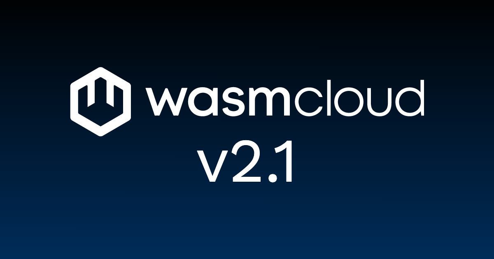

wasmCloud 2.1.0 is out today. This release marks the first minor version cut since [v2.0 launched in March](/blog/wasmcloud-v2-is-here/), and it brings namespace-scoped Host CRDs, Kubernetes-native Service routing, plugin support in services, and the first HTTP microbenchmarks for `wash-runtime`.

{/* truncate */}

## Namespace-scoped Host CRDs

The biggest change in 2.1.0 is the transition of the `Host` CRD from cluster scope to namespace scope.

Previously, every `Host` object lived at the cluster level, even though the underlying host pod runs in a specific Kubernetes namespace. That mismatch created two friction points: tenant isolation required careful labeling conventions in lieu of a hard API boundary, and granting access to see your team's hosts (for one example) meant issuing a `ClusterRole` binding. Neither of these were as idiomatic to Kubernetes as we wanted.

Starting in 2.1.0, the `Host` CRD is namespace-scoped rather than cluster-scoped. The runtime-operator creates every `Host` object in its own namespace, and a new `Host.environment` field records where the underlying host pod actually runs—populated automatically from the downward API for in-cluster hosts, or supplied via `--environment` for external ones. The default behavior allows shared hosts, so for your existing installs, wasmCloud schedules exactly as it does today; `kubectl get hosts -n <operator-namespace>` shows the full set of hosts you have permission to see.

For multi-tenant operators, there is now a single switch to enforce isolation:

```yaml
# values.yaml
operator:
  allowSharedHosts: false
```

With `allowSharedHosts: false`, workloads in `team-a` are only scheduled onto hosts running in `team-a`'s namespace (matched via each host's `environment`). No label gymnastics required. The `WorkloadDeployment.Spec.template.spec.environment` field gives workloads an opt-in escape hatch to target a named namespace's host pool when sharing is intentional (a shared infrastructure namespace, for example), but that's rejected if the operator has disabled sharing.

On the RBAC side, user-facing host roles are now generated as namespaced `Role`s rather than `ClusterRole`s. A namespace admin can grant host visibility to their team without cluster-admin involvement. Clusters that forbid `ClusterRole`s entirely can now adopt the wasmCloud operator without exception.

The scheduling performance story is also improved: in the default mode the cost is identical to before, and per-namespace scheduling is strictly cheaper because the host list narrows to one namespace.

## Kubernetes-native traffic routing

Also shipping in 2.1.0 is [Kubernetes-native Service routing](https://github.com/wasmCloud/wasmCloud/issues/5025), which replaces the previous `runtime-gateway` approach.

The `runtime-gateway` was a dedicated proxy deployment that received all inbound traffic and routed it to wasmCloud host pods via internal logic. It worked, but it was a single point of failure that sat outside the standard Kubernetes networking model and blocked users from bringing their own ingress controller.

The new model is straightforward: the runtime-operator maintains `EndpointSlice` resources for each `WorkloadDeployment`, populated with the pod IPs and ports of the hosts running that workload. Standard Kubernetes Services back those slices. Traffic flows directly from whatever ingress or Gateway API implementation you already have to the host pods—Traefik, Envoy Gateway, Cilium, NGINX, all of them work out of the box.

The result: wasmCloud workloads are now first-class Kubernetes Services. You can configure ingress with any `HTTPRoute` or `Ingress` resource, apply network policy, and wire up observability through standard tooling, the same way you would for any other workload.

## Plugin support in services

[Services](/docs/overview/workloads/services/) are the v2 pattern for stateful workload companions: they hold long-lived resources like connection pools and act as `localhost` for their paired component. In 2.1.0, services can now load and use host plugins directly, contributed by first-time contributor [Mendy Berger](https://github.com/MendyBerger).

This closes an expressiveness gap: a service that needs to call `wasi:keyvalue`, `wasi:blobstore`, or any other in-process plugin can now do so with the same call path available to components.

It also enables a fresh new TypeScript example that [demonstrates GPU-accelerated machine learning in a wasmCloud workload](https://github.com/wasmCloud/typescript/tree/main/examples/components/webgpu-tensorflow), using TensorFlow.js with the WebGPU backend to re-stylize images. 

## Microbenchmarks for HTTP invocations

One of the Q2 priorities is building a reproducible performance story for wasmCloud v2. The first piece landed in this release: [per-path microbenchmarks for the HTTP dispatch hot path in `wash-runtime`](https://github.com/wasmCloud/wasmCloud/issues/5054).

These benchmarks cover cold start, per-invocation overhead, and the critical path through the router. They're designed to run in CI and catch regressions as the runtime evolves. The broader benchmarking suite aims to be reproducible and shareable, and to cover steady-state throughput and tail latency; this is still underway under [#5052](https://github.com/wasmCloud/wasmCloud/issues/5052).

## `wash` on Windows via winget

Windows users can now install `wash` through [winget](https://learn.microsoft.com/en-us/windows/package-manager/winget/), the Windows Package Manager:

```powershell
winget install wasmCloud.wash
```

This closes the last major installation gap on Windows. The v1 release had Chocolatey support; winget is now the canonical Windows install path for v2.

## Security and CI hardening

2.1.0 includes a Wasmtime bump and a shift from `rustls-pemfile` to `rustls-pem`, with `cargo audit` now running in CI. The release also integrates OpenSSF Scorecard and CodeQL analysis, and a first pass of workflow hardening via [zizmor](https://github.com/woodruffw/zizmor).

## What's coming

Work on the Q2 roadmap is well underway, and several initiatives that will define 2.2 are already in motion.

### WASI P3 behind a flag (and the first real-world demo)

Experimental WASI P3 support has been available in wasmCloud [since April](/blog/wasi-p3-on-wasmcloud/), behind the `wasip3` Cargo feature. Since then the work has continued, and this week maintainer [Aditya](https://github.com/Aditya1404Sal) opened a draft PR that is worth looking at even in its early state.

[PR #5132](https://github.com/wasmCloud/wasmCloud/pull/5132) adds a `sqlx-socket` component: a WASI P3 service component that holds a long-lived MySQL connection pool using `sqlx` and serves queries over the `wash` loopback to a stateless HTTP component. The whole stack—component, MySQL pool, HTTP handler—runs today under `wash dev --wasip3`.

This is the first end-to-end demo of what P3's native async and socket support make possible in practice: a component that maintains persistent, expensive state across invocations, composes cleanly with stateless logic, and runs under the standard `wash dev` loop. It's a draft, and there is more work to do, but the shape of the P3 application model is visible here.

Also behind a flag in the near term: **wasi-tls**, bringing TLS support directly to components via the standard WASI interface.

### HTTP instance reuse

[Issue #5056](https://github.com/wasmCloud/wasmCloud/issues/5056) tracks instance pooling for HTTP invocations—reusing component instances across requests rather than constructing them fresh each time. This is a meaningful latency improvement, and it depends on P3's per-instance reuse model in wasmtime (ProxyHandler). Once that's wired into wash-runtime, this ships.

### Host Component Plugins

[Issue #5018](https://github.com/wasmCloud/wasmCloud/issues/5018) tracks a significant expressiveness win for the plugin model: the ability to back a host plugin with a Wasm component rather than native Rust. Plugin authors can target a stable WIT contract and ship their plugin as a component. Design work is in progress.

## Get started with wasmCloud 2.1.0

Install or upgrade `wash`...

On macOS or Linux via install script:

```bash
curl -fsSL https://wasmcloud.com/sh | bash
```

With Homebrew:

```bash
brew install wasmcloud/wasmcloud/wash
```

Windows users can now install `wash` directly through [winget](https://learn.microsoft.com/en-us/windows/package-manager/winget/), the Windows Package Manager:

```shell
winget install wasmCloud.wash
```

For new users, the [quickstart](/docs/quickstart/) gets you from installation to a running component on Kubernetes in a few minutes.

Full changelog: [v2.0.0...v2.1.0](https://github.com/wasmCloud/wasmCloud/compare/v2.0.0...v2.1.0)

## Join the community

- [wasmCloud Slack](https://slack.wasmcloud.com/) — questions, announcements, and #wasmcloud-dev
- [wasmCloud Wednesday](/community/) — weekly community call, Wednesdays at 1PM ET
- [Q2 2026 Roadmap](https://github.com/orgs/wasmCloud/projects/7/views/19) — what's in progress and what's ready for contributors to pick up
- Good first issues: [github.com/wasmCloud/wasmCloud/issues](https://github.com/wasmCloud/wasmCloud/issues?q=label%3A%22good+first+issue%22+is%3Aopen)