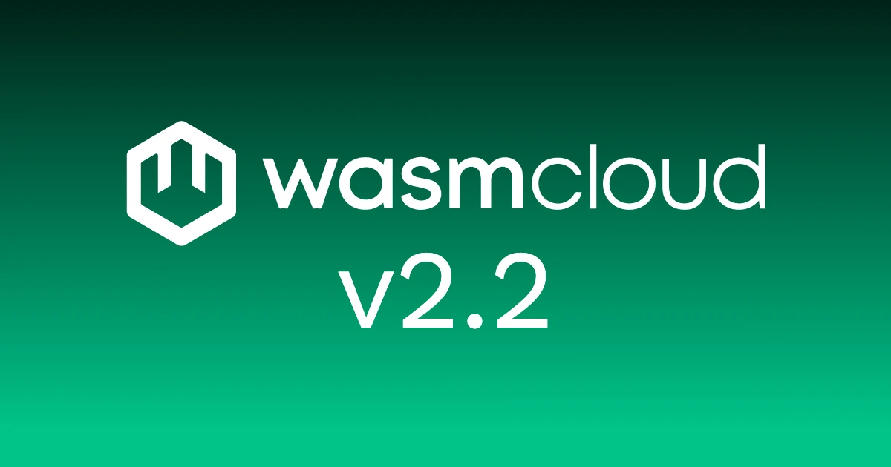

wasmCloud 2.2.0 is out today. The headline change is native TLS for WebAssembly components, alongside a pluggable HTTP egress trait that lets embedders take full control of outgoing requests, an expanded `wash config` command, and a round of runtime-operator hardening that builds on the namespace-scoping work from 2.1.

{/* truncate */}

## `wasi:tls` for WebAssembly components

The biggest user-facing addition in 2.2.0 is [`wasi:tls` support in `wash-runtime`](https://github.com/wasmCloud/wasmCloud/pull/5113), contributed by maintainer [Aditya](https://github.com/Aditya1404Sal). Guest components can now establish TLS connections directly over `wasi:sockets` using the WASI P3 `wasi:tls/client` and `wasi:tls/types` interfaces.

Until now, components that needed encrypted transport had to delegate to a host-provided HTTP client or a service running alongside the workload. With `wasi:tls`, the component owns the TLS session: the WIT contract is part of the standard WASI P3 surface, and the implementation is gated behind the new `wasi-tls` Cargo feature on the host so adoption is opt-in while the interface stabilizes.

wasmCloud standardizes on [`rustls`](https://github.com/rustls/rustls) backed by [`aws-lc-rs`](https://github.com/aws/aws-lc-rs), not the upstream `ring` default. `wash-runtime`'s `init_crypto()` installs `aws-lc-rs` as the process-level rustls provider at startup (and the workspace `rustls` pin compiles `ring` out of the dependency tree entirely), so workloads pick it up automatically with no per-host configuration. Embedders that need a different stack — to install a custom root store (corporate CAs, certificate pinning), use an HSM-backed key source, or swap the backend entirely — can override the default by registering a custom TLS provider through `EngineBuilder::with_tls_provider`.

`wasi:tls` is one of the first dedicated WASI P3 interfaces to graduate into a tagged wasmCloud release, and it sets up the path for higher-level workloads (e.g., databases, message brokers, third-party APIs) to be reached directly from a component without a host-side proxy.

## Pluggable HTTP egress with `OutgoingHandler`

[PR #5014](https://github.com/wasmCloud/wasmCloud/pull/5014), also by Aditya, introduces an `OutgoingHandler` trait that decouples outgoing HTTP request handling from the runtime's default implementation.

Previously, every outbound request flowed through a fixed `default_send_request` path. That worked for the common case but made it awkward to thread custom TLS configuration through outgoing calls, swap in an alternative transport (for example, an internal RPC system), or insert middleware-style logic at the egress boundary.

With `OutgoingHandler`, embedders supply their own handler to `HttpServerBuilder::outgoing_handler` and decide how every outbound request is dispatched. Like the existing `HostPlugin` trait, `OutgoingHandler` is a Rust-level extension point in `wash-runtime`: the runtime calls into the handler for every outbound HTTP request, and the implementation lives in embedder-owned code.

Combined with `wasi:tls`, this gives operators two complementary tools for shaping egress: components can perform TLS themselves when they need direct control over the session, and embedders can wrap every outbound HTTP call in a consistent transport policy when they need uniform handling across the host.

## `wash config` gains init, cleanup, and validate

Pavel ([if0ne](https://github.com/if0ne)) extended the `wash config` command with three new subcommands in [PR #5140](https://github.com/wasmCloud/wasmCloud/pull/5140):

```shell
# Write a populated example config in YAML, JSON, or TOML
wash config init --format yaml --example

# Preview what cleanup would remove, then actually clean
wash config cleanup --all --dry-run
wash config cleanup --all

# Check the current config for hard errors before you run it
wash config validate
```

`wash config init --example` populates every section with illustrative values, so new projects can start from a working template instead of an empty file. The `--format` flag accepts `yaml`, `yml`, `json`, or `toml`. `--global` has been deprecated and has no effect; the command always writes to the project-local `.wash/` directory.

`wash config cleanup` removes the wash cache and/or data directories with per-target flags (`--cache`, `--data`, `--all`) and a `--dry-run` mode that reports per-directory sizes via `humansize` before anything is touched.

`wash config validate` runs structural checks across the merged project configuration: socket-address syntax, `redis://` / `nats://` / `postgres://` URL schemes, paired TLS cert and key files, WebGPU availability on Windows, non-empty build commands, well-formed WIT registry URLs, and local WIT source paths that actually exist on disk. Remote sources (HTTP, Git, OCI) are skipped. Errors are collected from every section before the command returns so you see the full set in one pass.

## runtime-operator hardening

Two operator changes in 2.2.0 build directly on the namespace-scoping work shipped in 2.1.

The first is a fix from new contributor [@CharlesV1234](https://github.com/CharlesV1234) for a bug in per-workload Service routing. The `WorkloadRouteReconciler` populates `EndpointSlice` entries from `host.Hostname`, but most default deployment templates expose the pod name rather than the pod IP there, and `EndpointSlice.AddressType=IPv4` rejects any address that doesn't parse as an IP. On default Kubernetes installs, traffic to the workload's ClusterIP would time out, leaving `runtime-gateway` as the only working ingress path. [PR #5155](https://github.com/wasmCloud/wasmCloud/pull/5155) makes the reconciler resilient: when `host.Hostname` isn't a valid IPv4 address, it looks up the matching pod and writes `Status.PodIP` instead. Existing installations that already report pod IPs are unaffected.

The second is a permissions tightening from [Jeremy Fleitz](https://github.com/jfleitz) in [PR #5138](https://github.com/wasmCloud/wasmCloud/pull/5138). When the runtime-operator is installed with `watchNamespaces` set, the rules for `configmaps`, `secrets`, `events`, and `services` move out of the operator's main `ClusterRole` and into a separate `ClusterRole` bound via per-namespace `RoleBinding`s — one for each watched namespace. The operator's core grants (CRDs, workload, host) stay cluster-wide as before. The net effect is that the operator's reach into per-workload resources is now scoped to exactly the namespaces it owns, instead of cluster-wide.

## WIT interfaces published to GHCR

`wash` projects can now pull wasmCloud's first-party WIT packages directly from GitHub Container Registry. [PR #5149](https://github.com/wasmCloud/wasmCloud/pull/5149), from [Bailey Hayes](https://github.com/ricochet), validates each package with `wash wit build`, embeds provenance via `wasm-tools metadata add`, and publishes to `ghcr.io/wasmcloud/interfaces/<name>:<version>` on push to main, with [GitHub attestation](https://docs.github.com/en/actions/security-for-github-actions/using-artifact-attestations/using-artifact-attestations-to-establish-provenance-for-builds) attached to every artifact. Stable versions are immutable; re-pushing an existing tag is a no-op. `wasmcloud:messaging` and `wasmcloud:secrets` are available today; more interfaces are expected to follow as the project-root inventory grows.

A companion workflow opens weekly PRs to bump pinned `wasm-tools` versions, filling the gap that Dependabot doesn't cover for this kind of pinned tool dependency.

## Other notable changes

- `wash new` honors `--non-interactive`, so scripted scaffolding works in CI environments without TTY prompts ([#5154](https://github.com/wasmCloud/wasmCloud/pull/5154)).
- The `install.sh` script reports actionable errors instead of generic curl failures when the network or registry is misbehaving ([#5144](https://github.com/wasmCloud/wasmCloud/pull/5144)).
- `wash` now installs cleanly on musl-on-glibc systems (notably some container base images) where the previous detection logic guessed wrong ([#5135](https://github.com/wasmCloud/wasmCloud/pull/5135)).
- Release-train automation, canary build hardening, OpenSSF Scorecard, CodeQL, and OCI promote idempotency continue to tighten the supply-chain story across the project.

## What's coming

The 2.1 release flagged HTTP instance reuse ([#5056](https://github.com/wasmCloud/wasmCloud/issues/5056)) and Host Component Plugins ([#5018](https://github.com/wasmCloud/wasmCloud/issues/5018)) as upcoming work; both are still in progress and unblocking the next set of performance and extensibility enhancements. With `wasi:tls` landed, expect more WASI P3 surface to graduate from "behind a flag" over the next minor releases as upstream stabilizes the interfaces. The sqlx-socket demo previewed in the 2.1 post continues to evolve as a reference for what a fully P3-native workload looks like.

## Get started with wasmCloud 2.2.0

Install or upgrade `wash`...

On macOS or Linux via install script:

```bash
curl -fsSL https://wasmcloud.com/sh | bash
```

With Homebrew:

```bash
brew install wasmcloud/wasmcloud/wash
```

On Windows with [winget](https://learn.microsoft.com/en-us/windows/package-manager/winget/):

```shell
winget install wasmCloud.wash
```

For new users, the [quickstart](/docs/quickstart/) gets you from installation to a running component on Kubernetes in a few minutes.

Full changelog: [v2.1.0...v2.2.0](https://github.com/wasmCloud/wasmCloud/compare/v2.1.0...v2.2.0)

## Join the community

- [wasmCloud Slack](https://slack.wasmcloud.com/) — questions, announcements, and #wasmcloud-dev
- [wasmCloud Wednesday](/community/) — weekly community call, Wednesdays at 1PM ET
- [Q2 2026 Roadmap](https://github.com/orgs/wasmCloud/projects/7/views/19) — what's in progress and what's ready for contributors to pick up
- Good first issues: [github.com/wasmCloud/wasmCloud/issues](https://github.com/wasmCloud/wasmCloud/issues?q=label%3A%22good+first+issue%22+is%3Aopen)
