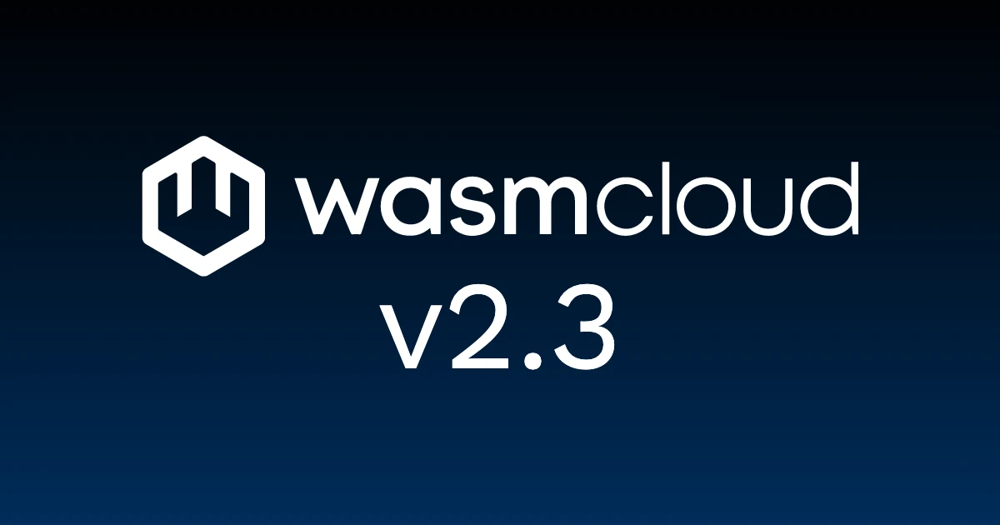

wasmCloud 2.3.0 is now available! 

The headline change for this release is the ability to specify a workload's environment, configuration, and secrets directly in `wash/config.yaml`, putting the `wash` local-dev loop on the same configuration footing as a Kubernetes-deployed workload. 

But there's a lot more to discuss: wasmCloud 2.3.0 also ships a comprehensive observability story (WIT-aware host plugin spans, an HTTP-status field on request spans, a cross-workload OpenTelemetry trace roll-up, and `wasi:otel` rc2), a namespaced apiGroup for the runtime-operator's RBAC, fuzz testing for the operator, an official `wasip3` canary image, and a bump to Wasmtime 45.

{/* truncate */}

## Workload environment, config, and secrets in `wash/config.yaml`

The biggest developer-facing change in 2.3.0 is a new `workload:` section in `.wash/config.yaml` that lets a project declare its environment variables, opaque configuration, secrets, and outbound host allow-list directly alongside its build config.

Previously, the only way to pass configuration into a workload was through a Kubernetes-style `WorkloadDeployment` CRD or by setting host-level environment variables. That worked for deployed workloads but introduced friction during local development with `wash dev`: configuration that the production deploy expressed declaratively didn't have an equivalent local representation, so authors had to mirror it by hand in their shell environment or through ad-hoc wrappers.

The new schema introduces two top-level keys for *named sources*, `configs:` and `secrets:`, each of which can be `inline:`, `file:` (`.env` format), or `fromEnv:` (read from the developer's shell). A `workload:` block then references those sources by name through `environment.configFrom` and `environment.secretFrom`, alongside an opaque `config` map for `wasi:config/store` entries and an `allowedHosts` list that constrains outbound HTTP calls:

```yaml
# .wash/config.yaml
configs:
  app-defaults:
    file: config/defaults.env
secrets:
  upstream-credentials:
    fromEnv: UPSTREAM_API_TOKEN

workload:
  environment:
    configFrom: [app-defaults]
    secretFrom: [upstream-credentials]
  config:
    "otel.resource.service.name": "my-service"
  allowedHosts: ["example.com"]
```

The field shape mirrors `WorkloadDeployment.localResources` deliberately, so the same file can round-trip to a Kubernetes manifest later. `wash dev` resolves the workload before deploy and applies the result to the dev component's `LocalResources`; the `wasi:config` plugin is constructed with `copy_environment=true`, so workload environment variables surface via both `wasi:cli/env` and `wasi:config/store::get`. 

In short, what works in local development continues to work after deployment.

Secrets carry a stricter posture than the other fields. File paths are canonicalized and confined to the project directory to defuse path-traversal escapes, Unix mode is required to be `0600` or `0400`, and a gitignore-aware warning surfaces when a secret file resolves inside the repo working tree. Errors and traces reference sources by name only; resolved secret values never appear in log output.

In `examples/otel-config`, you can now find a worked example that uses every piece of the schema end-to-end: 

* An `app-defaults` config source feeds non-sensitive runtime knobs from `config/defaults.env` 
* An `upstream-credentials` secret source pulls `UPSTREAM_API_TOKEN` from the developer's shell 
* The workload references both via `configFrom`/`secretFrom`
* `allowedHosts` constrains the outbound call

A `log_runtime_config_once` helper emits a single OTel log line at startup listing every `wasi:config` key visible to the component (with no values, per the schema's contract).

## End-to-end OpenTelemetry

A theme of 2.3.0 is making observability work *across* workloads instead of per-host or per-component in isolation:

* [**WIT-aware host plugin spans.**](https://github.com/wasmCloud/wasmCloud/pull/5188) Now every host plugin handler span gets a structured name of the form `<namespace>.<package>.<fn>`. That means a span previously named `create_container` is now emitted as `wasi.blobstore.create_container`, and Tempo/Grafana dashboards can filter at the interface level (`{ name =~ "wasi.blobstore.*" }`) instead of pattern-matching bare function names. The same pass adds `#[instrument]` to backends that were previously missing per-op spans entirely: `wasi:keyvalue` on `nats`, `redis`, and `in_memory` had no per-op spans in Tempo at all before this change. This change covers `wasi:blobstore`, `wasi:keyvalue`, `wasi:config`, `wasi:logging`, `wasmcloud:messaging`, and `wasmcloud:postgres`.

* [**HTTP response status on request spans.**](https://github.com/wasmCloud/wasmCloud/pull/5210) `http.response.status_code` is now added to the `handle_http_request` span, so span-metrics collectors can break requests down by 2xx/4xx/5xx. The change also sets `otel.status_code = ERROR` on 5xx responses (4xx stays `UNSET` per the OTel HTTP semconv). Additionally, request-side attributes are emitted under the current-stable OTel semconv names (`http.request.method`, `url.path`, `server.address`) alongside the legacy names, so dashboards built against either convention resolve.

* [**`wasi:otel 0.2.0-rc.2`.**](https://github.com/wasmCloud/wasmCloud/pull/5205) Tthe `wasi:otel` host plugin and the `otel-config` example have been bumped to track the latest upstream release candidate: the interface components use to emit their own traces, metrics, and logs through the host pipeline instead of wiring an exporter per component.

* [**Cross-workload trace roll-up.**](https://github.com/wasmCloud/wasmCloud/pull/5226) Before 2.3, traces across workloads were silently broken: `initialize_observability` extracted incoming `traceparent` headers via `get_text_map_propagator`, but no `W3C TraceContextPropagator` was registered, so the global default was a no-op and every workload rooted its own trace. This change registers the propagator and extends the `otel-config` example into a multi-workload chain (frontend → middle → backend → `example.com`) that demonstrates the end-to-end roll-up.

Together these turn `wash-runtime`'s OpenTelemetry support from per-component instrumentation into a system-level capability: where a request goes, the trace follows it, and what every workload did along the way is visible in one diagram.

## runtime-operator: namespaced apiGroup RBAC, fuzz testing

Two operator changes in 2.3.0 continue the namespacing work from the last couple of releases.

The first [extends the namespacing model to the `runtime.wasmcloud.dev` apiGroup itself](https://github.com/wasmCloud/wasmCloud/pull/5208). The existing `operator.watchNamespaces` Helm value now governs the apiGroup's RBAC scope as well as which namespaces get reconciled: when `watchNamespaces` is non-empty, access to `artifacts`, `workloads`, `workloadreplicasets`, and `workloaddeployments` (plus their `/status` and `/finalizers` subresources) is granted via a Role + RoleBinding in each watched namespace instead of a cluster-wide ClusterRole. The same PR also converts the shared Kubernetes-native resources (`configmaps`/`secrets`/`services`/`events`/`endpointslices`) to the per-namespace pattern, so a `watchNamespaces` install no longer holds any cluster-wide grants beyond the operator's core informers.

Namespaced behavior is [covered end-to-end](https://github.com/wasmCloud/wasmCloud/pull/5209): workloads in watched namespaces reconcile, workloads in unwatched namespaces don't, with no admission denials in the logs. A [CI guard](https://github.com/wasmCloud/wasmCloud/pull/5187) catches RBAC drift between the chart's generated rules and the operator's runtime requirements as the project evolves.

The second significant operator change brings [fuzz testing for the runtime-operator](https://github.com/wasmCloud/wasmCloud/pull/5172). The fuzz harness covers condition handling, CRD type invariants, label and env-var merging helpers, and controller-internal utilities. The seed corpus runs as part of `make test` with no flags, and the harness is structured to be OSSFuzz-compatible if the project wants to extend coverage upstream.

## `wasip3` canary image and socket hardening

WASI P3 work continues to mature through `wash-runtime`. Two changes in 2.3.0 are worth flagging:

* This release [**introduces an official `wasip3` canary image**](https://github.com/wasmCloud/wasmCloud/pull/5227): a separately-tagged container build of `wash` published on every `main` push as `ghcr.io/wasmcloud/wash:canary-wasip3` (and `sha-<full-sha>-wasip3` for pinned references) alongside the default P2 tags. The image is built with both the `wasip3` and `wasi-tls` Cargo features enabled, so the canary pairs WASI P3 with the [2.2.0 `wasi:tls` work](/blog/wasmcloud-2-2-0-release/) in a single tag; components can experiment with the P3 surface and component-owned TLS at the same time.

* The P3 socket implementation in `wash-runtime` [**is now in line with upstream `wasmtime`'s `wasi-sockets` shape**](https://github.com/wasmCloud/wasmCloud/pull/5222): name lookups, TCP listener ownership, and the loopback `TcpConn` halves now follow the same take-once semantics as upstream, so a second take reports `InvalidState` instead of silently swapping in a fresh channel. P3 socket support is still gated behind the `wasip3` feature; this lands as foundation work for the interfaces that will graduate out from behind the flag in upcoming releases.

## Benchmark infrastructure

An [**end-to-end `wash-runtime` benchmarking pipeline is now in place**](https://github.com/wasmCloud/wasmCloud/pull/5153) with a dedicated bench host, deterministic instruction-count benches alongside the existing wall-clock criterion benches, and GitHub workflows that publish a self-updating trend timeline for [wasmCloud/arewefastyet](https://github.com/wasmCloud/arewefastyet). 

(We've also [renamed](https://github.com/wasmCloud/wasmCloud/pull/5211) the deterministic library from `iai-callgrind` to its current upstream name, `gungraun`.) 

## Other notable changes

- [**Wasmtime is bumped to version 45**](https://github.com/wasmCloud/wasmCloud/pull/5206).

- [**Test fixtures via xtask**](https://github.com/wasmCloud/wasmCloud/pull/5220), co-authored with [@dman-os](https://github.com/dman-os), moves Wasm test-fixture compilation out of `build.rs` and into a new `xtask` crate invoked as `cargo xtask build-fixtures`. This unblocks the new benchmark pipeline by removing the nested-`cargo` invocation that was undermining build performance.

- [**Commit SHAs in `wash new --git-ref`.**](https://github.com/wasmCloud/wasmCloud/pull/5201) First-time contributor [@immanuwell](https://github.com/immanuwell) fixed `wash new --git-ref` to accept commit SHAs. The documented behavior was branch/tag/commit, but the old code passed the ref to `git clone --branch` (which only resolves branch and tag names). The fix clones first, then `git checkout`s the ref, so all three forms work. Thanks and welcome!

- [**In-memory blobstore default.**](https://github.com/wasmCloud/wasmCloud/pull/5223) Previously, `wash dev`'s in-memory blobstore constructed a zero-capacity `MemoryOutputPipe` and any non-empty write trapped with `"write beyond capacity of MemoryOutputPipe"`. The replacement delegates to the explicit `new(None)` constructor (1MB cap), matching documented behavior.

## What's coming

The 2.1 release flagged HTTP instance reuse ([#5056](https://github.com/wasmCloud/wasmCloud/issues/5056)) and Host Component Plugins ([#5018](https://github.com/wasmCloud/wasmCloud/issues/5018)) as upcoming work. Both remain in progress; HTTP instance reuse continues to depend on Wasmtime's ProxyHandler-based per-instance reuse model, and component-backed host plugins are still in design. With the `wasip3` canary image landing in this release, the next minor cycle is the natural place for more WASI P3 surface to graduate out from behind the feature flag.

The benchmark infrastructure that landed here is the prerequisite for shareable, reproducible performance numbers; expect the first round of those alongside HTTP instance reuse.

## Get started with wasmCloud 2.3.0

Install or upgrade `wash`.

On macOS or Linux via install script:

```bash
curl -fsSL https://wasmcloud.com/sh | bash
```

With Homebrew:

```bash
brew install wasmcloud/wasmcloud/wash
```

On Windows with [winget](https://learn.microsoft.com/en-us/windows/package-manager/winget/):

```shell
winget install wasmCloud.wash
```

For new users, the [quickstart](/docs/quickstart/) gets you from installation to a running component on Kubernetes in a few minutes.

Full changelog: [v2.2.0...v2.3.0](https://github.com/wasmCloud/wasmCloud/compare/v2.2.0...v2.3.0)

## Join the community

- [wasmCloud Slack](https://slack.wasmcloud.com/) — questions, announcements, and #wasmcloud-dev
- [wasmCloud Wednesday](/community/) — weekly community call, Wednesdays at 1PM ET
- [Q2 2026 Roadmap](https://github.com/orgs/wasmCloud/projects/7/views/19) — what's in progress and what's ready for contributors to pick up
- Good first issues: [github.com/wasmCloud/wasmCloud/issues](https://github.com/wasmCloud/wasmCloud/issues?q=label%3A%22good+first+issue%22+is%3Aopen)
