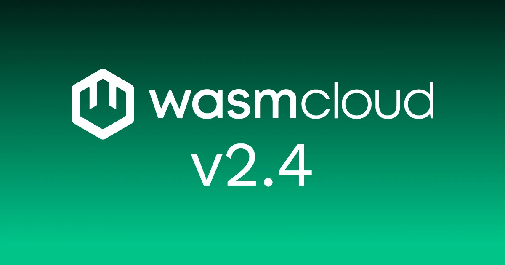

wasmCloud 2.4.0 is now available!

This release brings **Kubernetes-native autoscaling** for Wasm workload deployments: the `WorkloadDeployment` resource now implements the standard `/scale` subresource, so the [Horizontal Pod Autoscaler](https://kubernetes.io/docs/tasks/run-application/horizontal-pod-autoscale/) and [KEDA](https://keda.sh/) scale wasmCloud workloads using the same contract they use for any other Kubernetes resource, without losing the host-pod density.

2.4.0 also lands the long-awaited **multi-handler `wash dev` workflow** for messaging-driven workloads, opens up a swath of previously hard-coded **Helm chart** values (pluggable NATS, custom-host args, host-pod volume passthroughs), reshapes the **`wash-runtime` host plugin API** for plugin authors, and ships a Wasmtime 45.0.2 security bump.

{/* truncate */}

A handful of these changes were demoed and discussed live on the [June 10 community call](/community/2026-06-10-community-meeting/), including Jeremy Fleitz's scale-to-38 KEDA demo, Bailey Hayes's multi-handler `wash dev` walkthrough, and a conversation around plugging in external NATS clusters. The recording is worth watching alongside this post.

## Workload autoscaling on Kubernetes via HPA and KEDA

`WorkloadDeployment` [now implements the Kubernetes `/scale` subresource](https://github.com/wasmCloud/wasmCloud/pull/5244) — `kubectl scale`, the [Horizontal Pod Autoscaler](https://kubernetes.io/docs/tasks/run-application/horizontal-pod-autoscale/), and [KEDA](https://keda.sh/) all drive replica count against a wasmCloud workload using the same contract they use against a `Deployment`, with no wasmCloud-specific glue. Autoscaling changes the **number of component instances** spread across the existing host group, not the number of host pods — so the platform's high-density story (many components per host) is preserved while the autoscaling surface stays exactly the one platform engineers already know.

A complete HPA manifest is one block:

```yaml
apiVersion: autoscaling/v2
kind: HorizontalPodAutoscaler
metadata:
  name: hello
spec:
  scaleTargetRef:
    apiVersion: runtime.wasmcloud.dev/v1alpha1
    kind: WorkloadDeployment
    name: hello
  minReplicas: 1
  maxReplicas: 100
  metrics:
    - type: External
      external:
        metric: { name: http_requests_per_second }
        target: { type: AverageValue, averageValue: '10' }
```

Pod- and resource-based HPA metrics don't apply (wasmCloud components aren't pods) but `External` and `Object` metrics through the Prometheus Adapter or a KEDA scaler do exactly the right thing. The KEDA path is the more interesting one: a component that emits its own OpenTelemetry metrics (e.g. an `invocations_total` counter) becomes its own scale signal, and the rest of the loop works without the component knowing KEDA exists.

On the [June 10 community call](/community/2026-06-10-community-meeting/), Jeremy Fleitz drove ~450 req/s at a single Hello World workload and watched it scale from one to 38 instances across three host pods in real time, with KEDA targeting 10 req/s per instance.

The full conceptual story (when autoscaling fits, when it doesn't, host-group sizing as a precondition, status fields) is in the new [Autoscaling page](/docs/kubernetes-operator/operator-manual/autoscaling/) in the operator manual.

## Multi-handler workloads in `wash dev`

Two related changes in 2.4.0 unlock a workload shape that previously required separate `WorkloadDeployment`s: **one workload, multiple components, each handling a different message subject**.

The runtime change is small but consequential. The intercomponent-linking checker previously rejected any workload where two sibling components exported the same host-invoked interface (the `wasi:messaging/handler` export, in this case) because there's no way to disambiguate which instance to invoke when *another component in the same workload* tries to import that export. But if no component imports it (the host is the one that decides which component to call, based on the incoming subject) the workload isn't ambiguous, just multiply-exported. [#5243](https://github.com/wasmCloud/wasmCloud/pull/5243) keeps the cycle check on imports and lifts it on duplicate exports when nothing in the workload pulls them.

The developer-experience change is the matching half. `dev.components[]` entries in `.wash/config.yaml` now accept per-component `environment`, `config`, and `allowedHosts` overrides; environment and config *merge* over the workload-wide values, while `allowedHosts` *replaces* them when set (an explicit empty list denies all egress for that component). A new `dev.data_nats_url` field points the blobstore, keyvalue, and messaging plugins at a single NATS endpoint at once (mirroring the production host's `--data-nats-url`) with the per-plugin URLs kept as overrides. This release is also the first time `wash dev` ships a NATS-backed blobstore.

And [#5242](https://github.com/wasmCloud/wasmCloud/pull/5242) fixes a quiet bug from the previous release: workload-wide `workload.environment`, `workload.config`, and `workload.allowedHosts` were only reaching the *main* dev component; sidecars from `dev.components[]` and the `dev.service_file` sidecar service silently got default `LocalResources`. Workload values now apply as the base layer for every component in the workload, with the per-component overrides above as the top layer.

Bailey Hayes walked the whole stack on the June 10 call: an HTTP front-end plus two messaging handlers (`task-leet` and `task-reverse`), each component declaring its own subscription, the host routing each subject to the right component instance. The bundled `http-api-with-distributed-workloads` template was extended to exercise the shape and now includes a small architecture diagram inline in the UI.

## Helm chart: pluggable NATS, env, args, and host volumes

The `runtime-operator` Helm chart in 2.4.0 fills in a set of values that were previously hard-coded. The trigger here was [Mike's question](https://github.com/wasmCloud/wasmCloud/issues/5245) about pointing the chart at a Synadia cluster instead of the bundled NATS, but the pass touched everything in a similar shape.

**Split control-plane and data-plane NATS URLs** ([#5246](https://github.com/wasmCloud/wasmCloud/pull/5246)):

```yaml
global:
  nats:
    schedulerUrl: "nats://control-plane.example.internal:4222"
    dataUrl: "nats://data-plane.example.internal:4222"
```

The operator and host runtime use `schedulerUrl` for workload scheduling and host heartbeats; the host runtime uses `dataUrl` for Wasm workload messaging, key-value, and blobstore backends. Both default to the in-cluster NATS service, so existing installs are unchanged. Splitting them lets a workload's application traffic and the operator's coordination traffic live on entirely different brokers — useful when one of those is Synadia or an external NATS cluster.

**Operator and host passthroughs** (`env`, `envFrom`, `extraArgs`): the operator and host group containers now accept standard Kubernetes env-shape passthroughs (`secretRef`, `configMapRef`, `valueFrom`) and a list of CLI args appended verbatim. The `extraArgs` path matters most for **custom-built host images** with compiled-in plugins that need to flip a flag at start time — a bridge for the pre-host-component-plugins world.

**Host group passthroughs** ([#5219](https://github.com/wasmCloud/wasmCloud/pull/5219)): `runtime.hostGroups[]` now accepts optional `env`, `envFrom`, `volumes`, `volumeMounts`, and `ports`. This lets a chart user declaratively mount ConfigMaps, Secrets, or persistent volumes into a host group, and expose extra container ports (a metrics scrape port, say) without forking the chart or post-rendering the release. The previous answer involved hand-patching the rendered Deployment — workable, but bound to drift on the next `helm upgrade`.

The full schema is in the updated [Helm Values Reference](/docs/kubernetes-operator/operator-manual/helm-values/); the [Filesystems and Volumes](/docs/kubernetes-operator/operator-manual/filesystems-and-volumes/) page now documents the declarative Helm-values path alongside the existing direct Deployment edit.

## Operator survives NATS rolling restarts

The `runtime-operator` deployment now exposes a dedicated health port whose liveness and readiness probes reflect the operator's NATS connection status ([#5235](https://github.com/wasmCloud/wasmCloud/pull/5235)). If the NATS service becomes unreachable — for example during a NATS rolling restart — the kubelet recycles the operator pod, which reconnects automatically once NATS is back. No manual intervention is required to recover from a control-plane broker hiccup. An integration test in the same PR exercises the round-trip end-to-end.

## `wash-runtime` host plugin API ergonomics

2.4.0 reshapes a couple of rough edges in the [`wash-runtime`](/docs/runtime/) host plugin surface for plugin authors ([#5237](https://github.com/wasmCloud/wasmCloud/pull/5237)). [@if0ne](https://github.com/if0ne) drove the refactor through.

`Ctx::try_get_plugin` and `Ctx::get_plugin` replace the old `Option`-returning accessor: the fallible variant returns a descriptive `wasmtime::Result<Arc<T>>` that composes with `?`, and the infallible variant panics on miss for cases where the plugin is guaranteed by the host's registration logic. This collapses a guard block that used to repeat across every built-in plugin into a single line per lookup.

`WitInterfaces<'a>` is a new borrowed wrapper around `&HashSet<WitInterface>` with `iter()`, `get()`, and `contains()` lookup helpers; it now stands in for the owned `HashSet<WitInterface>` that `on_workload_bind`, `on_workload_item_bind`, and `on_workload_unbind` previously took by value. The set is no longer cloned per callback, and the lookup helpers give plugin code a more direct idiom for "does this binding actually require my interface" decisions than iterating the set by hand.

Both changes are documented in the updated [Creating Host Plugins](/docs/runtime/creating-host-plugins/) page.

## Other notable changes

- **[Wasmtime 45.0.2 security bump.](https://github.com/wasmCloud/wasmCloud/pull/5256)** Resolves [RUSTSEC-2026-0182](https://rustsec.org/advisories/RUSTSEC-2026-0182.html), a WASIp1 `fd_renumber` leak in `wasmtime-wasi`, by tracking the patched 45.0.2 release across the workspace.

- **[NATS keyvalue auto-creates buckets on open.](https://github.com/wasmCloud/wasmCloud/pull/5229)** First-time contributor [@Mees-Molenaar](https://github.com/Mees-Molenaar) brought the NATS `wasi:keyvalue` backend's `open` behavior into line with the in-memory and filesystem backends, which already created the bucket on first open. Welcome!

- **[`wash new --new.command` scoped to template config.](https://github.com/wasmCloud/wasmCloud/pull/5241)** [@immanuwell](https://github.com/immanuwell) fixed a quiet scoping bug where a user-level `new.command` in `~/.config/wash/config.yaml` was being merged into every `wash new` scaffold — even when the template itself had no `.wash/config` and never asked for a hook. The fix scopes `new.command` to the scaffolded template config; global hooks no longer bleed into unrelated templates.

## What's coming

On the WASI P3 front, [last week's WASI P3 launch](https://bytecodealliance.org/articles/WASI-0.3) sets up the next steps: wasmCloud enabling WASI P3 by default and bundling the WASI 0.3.0 WIT interfaces into the published OCI artifacts. Look for swift movement here very soon.

## Get started with wasmCloud 2.4.0

Install or upgrade `wash`.

On macOS or Linux via install script:

```bash
curl -fsSL https://wasmcloud.com/sh | bash
```

With Homebrew:

```bash
brew install wasmcloud/wasmcloud/wash
```

On Windows with [winget](https://learn.microsoft.com/en-us/windows/package-manager/winget/):

```shell
winget install wasmCloud.wash
```

For new users, the [quickstart](/docs/quickstart/) gets you from installation to a running component on Kubernetes in a few minutes.

Full changelog: [v2.3.0...v2.4.0](https://github.com/wasmCloud/wasmCloud/compare/v2.3.0...v2.4.0)

## Join the community

- [wasmCloud Slack](https://slack.wasmcloud.com/) — questions, announcements, and #wasmcloud-dev
- [wasmCloud Wednesday](/community/) — weekly community call, Wednesdays at 1PM ET
- [Q2 2026 Roadmap](https://github.com/orgs/wasmCloud/projects/7/views/19) — what's in progress and what's ready for contributors to pick up
- Good first issues: [github.com/wasmCloud/wasmCloud/issues](https://github.com/wasmCloud/wasmCloud/issues?q=label%3A%22good+first+issue%22+is%3Aopen)
