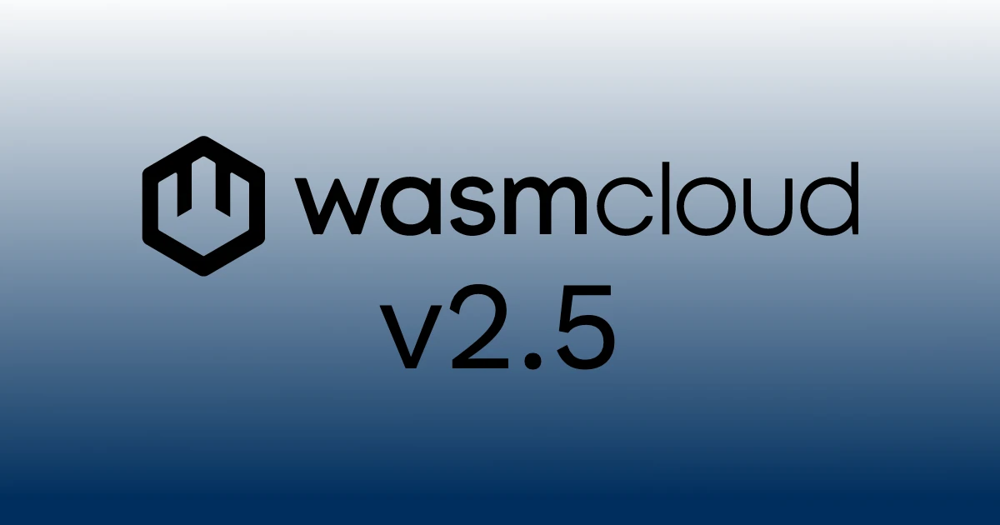

[wasmCloud 2.5.0](https://github.com/wasmCloud/wasmCloud/releases/tag/v2.5.0) is now available! This release brings some major changes: 

* **WASI 0.3 is on by default** with the platform's update to [Wasmtime](https://wasmtime.dev/) 46 
* **Top-level Wasm proposals are now runtime-configurable** per host, per host group, or per `wash dev` config
* **`(implements ..)` have landed** (behind a feature flag for now), meaning a workload can now import the same interface multiple times under distinct labels and route each call to its own backend.

2.5.0 also ships async-shaped `wasmcloud:keyvalue` and `wasmcloud:blobstore` WIT (with TTL, CAS, and richer errors), a Helm chart hardening pass with NetworkPolicies on the runtime-operator pods, an operator host-controller refactor to Server-Side Apply, and a passel of `wash` quality-of-life fixes.

{/* truncate */}

## At a glance

| Area | 2.4.0 | 2.5.0 |
|---|---|---|
| Wasmtime | 45 | 46 |
| WASI default | 0.2 | 0.3 |
| Engine Wasm proposals | compile-time | runtime-configurable per host |
| Host-plugin routing | one backend per interface | multiplexed via `(implements ..)` (feature-flagged) |
| Async `wasmcloud:keyvalue` / `wasmcloud:blobstore` WIT | not shipped | shipped (TTL, CAS, typed errors) |
| Helm chart NetworkPolicies | not shipped | runtime-operator and host group pods |

## Wasmtime 46 and WASI 0.3 by default

Wasmtime 46 brings the engine refactor that makes this release's other headlines possible. WASI 0.3 is now the default and only supported target across the `wash` binary — the earlier `wasip3` Cargo feature flag has been removed, and there is no runtime toggle. Every `wash-runtime` build in 2.5.0 and onward ships with WASI 0.3 always enabled.

The Wasmtime update also lifts a few API constraints into the wash-runtime surface: 

* `Component::imports()`/`exports()` now yield `ComponentExtern` 
* 0.3 sockets traits move their store generic onto the trait
* `StreamProducer::Buffer` no longer accepts `Cursor<_>`
* `wasi:cli/exit` `LinkOptions` are removed (the `exit-with-code` proposal is now stable)

The release also finalizes the `wasi:http` interface at WASI 0.3.0 (an RC → release promotion, no shape change). 

WASI 0.3 cross-component support also lands a series of supporting changes: response streaming, cross-component streams and resources, store scoping for linked WASI 0.3 calls, and ephemeral context rebuilding at call time ([#5260](https://github.com/wasmCloud/wasmCloud/pull/5260)).

## Top-level Wasm proposals as a configurable surface

The engine refactor that came with the Wasmtime 46 bump made builder settings (pooling, fuel, proposals) composable on top of any `with_config()` base instead of erroring when combined. That refactor is what made it possible to expose the top-level Wasm proposals (`component-model-async`, `gc`, `exception-handling`, `wide-arithmetic`, `threads`, `tail-call`) as a per-host, per-host-group surface rather than a baked-in choice.

The new API is a `WasmProposal` enum with `with_wasm_proposal()` on the builder ([#5267](https://github.com/wasmCloud/wasmCloud/pull/5267), driven by maintainer [@Aditya1404Sal](https://github.com/Aditya1404Sal)). From a user standpoint:

- **`wash host`** accepts `--wasm-proposal <name>` (comma-separated, repeatable, also `WASH_WASM_PROPOSALS`).
- **`wash dev`** reads a `dev.wasm_proposals` list out of `.wash/config.yaml`, validated at startup.
- **`runtime-operator` Helm chart** accepts a per-host-group `wasmProposals: []` list that the chart renders as `--wasm-proposal` arguments on the host container. The chart's appVersion bumps to 0.6.0 in step with the new field.

One implementation note documented in the same release: WASI 0.3 always brings the `component-model-async` proposal along with it, so every 2.5.0 host has the async proposal available whether or not it's listed explicitly in the proposals set. 

## Multiplexing host plugins with the WebAssembly Component Model's `implements` clause

The most user-visible payoff of this release is finally being able to do this in a WIT world:

```wit
package my-app:kv-cached;

world kv-cached {
    import cache: wasi:keyvalue/store@0.2.0-draft;
    import store: wasi:keyvalue/store@0.2.0-draft;
    export wasi:http/incoming-handler@0.2.2;
}
```

That's two labeled imports of the same `wasi:keyvalue/store` interface, expressed via the Component Model's `implements` clause (the `import <label>: <iface>;` syntax). The guest now has control over which store each call hits: `cache::open("session-data")` and `store::open("orders")` reach two different backends (say, a fast local cache and a durable NATS-backed store) without the guest needing to know which is which.

:::info[Feature flag required for now]
`(implements ..)` multiplexing ships behind the `wasm_component_model_implements` Cargo feature, which is not in the default `wash-runtime` feature set. That means the stock `ghcr.io/wasmcloud/wash:2.5.0` binary and the stock `ghcr.io/wasmcloud/runtime-operator:2.5.0` image don't enable multi-backend binding out of the box. To use it today, build a custom host image with `CARGO_FEATURES=wasm_component_model_implements` (the source Dockerfile takes this as a build arg) and point the chart at it via [`runtime.image.tag`](/docs/kubernetes-operator/operator-manual/helm-values/#runtimeimagetag). The `implements` proposal is a WebAssembly Component Model feature being finalized upstream; once it graduates and lands in a tagged Wasmtime release, the workspace fork can go and this can move onto the default surface.
:::

The 2.5.0 release lands multiplexing infrastructure and support for `wasi:keyvalue`, `wasmcloud:postgres`, and `wasmcloud:messaging/consumer`. The engine itself was taught to surface `(implements ..)` imports as named `WitInterface`s so the plugin dispatcher can bind each labeled import to the right backend at workload start.

On Kubernetes, a [`WorkloadDeployment`](/docs/kubernetes-operator/crds/#workloaddeployment)`.spec.`[`hostInterfaces`](/docs/kubernetes-operator/crds/#host-interfaces) entry now has an optional `name` field that identifies one instance of an interface among many that share the same `namespace:package`. The component's `(implements <name>)` annotation is the routing id that ties an import to a `hostInterfaces` entry of the same name.

CEL admission validation enforces what the multiplex actually expects: exact duplicates (same namespace, package, name, and version) are rejected, at most one *unnamed* entry per `namespace:package` is allowed (the default route for non-`implements` imports), and the operator's merge logic follows the component-model canonical-version rules: `0.2.1` and `0.2.6` collapse to the higher, `0.2` and `0.3` stay distinct, differently-named entries never merge.

One structural detail worth noting ([#5280](https://github.com/wasmCloud/wasmCloud/pull/5280)): `wasmcloud:keyvalue` puts the `bucket` resource (and `error`, `key-response`, `set-options`) in a shared `types` interface rather than in `store`. `store`, `atomics`, `cas`, `batch`, and `watcher` all `use types.{bucket, error}`, so a guest that imports a labeled (multiplexed) `store` can *also* use `cas`/`atomics`/`batch` against the same bucket — the resource identity matches across all five interfaces. `wasmcloud:blobstore` uses the same pattern with its `container` interface.

## Async `wasmcloud:keyvalue` and `wasmcloud:blobstore` WIT

Two new WIT changes lay the async groundwork for these interfaces under WASI 0.3 and the component-model-async proposal:

- [Async-shaped packages](https://github.com/wasmCloud/wasmCloud/pull/5258) are added for `wasmcloud:keyvalue` and `wasmcloud:blobstore` packages.
- [Async keyvalue/blobstore interfaces are extended](https://github.com/wasmCloud/wasmCloud/pull/5262) with **TTL on `set`**, **CAS** (compare-and-swap), and **richer errors** (typed variants for missing keys, conflicts, and backend failures, instead of a flat string).

The async-keyvalue world also picks up an `import types` line as part of the `bucket` restructure, so the resource type stays identical across `store`, `cas`, `atomics`, `batch`, and `watcher`.

## Helm chart hardening

The `runtime-operator` Helm chart picks up two security and operability improvements in 2.5.0:

- **NetworkPolicies for runtime-operator pods** ([#5269](https://github.com/wasmCloud/wasmCloud/pull/5269)) — the operator and host group pods now ship with default-allow-only-what-they-need NetworkPolicies, closing the implicit "the cluster network is open" assumption that earlier releases carried.
- **Chart lint and harden pass** ([#5270](https://github.com/wasmCloud/wasmCloud/pull/5270)) — broader hardening of resource limits, security contexts, probe defaults, and chart-lint compliance across the chart's templates.

If you've been hand-patching NetworkPolicies onto a wasmCloud release, this release replaces that with the in-chart equivalent.

## Other notable changes

- **[Server-Side Apply / Upsert in the host controller](https://github.com/wasmCloud/wasmCloud/pull/5226).** Replaces the cache-get-modify-write pattern with Server-Side Apply, eliminating a class of conflict-and-retry behavior the operator used to fall into on contended hosts. Paired with `Always set leader-elect` ([#5225](https://github.com/wasmCloud/wasmCloud/pull/5225)) and a fix to only update `LastSeen` on metadata change ([#5298](https://github.com/wasmCloud/wasmCloud/pull/5298)) for less reconcile noise.
- **[s390x binary in CI](https://github.com/wasmCloud/wasmCloud/pull/5249).** wasmCloud now ships a Linux/s390x binary alongside the existing platform set.
- **[`wash wit add` supports multiline world declarations](https://github.com/wasmCloud/wasmCloud/pull/5293).** — first-time contributor [@immanuwell](https://github.com/immanuwell) extended the world-declaration parser so `wash wit add` no longer requires a single-line `world` form.
- **[`wash new` Windows-style paths](https://github.com/wasmCloud/wasmCloud/pull/5286).** `wash new` accepts Windows-style `\`-separated paths in project names and normalizes them. Paired with [#5274](https://github.com/wasmCloud/wasmCloud/pull/5274), which ignores trailing slashes when deriving project names from repo URLs.
- **[`wash wit` accepts package-level refs](https://github.com/wasmCloud/wasmCloud/pull/5257).** and fixes version-aware `remove`.
- **[RUSTSEC-2026-0185 security bump](https://github.com/wasmCloud/wasmCloud/pull/5255).** Resolves a `quinn-proto` advisory by bumping the workspace transitive.

## What's breaking

Two breaking changes in 2.5.0 worth flagging up front:

- **`wash-runtime` no longer has a `wasip3` feature flag** ([#5279](https://github.com/wasmCloud/wasmCloud/pull/5279)). The runtime is always WASI 0.3-enabled. Custom-host builds that compiled with `--no-default-features` to omit WASI 0.3 will need to drop that flag and pick up the full runtime instead.
- **Rust MSRV is now 1.94.0.** The Wasmtime 46 dependency requires it. Building wasmCloud or `wash-runtime` from source requires a Rust toolchain at 1.94.0 or later.

## What's coming

The next round of work tracks the `implements` Component Model proposal toward finalization; once it lands in a tagged Wasmtime release, we'll drop the workspace fork in favor of the upstream version. The async keyvalue and blobstore WIT also has follow-on backend work in flight: a draft "async backends" PR from Bailey ([#5297](https://github.com/wasmCloud/wasmCloud/pull/5297)) is the next step toward pairing real async backends with the new interface shapes.

## Get started with wasmCloud 2.5.0

Install or upgrade `wash`.

On macOS or Linux via install script:

```bash
curl -fsSL https://wasmcloud.com/sh | bash
```

With Homebrew:

```bash
brew install wasmcloud/wasmcloud/wash
```

On Windows with [winget](https://learn.microsoft.com/en-us/windows/package-manager/winget/):

```shell
winget install wasmCloud.wash
```

For new users, the [quickstart](/docs/quickstart/) gets you from installation to a running component on Kubernetes in a few minutes.

Full changelog: [v2.4.0...v2.5.0](https://github.com/wasmCloud/wasmCloud/compare/v2.4.0...v2.5.0)

## Join the community

- [wasmCloud Slack](https://slack.wasmcloud.com/) — questions, announcements, and #wasmcloud-dev
- [wasmCloud Wednesday](/community/) — weekly community call, Wednesdays at 1PM ET
- [Q2 2026 Roadmap](https://github.com/orgs/wasmCloud/projects/7/views/19) — what's in progress and what's ready for contributors to pick up
- Good first issues: [github.com/wasmCloud/wasmCloud/issues](https://github.com/wasmCloud/wasmCloud/issues?q=label%3A%22good+first+issue%22+is%3Aopen)
