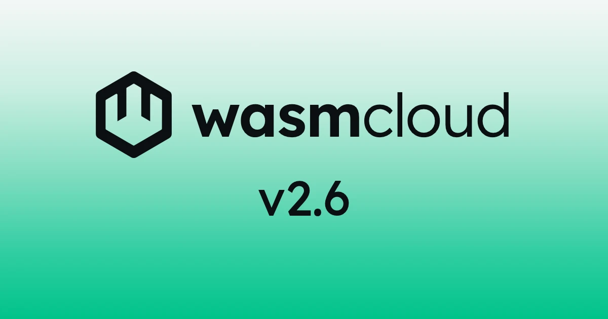

[wasmCloud 2.6.0](https://github.com/wasmCloud/wasmCloud/releases/tag/v2.6.0) is now available (along with the quick follow-up patch [2.6.1](https://github.com/wasmCloud/wasmCloud/releases/tag/v2.6.1))! This release delivers some of the most significant additions to the runtime since the 2.0 launch:

- **Trigger services**: A runtime execution model that pins one long-lived component instance and delivers external work to it through HTTP, messaging, and capability **ingresses**
- **Host component plugins**: Extend the wasmCloud host with new capabilities written as WebAssembly components (opt-in via feature flag for now)
- **Warm-instance pooling**: Reuse component instances across invocations with the new `poolSize` and `maxInvocations` controls, cutting per-invocation latency without capping concurrency

2.6 also changes the default delivery behavior for NATS messaging with replicas (consumer groups, so one replica handles each message), adds a per-component DNS allowlist for `wasi:sockets` name lookups, updates to [Wasmtime](https://wasmtime.dev/) 47, and teaches `wash build` to build WASI 0.3 components directly.

{/* truncate */}

## At a glance

| Area | 2.5.0 | 2.6.x |
|---|---|---|
| Wasmtime | 46 | 47 |
| Long-lived instances | services (the workload `service:` slot) | trigger services: services *and* host component plugins, fed by HTTP, messaging, and capability ingresses |
| Extending the host | native Rust plugins compiled into the host binary | native plugins + host component plugins (Wasm, feature-flagged) |
| Instance reuse | fresh instance per invocation | warm-instance pooling via `poolSize` / `maxInvocations` |
| NATS messaging with replicas | every replica receives every message | per-component consumer group by default; `broadcast` opt-in |
| DNS lookups from components | denied | per-component `allowedIpNameLookups` allowlist |

## Trigger services

A **trigger service** pins one long-lived component instance under a single store, and the host delivers external invocations into that same instance through one or more **ingresses**. If the component exports `wasi:cli/run`, that runs as a background task; inbound invocations run alongside it as concurrent tasks against the same instance, so in-memory state (pools, caches, counters, connections) is visible to every handler.

Three ingress kinds ship in 2.6.0:

- **HTTP**: A trigger service that exports `wasi:http/handler@0.3.0` receives inbound HTTP requests, with responses streaming back incrementally. When a service runs with multiple replicas on a host, the ingress distributes requests across replicas. Each replica is its own pinned instance with its own in-memory state.
- **Messaging**: A trigger service that exports `wasmcloud:messaging/handler@0.2.0` receives inbound messages on its pinned instance. The built-in messaging plugins deliver through this ingress for **service** workloads; a plain component exporting the same handler is still instantiated fresh per message.
- **Capability**: Carries invocations from other workloads to a trigger service's exported capability interface. This is the ingress that host component plugins are built on.

The model backs two user-facing roles: [**services**](/docs/overview/workloads/services/) (the stateful component in a workload's `service:` slot) and the new [**host component plugins**](/docs/overview/hosts/plugins/#host-component-plugins). Both are the same runtime construct; the differences are which ingresses they use and the role they play in the platform.

If a pinned instance traps, the runtime re-instantiates it within a bounded restart budget, and in-flight invocations to the failed incarnation fail promptly rather than hanging. Trigger services can also import the new `wasmcloud:host` interface (more on that below).

Read more in the new [Trigger services documentation](/docs/overview/hosts/trigger-services/).

## Host component plugins

Until now, extending the wasmCloud host with a new capability meant writing a native plugin: a Rust implementation of the `HostPlugin` trait, compiled into the host binary. wasmCloud 2.6.0 adds a second option: build the capability as a **WebAssembly component**, declare it in host configuration, and the host loads it at startup, without your having to rebuild the host. As a bonus, you can now write plugins in any language that compiles to a component.

A host component plugin runs as a trigger service with a capability ingress: one long-lived plugin instance is pinned in the host, and capability calls from other workloads (say, a `wasmcloud:messaging/consumer.publish` invocation) are dispatched to that pinned instance. Because the caller and the plugin live in different stores, the runtime relocates resource handles, streams, and futures across the boundary. Cross-store streams and futures are new in this release, and are what make streaming payloads through a plugin possible.

Plugins get real lifecycle hooks, too: a host component plugin can observe workloads binding and unbinding, so it can set up and tear down per-workload state (connections, subscriptions) at the right moments. And two new host interfaces let a plugin cooperate with its environment:

- **`wasmcloud:host/identity`**: Query the workload and component identifiers of the current caller. Since these are resolved per-invocation, the answer is exact under concurrent, interleaved calls. Useful for partitioning state per caller.
- **`wasmcloud:host/cancel`**: Cooperative per-invocation cancellation for long-running work.

The release also ships an async-shaped `wasmcloud:secrets` WIT along with a secrets host component plugin, and the new [`oci-registry` example](https://github.com/wasmCloud/wasmCloud/tree/main/examples/oci-registry) (a minimal OCI registry as a single WASI 0.3 component) reads its credentials through it.

:::info[Feature flag required for now]
Host component plugin support is opt-in in 2.6: the `host-component-plugins` Cargo feature is not in the default `wash-runtime` feature set, so stock release images don't enable it out of the box. To use it today, build a custom host image with the feature enabled (the source [Dockerfile](https://github.com/wasmCloud/wasmCloud/blob/main/Dockerfile) takes `CARGO_FEATURES=host-component-plugins` as a build arg) and point the Helm chart at your image via the `runtime.image` values (`registry`, `repository`, and [`tag`](/docs/kubernetes-operator/operator-manual/helm-values/#runtimeimagetag)). If you embed `wash-runtime` in a custom host, enable the `host-component-plugins` feature on a git dependency pinned to the `v2.6.1` tag of [wasmCloud/wasmCloud](https://github.com/wasmCloud/wasmCloud).
:::

To get started, see the new [authoring guide for host component plugins](/docs/runtime/creating-host-component-plugins/). Wondering when to reach for a native plugin, a host component plugin, or a service? The [Plugin or Service? recipe](/docs/recipes/plugin-or-service/) is a decision guide for exactly that question.

## Warm-instance pooling

By default, wasmCloud instantiates a fresh component instance for every invocation, giving you maximum isolation but incurring an instantiation cost on every call. 2.6.0 adds **warm-instance pooling** with two per-component controls, set in a Kubernetes manifest under `spec.template.spec.components[*]`:

- **`poolSize`**: After an invocation completes cleanly, the host parks the instance (up to `poolSize` instances) and reuses parked instances for subsequent invocations. A burst beyond `poolSize` still gets fresh instances rather than queueing, so pooling reduces per-invocation latency without capping concurrency. Omitted or `0` preserves today's fresh-per-invocation behavior.
- **`maxInvocations`**: Caps how many invocations a pooled instance serves before the host retires it and instantiates a replacement: a recycling bound for long-lived pooled instances rather than a concurrency limit.

See [Component resource controls](/docs/kubernetes-operator/crds/#component-resource-controls) in the CRD documentation for details, including a note on how pooling interacts with linked components that share a store.

## Consumer groups by default for NATS messaging

Before 2.6.0, scaling out a messaging-driven component had a surprise in it: every replica subscribed independently, so every replica received every message. Now replicas of a component subscribing through the built-in NATS messaging plugin join a **per-component consumer group by default**, so exactly one replica handles each message, which is the behavior that we believe most scaled-out consumers want.

If you were relying on fan-out (every replica sees every message, e.g. for cache invalidation), set `consumer_group: broadcast` to restore it. The key is read from the component's `localResources.config` first, falling back to the `config` on the workload's `wasmcloud:messaging` `hostInterfaces` entry. This is a behavior change worth checking before you upgrade a messaging workload with more than one replica.

## Per-component DNS allowlists

wasmCloud denies `wasi:sockets` name lookups by default: components connect by IP unless told otherwise. 2.6.0 makes DNS an explicit, per-component grant: the `allowedIpNameLookups` list in a component's `localResources` names what the component may resolve. Entries can be exact hostnames, `*.suffix` wildcards, `*` (any name), or literal IPs; an omitted or empty list keeps denying every lookup.

This pairs with the `allowedHosts` outbound-HTTP allowlist to round out least-privilege networking: you can grant a component exactly the name resolution and exactly the HTTP destinations it needs, and nothing else. See [Workload security](/docs/kubernetes-operator/workload-security/) for usage guidance.

## The 2.6.1 patch: two renames

2.6.1 followed a day after 2.6.0 with two renames worth knowing about:

- **`allowIpNameLookup` → `allowedIpNameLookups`**: The DNS allowlist field shipped in 2.6.0 under a singular name; 2.6.1 finalizes the plural. If you adopted the field on day one, update your Kubernetes manifests — and `wash dev` users, the corresponding `.wash/config.yaml` key is now `allowed_ip_name_lookups`.
- **`HttpServer` → `Ingress`**: A `wash-runtime` API rename aligning the HTTP-serving type with the ingress model above. This only affects you if you embed `wash-runtime` in a custom host.

## Other notable changes

- **[Updated to Wasmtime 47](https://github.com/wasmCloud/wasmCloud/pull/5373)**
- **[`wash build` builds WASI 0.3 components](https://github.com/wasmCloud/wasmCloud/pull/5349)** directly, closing the loop on the WASI 0.3-by-default runtime from 2.5.0.
- **[Multi-component workloads with several `wasi:http` exporters now route deterministically](https://github.com/wasmCloud/wasmCloud/pull/5387)**: the runtime picks the first exporting component in manifest order and warns about the rest.
- **[`wasi:webgpu` updated to 0.3.0-rc.2](https://github.com/wasmCloud/wasmCloud/pull/5316)**, tracking the upstream proposal.
- **[Nagle's algorithm disabled on accepted HTTP connections](https://github.com/wasmCloud/wasmCloud/pull/5363)**, trimming tail latency on small responses.
- **[Duplicate workload IDs are rejected](https://github.com/wasmCloud/wasmCloud/pull/5379)** rather than silently colliding.
- **[`WASH_PLUGIN_STOP_TIMEOUT_SECS` is honored in `Host::stop`](https://github.com/wasmCloud/wasmCloud/pull/5377)**, so plugin shutdown grace periods behave as documented.
- **[NATS keyvalue listings beyond the batch size return a valid cursor](https://github.com/wasmCloud/wasmCloud/pull/5329)**, fixing pagination over large key sets.
- **[Interfaces are exposed to services in `wash dev`](https://github.com/wasmCloud/wasmCloud/pull/5358)**, a quality-of-life win for service authors in the dev loop.
- **Telemetry fixes**: spans are created from a component's `parent_span_id` ([#5354](https://github.com/wasmCloud/wasmCloud/pull/5354)), and `wasi:otel` no longer drops span links and trace state ([#5365](https://github.com/wasmCloud/wasmCloud/pull/5365)).

A warm welcome to first-time contributors [@bharattech](https://github.com/bharattech), [@jamesstocktonj1](https://github.com/jamesstocktonj1), and [@george-lim](https://github.com/george-lim)!

## What to check before you upgrade

- **Messaging replicas**: the consumer-group default means replicas no longer all receive every message. If you depend on fan-out, set `consumer_group: broadcast` (see above).
- **DNS allowlist early adopters**: rename `allowIpNameLookup` to `allowedIpNameLookups` in manifests written against 2.6.0, and `allow_ip_name_lookup` to `allowed_ip_name_lookups` in `.wash/config.yaml`.
- **Custom host builders**: the `HttpServer` type is now `Ingress`.

## What's coming

Host component plugins ship behind a feature flag in 2.6, and iteration on them continues. Beyond that, the next major epic on deck is a **distributed cache**, with its design being considered jointly with first-class artifact types: watch for a tracking issue and a community brainstorm, or join a [wasmCloud Wednesday](/community/) call to be part of the discussion.

## Get started with wasmCloud 2.6

Install or upgrade `wash`.

On macOS or Linux via install script:

```bash
curl -fsSL https://wasmcloud.com/sh | bash
```

With Homebrew:

```bash
brew install wasmcloud/wasmcloud/wash
```

On Windows with [winget](https://learn.microsoft.com/en-us/windows/package-manager/winget/):

```shell
winget install wasmCloud.wash
```

For new users, the [quickstart](/docs/quickstart/) gets you from installation to a running component on Kubernetes in a few minutes.

Full changelog: [v2.5.0...v2.6.1](https://github.com/wasmCloud/wasmCloud/compare/v2.5.0...v2.6.1)

## Join the community

- [wasmCloud Slack](https://slack.wasmcloud.com/) — questions, announcements, and #wasmcloud-dev
- [wasmCloud Wednesday](/community/) — weekly community call, Wednesdays at 1PM ET
- [wasmCloud Roadmap](https://github.com/orgs/wasmCloud/projects/7) — what's in progress and what's ready for contributors to pick up
- Good first issues: [github.com/wasmCloud/wasmCloud/issues](https://github.com/wasmCloud/wasmCloud/issues?q=label%3A%22good+first+issue%22+is%3Aopen)
