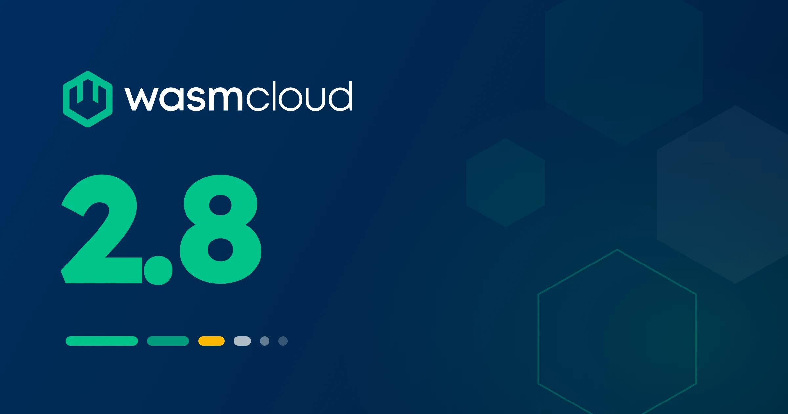

[wasmCloud 2.8.0](https://github.com/wasmCloud/wasmCloud/releases/tag/v2.8.0) is now available! This release centers on messaging and runtime resilience:

- **Async messaging**: The new `wasmcloud:messaging@0.3.0` interfaces bring async functions, streamed message bodies, per-request timeouts, and typed errors, served alongside the sync `0.2.0` interfaces
- **Messaging admission control**: Deliveries to messaging-triggered components are now bounded by per-component and host-wide in-flight limits, sized from the instance pool by default
- **A backstop for runaway guests**: Guest code that spins the CPU without yielding is now detected and trapped, so a busy-looping component can no longer pin a core until restart

2.8 also opens up wasmtime memory tuning through the Helm chart, makes `wash wit` validate before it writes, and tightens default socket policy for embedders of `wash-runtime`.

{/* truncate */}

## At a glance

| Area | 2.7.0 | 2.8.0 |
|---|---|---|
| `wasmcloud:messaging` | sync `0.2.0` | async `0.3.0` alongside `0.2.0` |
| Messaging deliveries | unbounded | admission-controlled, with per-component limits |
| Messaging trigger services | invoke `handler@0.2.0` | invoke `handler@0.3.0` |
| Guests that never yield | pin a core until restart | trapped and replaced |
| Wasmtime engine sizing | fixed defaults | tunable heap ceiling and instance slots |
| `wash wit add` | could write invalid WIT | validates first; a bare package lists its interfaces |

## Async messaging with `wasmcloud:messaging@0.3.0`

The `wasmcloud:messaging` package now ships an async `0.3.0` revision alongside the sync `0.2.0` interfaces. In `0.3.0`:

- **Every function is an `async func`.** A component can hold many publishes or requests in flight, and a handler can await `consumer.publish` from inside `handle-message` (for example, to reply on `reply-to`).
- **Message bodies are `stream<u8>`** rather than `list<u8>`, so large payloads can flow incrementally.
- **`request` takes an optional `timeout-ms`**, with `none` deferring to the backend default.
- **Errors are typed variants** (`timeout`, `broker-unavailable`, `message-too-large`, and more) instead of strings, and a handler returns a `reject`/`retry`/`other` disposition. At 2.8.0 the host logs the disposition; mapping `retry` to broker redelivery is left to future backend support.

Both revisions share the same backends and configuration, including `subscriptions` and `consumer_group`, and both work in `wash dev` out of the box. Nothing changes for existing workloads: the `0.2.0` interfaces remain the default, and a `wasmcloud:messaging` host interface entry without a `version` binds them exactly as before. Declaring `version: "0.3.0"` on the entry links the async `consumer` imports; on the handler side, the host invokes whichever revision the component exports, preferring `0.3.0`.

There is one deliberate break: **messaging [trigger services](/docs/overview/hosts/trigger-services/) now invoke `handler@0.3.0` only**. A service workload handling messages must export the `0.3.0` revision to start on 2.8.0. Plain components are unaffected and may export either revision. See the upgrade notes below.

You can find more details in the [Interfaces overview](/docs/overview/interfaces/#wasmcloud-interfaces) and the [CRD documentation](/docs/kubernetes-operator/crds/#messaging-subscriptions-and-consumer-groups).

## Messaging admission control

Messaging deliveries to per-message components previously had no bound: a subject burst could instantiate components until the instance pool ran dry. 2.8.0 puts an admission limit in front of instantiation.

- **`max_in_flight`**, a config key on the component, caps concurrent deliveries across the component's replicas on a host. It can lower a component below the host's per-component ceiling but not raise it above.
- **`admission_wait`** (default `30s`) sets how long a delivery waits for a slot before it is dropped with a warning. Core NATS has no negative acknowledgment, so size the limit for peak load rather than counting on redelivery.
- **Host-wide ceilings** back the per-component limit, with defaults derived from the wasmtime instance pool (133 total and 33 per component on a stock host). Flags and environment variables raise them.

The in-flight limit joins `poolSize`/`maxConcurrency` and the connection quotas as a third limits family; the new [Concurrency and connections](/docs/kubernetes-operator/operator-manual/concurrency-and-connections/#messaging-admission-per-component) guide covers how they fit together. Full reference in the [CRD documentation](/docs/kubernetes-operator/crds/#messaging-admission-control).

## A backstop for runaway guests

Before 2.8.0, guest code that spun the CPU without yielding (e.g., an infinite loop or a pathological regex) was unreachable by every timeout: the call appeared hung, and the instance pinned a core until the workload restarted. 2.8.0 compiles wasmtime epoch interruption into guest code and pairs it with abandoned-call tracking, so the host can reclaim an instance that is provably stuck.

The backstop is conservative. A store is trapped only when a call has passed its deadline (or its client disconnected), no other call on the instance is still wanted, and the guest is measurably pinned. A guest that yields normally is never affected, and one hung caller never traps an instance with live callers. When the trap fires, a pooled warm instance is replaced, a service restarts under supervision, and a host component plugin is warned before an escalating restart.

Alongside this, two call paths that previously had no bound gained one: messaging deliveries (`WASH_MESSAGING_DELIVER_TIMEOUT_SECS`) and plugin capability calls (`WASH_PLUGIN_CAPABILITY_CALL_TIMEOUT_SECS`), both defaulting to 600 seconds. Details in [Trigger services](/docs/overview/hosts/trigger-services/).

## Wasmtime memory tuning

Hosts gain three engine sizing controls, surfaced in the Helm chart:

- **`--default-heap-memory`** caps any single guest linear memory (wasmtime's default is 4 GiB).
- **`--core-instances`** sets the wasmtime pooling allocator's instance slots (default 1000).
- **`--max-guest-memory`** declares a total guest memory budget. At 2.8.0 the budget is advisory: the host derives it from the cgroup limit or physical memory when unset, logs it at startup, and warns when the other settings look inconsistent with it.

On Kubernetes, set `runtime.resources.defaultHeapMemory` and `runtime.resources.coreInstances` alongside the usual requests and limits; the chart passes them as environment variables, and forwards `resources.limits.memory` as the guest memory budget. See the [Helm values reference](/docs/kubernetes-operator/operator-manual/helm-values/#runtimeresourcesdefaultheapmemory-and-runtimeresourcescoreinstances).

## `wash wit` validates before it writes

The `wash wit` subcommands got a usability pass:

- **`wash wit add` takes an interface reference** (like `wasi:keyvalue/store`) and validates it against the registry before touching `wit/world.wit`. Previously it could write invalid WIT. Passing a bare package now lists that package's interfaces instead of writing anything, and unknown references report the versions that do exist.
- **`wash wit remove`** also drops the package from `wit/deps/` and re-fetches, so the lock file no longer pins removed dependencies.
- **`wash wit update`** reports exactly which packages moved.
- **`wit.sources`** in project configuration accepts absolute local paths in addition to HTTP, Git, and OCI references.

See the [command reference](/docs/wash/commands/#wash-wit).

## Other notable changes

- **[Instance pooling no longer silently disables under concurrent load](https://github.com/wasmCloud/wasmCloud/pull/5488)**: A race could poison the pool and quietly degrade every request to cold starts until restart.
- **[Failed workload starts roll back partially-bound plugins](https://github.com/wasmCloud/wasmCloud/pull/5492)**, so a bind failure no longer leaks plugin connections and tasks.
- **[Filesystem keyvalue writes are atomic and counters serialized](https://github.com/wasmCloud/wasmCloud/pull/5447)**, making `wash dev` keyvalue reliable under concurrent invocations.
- **[The `http-hello-world-persistent-storage` example is now published](https://github.com/wasmCloud/wasmCloud/pull/5476)** as an OCI artifact.
- **[Embedder defaults tightened](https://github.com/wasmCloud/wasmCloud/pull/5478)**: `wash-runtime`'s default socket policy now matches the CLI's (special address ranges denied, egress counting on), and OCI CA trust is settable via `HostConfig`. See [Building custom hosts](/docs/runtime/building-custom-hosts/#embedder-defaults-at-280).
- **[Anonymous OCI pulls no longer log a spurious credentials warning](https://github.com/wasmCloud/wasmCloud/pull/5479)**.
- **[`cargo package` works again for `wash-runtime`](https://github.com/wasmCloud/wasmCloud/pull/5446)** with proto codegen moved to an xtask: Thanks to contributor [@jtakakura](https://github.com/jtakakura)!
- **[h2 bumped to 0.4.17](https://github.com/wasmCloud/wasmCloud/pull/5481)** for RUSTSEC-2026-0258.

## What to check before you upgrade

- **Messaging trigger services must export `handler@0.3.0`**: A service workload that handles messages and exports only `handler@0.2.0` fails to start on 2.8.0. Rebuild the service against the `0.3.0` interfaces, or run the handler as a plain component, which still supports either revision.
- **Messaging deliveries are now bounded**: A component that previously absorbed unbounded bursts now queues at the admission limit and sheds after `admission_wait`. If a workload legitimately needs more than the stock per-component ceiling of 33 concurrent deliveries, raise the host's per-component ceiling via its flag or environment variable.
- **Deliveries and plugin calls now time out**: Messaging deliveries and plugin capability calls are bounded at 600 seconds by default. A legitimately long-running handler needs the corresponding environment variable raised.
- **Embedders of `wash-runtime`**: The default socket policy is no longer permissive. If your embedding relied on the old default, set a policy explicitly.

Everything else in 2.8.0 is backward compatible: existing manifests, sync messaging components, and chart values run unchanged.

## What's coming

Async messaging opens the door to broker-side redelivery: the `0.3.0` interfaces are designed so a backend with redelivery semantics, like NATS JetStream, can map the `retry` disposition to a negative acknowledgment. Host component plugin work also continues upstream. As always, the [roadmap](https://github.com/orgs/wasmCloud/projects/7) has what's in progress, and [wasmCloud Wednesday](/community/) is the place to weigh in.

## Get started with wasmCloud 2.8

Install or upgrade `wash`.

On macOS or Linux via install script:

```bash
curl -fsSL https://wasmcloud.com/sh | bash
```

With Homebrew:

```bash
brew install wasmcloud/wasmcloud/wash
```

On Windows with [winget](https://learn.microsoft.com/en-us/windows/package-manager/winget/):

```shell
winget install wasmCloud.wash
```

For new users, the [quickstart](/docs/quickstart/) gets you from installation to a running component on Kubernetes in a few minutes.

Full changelog: [v2.7.0...v2.8.0](https://github.com/wasmCloud/wasmCloud/compare/v2.7.0...v2.8.0)

## Join the community

- [wasmCloud Slack](https://slack.wasmcloud.com/): Questions, announcements, and #wasmcloud-dev
- [wasmCloud Wednesday](/community/): Weekly community call, Wednesdays at 1PM ET
- [wasmCloud Roadmap](https://github.com/orgs/wasmCloud/projects/7): What's in progress and what's ready for contributors to pick up
- Good first issues: [github.com/wasmCloud/wasmCloud/issues](https://github.com/wasmCloud/wasmCloud/issues?q=label%3A%22good+first+issue%22+is%3Aopen)
