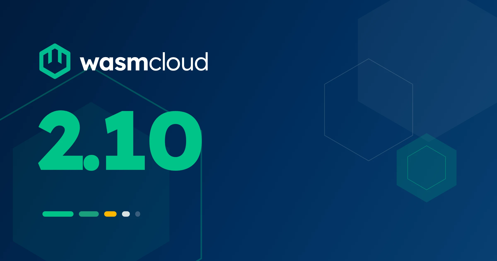

[wasmCloud 2.10.0](https://github.com/wasmCloud/wasmCloud/releases/tag/v2.10.0) is now available! This release centers on connecting workloads and securing the connections:

- **Same-host local routing**: An opt-in fast path serves a workload's outgoing HTTP in process when the destination is a co-located workload, skipping the network entirely
- **Outbound client identity**: The host can present an mTLS client certificate on components' outbound HTTPS, with rotation that never needs a restart
- **Spec-conformant OpenTelemetry**: The host's telemetry export now follows the OpenTelemetry environment spec, with per-signal control, TLS and mTLS to collectors, and misconfiguration that warns instead of aborting

2.10 also enforces egress policy for host plugins, routes `implements` labels between components in a workload, fixes messaging admission so replicas share one gate, publishes an all-features host image, and upgrades to Wasmtime 48.

{/* truncate */}

## At a glance

| Area | 2.9.0 | 2.10.0 |
|---|---|---|
| HTTP between co-located workloads | over the network | opt-in in-process local routing |
| Outbound HTTPS identity | none (server verification only) | mTLS client certificate, rotating |
| Host telemetry | any `OTEL_*` var activated everything | endpoint-keyed, per-signal, spec-conformant |
| Plugin egress | HTTP and DNS gated for component plugins only | raw sockets and native plugins gated too |
| `implements` labels | route to host backends | route to host backends or sibling components |
| `max_in_flight` on Kubernetes | one gate per replica | one gate per deployment |
| Host component plugins | custom build required | published `-all-features` image |
| Engine | Wasmtime 47 | Wasmtime 48 |

## Same-host local routing

When two workloads are scheduled on the same host, an HTTP call between them previously took the full network path: kube-proxy, cluster DNS, and everything between. With 2.10.0's opt-in local routing, the call never leaves the process.

It is a two-key grant, like host loopback. The target workload declares the hostnames it serves in its `wasi:http` entry (`localRoute: 'svc.internal, api.internal/orders'`, with segment-boundary path prefixes), and the operator enables `--http-local-routing` on the host (chart value [`runtime.hostGroups[].http.localBypassRouting`](/docs/kubernetes-operator/operator-manual/helm-values/#runtimehostgroupshttplocalbypassrouting)). Callers change nothing, and their `allowedHosts` policy is checked before the short-circuit, so local routing never widens egress. Names declared in `localRoute` are never reachable from the network; a forged `Host` header from outside gets a 404.

The tradeoff is trust, and it is deliberate: a `localRoute` claim is not proof of ownership. Any workload on an enabled host can claim any hostname, including one a neighbor calls over HTTPS, and receive that traffic in plaintext. Locally routed calls also bypass ingress auth, rate limits, mesh mTLS, and NetworkPolicy. Enable it on host groups whose workloads trust each other, never on shared multi-tenant groups. See [Same-host local routing](/docs/kubernetes-operator/workload-security/#same-host-local-routing) and the [local-ingress example](https://github.com/wasmCloud/wasmCloud/tree/main/examples/local-ingress).

## Outbound client identity

Workloads calling services that require mutual TLS previously had no way to present a client certificate. In 2.10.0 the host carries one for them:

- **`--http-client-cert-path` / `--http-client-key-path`** (PEM) present a client certificate on outbound HTTPS whenever a peer requests one. On Kubernetes, [`runtime.clientIdentity`](/docs/kubernetes-operator/operator-manual/helm-values/#runtimeclientidentity) points at a `kubernetes.io/tls` Secret, cert-manager-shaped by default.
- **`--http-client-identity-refresh`** re-reads the pair on an interval (the chart sets `30s`; the flag itself reads once when unset), built for Kubernetes Secret rotation: new connections pick up the new credential, established connections keep what they negotiated, and a failed re-read keeps the current credential.
- **Expiry is fail-closed under refresh**: with the refresh interval set, a host refuses to start with an already-expired identity, and a credential that expires while resident stops being presented rather than being offered stale.

The identity is host-group-wide and destination-wide: every workload authenticates as it, to any peer that asks. Pair it with narrow `allowedHosts`, and keep untrusted workloads on a host group without one. Details in [Workload security](/docs/kubernetes-operator/workload-security/#outbound-client-identity-mtls).

## Spec-conformant OpenTelemetry

The host's own telemetry export was rebuilt around the [OpenTelemetry environment spec](https://opentelemetry.io/docs/specs/otel/configuration/sdk-environment-variables/):

- **Export activates on an endpoint.** A signal exports only when `OTEL_EXPORTER_OTLP_ENDPOINT` (or its per-signal form) is set. Setting `OTEL_SERVICE_NAME` alone no longer spins up three exporters aimed at localhost.
- **Per-signal control**: `OTEL_METRICS_EXPORTER=none` turns one signal off; per-signal endpoints, protocols, and timeouts are honored; `grpc` and `http/protobuf` both work, including to `https://` collectors, with `OTEL_EXPORTER_OTLP_CERTIFICATE` for private CAs and client certificate variables for mTLS.
- **Misconfiguration warns instead of killing the process**, `OTEL_SERVICE_NAME` now sets `service.name` (the host previously forced `wash-runtime`), and each enabled signal logs one startup line saying where it exports.

The new [Host telemetry](/docs/kubernetes-operator/operator-manual/telemetry/) page documents the full variable surface.

## Plugins: enforced egress and an all-features image

Host plugin egress grants are now enforced on every path. The `allowedHosts` and `allowedIpNameLookups` lists on a plugin declaration previously gated component plugins' HTTP and DNS only:

- The lists now apply to native and component plugins alike, and cover raw sockets.
- A native plugin that cannot enforce a declared ceiling fails host startup instead of ignoring it.
- The built-in `wasmcloud:nats` plugin enforces its ceiling at startup and at bind, and stops following cluster-advertised peers under one, so list every failover member.
- Plugins can declare `allowedHostLoopbackPorts` and bind operator-declared `ports`, reserved in the host's port table.

And running host component plugins no longer requires a custom build: each release now publishes an **all-features image**, the release tag plus an `-all-features` suffix (`ghcr.io/wasmcloud/wash:2.10.0-all-features`), multi-arch and retagged from the exact digest that passed release testing. Point one host group's `image.tag` at it to run component plugins on stock artifacts.

## `implements` labels route between components

Multi-backend binding's `(implements ..)` labels gain a second target: a label can now name a sibling **component** in the same workload, linking the import in process to that component's export, for any interface. Two components exporting the same interface no longer conflict; an importer names its provider, and an unlabeled import of a multi-exported interface is refused with guidance naming the fix. An operator-declared `hostInterfaces` entry `name` takes precedence over a same-named component, so the manifest's explicit routing always wins. See [Host Interfaces](/docs/kubernetes-operator/crds/#host-interfaces).

## Messaging admission shares the gate

2.8's `max_in_flight` limit was documented as counted across a component's replicas on a host, but on Kubernetes each replica's Workload resource carried a unique name, so each replica opened its own gate at the full ceiling. In 2.10.0 the operator stamps replicas with stable identity annotations and the host keys admission gates on them, so replicas of one deployment genuinely share a single gate. A new `admission_group` config key overrides the name the gate is keyed under, so same-named components in different deployments can share a gate deliberately. See [Messaging admission control](/docs/kubernetes-operator/crds/#messaging-admission-control).

## Wasmtime 48

The engine moves to Wasmtime 48, bringing several behavior improvements along with the upgrade:

- **A denied outbound request no longer traps WASI 0.2 guests**: `allowedHosts` denials surface as a handleable `http-request-denied` error, matching 0.3 semantics.
- **Socket policy now screens inbound traffic** (listens, accepts, received datagrams), and accepted connections count against the inbound quota.
- **Ingress normalizes scheme and authority**: guests behind a TLS listener see `https`, and an invalid `Host` header is a 400.
- Hop-by-hop headers are withheld from 0.3 guests as they already were from 0.2.

## Other notable changes

- **[WIT registry fetches retry transient failures](https://github.com/wasmCloud/wasmCloud/pull/5568)**: connection resets, timeouts, HTTP 429/5xx, and truncated downloads retry up to three times with backoff, and corrupted cache entries are discarded between attempts ([including on Windows](https://github.com/wasmCloud/wasmCloud/pull/5602)).
- **[`wasmcloud:nats` adds `bucket.select`](https://github.com/wasmCloud/wasmCloud/pull/5572)**: stream every matching key-value entry with its value, uncapped, with a terminal-status future so a broken drain is never mistaken for a complete one. The package moves to `0.1.2`; components built against `0.1.x` keep binding.
- **[Component and store ids are UUIDv7](https://github.com/wasmCloud/wasmCloud/pull/5576)**: time-sortable, so logs and traces order chronologically.
- **[Plugin dispatch is cancellable](https://github.com/wasmCloud/wasmCloud/pull/5565)** for native plugin authors, with handles that report quiescence.
- **[Hosts can turn off native unwind tables](https://github.com/wasmCloud/wasmCloud/pull/5555)** (`WASMTIME_NATIVE_UNWIND_INFO=false`) where LLVM libunwind makes component teardown quadratic; the published container image is unaffected.
- **[A stopped host releases its ingress](https://github.com/wasmCloud/wasmCloud/pull/5548)** without cutting off the drain (keep-alive requests in flight are served to completion), so embedders stop leaking an engine's worth of state per dropped host. And **[a panicked command task now shuts the host down cleanly](https://github.com/wasmCloud/wasmCloud/pull/5559)**, so the pod restarts instead of lingering half-dead.
- **[The `--max-concurrent-starts` help text](https://github.com/wasmCloud/wasmCloud/pull/5553)** now matches the documented parallel-compilation behavior.

## What to check before you upgrade

- **Set your OTel endpoint explicitly**: hosts that exported to the SDK's localhost default without an endpoint variable stop exporting. Set `OTEL_EXPORTER_OTLP_ENDPOINT`, and note `service.name` now honors `OTEL_SERVICE_NAME`.
- **Messaging replicas share their admission gate**: a deployment whose replicas each consumed a full `max_in_flight` allowance now shares one gate. If throughput drops, raise `max_in_flight` (and the host ceiling if needed) to the intended aggregate.
- **Plugin egress lists are enforced**: lists that previously bound nothing on a native plugin, and left a component plugin's raw sockets ungated, now apply, with `allowedHosts` and range refusals following the host's `socketEgress` mode; a native plugin that cannot enforce a declared ceiling fails host startup.
- **WASI 0.2 components see denials as errors**: code that relied on trapping when `allowedHosts` blocked a request now receives an error value to handle.
- **Embedders**: Wasmtime 48 unifies the outgoing HTTP surfaces and removes the P3-specific types; MSRV is 1.95. See [Building custom hosts](/docs/runtime/building-custom-hosts/#embedder-changes-at-2100).

Everything else is backward compatible: local routing, client identity, and the plugin `ports` surface are all opt-in, and existing manifests and chart values run unchanged.

## What's coming

Host component plugins stay opt-in behind a Cargo feature; the all-features image makes them reachable on stock artifacts while the binding surface settles. `wasmcloud:nats` is at `0.1.2` with stream and consumer administration still deliberately out of scope, and local routing's per-workload trust model is the open question for a future release. As always, the [roadmap](https://github.com/orgs/wasmCloud/projects/7) has what's in progress, and [wasmCloud Wednesday](/community/) is the place to weigh in.

## Get started with wasmCloud 2.10

Install or upgrade `wash`.

On macOS or Linux via install script:

```bash
curl -fsSL https://wasmcloud.com/sh | bash
```

With Homebrew:

```bash
brew install wasmcloud/wasmcloud/wash
```

On Windows with [winget](https://learn.microsoft.com/en-us/windows/package-manager/winget/):

```shell
winget install wasmCloud.wash
```

For new users, the [quickstart](/docs/quickstart/) gets you from installation to a running component on Kubernetes in a few minutes.

Full changelog: [v2.9.0...v2.10.0](https://github.com/wasmCloud/wasmCloud/compare/v2.9.0...v2.10.0)

## Join the community

- [wasmCloud Slack](https://slack.wasmcloud.com/): Questions, announcements, and #wasmcloud-dev
- [wasmCloud Wednesday](/community/): Weekly community call, Wednesdays at 1PM ET
- [wasmCloud Roadmap](https://github.com/orgs/wasmCloud/projects/7): What's in progress and what's ready for contributors to pick up
- Good first issues: [github.com/wasmCloud/wasmCloud/issues](https://github.com/wasmCloud/wasmCloud/issues?q=label%3A%22good+first+issue%22+is%3Aopen)
