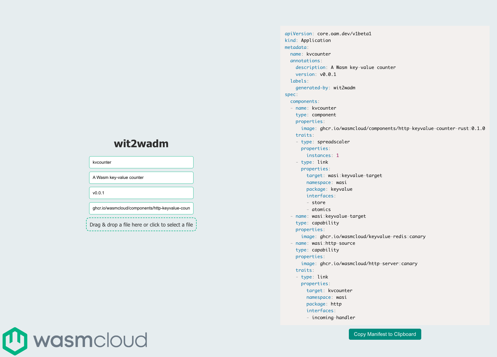

We built wasmCloud 1.0 on a conviction that with the right tools and the right standards, [WebAssembly components](/docs/concepts/components) could help developers reuse code&mdash;regardless of the language it was written in&mdash;and build applications much more efficiently, then deploy and distribute those applications anywhere. But I have to admit that on the developer side, I've been surprised by just how much components and [well-known interfaces](/docs/concepts/interfaces) can speed up development. 

{/* truncate */}

It really hit me when I was working on [wit2wadm](https://github.com/brooksmtownsend/wit2wadm), my project that sprung out of our [Spring Hackathon](/blog/hackathon-llama-3-wit2wadm). The idea was to create a simple tool that could automatically generate YAML deployment manifests for wasmCloud applications. Once I got going, I realized how wonderful it is to reuse the same code in new contexts, and I thought it would be worthwhile to walk through the process for folks new to components. So let's take a look at how you can use the same component everywhere from the browser to a CLI tool.

# Step 1: From Rust to component

I started out writing `wit2wadm` as a Rust binary and library. Since components have strictly defined imports and exports, the tool could automatically populate a Wadm manifest from the WIT for a given component. When the tool finds an unsatisfied import or export, it can fill in the manifest with known [first-party providers](https://github.com/orgs/wasmCloud/packages?repo_name=wasmCloud) and otherwise generate placeholders for custom interfaces. The CLI can also give users options for defining an application's name or description. 

So at this point, we have a nice utility in Rust. You can use it as a library by importing the `wit2wadm::component_to_wasm` function, which will take a `wit_parser::Resolve` and the name of a WIT world as arguments. I could write up a couple of unit tests and ensure it was working well. At this point, the pure Rust library and CLI was functionally complete, but I wasn't quite done yet.

We can *also* compile it as a WebAssembly component! That means we can run it anywhere that we can run a component&mdash;like, say, wasmCloud. Turning the tool into a component is a simple matter of cloning the [project](https://github.com/brooksmtownsend/wit2wadm) and running `wash build`. Having wit2wadm as a Wasm component meant I could distribute a single platform-agnostic binary and reuse the same logic outside of just the Rust ecosystem, for example in a web application.

# Step 2: Component to web app

Once the tool is compiled to a component, the possibilities really open up. I thought it would be nice to give users a simple graphical user interface, and once I got started it was a surprisingly simple matter of transpiling the component with [jco](https://github.com/bytecodealliance/jco). 

With the addition of a very simple user interface, now the tool could run in the browser ([you can try out a hosted version here](https://brooksmtownsend.github.io/wit2wadm/)). To use the web app you can just click the button to select a component, or drag the component into the window, and the tool will automatically generate a manifest.



# Step 3: Component to plugin

As I mentioned earlier, the great thing about the component ecosystem is how flexible and reusable your code can become. 

In addition to running the tool on wasmCloud or as a browser tool, we can plug it into component-based CLIs. With the tool componentized and a WebAssembly Interface Type (WIT) definition for the interface, it was easy to implement `wit2wadm` as an inaugural **[wash plugin](/blog/customize-wash-cli-webassembly-components)**: a modular subcommand for wasmCloud Shell (wash) implemented as a component. 

If you have wash v0.28 or later, you can install the plugin from an OCI artifact with a simple command:

```shell
wash plugin install oci://ghcr.io/brooksmtownsend/wit2wadm:0.2.0
```

Check out our [blog on wash plugins](/blog/customize-wash-cli-webassembly-components) to learn more about using the plugin. 

# Conclusion

Components and WIT interfaces are an amazing accelerant for developers, and as component tooling matures, development cycles are only going to get faster. If you want to talk about component development or chat about wasmCloud, join us on the [wasmCloud Slack](https://slack.wasmcloud.com/)!
