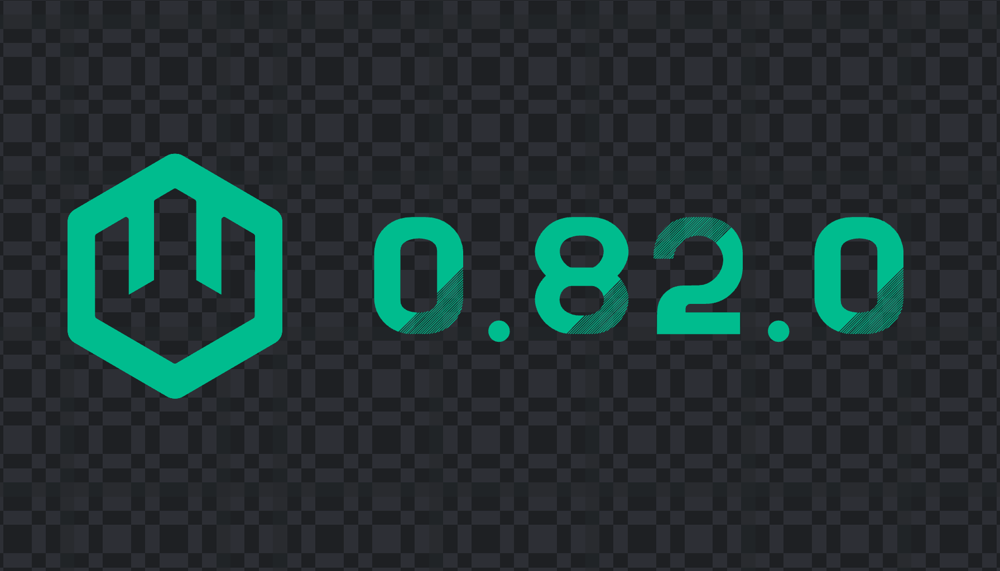

We’re proud to announce wasmCloud 0.82&mdash;the last stop on the road to our 1.0 milestone. This release is all about preparing the way, bringing: 

* Full and stable support for WASI 0.2 APIs 
* Quality-of-life improvements for builds and deployment
* Support for OpenTelemetry logging
* Additional bug-fixes and improvements

{/* truncate */}

WebAssembly components&mdash;portable, interoperable, and composable&mdash;are the future of Wasm artifacts, and with WASI 0.2, that future is here. Components are ideally suited to wasmCloud's design philosophy, and we're all-in: as of 0.82, the old “module + wasmbus” model is deprecated and will be removed in 1.0.  

Version 0.82 supports running both components and legacy modules, so now is the time to migrate old projects, do it with stable WASI 0.2 APIs, and have some fun!

# Transitioning to components

It's easier than ever to start a new project in the language of your choice. We've added project templates for building WebAssembly components from Python and TypeScript, which join Rust and TinyGo as first-class citizens in the `wash` CLI. When you run `wash new actor` you can choose from the following options:

```bash
? Select a project template: ›
  hello-world-rust: a hello-world actor component (in Rust) that responds over an HTTP connection
  hello-world-tinygo: a hello-world actor component (in TinyGo) that responds over an HTTP connection
  hello-world-typescript: a hello-world actor component (in TypeScript) that responds over an HTTP connection
  hello-world-python: a hello-world actor component (in Python) that responds over an HTTP connection
```

Alternatively, you can start a new project from one of those templates with a simplified command. The example below will start a new Python project:  

`wash new actor hello --template-name hello-world-python`

Note that as we're phasing out old-school module support, `wash` no longer creates new projects as modules, and our docs no longer detail module workflows.

# Simplified deployment

In addition to an easier build workflow, we’ve made deployment smoother by using relative paths to specify `.wasm` artifacts in the `image` fields of `wadm.yaml` manifests. Behind the scenes during deployment, the relative path simply gets converted to an absolute path.  

Previously, you'd have to know or find the absolute path to your signed build artifact&mdash;an extra bit of friction that just didn't need to be there. Now you can stay in the context of your project and point to the relative path, and the spec for an actor can look like this:

```yaml
- name: hello
      type: actor
      properties:
      // highlight-start
        image: file://./build/hello_s.wasm
      // highlight-end
```

# OpenTelemetry logging

OpenTelemetry (OTEL) logging joins our existing tracing support to provide more options for observability. (Metrics will complete the trifecta in wasmCloud 1.0.)  

By default, plaintext logs are written to `stderr` as before. You can enable structured logging and emit JSON as an OTEL signal by launching a wasmCloud host with the OTEL exporter enabled via environment variable:

```shell
OTEL_TRACES_EXPORTER=otlp wash up
```

For sample configurations and simplified experimentation with wasmCloud observability, we've created a set of Docker Compose files to easily launch a wasmCloud observability ecosystem including...

* An **OTEL collector** for ingesting OTLP signals from a wasmCloud host
* **Grafana** for dashboards
* **Loki** for logging
* **Tempo** for traces
* **Prometheus** for metrics (in preparation for wasmCloud 1.0)

The Docker Compose files are [available on GitHub](https://github.com/wasmCloud/wasmCloud/tree/main/examples/docker). Grafana, Loki, Prometheus, and Tempo are not specifically required: wasmCloud emits traces and logs (and soon metrics) to any OTEL-compatible system.

# Have fun, break things, and get involved

wasmCloud 1.0 is right around the corner, and the Wasm ecosystem is growing day by day. We couldn't be more excited to see language support expanding, and if we don't have built-in support for your language of choice yet, please let us know what you'd like to see!

If it's been a while since you've created a new project, or if you'd like to learn how to build a component, check out our [Quickstart](https://wasmcloud.com/docs/tour/hello-world)&mdash;it's up-to-date with instructions to build components from Go, Rust, Python, and TypeScript. If you run into any speedbumps as you run through the tutorials, or anywhere else in the wasmCloud experience, let us know on the [wasmCloud Slack](https://slack.wasmcloud.com/) or [file an issue on GitHub](https://github.com/wasmCloud/wasmCloud/issues).
