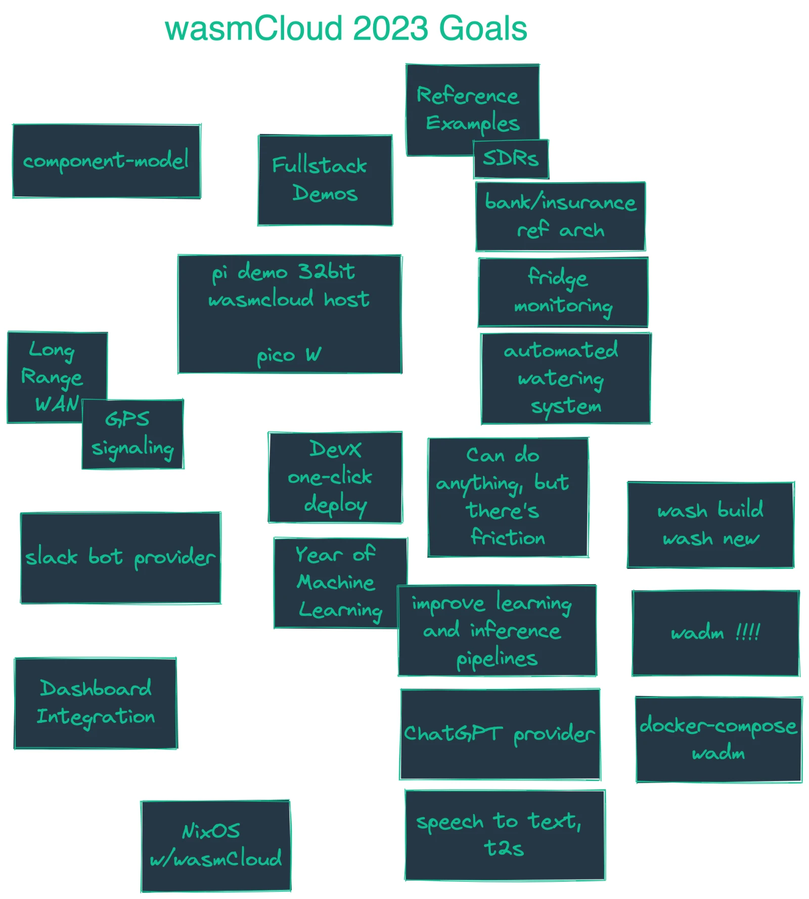

## Agenda

- Brief meeting today => It's holiday season 🎁
- New Year's resolutions (for wasmCloud)
  - We collaborated in excalidraw for some high-level goals that we want to see for wasmCloud in 2023.

{/* truncate */}

## Recording

Recording is being uploaded to YouTube and will be displayed promptly
