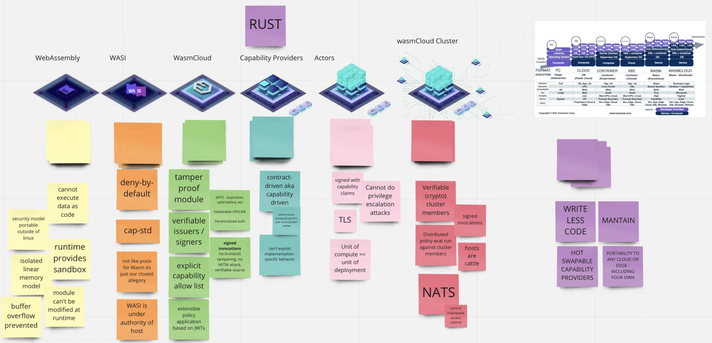

## Agenda

- (DEMO) wasmCloud `wazero` Go host runtime from Jordan
- (DEMO) `wash` 0.14.0 official release overview
- `wasmCloud` v0.60.0-rc.1 release & release candidate discussion
- (did not discuss) `wascap` 0.9.2 signed modules and compatibility
- Security overview of wasmCloud

{/* truncate */}

## Meeting Notes

- Jordan demo-ed the tailscale httpserver capability provider with a few extra features, including Tailscale funnel, to securely create public HTTPS endpoints through a tailscale account
- Jordan then demo-ed the Go-based wasmCloud runtime written on top of `wazero`, which features enough control interface commands to start an actor and invoke it by using `wash call`.
  - This capability provider embeds the NATS server binary into the final binary, so it is a single, static, zero dependency binary that can run on `armv6l` targets and likely even more restricted devices.
  - Community members discussed the impacts of multiple wasmCloud hosts and the benefits of leveraging different technologies as deploy targets to exercise Wasm's benefit of running anywhere
- Went over the wasmCloud `v0.60.0-rc.1` release which included large changes to the supervision tree (internal) and the mechanism of storing link definitions in a NATS key-value bucket. This is a critical breaking change and the release candidate is to allow for more in-depth integration testing before the official release
- Went over the wash `v0.14.0` release and the migration of functionality to `wash-lib`
- Whiteboarded some high level points on the many levels of security that applications on wasmCloud go through, with an end goal of putting the output in the wasmCloud documentation
  

## Recording

<YouTube url="https://youtu.be/rxB0Scrjp-o" />
