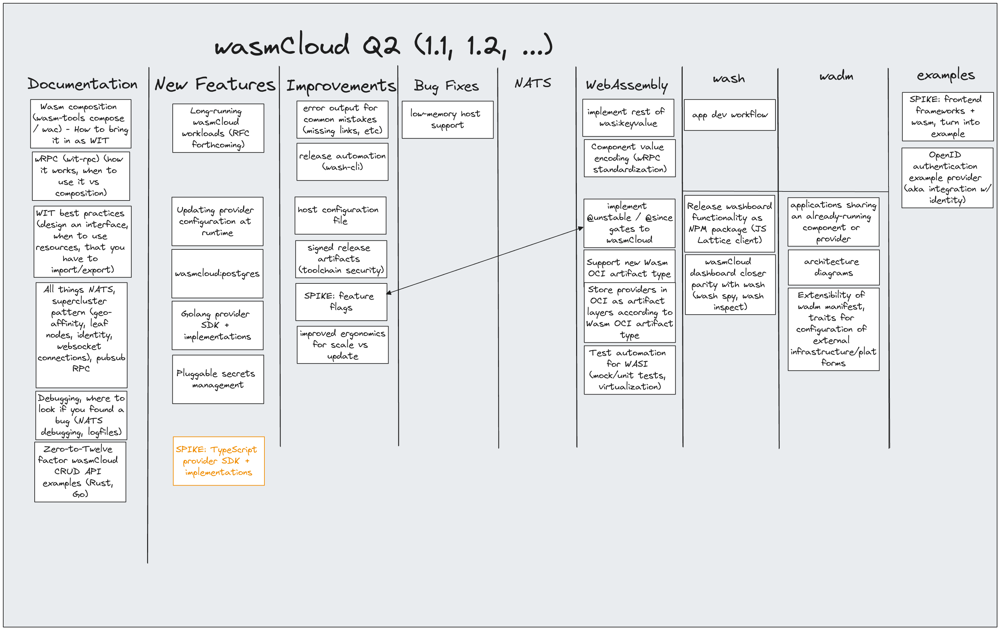

import ReactPlayer from 'react-player/youtube';

### Agenda

- DEMO: wash plugins part 2
- DISCUSSION: wasmCloud Roadmap development

{/* truncate */}

### Meeting Notes

- **DEMO: wash plugins part 2**
- Background: last week **Taylor** shows us a way to add [wash plugins](https://wasmcloud.com/docs/ecosystem/wash/plugins) which overlapped perfectly with Robin’s demo.
    - Not quite fully operational (in progress).
    - Inside of wash lib, in the process of adding to wash cli.
    - First plugin - custom sub-commands into wash.
    - Looking at the wit, we allow access to wasi cli world and the outgoing handler and control interface.
    - Makes it easy to take cowsay (for example) to wash, all you need to do is compose a simple plugin - metadata with a register function, attached to wash.
- Taylor is now ready to show this in action for real! Check out the recording for the demo, there’s only so much you can get from notes.
- Also, check out our [documentation](https://wasmcloud.com/docs/ecosystem/wash/plugins) and our [handy developer guide](https://wasmcloud.com/docs/ecosystem/wash/plugin_developer) if you want to tinker.
- This demos shows how it’s now possible to see all your current plugins via ‘plugin-list’ and install/uninstall/reinstall plugins using OCI and HTTPS/HTTPI.
- When installed we now have a Hello sub-command. wash automatically hooks in command lines to build in some validation.
- This is, essentially, full lifecycle management of plugins.
- We have updated our docs so you can [try things out](https://wasmcloud.com/docs/ecosystem/wash/plugin_developer) - toolchain section under wash (toggle 1.0). Configuration, disable, developer guide. ‘wash-build’ with the wash toolchain means your plugin will run anywhere as components.

**COMMUNITY KUDOS**

- Huge thank you to [Mossaka](https://github.com/Mossaka) (Jiaxiao Zhou) for his [wasi-blobstore with the Azure API](https://github.com/wasmCloud/wasmCloud/pull/1694)...well worth checking out.

- **DISCUSSION: wasmCloud Roadmap development**
- It’s an exciting moment as we start workshopping the next wave of innovation in wasmCloud.
- The roadmap for q2 this year came out of an interactive session with the community on this call, thank you all for your comments, contribution, feature requests, and suggestions!
- We will shortly update the roadmap in our documentation but please watch the recording for the detail.

**DOCUMENTATION:**

- We need 1st class documentation for composing components - Wasm tools compose with different components and run as one application.
    - WAC tool inclusion here.
- In the same vein more wRPC aka WITRPC documentation:
    - How and when to use it vs composition.
    - How to ship components together and communicate at runtime.
- We also have a general need for WIT best practices.
    - How to design an interface.
    - The requirement to use interfaces to import and export.
- All things NATS.
    - We would like to link out to existing documentation - streams, kv buckets etc.
- Take a look at the recording for the details on what’s coming next in wasmCloud.

**NEW FEATURES:**

- Recommend reading the [summary of our recent Hackathon](https://wasmcloud.com/blog/hackathon-llama-3-wit2wadm) which details several new ideas in flight.
- Long-running wasmCloud workloads is an interesting next foray:
    - Mitigates time limits.
    - Pushes long-running workloads to capability providers.
    - Request work starts and notify on completion.
    - Benefit; persistently run those workloads in components where the business logic resides.
- Updating provider config at runtimes:
    - With named configuration, if you have config that you put in wasmCloud an you change it, it will auto-update all the components that are using that configuration.
    - We’re going to improve how providers are configured in the next phase of development.
- wasmCloud Postgres.
- Zero-to-twelve factor wasmCloud CRUD.
- OpenID authentication example provider (integration with identity).
- Open API to WIT—Yosh—generator; a little rough and not quite ready but a great start here.
- NPM package for React that connects back to the lattice; wash board includes a package (as yet unpublished).
- Go Provider SDK is priority for Bailey—we have the basics for wRPC in Go and so not a giant leap.
- Typescript as second on the list.
- Native testing and debugging; a common question so we will focus efforts in this arena here.
    - Test automation for Wasm components.
    - Mocking framework for unit tests.
    - Using wasi-virt for testing.
    - Debugging as an IDE.
- C# support—for discussion and is always an interest area. Check out the latest [Bytecode Alliance Community Stream](https://www.youtube.com/watch?v=qqLAUz3-W3k) for a related discussion with Joel Dice on language support.
- Pluggable secrets support for wasmCloud was the most requested feature on the call, with plenty of design decisions and an RFC to follow.
- Watch out for the [updated roadmap](https://wasmcloud.com/docs/roadmap/) which will appear soon in docs.
- This was a wide-ranging discussion and so check out the recording below.

**EXAMPLES:**

- Ideally we’ll publish examples together in the repo; more to come!

In the end, we ended up with the following Roadmap that will be condensed into documentation, new features, and improvements (with additional views per-project and per-status in the GitHub project.)

**Where we’ll be…**

**May 14th:** Taylor will be at [SWCon in Colorado](https://www.sw2con.com/#agenda) talking all things Wasm and how it’s transforming Kubernetes estates and complex compute architectures. His talk: ‘Why Worry About WASM?’ takes place at 2pm in Breakout 3 (Wasm and Severless track).

**Listen in…**

- The CNCF and Bytecode Alliance [came together on CNCF Cloud Native Live](https://www.youtube.com/watch?v=5Nv51foQ1mQ) for an interesting discussion on WASI 0.2 the Component Model..and the role of the BA in driving forward Wasm standards and tooling.
- Cloud Native Wasm Day [recordings](https://youtube.com/playlist?list=PLj6h78yzYM2MQteKoXxICTWiUdZYEw6RI&feature=shared) are now live! Great to see the wasmCloud community on stage!
- Bailey joined Matt Butcher and industry analyst Dustin Kirkland on theCube (SiliconAngle) during KubeCon + CloudNativeCon to talk all things WebAssembly, [take a look](https://www.youtube.com/watch?v=XU4TVukPs8g).
- Check out the [Arm Developer Podcast](https://www.youtube.com/watch?v=iDTHXGuqXAI) where Bailey and Liam discussed the intersection of Wasm and GPU technologies.
- Cosmonic CTO Bailey Hayes met Chris Matteson (Fermyon) and Oscar Spencer (F5 NGINX) on the panel at the [latest Kubernetes meetup in New York](https://www.meetup.com/new-york-kubernetes-meetup/events/297886914/). They explored the Wasm what’s, why’s, standards and considerations when adoption. [The recording is live!](https://youtu.be/ThcQNR-aVvI)
- Listen in to the last [WasmEdge community meeting](https://youtu.be/ttiE7g2Ojuk) where Bailey Hayes talks all things WASI 0.2 and we hear from the students of the University of Tokyo on some cool new projects.
- Bailey was a guest on a recent [Rancher Live podcast](https://www.youtube.com/watch?v=SPdzvL59tIA) with Divya Mohan. Tune in for a deep dive into WASI 0.2!

### Recording

<YouTube url="https://www.youtube.com/watch?v=WP7UyarzYms" />
