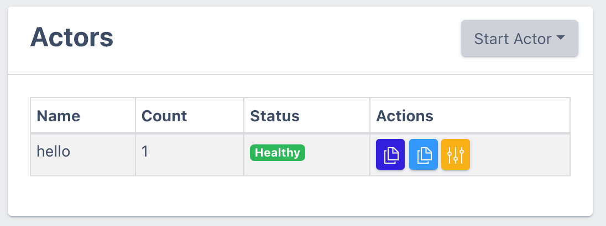
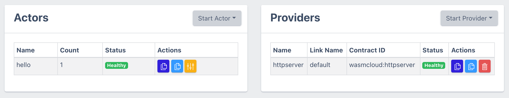

import Tabs from "@theme/Tabs";
import TabItem from "@theme/TabItem";

In [Getting started](/docs/getting-started.mdx) you ran an actor from the dashboard UI. Now, we're going to start the actor "the long way" so that you can get a feel for all of the moving parts of the process. Our tooling documentation should help you get actors started more easily, once you've been through this guide.

We assume you've already [installed](/docs/installation.mdx) wash, the wasmCloud host, and necessary prerequisites.

### Build the actor

Building the actor is as easy as running `make` in the project's root directory. This will compile the actor and sign it with a freshly generated seed key. The `Makefile` that comes with the newly generated project lists claims for the actor including `wasmcloud:httpserver`, so it can work with the HTTP Server capability provider.

### Launch the Actor

There are countless ways to run the actor we just created, and if you went through the [getting started](/docs/getting-started.mdx) section, you'll have seen some some of them already. Open your browser to view the web dashboard at [http://localhost:4000](http://localhost:4000). If you've configured your host with an alternate port number, use that here.

At this point, simply click **Start Actor** and then choose _From File_. Open a browser to your current project directory and then navigate to the `build` directory. Here you'll find a `(project)_s.wasm` file, where `(project)` is `hello`, or the name you selected for the project. The `_s` suffix indicates that this WebAssembly module has been _signed_.

A moment later you should see the actor in your web UI as shown in the following screenshot:



### Start the web server

We know our new actor needs a web server, so let's start the HTTP server capability provider. To do that, click the **Start Provider** button and enter this OCI URL: `wasmcloud.azurecr.io/httpserver:0.16.2`. Now we should have both an actor and a provider, and the dashboard should look like this:



### Add a link definition

With both the provider and the actor running, the next step is to _link_ the two. This provides a set of configuration values that is unique for each actor's use of a provider. To change things up slightly, and so you develop some muscle memory with the command line tooling, we'll use the `wash` CLI here. To link your actor, you'll' need the actor's public key. You can get that by clicking on the dark blue clipboard icon next to the actor name in the dashboard web UI (it'll be a long string that starts with **M**).

Once you've got the actor's public key, you can export a `HELLO_ACTOR_ID` environment variable with that value and copy-and-paste the link command:

<Tabs>
<TabItem value="unix" label="Unix" default>

```shell
# Paste your actor ID after the `=` below (with no space after the `=`)
export HELLO_ACTOR_ID=
```

```shell
wash ctl link put ${HELLO_ACTOR_ID} VAG3QITQQ2ODAOWB5TTQSDJ53XK3SHBEIFNK4AYJ5RKAX2UNSCAPHA5M wasmcloud:httpserver address=0.0.0.0:8087
```

  </TabItem>
  <TabItem value="powershell" label="Powershell" default>

```powershell
# Paste your actor ID after the `=` below (with a space after the `=`)
$env:HELLO_ACTOR_ID =
```

```powershell
wash ctl link put $env:HELLO_ACTOR_ID VAG3QITQQ2ODAOWB5TTQSDJ53XK3SHBEIFNK4AYJ5RKAX2UNSCAPHA5M wasmcloud:httpserver address=0.0.0.0:8087
```

  </TabItem>
</Tabs>

At this point your HTTP server capability provider has been notified that a link definition was created, and it started the corresponding web server listening on port `8087`. You can now hit that endpoint and exercise the code you just wrote:

```shell
curl localhost:8087
```

and you should get the response:

```text
Hello World
```

The actor accepts an optional parameter `name`, and uses it to change the greeting. (Notice the quotes around the url below).

```shell
curl "localhost:8087?name=Carol"
```

The response should be

```text
Hello Carol
```

_**Congratulations!**_ You've successfully created and run your first actor. Welcome to the world of boilerplate-free, simple distributed application development in the cloud, browser, and everywhere in between.

Let's make a slight modification to the code, so you can see what it's like to go through a development iteration to compile and update the running code. Don't worry - this will be pretty quick.
