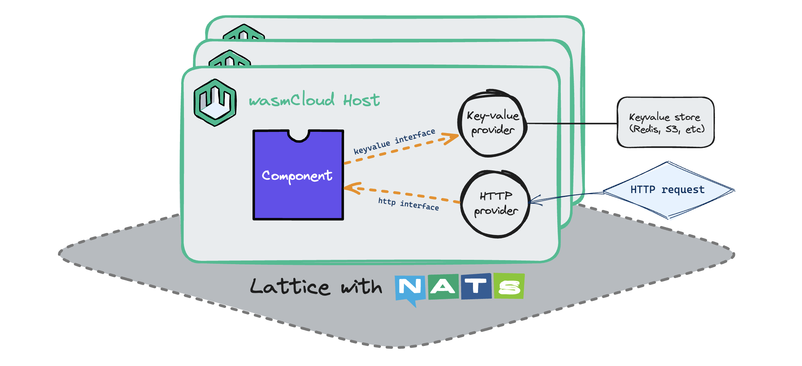
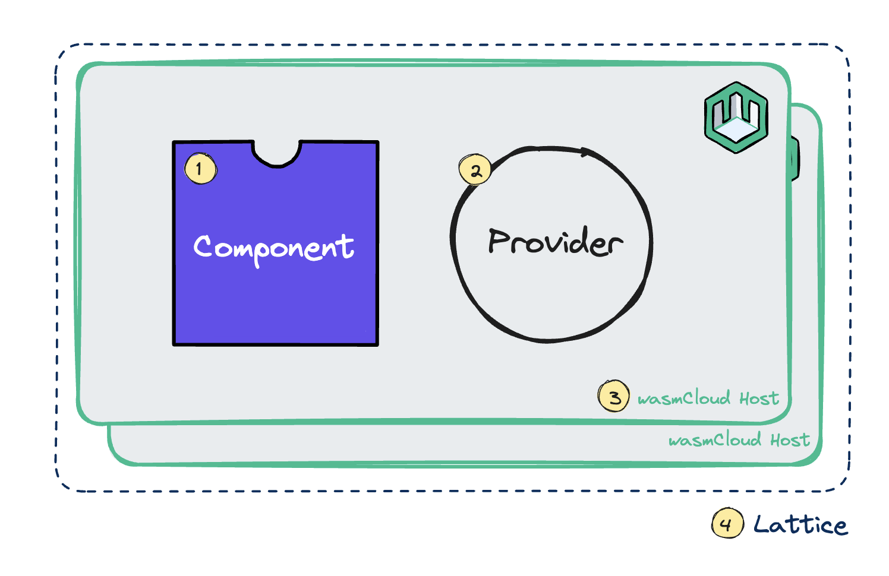

**wasmCloud** is a universal application platform that enables you to write code in your language of choice, compile the code into a WebAssembly component, and run your application anywhere&mdash;from your laptop to the edge to the cloud.

In wasmCloud, applications are comprised of **components** and **providers**:

1. [**Components**](/docs/concepts/components/) are portable, interoperable WebAssembly binaries that implement stateless logic. 
2. [**Providers**](/docs/concepts/providers/) are executable host plugins that implement longer-lived processes, typically providing reusable capabilities (such as key-value storage).

Applications run on **hosts** which may be clustered on a **lattice**:

3. A [**host**](/docs/concepts/hosts/) is a runtime environment node consisting of a WebAssembly runtime (Wasmtime) and additional layers of security and functionality.
4. A [**lattice**](/docs/concepts/lattice/) is a self-forming, self-healing mesh network that provides a unified, flat topology across environments using NATS.

Components and providers communicate with one another via **interfaces**. When components use the same interface, they may be **linked** either directly or over the lattice. 

5. [**Interfaces**](/docs/concepts/interfaces/) are contracts that define the relationships between entities like components and providers, often defining functionalities like HTTP or key-value storage at a high and vendor-agnostic level.
6. [**Linking**](/docs/concepts/linking-components/) is the connection of a component's requirements (or "imports") to the exposed function (or "export") of another entity.

Applications may be built out of any number of components and providers. A given provider may be dedicated to one component or (more typically) may link with multiple components ranging across applications.

Taken together, these concepts shape an architecture that enables you to run flexible, efficient, and secure WebAssembly workloads on a resilient lattice that may encompass cloud, on-prem, and edge environments. 

:::info[Compared to Kubernetes...]

For cloud native developers and operators, **wasmCloud is to WebAssembly components** as **Kubernetes is to containers**. Components are the portable unit of code, and wasmCloud orchestrates deployments across distributed environments.

Why use wasmCloud?

* Components are interoperable and composable, enabling new, accelerated software development paradigms driven by abstracted, reusable interfaces. Components are also architecture-agnostic and typically much smaller and more efficient, enabling them to run in resource-constrained environments where even minimal containers are impractical. 

* The architecture of wasmCloud makes it naturally suited to hybrid clouds and multi-tenant environments, with failover and load balancing that simply works out of the box. 

wasmCloud can stand alone *or* run on Kubernetes with the [**wasmCloud Kubernetes operator**](https://github.com/wasmCloud/wasmcloud-operator). Moreover, wasmCloud is designed to integrate with existing cloud native tooling and standards such as OpenTelementry and Open Policy Agent. See [wasmCloud with Kubernetes](/docs/kubernetes/) to learn more. 
:::

## Exploring the platform 

The best way to learn how wasmCloud works is to follow the [**Quickstart**](/docs/tour/hello-world). If you've completed the Quickstart or wish to explore the core concepts of wasmCloud in more depth, see the following pages in this section, which are best read in order:

- [Components](/docs/concepts/components/)
- [Providers](/docs/concepts/providers/)
- [Interfaces](/docs/concepts/interfaces/)
- [Hosts](/docs/concepts/hosts/)
- [Lattice](/docs/concepts/lattice/)
- [Linking Components](/docs/concepts/linking-components/)
    * [Linking at Runtime](/docs/concepts/linking-components/linking-at-runtime/)
    * [Linking at Build](/docs/concepts/linking-components/linking-at-build/)
- [Applications](/docs/concepts/applications/)

