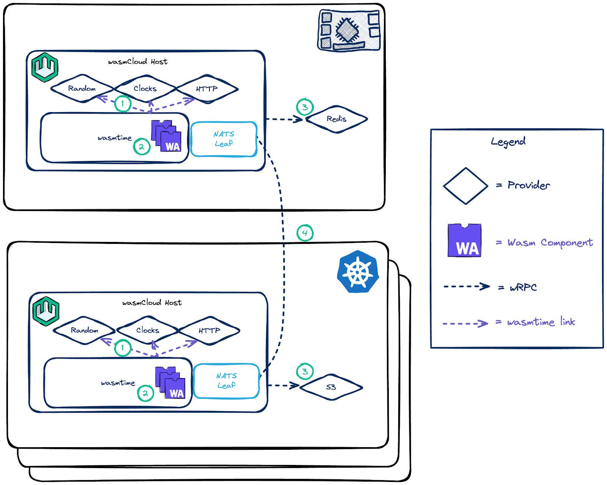

## Overview

A [component](/docs/concepts/components/) includes **imports** and **exports** that define what the component depends on and what it can do.

- **Imports** are the functions a component requires to run, which must be fulfilled by another entity for a component to start successfully. 
- **Exports** are the functions exposed by the component, which may be called by another entity. (At least one export must be linked in order to run a component.)

Entities that might **satisfy an import** or **target an export** include other components, providers, or the host runtime. (We will discuss these options at more length in a moment.)

Imports and exports are defined [using WIT in a component's `world.wit` file](/docs/developer/interfaces/creating-an-interface). In wasmCloud, the satisfaction of imports and targeting of exports is called **linking**, since the process combines bytecode into applications in a similar fashion to an operating system linker. 

## Linking at build or runtime

Components can be **linked at build** or **linked at runtime**:

- **Linking at build**: Combining components into a new component with linked imports and exports is called *composition*. Open source tools like [`wac`](https://github.com/bytecodealliance/wac) enable you to compose components at build. [**Learn more about linking at build ->**](/docs/concepts/linking-components/linking-at-build)
- **Linking at runtime**: Imports don't need to be fulfilled at build&mdash;only upon instantiation. With this in mind, wasmCloud enables you to declare links which can be made at runtime in a [deployment manifest](/docs/ecosystem/wadm/model). [**Learn more about linking at runtime ->**](/docs/concepts/linking-components/linking-at-runtime)

When running a component on wasmCloud, you don't have to worry about whether your components are distributed or running on the same host&mdash;simply declare links between the relevant entities in your manifest, and wasmCloud will coordinate the links regardless of where the constituent parts are running. The wasmCloud host mediates runtime links over the lattice using the Wit over RPC (wRPC) protocol.

## What can I link with a component?

In wasmCloud, components may be linked to...

* [**Host functions**](/docs/concepts/linking-components/linking-at-runtime#host-functions) (Runtime): The wasmCloud host provides several functions available for import by components (for example, logging). 
* [**Other components**](/docs/concepts/linking-components/linking-at-runtime#other-components) (Runtime or build): Components may be composed or linked with wRPC, and runtime links may be made with components running on the same wasmCloud host or another host on the lattice. 
* [**Providers**](/docs/concepts/linking-components/linking-at-runtime#providers) (Runtime): [Providers](/docs/concepts/providers) are stateful host plugins which may facilitate connections to external resources. A component may be linked to a provider running either on the same wasmCloud host or another host on the lattice via wRPC. 

[Linking at runtime](/docs/concepts/linking-components/linking-at-runtime) provides examples of linking with each of these entities.

In the diagram below, you can see multiple ways components can be linked in a distributed wasmCloud environment.

Links are represented by **dashed arrows** leading **from the importer to the exporter**: the importer is *targeting* the exposed functions of the exporter. In the diagram:

* A **component (1)** is running on a wasmCloud host. 
* The component links to the **logging host function (2)** provided by the same host to fulfill a logging import.
* The component also links to a **key-value provider (3)** on another host over the lattice to fulfill a key-value import. The key-value provider may communicate with software outside the wasmCloud lattice such as a Redis server or S3.
* Finally, the component exposes a function (export) on an interface that is imported by **another component (4)**.
* The **other component (4)** is a composed component&mdash;it was created by combining two constituent components at build. When this component runs, the link between those *constituent* components is resolved by the wasmCloud host's WebAssembly runtime (Wasmtime).
* The **other component (4)** exports on the HTTP interface. It is linked to an **HTTP provider (5)** that targets (imports) the exposed function.

In practice, the ability to link components means the capabilities of the wasmCloud host are pluggable and extensible at runtime&mdash;you do not need to ship a new host to update or extend capabilities. Developers can design and ship custom interfaces easily, and platform operators enjoy a convenient workflow for updating capabilities.

## Keep reading

[Continue to learn more about **applications**](/docs/concepts/applications), the abstraction that combines all the pieces you've explored so far, or...

- To learn more about runtime linking and explore examples, see [Linking at runtime](/docs/concepts/linking-components/linking-at-runtime).
- For more information about linking at build, including a step-by-step example of composing components, check out [Linking at build](/docs/concepts/linking-components/linking-at-build).