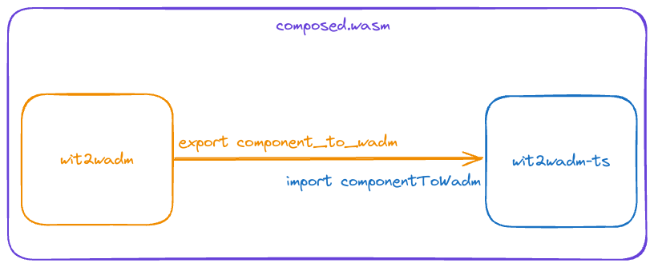

## Overview

At build-time, WebAssembly components may be **composed**, meaning they will be packaged together as a single component and linked internally. The composability of components is a core tenet of components' design. Open source CLI tools like [`wac`](https://github.com/bytecodealliance/wac) and [`wasm-tools`](https://github.com/bytecodealliance/wasm-tools) (using the `compose` subcommand) enable you to compose components before deployment.

It's important to note that build-time composition is a matter of link *declaration*. These links will be resolved upon component instantiation by the WebAssembly runtime&mdash;in our case, [Wasmtime](https://github.com/bytecodealliance/wasmtime), the underlying runtime used by the wasmCloud host. 

## When to link at build

Linking at build makes sense when...

* You want to reuse functionality from different languages
* Components' functionality is tightly coupled 
* Services performed by multiple components should scale together
* Sensitive functionality such as filesystem operations need to be sandboxed 

## Example: Composition

This example uses a Wasm component written in TypeScript that composes with the Rust component [wit2wadm](https://github.com/brooksmtownsend/wit2wadm). The wit2wadm tool is a small Rust library that is useful for generating deployment manifests, and can be compiled to a component. Here we are using its componentized form as an arbitrary example of a component that can be composed at build-time in order to reuse functionality from different languages. 

The instructions below show how to build an arbitrary TypeScript component and compose it with the Rust-based wit2wadm component as if it was a native TypeScript library.

### Prerequisites

- [wasm-tools](https://github.com/bytecodealliance/wasm-tools/tree/main)
- [jco](https://github.com/bytecodealliance/jco)
- [wash](https://wasmcloud.com/docs/installation)
- [node](https://docs.npmjs.com/downloading-and-installing-node-js-and-npm)
- [rust](https://www.rust-lang.org/tools/install)

Clone the example TypeScript component repository:

```bash
git clone https://github.com/brooksmtownsend/wit2wadm-ts.git
```

Install Node dependencies and build the component:

```bash
# Install NPM dependencies
npm install
# Build the TypeScript component
wash build
```
Inside the `wit2wadm-ts` project directory, we'll clone the `wit2wadm` Rust library as well:

```bash
git clone https://github.com/brooksmtownsend/wit2wadm.git
```

Now (from the root of `wit2wadm-ts`) we can build the other component:

```bash
wash build -p ./wit2wadm
```

Let's take a look at the two component's WIT interfaces:

```bash
wash inspect --wit ./wit2wadm/build/wit2wadm_component_s.wasm
```
```wit
package root:component;

world root {
  import wasi:cli/environment@0.2.0;
  import wasi:cli/exit@0.2.0;
  import wasi:io/error@0.2.0;
  import wasi:io/streams@0.2.0;
  import wasi:cli/stdin@0.2.0;
  import wasi:cli/stdout@0.2.0;
  import wasi:cli/stderr@0.2.0;
  import wasi:clocks/wall-clock@0.2.0;
  import wasi:filesystem/types@0.2.0;
  import wasi:filesystem/preopens@0.2.0;
  import wasi:random/random@0.2.0;

  export wasmcloud:tools/convert;
}
```

```bash
wash inspect --wit ./build/wit2wadm_ts_s.wasm
```
```wit
package root:component;

world root {
  import wasmcloud:tools/convert;

  export wasmcloud:tools/convert;
}
```

What we're going to be doing by composing these components together is connecting the `export wasmcloud:tools/convert` in the Rust component to the `import wasmcloud:tools/component` in the TypeScript component, and the final product is a single WebAssembly component.



### Compose

Compose the component with the wit2wadm Rust component in the `wit2wadm` directory, satisfying the `wasmcloud:tools/convert` import in our WIT:

```bash
# Copy into current directory for simplicity
cp ./wit2wadm/build/wit2wadm_component_s.wasm ./wit2wadm.wasm
# Compose the components, the wit2wadm component export will satisfy the import of the TypeScript component
wasm-tools compose ./build/wit2wadm_ts_s.wasm --definitions ./wit2wadm.wasm > composed.wasm
```

Taking a look at our composed component, we can see that we've ended up with a combination of both components:

```bash
wash inspect --wit ./composed.wasm
```
```wit
package root:component;

world root {
  import wasi:cli/environment@0.2.0;
  import wasi:cli/exit@0.2.0;
  import wasi:io/error@0.2.0;
  import wasi:io/streams@0.2.0;
  import wasi:cli/stdin@0.2.0;
  import wasi:cli/stdout@0.2.0;
  import wasi:cli/stderr@0.2.0;
  import wasi:clocks/wall-clock@0.2.0;
  import wasi:filesystem/types@0.2.0;
  import wasi:filesystem/preopens@0.2.0;
  import wasi:random/random@0.2.0;

  export wasmcloud:tools/convert;
}
```
If we wish to explore the flexibility of components, we can take this example further by transpiling the now-composed component to run as a JavaScript module in the web&mdash;that is beyond the scope of this page, but you can find instructions in the [example's GitHub repository](https://github.com/brooksmtownsend/wit2wadm-ts/tree/main). 

## Keep reading

You can learn more about composing components in the [Component Model documentation](https://component-model.bytecodealliance.org/creating-and-consuming/composing.html).