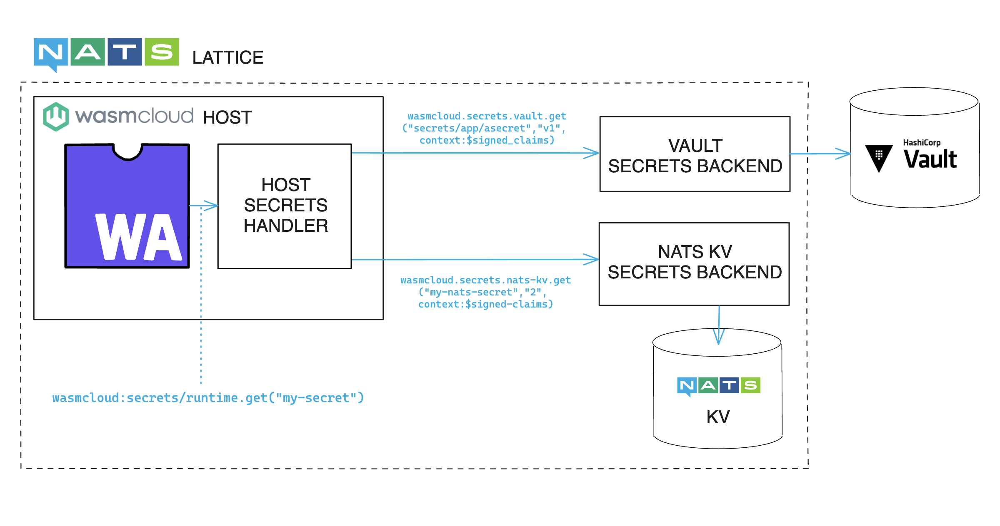

## Overview

Production applications often require secrets at runtime to access internal or external systems. wasmCloud provides first-class support for secrets in distributed environments. 

Secrets in wasmCloud are treated as a special piece of configuration. Secrets are stored in encrypted and secure stores; the host retrieves secrets from a secrets backend and provides them to components and providers that request them. Secrets backends are reachable by hosts via NATS using known NATS subject prefixes. Each secrets backend satisfies a common API so that anyone can write a backend and add an implementation to their cluster.

:::info[Compared to Kubernetes...]
In Kubernetes, secrets are simply externalized and stored as non-secure base64-encoded strings. In wasmCloud, secrets are encrypted in transit using [`**xkeys**](https://docs.nats.io/running-a-nats-service/configuration/securing_nats/auth_callout#encryption)`&mdash;x25519 keypairs compatible with [NaCl](https://nacl.cr.yp.to/) Seal and Open operations&mdash;and never stored by the host. 
:::

## When to use secrets

In wasmCloud, secrets should be used for sensitive data that should never be stored by the host. By design, secrets are never logged or accessible in memory, and when they are dropped they are wiped in memory. The host has a means to fetch the secret, but not store it.

## How secrets work in wasmCloud

Secrets support requires wasmCloud 1.1 or higher. Utilizing secrets requires:

* A secrets backend (for example, the NATS KV secrets backend)
* A secret in the relevant secret store
* A secret definition scoped for the relevant usage (entity-scoped or link-scoped) in the wasmCloud Application Deployment Manager (wadm) application manifest
* An entity (component or provider) to consume the secret using the WebAssembly Interface Type (WIT) secrets API

The complete path of a request for a secret is illustrated in this diagram:



* A component sends a request for a named secret (`my-secret`) using the `get` function of the `wasmcloud:secrets` interface. 
* The request is passed to the wasmCloud host's secrets handler, which resolves the secret reference and requests the secret from the proper secrets backend process.
* The secrets backend mediates with a secrets store&mdash;in the pictured examples, that might be a completely external store like Vault or the key-value store already available as part of NATS.

## Implementing a secrets backend

A secrets backend implementation is identified by a single string as a name and will receive credentials requests on a NATS subject that includes this name prefix. The canonical default root prefix for the subject is `wasmcloud.secrets`. A specific deploy of a secrets backend is required to set a unique name for the backend and listens for requests on the subject `wasmcloud.secrets.$backend.>`.

As an example, suppose that there is a NATS KV-backed secrets backend and a Vault-backed secrets backend running as part of a wasmCloud cluster, as in the diagram above. The NATS KV secrets backend is configured with the name `nats-kv` and the Vault backend is named `vault`. The following table shows the NATS subjects that each backend will listen on:

| Name | Subject |
|------|---------|
| `nats-kv` | `wasmcloud.secrets.nats-kv.>` |
| `vault`	| `wasmcloud.secrets.vault.>` |

### Secrets backend API

The secrets backend API is a NATS-based API that is used to retrieve secrets from a secrets backend. The API is defined as follows:

```
#[derive(Serialize, Deserialize)]
struct Context {
    // The component or provider's signed JWT.
    jwt: String,
}

struct SecretRequest {
    // The name of the secret
    name: String,
    // The version of the secret
    version: Option<String>,
    context: Context,
}

struct Secret {
    pub name: String,
    pub version: String,
    pub string_secret: Option<String>,
    pub binary_secret: Option<Vec<u8>>,
}

struct SecretResponse {
    pub secret: Option<Secret>,
    pub error: Option<String>,
}
```

One of the key properties of this API is that sensitive payloads are encrypted in transit over NATS using **xkeys**. [Xkeys are x25519 keypairs that are an extension on top of NATS’ nkeys format](https://docs.nats.io/running-a-nats-service/configuration/securing_nats/auth_callout#encryption). These keys are compatible with the [NaCl](https://nacl.cr.yp.to/) Seal and Open operations, which makes them suitable for general purpose encryption and decryption.

The payload of a request to the `wasmcloud.secrets.$name.get` endpoint *must* be encrypted using a xkey generated by the host for that specific request and provided as a header on the NATS message. This is to prevent replay attacks and eavesdropping by other NATS clients on the secrets backend. If the payload of a `get` request was sent in the clear, in theory all a malicious client would need to do in order to get a copy of secrets for a component or provider would be to resend the original request. While the signed component or provider JWTs are *not* private, having a copy of them does demonstrate that the caller has access to the built binary and accessing secrets on their behalf. Encrypting the payload with a single use xkey prevents the need for a nonce or a timestamp since every request to the endpoint has a unique payload.

The `server_xkey` endpoint is used to retrieve the public xkey of the secrets backend so that the host can encrypt and decrypt communication to the backend. Callers should cache this key so that they do not have to make repeated calls to the endpoint before calling get. If the server is unable to decrypt a payload it will return an error indicating that, so clients should make a call to the `server_xkey` endpoint to refresh the server’s key and try again. 

### Get request payload

Headers:

* `Wasmcloud-Host-Xkey`: String

Body:

```
{
    "secret_name": "",
    "version": "1",
    "context": {
        "jwt": "..."
    }
}
```

### Get reponse payload

```
{
  // Will be empty if errored
  "secret": {
    "name": "",
    "version": "",
    // Only one of the following fields will be set
    "secret_string": "",
    "secret_binary": ""
    }
    // Omitted on success
    "error": ""
}
```

A successful response will only contain the secret payload. An unsuccessful response should contain an error key with a string message describing the error. Examples of what might cause such an error include:

* An invalid source JWT (component or provider)
* Secret not found
* Errors encrypting or decrypting the secret
* Some error with the backend

Secrets backend implementations may also have additional API endpoints as needed&mdash;for example, mapping secrets to specific components or providers in the NATS KV-backed implementation.

### Secret stores

All wasmCloud stores are secret references which are pieces of config that start with `secret_` and have the following structure:

```
#[derive(Debug, Serialize, Deserialize, Clone, PartialEq, Eq, Hash)]
struct SecretReference {
    /// The backend to use for retrieving the secret.
    pub backend: String,
    /// The key to use for retrieving the secret from the backend.
    pub key: String,
    /// The version of the secret to retrieve. If not supplied, the latest version will be used.
    #[serde(default, skip_serializing_if = "Option::is_none")]
    pub version: Option<String>,
}
```

A NATS KV secret represented in JSON could be named `secret_my-password`:

```
{
"backend": "nats-kv",
"key": "my-password",
// optional version
}
```

## Defining secrets in application manifests

Components and providers must specify which secrets they require as part of their manifest definitions. A secret can be defined in two different places: at the top level of a component or a provider, at the same level as config, or in the configuration of a link. This gives us the opportunity to distinguish between the two contexts and have the host merge them together as needed.

### Entity-scoped secrets

An entity-scoped secret is a secret that is defined at the top level of a component or provider. This means that the secret is available in any function defined by a component, including those that are implemented to handle a specific interface attached to a link. This is useful for secrets that are used across multiple interfaces or functions.

```yaml
spec:
  components:
    - name: http-component
      type: component
      properties:
        image: ghcr.io/wasmcloud/test-fetch-with-token:0.1.0-fake
        secrets:
          - name: some-api-token
            source:
              backend: vault
              key: secrets/test/value
              version: 1
          - name: my-other-secret
            source:
              backend: aws-secrets-manager
              value: secret-name
              version: "be01a5fb-7ebb-4ae9-8ea0-0902e8940bc0"

```

### Link-scoped secrets

A link-scoped secret is only accessible in the context of a link. For a component, this means that it is only available in the functions that are implemented to handle the interfaces that defined by the link. For a provider, this means that is supplied when the link is created. This is intended for secrets such as database connection strings, API tokens, etc, that are needed in the context of a component communicating with another component or a provider. An example of what this looks like is shown below:

```yaml
        - type: link
          properties:
            namespace: wasmcloud
            package: postgres
            interfaces: [managed-query]
            target:
              name: sql-postgres
              secrets:
                - name: db-password
                  source:
                    backend: vault
                    key: secrets/myapp/db-password
                    version: 1
```

### Sample manifest

Below is a sample manifest that shows how secrets can be defined in a wasmCloud application:

```yaml
apiVersion: core.oam.dev/v1beta1
kind: Application
metadata:
  name: App with secrets
  annotations:
    version: v0.0.1
    description: "HTTP hello world demo in Rust"
spec:
  components:
    - name: http-component
      type: component
      properties:
        image: ghcr.io/wasmcloud/components/http-hello-world-rust:0.1.0
        secrets:
          - name: test
            source:
              backend: vault
              key: "path/to/key"
      traits:
        # Govern the spread/scheduling of the component
        - type: spreadscaler
          properties:
            replicas: 1
        - type: link
          properties:
            target: httpclient
            namespace: wasi
            package: http
            interfaces: [outgoing-handler]
        - type: link
          properties:
            namespace: wasmcloud
            package: postgres
            interfaces: [managed-query]
            target:
              name: sql-postgres
              secrets:
                - name: db-password
                  properties:
                    backend: vault
                    key: secrets/myapp/db-password
                    version: 1
              config:
                - name: foo
                  properties:
                    value: whatever

    # Add a capability provider that enables HTTP access
    - name: httpserver
      type: capability
      properties:
        image: ghcr.io/wasmcloud/http-server:0.20.0
      traits:
        # Link the httpserver to the component, and configure the HTTP server
        # to listen on port 8080 for incoming requests
        - type: link
          properties:
            namespace: wasi
            package: http
            interfaces: [incoming-handler]
            target:
              name: http-component
              secrets: ...
            source:
              config:
                  - name: default-http
                    properties:
                      address: 127.0.0.1:8080
              secrets:

    - name: httpclient
      type: capability
      properties:
        image: ghcr.io/wasmcloud/http-client:0.9.0

    - name: sqldb-postgres
      type: capability
      properties:
        image: ghcr.io/wasmcloud/provider-sqldb-postgres:0.1.0
```

## Example: Using a NATS KV backend

This example is a modified version of the [http-keyvalue-counter](https://github.com/wasmcloud/wasmcloud/examples/rust/components/http-keyvalue-counter/) application that authenticates with a Redis database that requires a password, and serves an HTTP API that requires an authentication password header.

This example uses a locally built version of the NATS KV secrets backend and wasmCloud from the `main` branch of this repository, as wasmCloud 1.1 is not yet released. Additionally, support for secrets in the [wadm](https://github.com/wasmCloud/wadm) application manifest was not released at the time of writing this example, so the application and setup is done imperatively. We'll update this example to also have an application manifest for easy setup once available.

### Prerequisites

- [Rust toolchain](https://www.rust-lang.org/tools/install)
- [wash](https://wasmcloud.com/docs/installation)
- [NATS CLI](https://github.com/nats-io/natscli)
- [redis-server](https://redis.io/docs/latest/operate/oss_and_stack/install/install-redis/)
- [nats-server](https://docs.nats.io/running-a-nats-service/introduction)
- [jq](https://jqlang.github.io/jq/download/)

### Download the example

Download the [example repository](https://github.com/wasmCloud/wasmCloud/examples/security/secrets). You can perform a "sparse" checkout to download only the relevant example directory (and associated documentation and metadata):

```
git clone --depth 1 --no-checkout https://github.com/wasmCloud/wasmCloud.git
cd wasmcloud
git sparse-checkout set ./examples/security/secrets
git checkout
cd examples/security/secrets

```

### Running this example

Build wasmCloud, the NATS KV secrets backend, the keyvalue counter auth component, and the keyvalue redis password provider:

```shell
./build.sh
```

Run the example:

```shell
./run.sh
```

Once running, in a different terminal you can first verify that unauthenticated requests to Redis and the component are denied:

```shell
redis-cli -u redis://127.0.0.1:6379 keys '*'
```
```shell
(error) NOAUTH Authentication required.
```

```shell
curl 127.0.0.1:8080/counter
```
```shell
Unauthorized
```

Then, authenticating passes the check in the component:

```shell
curl -H "password: opensesame" 127.0.0.1:8080/counter
```
```
Counter /counter: 1
```

Passing in an invalid password will still fail the authentication check:

```shell
curl -H "password: letmein" 127.0.0.1:8080/counter
```
```
Unauthorized
```

If you want to inspect the Redis database directly, you can provide the password in the URI:

```bash
redis-cli -u redis://sup3rS3cr3tP4ssw0rd@127.0.0.1:6379 get /counter
```