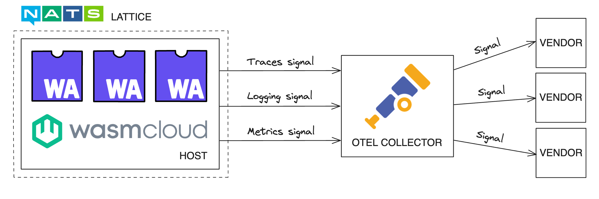

wasmCloud is designed to support cloud native observability standards using [OpenTelemetry (OTEL)](https://opentelemetry.io/). OpenTelemetry is an open source project defining common APIs and standards for telemetry in cloud native systems. 

As of v1.0, wasmCloud emits **traces**, **logs**, and **metrics** as OTEL [**signals**](https://opentelemetry.io/docs/concepts/signals/). The wasmCloud host uses the OpenTelemetry library, a **push-based protocol** that sends out signals for collection.

### Why OpenTelemetry?

Standards-driven vendor-agnosticism is a pillar of wasmCloud's design philosophy: developers and operators should be able to swap out elements of their toolchains as needed. Using an industry standard like OpenTelemetry enables teams to pick and choose the [OTEL-compatible vendors](#otel-compatible-vendors) they want to use&mdash;moreover, teams can preserve historical data, reducing practical barriers to migration. 

### Data flow

A wasmCloud observability ecosystem must include an [**OTEL collector**](https://opentelemetry.io/docs/collector/), a vendor-agnostic application from the OpenTelemetry project that processes and routes signals. The wasmCloud host emits signals to the OTEL collector, which passes the data on to observability systems such as [**Grafana**](https://github.com/grafana/grafana)&mdash;the collector can route signals to one or multiple processing systems for logs, traces, and metrics.



The OTEL documentation provides detailed instructions on how to [install and run the OTEL collector](https://opentelemetry.io/docs/collector/quick-start/). Additionally, you can find a [sample configuration for an OTEL collector](https://github.com/wasmCloud/wasmCloud/blob/main/examples/docker/otel-collector.yaml) in the wasmCloud observability ecosystem demo on GitHub.

While the OTEL collector is the recommended point of configuration for complex signal routing, there are a set of core configurations available at the level of a [wasmCloud host](https://wasmcloud.com/docs/concepts/hosts). The host can be configured using [environment variables or host config flags](/docs/reference/host-config).

### Configuration

Enable the wasmCloud host to emit all OTEL signals with the `WASMCLOUD_OBSERVABILITY_ENABLED` environment variable:

```bash
WASMCLOUD_OBSERVABILITY_ENABLED="true"
```

By default, OTEL signals are exported on port 4318, the standard **HTTP/OpenTelemetry Protocol (`otlp`)** port. wasmCloud only supports the `otlp` format. The endpoint for all `otlp` exports may be overwritten with the `OTEL_EXPORTER_OTLP_ENDPOINT` environment variable:

```bash
OTEL_EXPORTER_OTLP_ENDPOINT=http://my-custom-host:4318
```

It is also possible to enable and overwrite endpoints for only specific signals&mdash;see the pages for [traces](/docs/deployment/observability/tracing), [logs](/docs/deployment/observability/logs), and [metrics](/docs/deployment/observability/metrics) for more details.

While these options are typically passed as part of [host configuration](/docs/reference/host-config), you can launch a wasmCloud observability ecosystem locally by passing environment variables to `wash up`:

```bash
WASMCLOUD_OBSERVABILITY_ENABLED="true" wash up
```

### Launch a wasmCloud observability ecosystem

A set of sample configurations and Docker Compose files are available on GitHub. These samples can be used to launch an example wasmCloud observability ecosystem. Clone or download the wasmCloud repository:

```bash
git clone https://github.com/wasmCloud/wasmCloud.git
```

Change directory to `examples/docker`:

```bash
cd wasmcloud/examples/docker
```

Run the `docker-compose-otel.yml` file to launch...

- **Grafana** for dashboards
- **The OTEL collector** for ingesting OTLP signals from the wasmcloud host
- **Tempo** for processing traces and passing them to Grafana
- **Loki** for processing logs and passing them to Grafana
- **Prometheus** for metrics (wasmCloud metrics support still in development)

```bash
docker compose -f docker-compose-otel.yml up
```

Make sure a wasmCloud host is running locally with OTEL signals enabled:

```bash
WASMCLOUD_OBSERVABILITY_ENABLED="true" wash up
```

Now you can access Grafana's "Explore" interface at [http://localhost:5050/explore](http://localhost:5050/explore).

### OTEL-compatible tooling and vendors

The following tools and vendors process logs, metrics, and traces with support for the OpenTelemetry standard:

* [Grafana Stack](https://grafana.com/about/grafana-stack/) (Composable open source stack)
    - [Loki](https://grafana.com/docs/loki/latest/) (Logs)
    - [Prometheus](https://grafana.com/docs/grafana/latest/fundamentals/intro-to-prometheus/) (Metrics)
    - [Tempo](https://grafana.com/docs/tempo/latest/) (Traces)
* [AWS Distro for OpenTelemetry](https://aws.amazon.com/otel/)
* [Datadog](https://www.datadoghq.com/)
* [Dynatrace](https://www.dynatrace.com/)
* [Elastic](https://www.elastic.co/)
* [Honeycomb](https://www.honeycomb.io/)
* [New Relic](https://newrelic.com/)
* [Splunk](https://www.splunk.com/)
* Many more&mdash;any vendor with OpenTelemetry compatability is supported

### Advanced options

Because wasmCloud's implementation of OpenTelemetry observability uses upstream OTEL libraries, a variety of advanced configuration options are available via environment variables defined in the upstream [OTEL SDK](https://opentelemetry.io/docs/specs/otel/configuration/sdk-environment-variables/) and [OTLP Exporter SDK](https://opentelemetry.io/docs/languages/sdk-configuration/otlp-exporter/).

For example, users have several options for [trace sampling](https://opentelemetry.io/docs/specs/otel/configuration/sdk-environment-variables/#general-sdk-configuration) and [log batch management](https://opentelemetry.io/docs/specs/otel/configuration/sdk-environment-variables/#batch-logrecord-processor). Not all upstream options are supported&mdash;for example, the wasmCloud host does not support changing format to gRPC.

:::info[Note]
In cases where the system receives conflicting configurations for the same option via environment variable and command line argument, upstream OpenTelemetry libraries prioritize configurations set via environment variable. Refer to the [OpenTelemetry documentation](https://opentelemetry.io/docs/languages/sdk-configuration/) for more details.
:::

### Further reading

Signal-specific options on the wasmCloud host are detailed on the [traces](/docs/deployment/observability/tracing), [logs](/docs/deployment/observability/logs), and [metrics](/docs/deployment/observability/metrics) pages. For more information on OpenTelemetry, refer to the [project documentation](https://opentelemetry.io/docs/).
