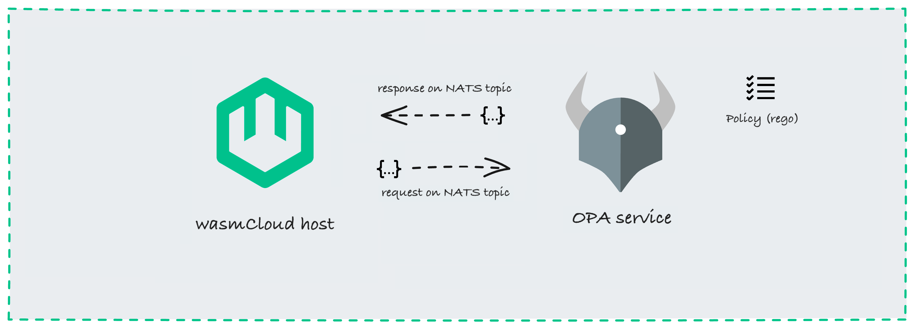

wasmCloud hosts will always enforce a certain level of security by default that _cannot be loosened_. For example, hosts will always validate [invocations](/docs/deployment/security/zero-trust-invocations) and [runtime links](/docs/developer/debugging/actors#missing-runtime-links). Additionally, the wasmCloud **policy service API** can be used to extend and customize policy evaluation, such as by restricting untrusted application components and providers on particular hosts. 

### Policy evaluation flow

The policy service API provides a simple mechanism for communicating with an external policy server. External servers can be created using standard engines such as **[Open Policy Agent](https://www.openpolicyagent.org/)**. 

Once the wasmCloud policy service is enabled, the host will send policy requests on a dedicated NATS topic (for example, `wasmcloud.policy`) to the external server. The policy server, in turn, returns responses on the same NATS topic, determining whether the host is allowed to start an application component, start a capability provider, or let a component invoke a capability provider. 



**The policy service is disabled by default**. When enabled, the policy service will be called by a host when:
- a particular component or provider is started for the first time
- an invocation is received between two entities for the first time

The policy service evaluates the provided action and returns a response indicating whether it is permitted. This response is cached by the host, so subsequent requests for the same action will not incur any overhead.

### Policy Requests and Responses

Policy requests are made on a NATS topic, which is specified by the `--policy-topic` [host config](/docs/reference/host-config) option.

<details>
<summary>Policy request schemas</summary>

Request schemes vary according to whether the request is to start an application component, start a provider component, or perform an invocation.

**Schema for component start**:

```json
{
	"requestId": "... unique ID used for correlation ..."
	"kind": "startComponent",
  "version": "v1",
	"request": {
		"component": {
        "publicKey": "Mxxx",
        "reference": "mycloud/echo:0.3.4",
        "issuer": "Axxx",
        "issuedOn": "xxxx",
        "expiresAt": 0,
        "expired": false,
		},
		"host": {
       "publicKey": "Nxxxx",
       "latticeId": "default",
       "labels": [
           "(key)": "value",
					 ..
       ],
       "clusterIssuers": [ "Cxxxx", "Cxxxy" ],
        }
	}
}
```

**Schema for provider start**:

```json
{
	"requestId": "... unique ID used for correlation ..."
	"kind": "startProvider",
  "version": "v1",
	"request": {
		"provider": {
        "publicKey": "Vxxx",
        "reference": "mycloud/provider:0.3.4",
        "contractId": "provider:cloud",
        "linkName": "default",
        "issuer": "Axxx",
        "issuedOn": "xxxx",
        "expiresAt": 0,
        "expired": false,
		},
		"host": {
       "publicKey": "Nxxxx",
       "latticeId": "default",
       "labels": [
           "(key)": "value",
					 ..
       ],
       "clusterIssuers": [ "Cxxxx", "Cxxxy" ],
        }
	}
}
```

**`Schema for invocation**: 

```json
{
	"requestId": "... unique ID used for correlation ..."
	"kind": "performInvocation",
  "version": "v1",
  "request": {
    "source": {
      "publicKey": "Mxxx or Vxxx",
      "contractId": "nullable",
      "linkName": "nullable",
      "issuer": "Axxx",
      "issuedOn": "xxxx",
      "expiresAt": 1660608232,
      "expired": false, 
    },
    "target": {
        "publicKey": "Mxxxx or Vxxxx",
        "issuer": "Axxxx",
        "contractId": "nullable",
        "linkName": "nullable"
	      "issuer": "Axxx",
	      "issuedOn": "xxxx",
	      "expiresAt": 1660608232,
	      "expired": false, 
    },
    "host": {
         "publicKey": "Nxxxx",
         "latticeId": "01234...",
         "labels": [
             "(key)" : "value"
         ],
        "clusterIssuers": [ "Cxxxx", "Cxxxy" ],
     }
}
```

</details>


<details>
<summary>Policy response schema</summary>
```
{
    "requestId": "...",
    "permitted": true,
    "message": "..." (optional)
}
```
</details>

### Revoking Policy Decisions

Past policy decisions can be revoked/overridden by the policy service by publishing on the `--policy-changes-topic` NATS subject.

### Example: Open Policy Agent

Since the policy service API is over NATS, it can be implemented by anything that can subscribe and publish responses to the configured policy topic (including a wasmCloud component!).

An example policy service implementing Open Policy Agent is [available in the wasmCloud GitHub repository](https://github.com/wasmCloud/wasmCloud/examples/security).
