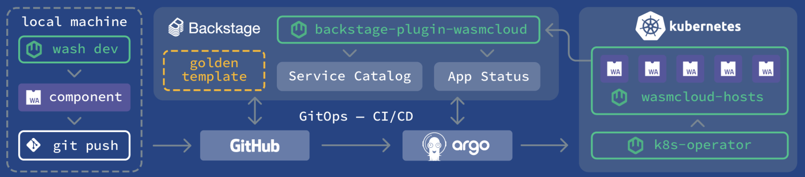

# wasmCloud Platform Compatibility Overview

wasmCloud is a WebAssembly-native application runtime that enables developers to deploy, scale, and manage high-performance applications across diverse environments. It operates seamlessly on container orchestration platforms such as AWS EKS, Google GKE, Microsoft AKS, on-premises solutions like Rancher and VMware Tanzu, and many others. By adopting wasmCloud, teams gain the flexibility to build applications that execute on any cloud or on-prem environment without modification, creating a truly portable, vendor-agnostic solution.

## Cross-Platform Integration

wasmCloud integrates with essential platform engineering components and CI/CD tools, ensuring a smooth, managed deployment experience across Kubernetes clusters and beyond. Out of the box, wasmCloud supports **Backstage** for developer portal management, **Argo CD** for continuous delivery automation, and the **wasmCloud Kubernetes Operator**, which automates key deployment tasks. These integrations empower teams to streamline development workflows, reduce the burden of infrastructure management, and deploy WebAssembly applications efficiently at scale.

## Pluggable Application Components

wasmCloud's architecture enables flexible, runtime-bound integration with backend services, streamlining deployments across cloud and on-premises environments. Using pluggable components, developers can build applications that bind to specific services at runtime instead of hardcoding dependencies. For example, the **wasi-keyvalue** component allows applications to connect to a range of Redis-compatible backends like **Redis**, **Couchbase**, **Val Key**, and **AWS ElastiCache** without altering application code. This modular design enables applications to adapt easily to different data services, making migrations and environment-specific adjustments straightforward and efficient.

By leveraging wasmCloud’s pluggable component architecture, platform engineers gain the freedom to select the best fit for their infrastructure, ensuring consistency and high performance regardless of deployment platform. This flexibility allows wasmCloud to support a wide range of use cases, from edge and IoT to full-scale, cloud-native applications, all with the adaptability and security of WebAssembly.

## Supported Container Execution Platforms

The following table outlines container execution platforms supported by wasmCloud, providing links to deployment instructions for each.

| Vendor                     | Platform Name                          | Supported | Deployment Instructions                                                                                                                                       | wasmCloud Deployment |
|----------------------------|----------------------------------------|-----------|----------------------------------------------------------------------------------------------------------------------------------------------------------------|-----------------------|
| **Amazon Web Services**    | Amazon Elastic Kubernetes Service (EKS) | Yes       | [EKS Documentation](https://docs.aws.amazon.com/eks/latest/userguide/getting-started.html)                                                                      |                       |
|                            | Amazon Elastic Container Service (ECS)  | Yes       | [ECS Documentation](https://docs.aws.amazon.com/AmazonECS/latest/developerguide/Welcome.html)                                                                   |                       |
|                            | AWS Fargate                             | Yes       | [Fargate Documentation](https://docs.aws.amazon.com/AmazonECS/latest/developerguide/AWS_Fargate.html)                                                           |                       |
|                            | AWS App Runner                          | Yes       | [App Runner Documentation](https://docs.aws.amazon.com/apprunner/latest/dg/what-is-apprunner.html)                                                              |                       |
| **Google Cloud Platform**  | Google Kubernetes Engine (GKE)          | Yes       | [GKE Documentation](https://cloud.google.com/kubernetes-engine/docs/quickstart)                                                                                 |                       |
|                            | Google Cloud Run                        | Yes       | [Cloud Run Documentation](https://cloud.google.com/run/docs/quickstarts)                                                                                        |                       |
|                            | Google Cloud Run for Anthos             | Yes       | [Cloud Run for Anthos Documentation](https://cloud.google.com/anthos/run/docs)                                                                                  |                       |
|                            | Google App Engine                       | Yes       | [App Engine Documentation](https://cloud.google.com/appengine/docs)                                                                                             |                       |
| **Microsoft Azure**        | Azure Kubernetes Service (AKS)          | Yes       | [AKS Documentation](https://learn.microsoft.com/en-us/azure/aks/)                                                                                               |                       |
|                            | Azure Container Instances (ACI)         | Yes       | [ACI Documentation](https://learn.microsoft.com/en-us/azure/container-instances/)                                                                               |                       |
|                            | Azure App Service                       | Yes       | [App Service Documentation](https://learn.microsoft.com/en-us/azure/app-service/)                                                                               |                       |
|                            | Azure Red Hat OpenShift                 | Yes       | [Azure Red Hat OpenShift Documentation](https://learn.microsoft.com/en-us/azure/openshift/)                                                                     |                       |
| **IBM Cloud**              | IBM Cloud Kubernetes Service            | Yes       | [IBM Cloud Kubernetes Service Documentation](https://cloud.ibm.com/docs/containers)                                                                              |                       |
|                            | IBM Cloud Code Engine                   | Yes       | [IBM Cloud Code Engine Documentation](https://cloud.ibm.com/docs/codeengine)                                                                                    |                       |
|                            | IBM Cloud Red Hat OpenShift             | Yes       | [IBM Cloud Red Hat OpenShift Documentation](https://cloud.ibm.com/docs/openshift)                                                                               |                       |
| **Oracle Cloud**           | Oracle Kubernetes Engine (OKE)          | Yes       | [OKE Documentation](https://docs.oracle.com/en-us/iaas/Content/ContEng/Concepts/contengoverview.htm)                                                            |                       |
|                            | Oracle Functions                        | Yes       | [Oracle Functions Documentation](https://docs.oracle.com/en-us/iaas/Content/Functions/Concepts/functionsoverview.htm)                                            |                       |
| **VMware**                 | VMware Tanzu Kubernetes Grid            | Yes       | [Tanzu Kubernetes Grid Documentation](https://docs.vmware.com/en/VMware-Tanzu-Kubernetes-Grid/index.html)                                                       |                       |
|                            | Tanzu Application Service               | Yes       | [Tanzu Application Service Documentation](https://docs.vmware.com/en/VMware-Tanzu-Application-Service/index.html)                                                |                       |
| **Red Hat**                | OpenShift Kubernetes Platform           | Yes       | [OpenShift Documentation](https://docs.openshift.com/container-platform/4.9/welcome/index.html)                                                                 |                       |
| **DigitalOcean**           | DigitalOcean Kubernetes                 | Yes       | [DigitalOcean Kubernetes Documentation](https://docs.digitalocean.com/products/kubernetes/)                                                                     |                       |
|                            | DigitalOcean App Platform               | Yes       | [App Platform Documentation](https://docs.digitalocean.com/products/app-platform/)                                                                              |                       |
| **On-Premises Solutions**  | Rancher                                 | Yes       | [Rancher Documentation](https://rancher.com/docs/rancher/latest/en/)                                                                                             |                       |
|                            | OpenShift                               | Yes       | [OpenShift Documentation](https://docs.openshift.com/container-platform/4.9/welcome/index.html)                                                                 |                       |
|                            | VMware Tanzu Kubernetes Grid            | Yes       | [Tanzu Kubernetes Grid Documentation](https://docs.vmware.com/en/VMware-Tanzu-Kubernetes-Grid/index.html)                                                       |                       |

---

This guide outlines the compatibility of wasmCloud across multiple container platforms, highlighting the flexibility and runtime adaptability that make wasmCloud an ideal choice for distributed, cloud-native applications.
