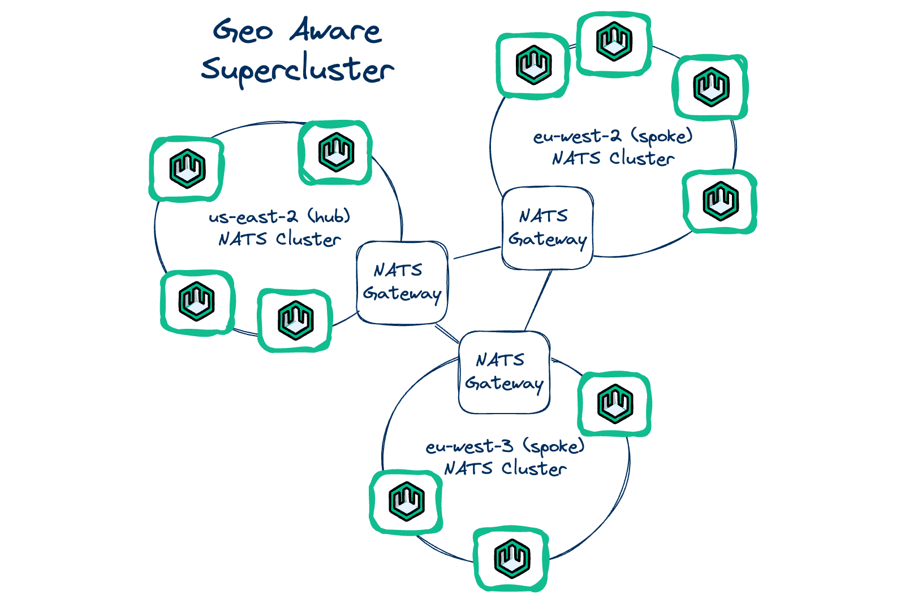

# NATS

## Overview

The wasmCloud [lattice](/docs/concepts/lattice) is built on [**NATS**](https://nats.io/), an open source connective technology hosted by the Cloud Native Computing Foundation (CNCF). NATS enables secure application-layer networking across diverse environments including edge, different vendors' clouds, and on-premise datacenters. 

NATS is designed to provide seamless connectivity tailored specifically to distributed systems, avoiding the complexities and limitations of 1:1 communication frameworks like HTTP or gRPC in distributed use cases. In wasmCloud, NATS helps to deliver a lattice with out-of-the-box load balancing, failover, and other features for systems that span environments.

# Supercluster pattern 



NATS enables a "supercluster" architecture for wasmCloud, with multiple NATS clusters connected through [**NATS Gateways**](https://docs.nats.io/running-a-nats-service/configuration/gateways#gateways). The supercluster architecture provides...

* **Scalability**: Seamlessly scales communication across multiple clusters, ensuring applications can grow without limitation.
* **Reliabilitye**: Enhances the overall reliability of the system by providing failover and load balancing across clusters.
* **Geo-awareness**: Geo-affinity is implemented automatically in queuing, ensuring that service requests are handled by the nearest available cluster, reducing latency and improving performance.

A **[leaf node](https://docs.nats.io/running-a-nats-service/configuration/leafnodes)** is a specially configured NATS server that creates a local NATS network that functions even without a connection to the broader network. This can allow for even further scaling and lower latency in use cases such as edge and IoT. 

:::info[Compared to Kubernetes...]
Where Kubernetes uses HTTP and DNS (or alternatively a service mesh solution) for connectivity across a cluster, wasmCloud uses NATS for a "distributed-first" approach. Challenge areas for Kubernetes such as edge and multi-cloud are first-class use cases in wasmCloud. NATS also fulfills roles comparable to those served by etcd in Kubernetes, such as storing state.
:::

# Essential NATS concepts

NATS conceptualizes communications as **messages**. Applications send and receive messages identified by **subject** strings. In addition to the subject, messages contain a byte array payload and any number of header fields.

An entity that sends a message is a **publisher**. When a publisher sends a message, it may be received by one or more **subscribers**. This one-to-many communication pattern is called the [**publish-subscribe**](https://docs.nats.io/nats-concepts/core-nats/pubsub) model.

NATS supports a **[request-reply](https://docs.nats.io/nats-concepts/core-nats/reqreply)** pattern built on the publish-subscribe model. A publisher may send a "reply" message (the "request") on a given subject. Entities subscribed to the subject may send replies which are automatically directed back to the original request publisher. 

In addition to the core publish-subscribe functionality, NATS provides **streaming** and **key-value storage** through its distributed persistence system called **[JetStream](https://docs.nats.io/nats-concepts/jetstream)**:

* **[Streams](https://docs.nats.io/nats-concepts/jetstream/streams)** are stores for messages on a given subject.
* **[Buckets](https://docs.nats.io/nats-concepts/jetstream/key-value-store)** are immediately consistent key-value stores using strings as keys and byte arrays as values (used in wasmCloud for tasks such as storing application manifests).

Streams and buckets play an important role in the scheduling process of the wasmCloud Application Deployment Manager (wadm). See the [wadm](/docs/ecosystem/wadm/) section for more information.

# Using the NATS CLI

You can interact directly with NATS using the NATS CLI. While it is not necessary to install the NATS CLI to use wasmCloud, it can be useful for debugging. Installation instructions for the CLI are available on the [NATS CLI GitHub repo](https://github.com/nats-io/natscli). 

To list all streams on your NATS network:

```shell
nats stream list
```

When running a wasmCloud host and wadm, the listed streams for a wasmCloud lattice will include:

* `wadm_commands`
* `wadm_events`
* `wadm_mirror`
* `wadm_notify`
* `wadm_status`

You can list all key-value buckets on your NATS instance with:

```shell
nats kv list
```

The listed key-value buckets will include:

* `CONFIGDATA_default`
* `wadm_manifests`
* `wadm_state`
* `LATTICEDATA_default`

For more information on debugging and NATS, see the [troubleshooting](/docs/developer/debugging/host#clear-nats-streams-and-buckets) section.  

# Further reading

For more information on NATS, see the [NATS documentation](https://docs.nats.io/).