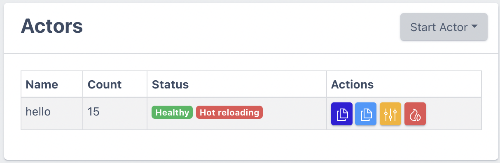

import Tabs from "@theme/Tabs";
import TabItem from "@theme/TabItem";

This section describes how you can iteratively build and test your actor functionality.

## `wash dev`

As of wash 0.18.0 you can use the experimental `wash dev` command to rapidly iterate on your actor.
This command will start a local wasmCloud host (if you don't already have one started) and
automatically register your actor with it. It will also watch your actor file for changes and
automatically recompile and update the actor in the host. This is a great way to get started with
wasmCloud development, and we recommend it for all new actors. Currently, it only will start the
actor, so you'll have to follow the steps in the [running the actor](./run) section to start the
providers your actor needs. We hope to automate as much of that away in the future.

Before running `wash dev`, you'll need to enable experimental mode for wash:

```shell
export WASH_EXPERIMENTAL=true
```

Then you can just run the `wash dev` command in the directory of your actor!

## Hot Reloading

### Prerequisites

To use the hot reloading feature you'll need to install one more [utility](https://github.com/falood/file_system#system-support) to ensure the host can monitor your actor file for changes. The following instructions for your operating system will ensure you are ready for the next section.

<Tabs>
  <TabItem value="ubuntudebian" label="Ubuntu/Debian" default>

```shell
apt-get install inotify-tools
```

  </TabItem>
  <TabItem value="fedora" label="Fedora" default>

```shell
yum install inotify-tools
```

  </TabItem>
  <TabItem value="other" label="Other Linux" default>

Refer to https://github.com/inotify-tools/inotify-tools/wiki#inotify-tools to find your package manager of choice's instructions

  </TabItem>
  <TabItem value="macos" label="Macos" default>

Ensure you've run `xcode-select --install` which installs all necessary tools. You'll get the following message if you've already run this command:

```
xcode-select: error: command line tools are already installed, use "Software Update" to install updates
```

  </TabItem>
  <TabItem value="windows" label="Windows" default>

Refer to https://github.com/thekid/inotify-win#inotify-win for Windows instructions.

  </TabItem>
  <TabItem value="docker" label="Docker" default>

We don't currently recommend hot reloading with Docker as the container filesystem is not the same as your development machine's filesystem. Technically this could be accomplished with a filesystem mount, though this introduces a few variables and we highly recommend using local development with [wash](/docs/installation.mdx) instead.

  </TabItem>
</Tabs>

### Setting up Hot Reloading

This section will introduce you to the process wasmCloud developers use to rapidly iterate on their actors. Introduced in wasmCloud `v0.51.0`, the Hot Reloading feature allows the dashboard to watch your signed actor file and automatically replace all instances of that actor upon a file change. This happens quickly (blink and you might miss it!) and tightly constrains the developer feedback loop so you can spend more time developing and less time waiting.

Let's start by scaling down our `hello` actor if it's still running from a previous step. Look for the yellow scale button  in the 'Actions' column, and set the replicas to `0` before hitting Submit.


Now, let's start the actor again using the "Start Actor" dropdown, but this time let's use the _From File (Hot Reload)_ option. You'll be required to supply the absolute path [^1] to your actor file, and you can choose a number of replicas to start as well.

Enter the absolute path in the _Start Actor_ form along with any number of replicas, and hit submit.


You should now see your actor with a `hot reloading` status badge, and you're ready to proceed to the next section and make changes.



## Making modifications (Rust)

Our new actor has come pre-equipped with a message handler that generates a text string in the body of the response. By default, the text is "Hello World", and the greeting changes if the URL contains a name parameter. We will modify the business logic of the actor to select the greeting, using a second URL paramter. In this exercise, you will go through the process of editing code, recompiling, and updating the actor in a live running system.

The new parameter that selects the greeting will be called `msg`. If msg is "hello" (or if there is no msg parameter), the greeting will be "Hello NAME". If msg is "bye", the greeting will be 'Goodbye NAME', and so on.

```rust
    async fn handle_request(
        &self,
        _ctx: &Context,
        req: &HttpRequest,
    ) -> std::result::Result<HttpResponse, RpcError> {
        let name = form_urlencoded::parse(req.query_string.as_bytes())
            .find(|(n, _)| n == "name")
            .map(|(_, v)| v.to_string())
            .unwrap_or_else(|| "You".to_string());

        let msg_id = form_urlencoded::parse(req.query_string.as_bytes())
            .find(|(n, _)| n == "msg")
            .map(|(_, v)| v.to_string())
            .unwrap_or_else(|| "hello".to_string());

        let response = match msg_id.as_str() {
            "hello" => format!("Hello {}", name),
            "bye" => format!("Goodbye {}", name),
            "hey" => format!("Hey {}, what's up?", name),
            _ => format!("I didn't  understand that, {}", name),
        };

        Ok(HttpResponse {
            body: response.as_bytes().to_vec(),
            ..Default::default()
        })
    }
```

In `src/lib.rs`, replace handle_request with the code above. Since we aren't releasing a new version of the actor yet, we don't need to change the version number in `Cargo.toml`.

If you are using hot reloading, run `wash build` to build the actor and re-sign it. The host replaces all running instances of the actor with the new version, thanks to the hot reload feature, and re-links them with the HttpServer capability provider using the link parameters already provided. It is not necessary to re-issue a link command.

If you are using `wash dev`, wash will build and relaunch your actor for you

Let's try out the new actor:

```shell
curl 'localhost:8087/?name=Alice&msg=hello'
```

```shell
curl 'localhost:8087/?name=Bob&msg=bye'
```

```shell
curl 'localhost:8087/?name=Carol&msg=hey'
```

You've just completed a full development cycle of test, edit, recompile, run - all while the host continued running. If an actor is handling a message when an update occurs, the host waits for the message handler to complete, then swaps in the newer WebAssembly module before the next message is processed.

_This is the way production software services were meant to be_.

No-fuss version management. Secure software supply-chain.
Zero-downtime upgrades.

[^1]: Because we're running the wasmCloud dashboard in a browser, the `Upload File` form is prevented from knowing exactly where files are on disk for security reasons. However, since the host process, an Elixir application, has access to files on disk, an absolute path (or relative path from where you started the host) is accessible for hot reloading.
