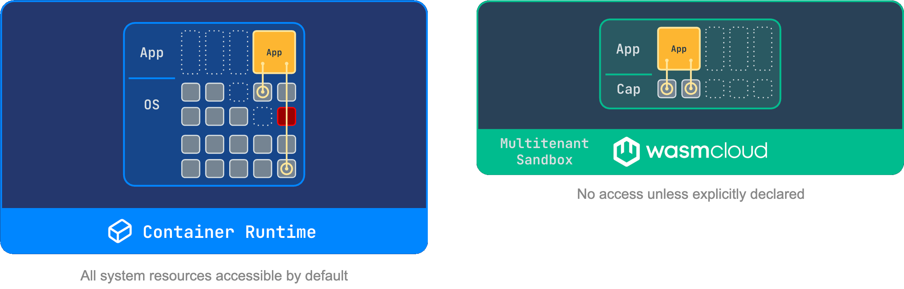
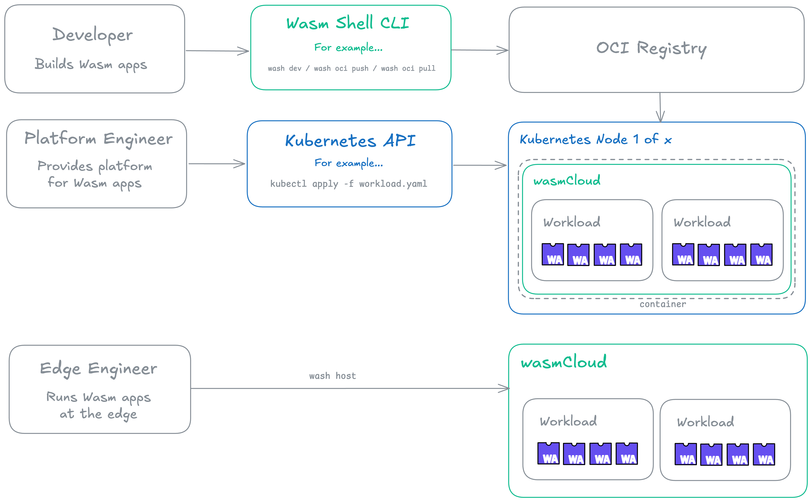

# wasmCloud

### wasmCloud is a cloud native platform for running WebAssembly workloads across any cloud, Kubernetes, datacenter, or edge.

Using wasmCloud, you can run workloads like microservices, functions, and agents as ultra-dense, deny-by-default **bytecode sandboxes** that are far more secure and efficient than traditional containers, *without* changing your operational model. 

Those bytecode sandboxes are called [WebAssembly (Wasm) components](./overview/workloads/components.mdx). Measuring in kilobytes to low megabytes and starting in milliseconds, components target the open [WebAssembly System Interface (WASI)](https://wasi.dev/) standard, so they are portable across any conformant runtime, not locked to wasmCloud. 

Build with any language that compiles to Wasm components, push to an OCI registry, and deploy to wasmCloud on Kubernetes—or directly with the wasmCloud runtime on any host.

The wasmCloud project is open source and Incubating with the [Cloud Native Computing Foundation (CNCF)](https://www.cncf.io/).

## Why wasmCloud?

Securing modern applications is hard. Containers provide process-level isolation, but their default security posture is **allow-by-default**: a container has broad access to the network, system calls, and environment variables unless something is explicitly blocked. Locking down a container image requires knowing everything it might try to do, then correctly enforcing those restrictions from the outside.

WebAssembly components take the opposite approach. The WebAssembly sandbox is **deny-by-default**: a component can do *nothing*—no file I/O, no network access, no system calls—unless a capability is explicitly granted. Capabilities are declared as language-agnostic [interfaces](./overview/interfaces.mdx) in the component itself (a typical component imports one or two interfaces rather than inheriting hundreds of available syscalls) making the security surface small, visible, auditable, and enforced at the runtime level rather than bolted on afterward.

wasmCloud runs WebAssembly components and manages their capabilities. You decide exactly which interfaces each component can access. Everything else is denied.

## Complementing containers

wasmCloud is designed to run alongside your existing container infrastructure, enabling you to start using WebAssembly components immediately without changes to your existing infrastructure and workloads. 

WebAssembly components are a strong fit for:

- **Untrusted or third-party code**: the capability model lets you run code you don't fully control with strict, auditable bounds on what it can access
- **New application logic**: business logic, API handlers, data processing pipelines—anything written fresh benefits from the deny-by-default security model and fine-grained capability controls
- **Edge and constrained environments**: components are practical on IoT gateways and constrained hosts where container images aren't viable

## Kubernetes-native

wasmCloud v2 is built for Kubernetes. The [Kubernetes Operator](./kubernetes-operator/index.mdx) deploys and manages wasmCloud infrastructure as standard Kubernetes resources, so wasmCloud works naturally with the cloud native toolchains, workflows, and policies your team already uses.

- **Auto-scaling**: handled by Kubernetes—HPA, KEDA, or whatever your cluster already uses
- **Backup and recovery**: your existing Kubernetes backup solution covers wasmCloud infrastructure
- **Observability, GitOps, RBAC**: standard Kubernetes patterns apply

You don't learn a new operational model. You extend the one you already have.

## Any cloud, datacenter, or edge

Beyond Kubernetes, the [wasmCloud runtime](./runtime/index.mdx) can run as a standalone process on any Linux, macOS, or Windows host—bare metal servers, VMs, IoT gateways, or CI runners. Because components are WASI-standard bytecode, the same artifact deploys identically across all of these environments without recompilation.

## The platform

The wasmCloud platform consists of three primary parts:

* [**Wasm Shell** (`wash`) CLI](./wash/index.mdx): A development tool for building and publishing WebAssembly components with languages including Go, TypeScript, Rust, and more.
* [**Runtime** (`wash-runtime`)](./runtime/index.mdx): An easy-to-use runtime and workload API for executing WebAssembly components, with built-in support for WASI interfaces.
* [**Kubernetes Operator** (`runtime-operator`)](./kubernetes-operator/index.mdx): An operations tool that runs wasmCloud infrastructure on Kubernetes.

For an overview of core concepts in wasmCloud and WebAssembly, see the [Platform Overview](./overview/index.mdx).

## Get started

- **[Install wasmCloud](./installation.mdx)**: deploy your first WebAssembly component in minutes
- **[Platform Overview](./overview/index.mdx)**: understand components, interfaces, and the capability model
- **[Kubernetes Operator](./kubernetes-operator/index.mdx)**: run wasmCloud on your existing cluster
