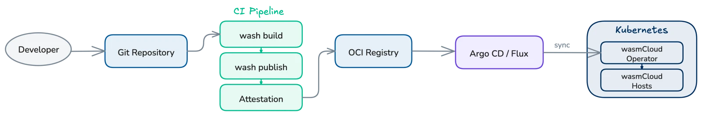

## Overview

wasmCloud components are distributed as [OCI artifacts](https://opencontainers.org/), so a CI/CD pipeline for wasmCloud follows a familiar pattern: build `.wasm` binaries, push them to an OCI registry, and update Kubernetes manifests to reference the new image.

Reusable CI building blocks are available for both major hosted CI platforms:

- **GitHub Actions** &mdash; the [`wasmCloud/setup-wash-action`](https://github.com/wasmCloud/setup-wash-action) and [`wasmCloud/actions`](https://github.com/wasmCloud/actions) repositories. See [wasmCloud GitHub Actions](./github-actions.mdx).
- **GitLab CI** &mdash; the [`cosmonic-labs/ci-components/wash`](https://gitlab.com/cosmonic-labs/ci-components/wash) CI component catalog. See [wasmCloud on GitLab CI](./gitlab-ci.mdx).

The two toolkits are designed for feature parity: equivalent build steps, OCI publishing, and Sigstore-keyless supply-chain attestations. The platform-specific pages above cover the per-job recipes. This page covers the cross-platform pieces: GitOps reconciliation with Argo CD and the shared supply-chain story.



## GitOps with Argo CD

For production deployments, a GitOps workflow keeps Kubernetes state in sync with a Git repository. [Argo CD](https://argo-cd.readthedocs.io/) is a popular GitOps tool for Kubernetes and pairs well with the wasmCloud operator.

### Two-application pattern

A common pattern uses two Argo CD Applications:

1. **Infrastructure Application** &mdash; deploys the wasmCloud platform (operator, NATS, hosts) from the [Helm chart](../../index.mdx).
2. **Workloads Application** &mdash; deploys `WorkloadDeployment` manifests from a dedicated Git repository.

This separation lets infrastructure and workload teams operate independently, each managing their own deployment cadence.

### Example Argo CD Applications

**Infrastructure Application** &mdash; installs the wasmCloud operator via Helm:

```yaml
apiVersion: argoproj.io/v1alpha1
kind: Application
metadata:
  name: wasmcloud-platform
  namespace: argocd
spec:
  project: default
  source:
    chart: runtime-operator
    repoURL: ghcr.io/wasmcloud/charts
    targetRevision: v2-canary
    helm:
      releaseName: wasmcloud
  destination:
    server: https://kubernetes.default.svc
    namespace: default
  syncPolicy:
    automated:
      prune: true
      selfHeal: true
```

**Workloads Application** &mdash; syncs `WorkloadDeployment` manifests from a Git repository:

```yaml
apiVersion: argoproj.io/v1alpha1
kind: Application
metadata:
  name: wasmcloud-workloads
  namespace: argocd
spec:
  project: default
  source:
    repoURL: https://github.com/<org>/wasmcloud-workloads.git
    targetRevision: main
    path: manifests
  destination:
    server: https://kubernetes.default.svc
    namespace: default
  syncPolicy:
    automated:
      prune: true
      selfHeal: true
```

### Automating manifest updates

After the CI pipeline publishes a new component image, a follow-up job updates the `WorkloadDeployment` manifest in the workloads repository and opens a pull request. Once merged, Argo CD detects the change and rolls out the new version automatically.

The pattern is identical on both CI platforms; only the YAML changes. GitHub Actions example:

```yaml
  update-manifests:
    needs: build-and-publish
    runs-on: ubuntu-latest
    steps:
      - uses: actions/checkout@v6
        with:
          repository: <org>/wasmcloud-workloads
          token: ${{ secrets.WORKLOADS_REPO_TOKEN }}

      - name: Update image tag
        run: |
          sed -i "s|image: ghcr.io/<org>/my-component:.*|image: ghcr.io/<org>/my-component:${{ github.ref_name }}|" \
            manifests/my-component.yaml

      - name: Create pull request
        uses: peter-evans/create-pull-request@v7
        with:
          title: "Update my-component to ${{ github.ref_name }}"
          commit-message: "chore: update my-component to ${{ github.ref_name }}"
          branch: "update-my-component-${{ github.ref_name }}"
```

On GitLab CI, the same job is expressed as a `script:` block that uses [`glab mr create`](https://gitlab.com/gitlab-org/cli) (or the REST API) against a separate workloads project. The [`wasm-component-sample`](https://gitlab.com/cosmonic-labs/wasm-component-sample) repository ships a `deploy:staging` job that applies the manifest directly &mdash; useful when Argo CD isn't in the picture.

:::info[]
This pattern works with any GitOps tool that watches a Git repository for changes, including [Flux](https://fluxcd.io/).
:::

## Supply chain security

Both CI toolkits assemble the same supply-chain story end-to-end:

1. **Embedded SBOM at build time** &mdash; `cargo-auditable` is configured via `.wash/config.yaml` so that `wash build` produces a `.wasm` carrying its full dependency graph inside the binary.
2. **CycloneDX extraction** &mdash; the published artifact ships with a CycloneDX SBOM derived directly from the embedded data, ready for vulnerability scanning and downstream attestation.
3. **Sigstore keyless signing** &mdash; both platforms use OIDC tokens (GitHub Actions OIDC, GitLab `id_tokens:`) to sign attestations via Sigstore, with no long-lived signing keys to manage.

The per-platform details &mdash; permissions, attestation storage, and verification commands &mdash; live on the platform pages:

- [GitHub Actions attestation flow](./github-actions.mdx#attestation) &mdash; SBOM + SLSA build provenance via [`actions/attest-sbom`](https://github.com/actions/attest-sbom) and [`actions/attest-build-provenance`](https://github.com/actions/attest-build-provenance), stored in the GitHub Attestation Store and verified with `gh attestation verify`.
- [GitLab CI attestation flow](./gitlab-ci.mdx#attestation) &mdash; Sigstore keyless signing via `cosign` driven by GitLab `id_tokens:`, plus CycloneDX SBOM ingestion into GitLab's own SBOM vulnerability scanner.
