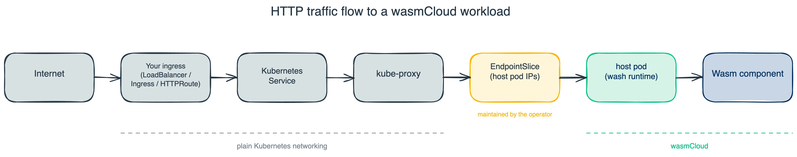

# Operator Overview

There are three primary deployments that comprise wasmCloud in a Kubernetes cluster:

1. **wasmCloud Operator** — watches workload CRDs, schedules Wasm workloads onto hosts, and manages EndpointSlices for user-defined Services
2. **Host Group** — a pool of pods running [cluster hosts (washlets)](../../runtime/washlet.mdx) that execute Wasm components
3. **NATS** — message broker providing the control-plane transport between the operator and hosts

:::note[Runtime Gateway deprecated in 2.0.3]
Earlier releases included a separate **Runtime Gateway** deployment that proxied HTTP traffic to workloads. The gateway is deprecated as of 2.0.3 and is scheduled for removal. HTTP routing is now handled natively by Kubernetes Services: the operator manages an EndpointSlice for each Service referenced by a workload, so requests arriving through standard Kubernetes Service DNS reach the right host pods without any wasmCloud-specific ingress. The gateway pod is still installed by the chart for backwards compatibility; set `gateway.enabled: false` to skip it.
:::

## Architecture

## wasmCloud operator

The wasmCloud operator (`runtime-operator`) is the control-plane entity that watches for wasmCloud [CRDs](../crds.mdx) and reconciles the desired state. Its responsibilities include:

- **Watching CRDs**: Monitors `WorkloadDeployment`, `WorkloadReplicaSet`, `Workload`, `Host`, and `Artifact` resources across all (or configured) namespaces.
- **Scheduling workloads**: Reads the `WorkloadDeployment` spec and selects a `Host` that matches the `hostSelector` criteria, then creates the appropriate child resources to run the Wasm component.
- **Scale-subresource support**: `WorkloadDeployment` implements the standard Kubernetes `/scale` subresource, so `kubectl scale`, HPA, and KEDA scale workloads natively. See [Autoscaling](./autoscaling.mdx) for HPA and KEDA examples.
- **EndpointSlice management**: For workloads that reference a Kubernetes Service via `spec.kubernetes.service.name`, the operator creates and maintains an EndpointSlice pointing to the pod IPs of the hosts running the workload. It also registers Service DNS aliases with the host's HTTP router so requests arriving via cluster DNS reach the correct component.
- **Host communication**: Sends workload start/stop requests and polls host health over NATS, using the `runtime.host.<hostID>.<operation>` subject pattern (e.g. `runtime.host.<hostID>.workload.start`).
- **Status reporting**: Updates the `status` subresource of each CRD to reflect whether scheduling succeeded or failed, and surfaces Kubernetes events for observability.
- **Leader election**: When enabled and running with multiple replicas, uses a `coordination.k8s.io/v1` Lease in the operator's own namespace to elect a single active instance and avoid split-brain reconciliation.
- **Metrics endpoint**: Exposes a `/metrics` endpoint (Prometheus format) protected by Kubernetes token review and subject access review, suitable for scraping by monitoring tools.
- **NATS-backed liveness probe**: Starting in 2.4.0, the operator deployment exposes a dedicated health port whose liveness and readiness probes reflect the operator's NATS connection status. If the NATS service becomes unreachable (for example during a NATS rolling restart) the kubelet restarts the operator pod, which reconnects automatically once NATS is back. No manual intervention is required to recover from a control-plane broker hiccup.

The operator runs with the `wasmcloud-runtime-operator` ServiceAccount. See [Roles and Role Bindings](./roles-and-rolebindings.mdx) for the full set of permissions required.

## Host group

The host group is a `Deployment` of pods, each running [cluster hosts (washlets)](../../runtime/washlet.mdx). A host group provides the sandboxed execution environment for WebAssembly components. Key characteristics:

- **Multiple hosts per group**: Multiple pods can form a single host group, allowing the operator to spread or replicate Wasm workloads across them.
- **Host labels**: Each pod is labelled (e.g., `hostgroup: default`) so that `WorkloadDeployment` manifests can use `hostSelector` to target a specific group.
- **Isolation**: Each host is an isolated sandbox; components on different hosts do not share memory or state.
- **Extensibility**: You can build custom host images that include [host plugins](../../glossary.mdx#host-plugin) to extend the capabilities available to Wasm components.

By default, the Helm chart installs three host pods in the `default` host group.

## NATS

NATS is the message broker that carries all control-plane traffic between the wasmCloud Operator and wasmCloud hosts. Key roles include:

- **Operator ↔ host RPC**: The operator sends workload start, stop, and status requests to individual hosts via NATS subjects (`runtime.host.<hostID>.workload.start`, `runtime.host.<hostID>.workload.stop`, etc.).
- **Host self-registration**: Each host pod publishes periodic `HostHeartbeat` messages to `runtime.operator.heartbeat.<hostID>`. The operator subscribes to these to discover hosts and create or update their `Host` CRDs.
- **JetStream**: Provides built-in object storage used by the platform.

The Helm chart bundles NATS with JetStream enabled (`nats.enabled: true` by default). To use an existing NATS cluster, set `nats.enabled: false` and configure the operator and hosts to point at your endpoint.

## Request flow

When a `WorkloadDeployment` that references a Kubernetes Service is applied:

1. The **wasmCloud operator** detects the new CRD, selects a matching host from the host group, and sends a workload start request to the host **via NATS** (`runtime.host.<hostID>.workload.start`).
2. The operator injects the Service's DNS aliases (e.g. `my-svc`, `my-svc.default`, `my-svc.default.svc`) into the host's HTTP router so incoming requests with a matching `Host` header route to this component.
3. The operator creates and maintains an **EndpointSlice** owned by the referenced Service, populated with the pod IPs of the hosts running the workload.
4. Incoming HTTP requests resolve the Service's ClusterIP via standard Kubernetes DNS and are forwarded by kube-proxy to the host pod IPs in the EndpointSlice, where the **wash runtime** executes the Wasm component.

See the [Expose a Workload via Kubernetes Service](../../recipes/expose-workload-via-kubernetes-service.mdx) recipe for a step-by-step walk-through.

## Related documentation

- [Workload Security](../workload-security.mdx) — the WebAssembly sandbox model, `allowedHosts`, and Kubernetes NetworkPolicy for host pods
- [Custom Resource Definitions (CRDs)](../crds.mdx) — describes the `WorkloadDeployment`, `Host`, `Workload`, and other resources
- [Helm Values Reference](./helm-values.mdx) — commonly-overridden configuration values
- [Roles and Role Bindings](./roles-and-rolebindings.mdx) — details the RBAC permissions required by the operator
- [Filesystems and Volumes](./filesystems-and-volumes.mdx) — how to mount volumes into host pods
- [Secrets and Configuration Management](./secrets-and-configuration.mdx) — supplying environment variables, ConfigMaps, and Secrets to components
- [Private Registries](./private-registries.mdx) — how to pull Wasm component images from private OCI registries
- [CI/CD](./cicd.mdx) — integrating wasmCloud workload deployments into CI/CD pipelines
