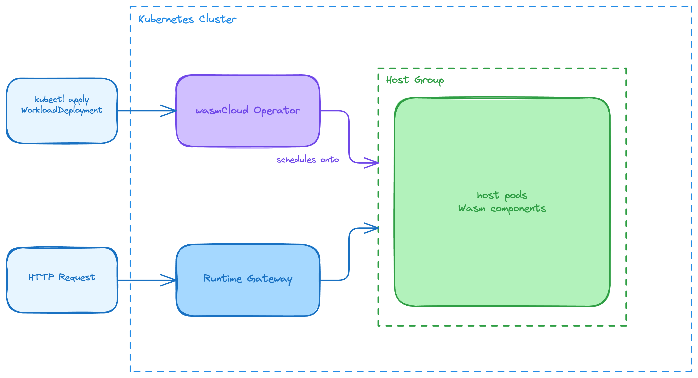

There are four primary deployments that comprise wasmCloud in a Kubernetes system:

1. **wasmCloud Operator** — watches for workload CRDs and schedules Wasm workloads onto hosts
2. **Runtime Gateway** — routes incoming HTTP traffic to deployed Wasm workloads
3. **Host Group** — a pool of pods running [cluster hosts (washlets)](../../runtime/washlet.mdx) that execute Wasm components
4. **NATS** — message broker providing the control-plane transport between the operator and hosts

## Architecture

## wasmCloud operator

The wasmCloud operator (`runtime-operator`) is the control-plane entity that watches for wasmCloud [CRDs](../crds.mdx) and reconciles the desired state. Its responsibilities include:

- **Watching CRDs**: Monitors `WorkloadDeployment`, `WorkloadReplicaSet`, `Workload`, `Host`, and `Artifact` resources across all (or configured) namespaces.
- **Scheduling workloads**: Reads the `WorkloadDeployment` spec and selects a `Host` that matches the `hostSelector` criteria, then creates the appropriate child resources to run the Wasm component.
- **Host communication**: Sends workload start/stop requests and polls host health over NATS, using the `runtime.host.<hostID>.<operation>` subject pattern (e.g. `runtime.host.<hostID>.workload.start`).
- **Status reporting**: Updates the `status` subresource of each CRD to reflect whether scheduling succeeded or failed, and surfaces Kubernetes events for observability.
- **Leader election**: When enabled and running with multiple replicas, uses a `coordination.k8s.io/v1` Lease in the operator's own namespace to elect a single active instance and avoid split-brain reconciliation.
- **Metrics endpoint**: Exposes a `/metrics` endpoint (Prometheus format) protected by Kubernetes token review and subject access review, suitable for scraping by monitoring tools.

The operator runs with the `wasmcloud-runtime-operator` ServiceAccount. See [Roles and Role Bindings](./roles-and-rolebindings.mdx) for the full set of permissions required.

## Runtime Gateway

The Runtime Gateway acts as a reverse proxy that routes incoming HTTP traffic to the appropriate Wasm workload running on a host. Its responsibilities include:

- **Traffic routing**: Listens on a configurable port and forwards HTTP requests to the Wasm component that registered the matching route.
- **Host discovery**: Watches `Host` and `Workload` CRDs (read-only) to maintain an up-to-date routing table as workloads are deployed or removed.
- **Service integration**: Exposed via a Kubernetes `Service`, allowing you to configure `NodePort`, `LoadBalancer`, or `ClusterIP` access depending on your environment.

The gateway runs with the `wasmcloud-runtime-operator-gateway` ServiceAccount, which has read-only access to `Host` and `Workload` resources. It cannot modify cluster state.

## Host group

The host group is a `Deployment` of pods, each running [cluster hosts (washlets)](../../runtime/washlet.mdx). A host group provides the sandboxed execution environment for WebAssembly components. Key characteristics:

- **Multiple hosts per group**: Multiple pods can form a single host group, allowing the operator to spread or replicate Wasm workloads across them.
- **Host labels**: Each pod is labelled (e.g., `hostgroup: default`) so that `WorkloadDeployment` manifests can use `hostSelector` to target a specific group.
- **Isolation**: Each host is an isolated sandbox; components on different hosts do not share memory or state.
- **Extensibility**: You can build custom host images that include [host plugins](../../glossary.mdx#host-plugin) to extend the capabilities available to Wasm components.

By default, the Helm chart installs three host pods in the `default` host group.

## NATS

NATS is the message broker that carries all control-plane traffic between the wasmCloud Operator and wasmCloud hosts. Key roles include:

- **Operator ↔ host RPC**: The operator sends workload start, stop, and status requests to individual hosts via NATS subjects (`runtime.host.<hostID>.workload.start`, `runtime.host.<hostID>.workload.stop`, etc.).
- **Host self-registration**: Each host pod publishes periodic `HostHeartbeat` messages to `runtime.operator.heartbeat.<hostID>`. The operator subscribes to these to discover hosts and create or update their `Host` CRDs.
- **JetStream**: Provides built-in object storage used by the platform.

The Helm chart bundles NATS with JetStream enabled (`nats.enabled: true` by default). To use an existing NATS cluster, set `nats.enabled: false` and configure the operator and hosts to point at your endpoint.

## Request flow

When a `WorkloadDeployment` is applied:

1. The **wasmCloud operator** detects the new CRD, selects a matching host from the host group, and sends a workload start request to the host **via NATS** (`runtime.host.<hostID>.workload.start`).
2. The operator updates the `WorkloadDeployment` status to reflect the scheduling outcome.
3. The **Runtime Gateway** observes the new `Workload` resource via the Kubernetes API and adds a routing rule for HTTP traffic.
4. Incoming HTTP requests hit the Gateway's Service, which forwards them directly to the appropriate host pod (by pod IP), where the **wash runtime** executes the Wasm component.

## Related documentation

- [Custom Resource Definitions (CRDs)](../crds.mdx) — describes the `WorkloadDeployment`, `Host`, `Workload`, and other resources
- [Roles and Role Bindings](./roles-and-rolebindings.mdx) — details the RBAC permissions required by the operator and gateway
- [Filesystems and Volumes](./filesystems-and-volumes.mdx) — how to mount volumes into host pods
- [Secrets and Configuration Management](./secrets-and-configuration.mdx) — supplying environment variables, ConfigMaps, and Secrets to components
- [Private Registries](./private-registries.mdx) — how to pull Wasm component images from private OCI registries
- [CI/CD](./cicd.mdx) — integrating wasmCloud workload deployments into CI/CD pipelines
