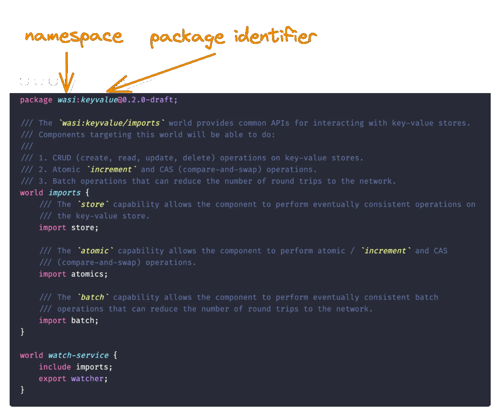
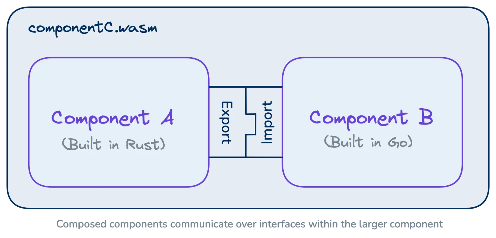

# Interfaces

### Interfaces are contracts that define the relationships between entities.

In wasmCloud, [components](./workloads/components.mdx) communicate through interfaces, which come in two kinds:

* **Well-known interfaces** are common standards (such as [WebAssembly System Interface (WASI) APIs](#wasi-interfaces)) or wasmCloud interfaces (core functionalities like `wasmcloud-messaging`) supported out-of-the-box by wasmCloud hosts.
* **Custom interfaces** are user-created contracts that make it possible to extend and tailor how wasmCloud components and providers interact with one another.

In all cases, wasmCloud interfaces are defined using the interface description language **WebAssembly Interface Type (WIT)**.

## WebAssembly Interface Type (WIT)

WebAssembly Interface Type (WIT) is an [open standard maintained as part of the Component Model](https://github.com/WebAssembly/component-model/blob/main/design/mvp/WIT.md) by the W3C WebAssembly Community Group.

WIT enables WebAssembly components to define the functions they expose to external entities ("**exports**") and the functionalities they require ("**imports**") in `.wit` files.

### Packages, namespaces, and versions

Interfaces defined in WIT are organized into **packages**. Packages must include a **namespace** and **identifier**.



Optionally, WIT packages may include a version using [semantic versioning](https://semver.org/).

:::info[Why `0.2.0-draft`?]
The version for the example above is `0.2.0-draft`. WASI proposals move through three phases. Once a proposal reaches Phase 3, it may be included in the standard API group of WASI 0.2. The `wasi-keyvalue` interface above is at Phase 2.
:::

In wasmCloud, you will often see packages belonging to the `wasmcloud` and `wasi` namespaces. You may also create custom interfaces with arbitrary namespaces. Packages with different namespaces may be mixed and matched freely, and the contents of a given package may be spread across multiple files.

A common organizational pattern divides a package into:

* `types.wit`
* `imports.wit`
* `world.wit`
* `my-interface-name.wit`

An interface may also have a `deps` folder holding WIT files for other WIT files used as dependencies in your interface.

{/* For more information on organizing an interface, see [Creating an interface](TK). */}

### Worlds

The highest-level contract in a WIT interface is called a **world**. A WIT world is akin to a complete description of a component, defining the imports and exports that enable the component to interact other entities. Here is a simple example of a world:

```wit
package wasmcloud:demo;

world demo {
  import wasi:logging/logging;

  export wasi:http/incoming-handler@0.2.0;
}

```
This is the top-level world for a hypothetical component that *imports* on the `logging` interface from [WASI Logging](https://github.com/WebAssembly/wasi-logging) and *exports* (or exposes a function on) the `incoming-handler` interface from [WASI HTTP](https://github.com/WebAssembly/wasi-http). This enables the component to be invoked (and respond) via HTTP and to use logging functionality.

:::info
In addition to using the `wasi:logging` interface, logs printed to STDERR will be output in host logs by default.
:::

There are often at least two worlds defined in a package. A common convention is to have an `imports` world and the world components typically target.

In a wasmCloud component project, it is conventional to include a top-level WIT world at the root of a `wit` folder in the project directory.


### Interfaces

An interface is a collection of **types** and **functions** scoped to a package which can be used within a world. Interfaces are the only place that a type can be defined. Packages may contain multiple interfaces.

Interfaces represent the lower-level vocabulary of the contract between entities. Worlds may also refer to other worlds, which themselves may refer to interfaces or still "deeper" worlds. Here is the `incoming-handler` interface imported by the world above:

```wit
/// This interface defines a handler of incoming HTTP Requests. It should
/// be exported by components which can respond to HTTP Requests.
interface incoming-handler {
  use types.{incoming-request, response-outparam};

  /// This function is invoked with an incoming HTTP Request, and a resource
  /// `response-outparam` which provides the capability to reply with an HTTP
  /// Response. The response is sent by calling the `response-outparam.set`
  /// method, which allows execution to continue after the response has been
  /// sent. This enables both streaming to the response body, and performing other
  /// work.
  ///
  /// The implementor of this function must write a response to the
  /// `response-outparam` before returning, or else the caller will respond
  /// with an error on its behalf.
  handle: func(
    request: incoming-request,
    response-out: response-outparam
  );
}
```

When two entities import and export respectively on the same interface (such as `incoming-handler`), they can be **linked** so that once invoked, they interact according to the contract defined in the interface.



{/* For more information on using WIT, see our Developer Guide page on [**Creating an interface**](/docs/developer/interfaces/creating-an-interface/). */}

:::info[WIT without WebAssembly]
In spite of the name, WIT isn't limited to WebAssembly: wasmCloud also uses WIT to define the interfaces used by providers and host functions written in Rust or Go. It is entirely possible, for example, to create a Rust or Go binary that uses WIT interfaces over the wRPC (WIT over RPC) protocol.
:::

## Well-known interfaces

wasmCloud supports interfaces belonging to [WebAssembly System Interface (WASI)](https://wasi.dev/) P2 (also known as WASI 0.2 / P2) in addition to a selection of interfaces proposed for inclusion in WASI, and interfaces belonging to the wasmCloud host.

### WASI interfaces

[WASI P2 includes these APIs](https://github.com/WebAssembly/WASI/tree/main/preview2#wasi-preview-2-contents), all available for use with wasmCloud 2.0:

| API                                             | Versions |
| ----------------------------------------------- | -------- |
| https://github.com/WebAssembly/wasi-io          | 0.2.0    |
| https://github.com/WebAssembly/wasi-clocks      | 0.2.0    |
| https://github.com/WebAssembly/wasi-random      | 0.2.0    |
| https://github.com/WebAssembly/wasi-filesystem* | 0.2.0    |
| https://github.com/WebAssembly/wasi-sockets*    | 0.2.0    |
| https://github.com/WebAssembly/wasi-cli         | 0.2.0    |
| https://github.com/WebAssembly/wasi-http        | 0.2.0    |

:::info[wasi-filesystem and wasi-sockets]
`wasi-filesystem` access is granted through preopens. By default, components have no filesystem access. Directories can be explicitly mounted to a component via volume mounts in the workload manifest — see [Filesystems and Volumes](../kubernetes-operator/operator-manual/filesystems-and-volumes.mdx) for details. [wasi-virt](https://github.com/bytecodealliance/wasi-virt) can be used to embed a virtual filesystem directly into a component binary (for example, to bundle static assets).

`wasi-sockets` is supported with host-enforced policy: outbound TCP connections are allowed, services can bind on loopback, and DNS name resolution is disabled by default. The host enforces these restrictions unconditionally&mdash;components do not need to implement their own socket access control. For an overview of socket policy and the service model for intra-workload TCP, see [Network Access and Socket Isolation](../wash/developer-guide/network-access-and-socket-isolation.mdx).
:::

Additionally, wasmCloud supports proposed WASI APIs that are in the process of implementation and standardization:

| API                                           | Versions    |
| --------------------------------------------- | ----------- |
| https://github.com/WebAssembly/wasi-blobstore | 0.2.0-draft |
| https://github.com/WebAssembly/wasi-keyvalue  | 0.2.0-draft |
| https://github.com/WebAssembly/wasi-logging   | 0.1.0-draft |
| https://github.com/WebAssembly/wasi-tls       | 0.3.0-draft |

:::info[wasi-tls]
`wasi:tls` (added in wasmCloud 2.2) lets components terminate TLS connections themselves over `wasi:sockets` using the WASI Preview 3 `wasi:tls/client` and `wasi:tls/types` interfaces. Support is opt-in via the `wasi-tls` Cargo feature on `wash-runtime` while the upstream WIT stabilizes. Embedders can register a custom TLS provider through `EngineBuilder::with_tls_provider` — see [Building Custom Hosts](../runtime/building-custom-hosts.mdx#tls-for-wasitls-components) for details.
:::

### wasmCloud interfaces

Well-known interfaces include two APIs built specifically for wasmCloud:

| API                                                                              | Versions    |
| -------------------------------------------------------------------------------- | ----------- |
| [wasmcloud:bus](https://github.com/wasmCloud/wasmCloud/tree/main/wit/bus)        | 1.0.0       |
| [wasmcloud:messaging](https://github.com/wasmCloud/messaging)                    | 1.0.0       |

* **`wasmcloud:bus`** provides advanced link configuration only available in wasmCloud.
* **`wasmcloud:messaging`** facilitates communication through message brokers.

:::info[2.5.0: async `wasmcloud:keyvalue` and `wasmcloud:blobstore`]
Starting in 2.5.0, `wasmcloud:keyvalue` and `wasmcloud:blobstore` ship async-shaped WIT packages alongside the existing sync interfaces, together with **TTL on `set`**, **CAS** (compare-and-swap), and **typed errors** for missing keys, conflicts, and backend failures. The async packages depend on the `component-model-async` proposal (implied by WASI 0.3).

The `bucket` resource (and `error`, `key-response`, `set-options`) live in a shared `wasmcloud:keyvalue/types` interface, and `store`, `atomics`, `cas`, `batch`, and `watcher` all `use types.{bucket, error}`. A guest using a labeled multi-backend `store` can therefore also use `cas`/`atomics`/`batch` against the same bucket — the resource identity matches across all five interfaces. This mirrors the shape that `wasmcloud:blobstore` uses.
:::

## Custom interfaces

WASI interfaces are ultimately common standards using WIT, but wasmCloud enables you to build custom WIT interfaces and communicate between components in the way best-suited to your requirements.

Here is an example of a `greeter` interface defined in WIT:

```wit
package local:greeter-demo; // <namespace>:<package>

interface greet { // interface <name of interface>
  greet: func(name: string) -> string; // a function named "greet"
}

world greeter {
  export greet; // make the `greet` function available to other components/the runtime
}
```

While reading the [spec][wit-spec] is the best way to learn about WIT, it is also designed to be easy to understand at a glance. WASI interfaces written in WIT contain their own documentation and are useful to consult as examples.

:::warning[Compared to gRPC and Smithy...]
While similar frameworks and languages like [gRPC][grpc] and [Smithy][smithy] are meant to perform over network boundaries, WIT is _in-process_, and performs at near-native speed.
:::

## Interface-driven development

Interface-driven development (IDD) is a development approach that focuses on defining what capabilities components require before the specifics of how you will meet those needs.

Systems developed using IDD&mdash;especially distributed systems&mdash;are loosely coupled, robust, and maintainable.

[wit-spec]: https://github.com/WebAssembly/component-model/blob/main/design/mvp/WIT.md
[wiki-idl]: https://en.wikipedia.org/wiki/Interface_description_language
[smithy]: https://smithy.io
[grpc]: https://grpc.io/
