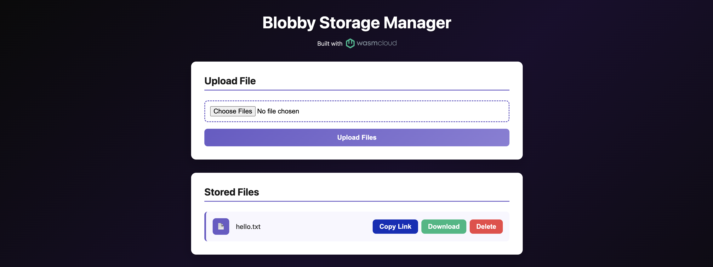

import Tabs from '@theme/Tabs';
import TabItem from '@theme/TabItem';
import HubspotForm from 'react-hubspot-form';

In our previous tutorials, we started a developer loop and added the [`wasi:keyvalue`](../overview/interfaces.mdx) interface to our application. The `wash dev` process satisfied our application's capability requirements automatically, so we could move quickly and focus on code.

Now we'll learn how to:

- Compile your application to a WebAssembly component binary
- Publish your Wasm binary to an OCI registry
- Set up a wasmCloud environment on Kubernetes and deploy your Wasm workload

:::info[Prerequisites]
This tutorial assumes you're following directly from the previous steps. Make sure to complete [**Quickstart**](./index.mdx) and [**Develop a WebAssembly Component**](./develop-a-webassembly-component.mdx) first.
:::

## Build Wasm binary

<Tabs groupId="lang" queryString>
  <TabItem value="rust" label="Rust" default>
  Use the `wash build` command from the root of a project directory to compile the component into a `.wasm` binary:

  ```shell
  wash build
  ```

  By default, the compiled `.wasm` binary for a Rust project is generated at `/target/wasm32-wasip2/debug/`. The output path for the compiled `.wasm` binary [can be configured via `wash`'s `config.json` file](../wash/config.mdx).
  </TabItem>
  {/*
  <TabItem value="tinygo" label="TinyGo">
  Use the `wash build` command from the root of a project directory to compile the component into a `.wasm` binary:

  ```shell
  wash build
  ```

  By default, the compiled `.wasm` binary for a TinyGo project is generated at `/build/`. The output path for the compiled `.wasm` binary [can be configured via `wash`'s `config.json` file](../wash/config.mdx).
  </TabItem>
  */}
  <TabItem value="typescript" label="TypeScript">
  Use the `wash build` command from the root of a project directory to compile the component into a `.wasm` binary:

  ```shell
  wash build
  ```

  By default, the compiled `.wasm` binary for a TypeScript project is generated at `/dist/`. The output path for the compiled `.wasm` binary [can be configured via `wash`'s `config.json` file](../wash/config.mdx).
  </TabItem>
  <TabItem value="unlisted" label="My language isn't listed">

If you prefer working in a language that isn't listed here, let us know!

{' '}

<div style={{ display: 'flex', flexDirection: 'row' }}>
  <div style={{ width: '100%' }}>
    <HubspotForm
      portalId="20760433"
      formId="71e74f55-cc30-41de-9d41-e3d9dc159c71"
      onSubmit={() => console.log('Submitted form')}
      onReady={(form) => console.log('Form ready for submit')}
      region="na1"
      loading={<div>Loading...</div>}
    />
  </div>
</div>

  </TabItem>
  
</Tabs>

## Publish image

Now we can publish a Wasm binary image to any OCI compliant registry that supports **OCI artifacts**. 

:::note[What is this image?]
The wasmCloud ecosystem uses the [OCI image specification](https://github.com/opencontainers/image-spec) to package Wasm components&mdash;these images are not container images, but conform to OCI standards and may be stored on any OCI-compatible registry. You can learn more about wasmCloud packaging on the [**Packaging**](../overview/packaging.mdx) page.
:::

### Authenticate to registry

`wash` uses Docker credentials for OCI registry authentication. For GitHub Packages (GHCR), you'll need a [GitHub Personal Access Token (PAT)](https://docs.github.com/en/authentication/keeping-your-account-and-data-secure/managing-your-personal-access-tokens) with `write:packages` scope. Authenticate with the `docker` CLI:

```shell
docker login ghcr.io -u <username>
```

Docker will prompt you for your PAT as the password.

:::note[]
Your GitHub username (and the namespace in image paths) must be **all lowercase**.
:::

### Push image to registry

Now we'll push a Wasm component image to a registry. The example below uses GitHub Packages, but you can use any OCI compliant registry that supports OCI artifacts.

If you're following along using GitHub Packages, make sure to replace `<namespace>` in the command below with your own GitHub namespace (lowercase).

<Tabs groupId="lang" queryString>
  <TabItem value="rust" label="Rust" default>

```shell
wash oci push ghcr.io/<namespace>/http-hello-world:0.1.0 ./target/wasm32-wasip2/debug/http_hello_world.wasm
```
  </TabItem>
{/*
  <TabItem value="tinygo" label="TinyGo">

```shell
wash oci push ghcr.io/<namespace>/http-hello-world:0.1.0 ./build/http_hello_world.wasm
```
  </TabItem>
*/}
  <TabItem value="typescript" label="TypeScript">

```shell
wash oci push ghcr.io/<namespace>/http-hello-world:0.1.0 ./dist/http_hello_world_hono.wasm
```
  </TabItem>
    <TabItem value="unlisted" label="My language isn't listed">

If you prefer working in a language that isn't listed here, let us know!

{' '}

<div style={{ display: 'flex', flexDirection: 'row' }}>
  <div style={{ width: '100%' }}>
    <HubspotForm
      portalId="20760433"
      formId="71e74f55-cc30-41de-9d41-e3d9dc159c71"
      onSubmit={() => console.log('Submitted form')}
      onReady={(form) => console.log('Form ready for submit')}
      region="na1"
      loading={<div>Loading...</div>}
    />
  </div>
</div>

  </TabItem>
</Tabs>

* The registry address (including name and tag) is specified for the first option with `wash oci push`.
* The second option defines the target path for the component binary to push.

:::warning[]
If you're using GitHub Packages, remember to [make the image public](https://docs.github.com/en/packages/learn-github-packages/configuring-a-packages-access-control-and-visibility) in order to follow the steps below.
:::

## Install wasmCloud on Kubernetes

Installation requires the following tools:

- [`kubectl`](https://kubernetes.io/docs/tasks/tools/#kubectl)
- [Helm](https://helm.sh/docs) v3.8.0+

For more information on running wasmCloud on Kubernetes, see [Kubernetes Operator](../kubernetes-operator/index.mdx).

Select your Kubernetes environment:

<Tabs groupId="k8s-env" queryString>
  <TabItem value="existing" label="Existing cluster" default>

If you already have a Kubernetes cluster, skip cluster creation. Verify your `kubectl` context is pointing to the right cluster:

```shell
kubectl cluster-info
```

  </TabItem>
  <TabItem value="kind" label="kind">

[kind](https://kind.sigs.k8s.io/) runs Kubernetes nodes as Docker containers.

**Requirements:** [Docker](https://docs.docker.com/get-started/get-docker/) · [kind](https://kind.sigs.k8s.io/docs/user/quick-start/#installation)

:::note[Linux]
On Linux, Docker may require `sudo` unless you've completed the [post-installation steps](https://docs.docker.com/engine/install/linux-postinstall/) to run Docker as a non-root user.
:::

The following command downloads a `kind-config.yaml` from the [`wasmCloud/wasmCloud`](https://raw.githubusercontent.com/wasmCloud/wasmCloud/refs/heads/main/deploy/kind/kind-config.yaml) repository, starts a cluster with port 80 mapped for ingress, and deletes the config upon completion:

```shell
curl -fLO https://raw.githubusercontent.com/wasmCloud/wasmCloud/refs/heads/main/deploy/kind/kind-config.yaml && kind create cluster --config=kind-config.yaml && rm kind-config.yaml
```

  </TabItem>
  <TabItem value="k3d" label="k3d">

[k3d](https://k3d.io/) runs a lightweight [k3s](https://k3s.io/) cluster inside Docker. It starts quickly and supports `LoadBalancer` services natively.

**Requirements:** [Docker](https://docs.docker.com/get-started/get-docker/) · [k3d](https://k3d.io/#installation)

:::note[Linux]
On Linux, Docker may require `sudo` unless you've completed the [post-installation steps](https://docs.docker.com/engine/install/linux-postinstall/) to run Docker as a non-root user.
:::

```shell
k3d cluster create wasmcloud --port "80:80@loadbalancer"
```

  </TabItem>
  <TabItem value="k3s" label="k3s">

[k3s](https://k3s.io/) is a lightweight Kubernetes distribution. **Linux only.**

Install k3s:

```shell
curl -sfL https://get.k3s.io | sh -
```

Configure `kubectl` to use the k3s cluster:

```shell
mkdir -p ~/.kube
sudo cp /etc/rancher/k3s/k3s.yaml ~/.kube/config
sudo chown $USER ~/.kube/config
```

  </TabItem>
</Tabs>

Use Helm to install the wasmCloud operator:

<Tabs groupId="k8s-env" queryString>
  <TabItem value="existing" label="Existing cluster" default>

```shell
helm install wasmcloud --version 2.0.1 oci://ghcr.io/wasmcloud/charts/runtime-operator \
  -f https://raw.githubusercontent.com/wasmCloud/wasmCloud/refs/heads/main/charts/runtime-operator/values.local.yaml \
  --set gateway.service.type=LoadBalancer
```

  </TabItem>
  <TabItem value="kind" label="kind">

The [`values.local.yaml`](https://raw.githubusercontent.com/wasmCloud/wasmCloud/refs/heads/main/charts/runtime-operator/values.local.yaml) file configures the Runtime Gateway as a NodePort service on port 30950, which the kind cluster config maps to host port 80:

```shell
helm install wasmcloud --version 2.0.1 oci://ghcr.io/wasmcloud/charts/runtime-operator \
  -f https://raw.githubusercontent.com/wasmCloud/wasmCloud/refs/heads/main/charts/runtime-operator/values.local.yaml
```

  </TabItem>
  <TabItem value="k3d" label="k3d">

k3d supports `LoadBalancer` services natively, so we override the gateway service type:

```shell
helm install wasmcloud --version 2.0.1 oci://ghcr.io/wasmcloud/charts/runtime-operator \
  -f https://raw.githubusercontent.com/wasmCloud/wasmCloud/refs/heads/main/charts/runtime-operator/values.local.yaml \
  --set gateway.service.type=LoadBalancer
```

  </TabItem>
  <TabItem value="k3s" label="k3s">

k3s includes a built-in load balancer (Klipper), so we override the gateway service type:

```shell
helm install wasmcloud --version 2.0.1 oci://ghcr.io/wasmcloud/charts/runtime-operator \
  -f https://raw.githubusercontent.com/wasmCloud/wasmCloud/refs/heads/main/charts/runtime-operator/values.local.yaml \
  --set gateway.service.type=LoadBalancer
```

  </TabItem>
</Tabs>

Wait for the deployment to be ready:

```shell
kubectl rollout status deploy -l app.kubernetes.io/instance=wasmcloud -n default
```

## Deploy Wasm workload

Now we'll deploy our Wasm application using a [`WorkloadDeployment`](../kubernetes-operator/crds.mdx#workloaddeployment) manifest.

:::info[wasmCloud security model]
wasmCloud components are **deny-by-default**: a component cannot use any capability—HTTP, key-value storage, logging, or any other—unless the host is explicitly told to allow it. The `hostInterfaces` field in a workload manifest is the allowlist. Each entry names an interface package that the host will make available to the component. Any interface not listed is silently unavailable, regardless of what the component's WIT file imports.
:::

Run the following script in your terminal to create a file called `deployment.yaml` containing a manifest.

```shell
cat > deployment.yaml << 'EOF'
  apiVersion: runtime.wasmcloud.dev/v1alpha1
  kind: WorkloadDeployment
  metadata:
    name: http-hello-world
  spec:
    replicas: 1
    template:
      spec:
        hostSelector:
          hostgroup: default
        components:
          - name: http-hello-world
            image: ghcr.io/<namespace>/http-hello-world:0.1.0
        hostInterfaces:
          - namespace: wasi
            package: http
            interfaces:
              - incoming-handler
            config:
              host: localhost
          - namespace: wasi
            package: keyvalue
            interfaces:
              - atomics
              - store
EOF
```

This is a deployment manifest for a [Kubernetes custom resource](../kubernetes-operator/crds.mdx). For the purposes of this quickstart, the most important fields to highlight in the specification are:

- `hostSelector.hostgroup`: Selects which pool of wasmCloud hosts runs this workload. The Helm chart installs three host pods labelled `hostgroup: default`—this is the correct target for most deployments. Custom host groups can be created to isolate workloads or provide specialized capabilities.
- `components.image`: This defines the registry address we will use to fetch our Wasm image.
- `hostInterfaces`: These declare which capability interfaces the host will make available to the component. **Without an explicit entry here, the component cannot access that capability.** Since the HTTP and key-value capabilities use [well-known built-in interfaces](../overview/interfaces.mdx), all we have to do is list them.

Open the file and update the image name with the correct registry address. If you're using GitHub Packages, that means replacing `<namespace>` with your GitHub namespace.

```yaml {13}
apiVersion: runtime.wasmcloud.dev/v1alpha1
kind: WorkloadDeployment
metadata:
  name: http-hello-world
spec:
  replicas: 1
  template:
    spec:
      hostSelector:
        hostgroup: default
      components:
        - name: http-hello-world
          image: ghcr.io/<namespace>/http-hello-world:0.1.0
      hostInterfaces:
        - namespace: wasi
          package: http
          interfaces:
            - incoming-handler
          config:
            host: localhost
        - namespace: wasi
          package: keyvalue
          interfaces:
            - atomics
            - store
```

Now use `kubectl` to apply the manifest:

```shell
kubectl apply -f deployment.yaml
```

Verify that the Wasm component is successfully deployed:

```shell
kubectl get workloaddeployments
```

Use `curl` to invoke the Wasm workload with an HTTP request:

:::note[macOS with OrbStack]
OrbStack manages port 80 on macOS, intercepting traffic before it reaches the cluster. Run a port-forward in a separate terminal:

```shell
kubectl port-forward svc/runtime-gateway 8080:80
```

Then substitute `localhost:8080` for `localhost` in the hello-world command, and use `-H "Host: blobby.localhost.direct" http://localhost:8080/...` in place of `http://blobby.localhost.direct/...` in the Blobby commands further below.
:::

```shell
curl localhost
```
```text
Hello x1, World!
```

## Deploy the Blobby file server

Now let's deploy a more feature-rich example: **Blobby** ("Little Blobby Tables"), a simple file server that demonstrates the [`wasi:blobstore`](https://github.com/WebAssembly/wasi-blobstore) capability alongside `wasi:http`.

The manifest below uses `host: blobby.localhost.direct` to route HTTP traffic — `blobby.localhost.direct` is a public DNS alias for `127.0.0.1`, so no `/etc/hosts` changes are needed. Apply it to deploy the [`blobby-ui`](https://github.com/wasmCloud/wasmCloud/tree/main/examples/blobby) component from a wasmCloud-hosted OCI image:

```shell
kubectl apply -f - <<EOF
apiVersion: runtime.wasmcloud.dev/v1alpha1
kind: WorkloadDeployment
metadata:
  name: blobby
spec:
  replicas: 1
  template:
    spec:
      hostInterfaces:
        - namespace: wasi
          package: http
          interfaces:
            - incoming-handler
          config:
            host: blobby.localhost.direct
        - namespace: wasi
          package: blobstore
          version: 0.2.0-draft
          interfaces:
            - blobstore
          config:
            buckets: blobby
        - namespace: wasi
          package: logging
          version: 0.1.0-draft
          interfaces:
            - logging
      components:
        - name: blobby
          image: ghcr.io/wasmcloud/components/blobby-ui:0.5.2
EOF
```

Verify the deployment:

```shell
kubectl get workloaddeployments
```

Once running, open **http://blobby.localhost.direct** in your browser to use the file manager UI:



You can also interact with the file server directly from the command line:

Upload a file:

```shell
echo "Hello, wasmCloud!" > hello.txt
curl -H "Content-Type: text/plain" http://blobby.localhost.direct/hello.txt --data-binary @hello.txt
```

List all files:

```shell
curl -X POST http://blobby.localhost.direct/
```

Download a file:

```shell
curl http://blobby.localhost.direct/hello.txt
```

Delete a file:

```shell
curl -X DELETE http://blobby.localhost.direct/hello.txt
```

## Clean up

To remove the deployments created in this tutorial:

```shell
kubectl delete workloaddeployment http-hello-world blobby
```

To tear down the cluster entirely:

<Tabs groupId="k8s-env" queryString>
  <TabItem value="existing" label="Existing cluster" default>

Remove the wasmCloud Helm release:

```shell
helm uninstall wasmcloud
```

  </TabItem>
  <TabItem value="kind" label="kind">

```shell
kind delete cluster
```

  </TabItem>
  <TabItem value="k3d" label="k3d">

```shell
k3d cluster delete wasmcloud
```

  </TabItem>
  <TabItem value="k3s" label="k3s">

```shell
k3s-uninstall.sh
```

  </TabItem>
</Tabs>

## What's next?

- **Explore the interfaces:** Learn how [WASI interfaces](../overview/interfaces.mdx) work and browse the full list of built-in capabilities your components can use.
- **Go deeper with components:** The [Developer Guide](../wash/developer-guide/index.mdx) covers building, publishing, debugging, and composing components.
- **Deploy to production:** The [Operator Manual](../kubernetes-operator/operator-manual/overview.mdx) covers production topics: RBAC, private registries, and CI/CD pipelines.


