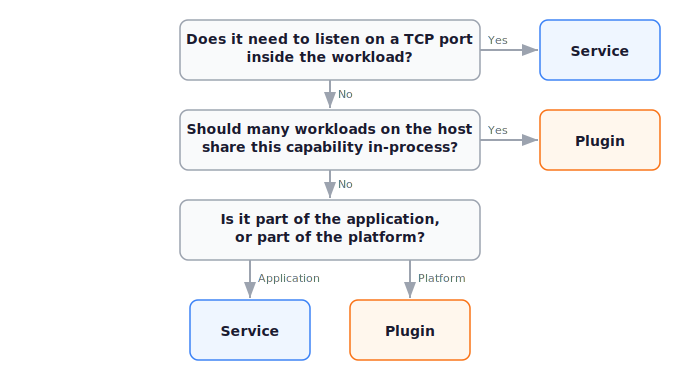

This recipe gives you a framework for choosing between two ways of providing capabilities to a wasmCloud application: extending the host with a [plugin](../overview/hosts/plugins.mdx), or shipping a [service](../overview/workloads/services.mdx) inside the workload. The two are not interchangeable&mdash;each has hard constraints that rule it out in some situations, and softer trade-offs in the rest.

## A quick introduction to plugins and services

A **host plugin** is a Rust implementation of the `HostPlugin` trait, compiled into the host binary. A host plugin is native Rust code that is available to and executed by components via calling into the host.

More concretely, when workloads are bound, the runtime adds the plugin's WIT imports directly to the wasmtime linker for each component or service in the workload, so calls from guest code dispatch in-process. 

For example, `wash-runtime` ships with built-in host plugins for interfaces like `wasi:keyvalue`, `wasi:blobstore`, `wasi:config`, `wasi:logging`, `wasi:otel`, `wasmcloud:messaging`, and more. See the [Plugins overview](../overview/hosts/plugins.mdx).

A **wasmCloud service** is a Wasm component that runs for the lifetime of a workload, deployed as part of a [`WorkloadDeployment`](../kubernetes-operator/crds.mdx#workloaddeployment). 

Unlike other components in a `WorkloadDeployment`, services receive the `wasi:sockets` TCP bind permission, can listen on loopback and unspecified addresses to interact with other components in the workload, and are automatically restarted if they crash. 

A service exports either `wasi:cli/run` or exactly one WIT interface so the runtime has an unambiguous entry point. See the [Services overview](../overview/workloads/services.mdx).

## Plugin and service comparison

| | Plugin | Service |
|---|---|---|
| **Form** | Rust trait impl linked into the host binary | Wasm component shipped with the workload |
| **Author language** | Rust | Any language that targets `wasm32-wasip2` |
| **Decision point** | Host build time | Workload deploy time |
| **Scope** | All workloads on the host | One workload |
| **Execution** | In-process (added to the Wasmtime linker) | Separate Wasm instance |
| **Shared state across workloads** | Yes&mdash;e.g. one connection pool or cache | No&mdash;sandboxed per workload |
| **TCP listen()** | No | Yes, on loopback and unspecified addresses |
| **Auto-restart on crash** | N/A | Yes |
| **Declared by workload as** | `host_interfaces: [...]` | `service: { ... }` |
| **Operator-facing toggle** | Cargo features on the host crate | Manifest field on the workload |

## Decision tree

The first two questions are hard filters: needing to listen on a TCP port rules plugins out, and needing in-process sharing across workloads rules services out. 

The third question is a tiebreaker that maps the choice to where the code should live in your deploy: with the platform (plugin) or with the application (service).

## When to choose a plugin

Pick a plugin when:

- The capability is **infrastructure**&mdash;storage, telemetry, secrets, messaging, a custom database driver&mdash;and should behave the same across every workload running on the host.
- You want **one resource** (a connection pool, a shared cache, a hardware handle) serving many workloads at once. Built-in plugins like `InMemoryKeyValue` do exactly this, keyed by workload ID for isolation.
- The capability needs to be **available to components in any language**, not just Rust. Plugins expose a WIT interface, so guests written in Rust, TypeScript, Go, or any other Wasm-targeting language consume them identically.
- You **control the host build** and can roll a new host image to ship any required changes.

## When to choose a service

Pick a service when:

- The work is **specific to one application** and shouldn't bleed across deployments&mdash;a per-tenant connection, a request batcher, an in-memory cache that only one workload uses.
- You need to **listen on a TCP port** inside the workload, whether as a real protocol server or as a way to bridge component invocations into a streaming connection.
- The behavior ships **with the application artifact**, not with the platform. Updating it means redeploying the workload, not rebuilding the host.
- The implementation **isn't Rust**, or the team writing it doesn't own the host binary.

## Best-practice examples

**Per-app configuration from Kubernetes ConfigMaps and Secrets** → **Plugin.**
The built-in `wasi:config` plugin reads runtime configuration uniformly for every workload on the host. This is platform-level concern, language-agnostic, and benefits from a single code path. See the [config-injection recipe](./inject-configuration-from-configmaps-and-secrets.mdx).

**Cron-driven invocation of components in the same workload** → **Service.**
A long-running loop that periodically calls a component interface is application logic, lives with the workload, and benefits from automatic restart. See the canonical [`cron-service` example](https://github.com/wasmCloud/wasmCloud/tree/main/examples/cron-service).

**Connecting to a proprietary database with no WASI binding** → **Plugin.**
If multiple workloads should share one driver and one connection pool, build a custom plugin against the `HostPlugin` trait. Components stay portable&mdash;they import a WIT interface, not a Rust SDK. See [Creating Host Plugins](../runtime/creating-host-plugins.mdx).

**A TCP protocol adapter that translates between an external system and your components** → **Service.**
Listening on a TCP port inside the workload is a hard requirement here. A service can bind to `127.0.0.1`, accept incoming connections, and call into companion components over WIT. Plugins cannot listen on ports.

## Keep reading

- [Plugins overview](../overview/hosts/plugins.mdx)&mdash;built-in plugins and the registration API.
- [Services overview](../overview/workloads/services.mdx)&mdash;the service model, TCP isolation, and export requirements.
- [Creating Host Plugins](../runtime/creating-host-plugins.mdx)&mdash;the `HostPlugin` trait reference for plugin authors.
- [Creating Services](../wash/developer-guide/create-services.mdx)&mdash;the developer-guide walkthrough for service authors.
