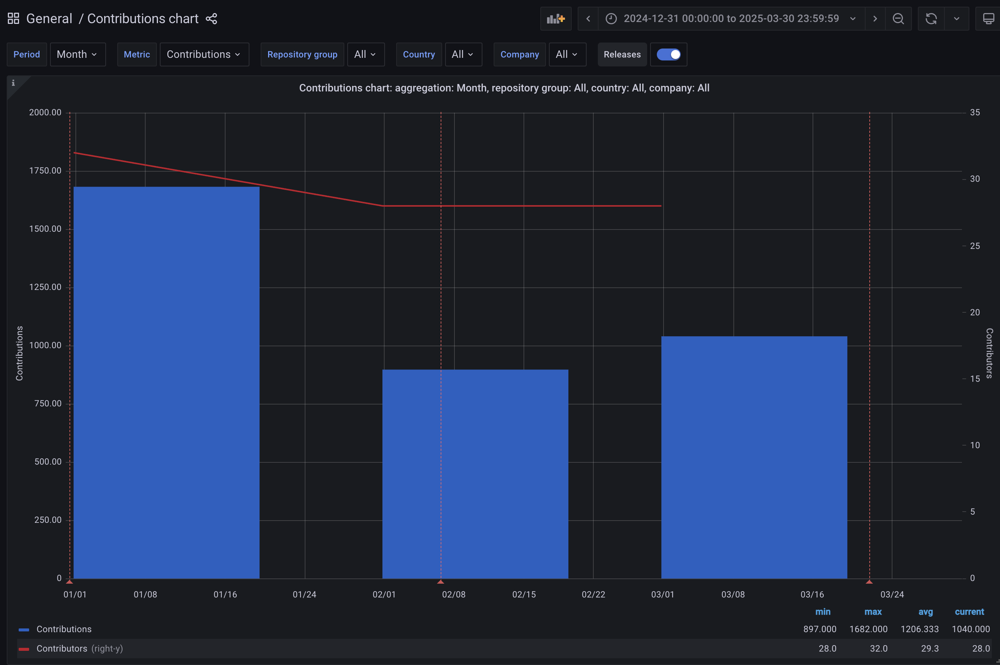

:::info
This roadmap page is a snapshot of the current state of the project. It is not a guarantee of future direction or features. It is a living document and will change as the project evolves. You can view the most current version of this roadmap on [GitHub Projects](https://github.com/orgs/wasmCloud/projects/7/views/13).
:::

The 2025 Q2 Roadmap was brainstormed and planned in the [23 April 2025 community meeting](/community/2025/04/23/community-meeting/). Thank you to all who attended, commented, and contributed to making this roadmap community-driven.

## Retrospective

For the previous roadmap we had the following goals as our first quarter as an incubating project:

1. **Apply stabilization rigor to our APIs, CloudEvents, capability provider SDKs, and documentation**
2. Track the development of WebAssembly standards in WASI P3, knowledge sharing and prototyping alongside standardization.
3. Utilize the transparency of components to provide a seamless developer experience for building, testing, and deploying applications with wasmCloud.
4. Enable developers to build features without vendor lock-in, platform specific dependencies, or language constraints.

We committed more than we had time for on the roadmap, and at the same time we kept a very high delivery throughput for wasmCloud as a project.

Over Q1, we had over 3500 contributions from a monthly average of 30 contributors, which is huge! It also means that we committed more to our roadmap that did not include existing features, bugs, and unplanned community contributions. To compensate for this, we’re going to take a more focused approach to the Q2 roadmap, especially given that we’re doing the planning session on Apr 23.

## Goals

I propose that Q2 for wasmCloud bring on a few of the issues from the first quarter so we can finish them up, and only bring on a select couple of bigger roadmap items. Larger roadmap items should have a community or maintainer sponsor (where possible) that is committed to driving that work to completion even if they are not planning on completing it themselves.

Additionally, in previous planning sessions it’s been difficult to distinguish between longer, more complex issues and “good first issues” that could be completed in a short amount of time by a new contributor. To compensate for this, I propose that we change the categories for the roadmap to focus on their phase of work rather than their category. Right now, the roadmap categories are: Documentation, New Features, improvements. I propose we change the categories to:

| Category | Description | Sponsor |
| --- | --- | --- |
| Research | Initiatives in this category focus on architectural exploration, standards alignment, and RFC development. These are often open-ended or speculative efforts intended to inform future development priorities and ecosystem alignment. | Maintainer or Project Lead |
| Development | Well-defined features, enhancements, or refactors with a clear scope and delivery outcome. These items are typically complex enough to require a deep understanding of the codebase, and should have a sponsor committed to driving them to completion. | Maintainer or previous contributor |
| Good first issue | Issues specifically scoped and labeled for new contributors to build confidence, context, and community familiarity. These are low-risk tasks with limited required domain knowledge, and may include mentorship or onboarding support. | Any contributor |

Now that we have all that out of the way, onto the roadmap!

With our new categories, there are some big pieces of work and some good first issues I’d like to propose to the roadmap:

1. `wash plugins` which allow for us to migrate CLI functionality to Wasm and provide extension points for Cosmonic and power users
2. External providers, which starts with a simplified binary run and then seamlessly works for containers / external processes that speak wRPC
3. Exploration and proposals for a configurable platform, finding the right abstraction for running a set of providers and "auto configuration" of links instead of using the wadm app model. (Opportunity for us to reframe the wadm CRD into something else)
4. Embedding NATS/wasmcloud into `wash dev`, deprecating binary launching via wash up, to drastically simplify deployment and prevent all the issues we have with services running leftover
5. Show component-based logs in the `wash dev` output OR provide a dashboard (otel or otherwise) that can be used to debug applications
6. Revisit how we store local data for `wash` (aligning with XDG spec)
7. Consider builtins or a more all encompassing strategy for wash dev (e.g. using all NATS services by default)

## Features

wasmCloud as a project offers the following top features:

1. Declarative WebAssembly Orchestration
1. Seamless Distributed Networking
1. Vendorless Application Components
1. Completely OTEL Observable
1. Defense-In-Depth Security By Default

## GitHub Project

This roadmap is available as a [GitHub Project](https://github.com/orgs/wasmCloud/projects/7/views/13).

## Contributing

We welcome all contributors to the wasmCloud project, and we'd love to have help to accomplish our goals. If you're interested in contributing, please see our [Contributing Guide](https://github.com/wasmCloud/wasmCloud/blob/main/CONTRIBUTING.md) for more information, and come join us on [Slack](https://slack.wasmcloud.com) to chat with the team and other community members.

We try to mark issues that are good for new contributors with the [**good first issue**](https://github.com/wasmCloud/wasmCloud/contribute) label, so look out for those for well scoped issues that are a good place to start. On this particular roadmap, many of the "Ready for Work" issues in the "Improvement" section are good places to start.

We also host [weekly community meetings](https://calendar.google.com/calendar/u/0/embed?src=c_6cm5hud8evuns4pe5ggu3h9qrs@group.calendar.google.com) that are open to all, where we can discuss aspects of the roadmap.
