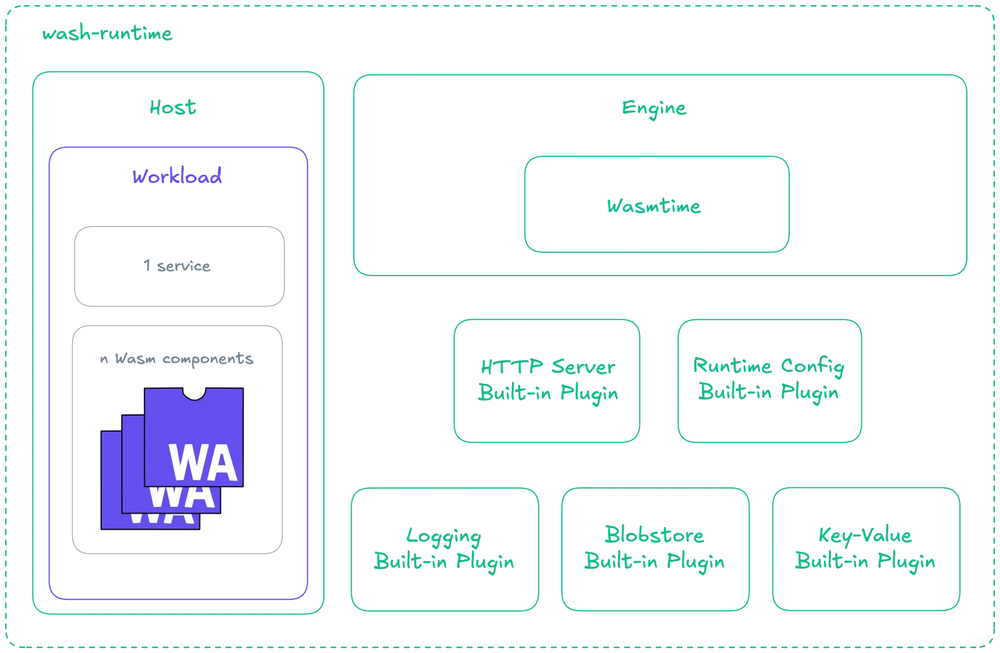

# Runtime

### wasmCloud's runtime (`wash-runtime`) is a simple, flexible runtime environment for WebAssembly workloads.

[`wash-runtime`](https://github.com/wasmCloud/wasmCloud/tree/main/crates/wash-runtime) is a Rust crate that includes Wasmtime as the underlying runtime engine, as well as the wasmCloud host, which serves as a runtime environment for WebAssembly components. A plugin system allows for extension of the host with new and custom capabilities.

The runtime provides easy-to-use abstractions over the low-level [Wasmtime API](https://wasmtime.dev/), as well as wasmCloud-specific APIs for managing workloads, handling NATS subscriptions, managing and utilizing host plugins, and more.

For a step-by-step guide to embedding the runtime, see [Building Custom Hosts](./building-custom-hosts.mdx). To run a cluster-connected host managed by the operator, see [Cluster Hosts (Washlet)](./washlet.mdx). To extend a host with new capabilities, see [Creating Host Plugins](./creating-host-plugins.mdx) for the native (Rust) authoring path or [Creating Component Host Plugins](./creating-component-host-plugins.mdx) for the WebAssembly component path.

## Architecture

The runtime provides three primary abstractions:

1. **Engine**: Wasmtime configuration and component compilation
2. **Host**: Runtime environment with plugin management
3. **Workload**: High-level API for managing component lifecycles



## WASI Interface Support

The runtime provides WASI interface support through three distinct mechanisms:

**Built-in via `wasmtime-wasi`** (always available, no registration needed): all [WASI P2 interfaces](https://docs.wasmtime.dev/api/wasmtime_wasi/p2/index.html#wasip2-interfaces) including `wasi:filesystem`, `wasi:clocks`, `wasi:random`, `wasi:io`, `wasi:sockets`, and the `wasi:cli` suite.

**HTTP handler** (`HttpServer`, registered via `with_http_handler()`): `wasi:http` — HTTP client and server. Uses the `HostHandler` trait, not `HostPlugin`.

**Host plugins** (registered via `with_plugin()`, feature-flag controlled): two sets are included — in-memory implementations for development with `wash dev`, and NATS-backed implementations for production. Supported interfaces:

- `wasi:keyvalue`
- `wasi:blobstore`
- `wasi:config`
- `wasi:logging`
- `wasi:otel`
- `wasmcloud:messaging`
- `wasmcloud:postgres`

Hosts can be extended with additional [native (Rust) plugins](./creating-host-plugins.mdx) at build-time, or with [component host plugins](./creating-component-host-plugins.mdx) — WebAssembly components deployed into the host at runtime — under the `host-component-plugins` feature.

:::info[Declaring plugins in Kubernetes]
On Kubernetes, host plugins are *available* on the host but must be *declared per workload* under `spec.hostInterfaces` (in a `Workload`) or `spec.template.spec.hostInterfaces` (in a `WorkloadDeployment`). The runtime links interfaces declaratively from the workload spec; an undeclared import surfaces as a linker error at startup. See [Host Interfaces](../kubernetes-operator/crds.mdx#host-interfaces) for the field reference and [Troubleshooting](../troubleshooting.mdx#missing-host-interface-implementation-in-the-linker) for the specific error.
:::

## Usage

```rust
use std::sync::Arc;
use std::collections::HashMap;

use wash_runtime::{
    engine::Engine,
    host::{HostBuilder, HostApi, http::{HttpServer, DevRouter}},
    plugin::wasi_config::DynamicConfig,
    types::{WorkloadStartRequest, Workload},
};

#[tokio::main]
async fn main() -> anyhow::Result<()> {
    // Create a Wasmtime engine
    let engine = Engine::builder().build()?;

    // Configure HTTP handler and plugins
    let http_handler = HttpServer::new(DevRouter::default(), "127.0.0.1:8080".parse()?).await?;
    let config_plugin = DynamicConfig::new(false);

    // Build and start the host
    let host = HostBuilder::new()
        .with_engine(engine)
        .with_http_handler(Arc::new(http_handler))
        .with_plugin(Arc::new(config_plugin))?
        .build()?;

    let host = host.start().await?;

    // Start a workload
    let req = WorkloadStartRequest {
        workload_id: uuid::Uuid::new_v4().to_string(),
        workload: Workload {
            namespace: "test".to_string(),
            name: "test-workload".to_string(),
            annotations: HashMap::new(),
            service: None,
            components: vec![],
            host_interfaces: vec![],
            volumes: vec![],
        },
    };

    host.workload_start(req).await?;

    Ok(())
}
```

## `cargo` Features

The crate supports the following `cargo` features:

- `wasi-config` (default): Runtime configuration interface
- `wasi-logging` (default): Logging interface
- `wasi-blobstore` (default): Blob/object storage interface
- `wasi-keyvalue` (default): Key-value storage interface
- `wasi-otel` (default): OpenTelemetry traces, metrics, and logs export
- `wasi-webgpu` (default): WebGPU interface
- `wasmcloud-postgres` (default): PostgreSQL access via the `wasmcloud:postgres` plugin (queries and prepared statements)
- `washlet` (default): Washlet support (depends on `oci`)
- `oci`: OCI registry integration for pulling components
- `wasi-tls`: TLS termination for [`wasi:tls` components](../overview/interfaces.mdx)
- `host-component-plugins`: Support for [component host plugins](./creating-component-host-plugins.mdx), WebAssembly components that provide host capabilities to workloads through a capability ingress

## WASI 0.3

Starting in wasmCloud 2.5.0, the runtime is built on Wasmtime 46 with WASI 0.3 always on. Every build of `wash-runtime` includes P3 support alongside the P2 versions:

- `wasi:http` (types, handler) at 0.3.0
- `wasi:cli` (including `run`) at 0.3.0
- `wasi:sockets/ip-name-lookup`
- `wasi:sockets/tcp`, `wasi:sockets/udp`

Components targeting either P2 or P3 worlds are compatible with the runtime.

:::info[Configurable engine proposals]
2.5.0 also exposes the engine's top-level Wasm proposals (`component-model-async`, `gc`, `exception-handling`, `wide-arithmetic`, `threads`, `tail-call`) as a per-host, per-host-group configurable surface via `wash host --wasm-proposal`, the `dev.wasm_proposals` config field, and the [`runtime.hostGroups[].wasmProposals`](../kubernetes-operator/operator-manual/helm-values.mdx#runtimehostgroupswasmproposals) Helm value. WASI 0.3 always brings the `component-model-async` proposal along with it, so hosts have async available whether or not it's listed explicitly.
:::

