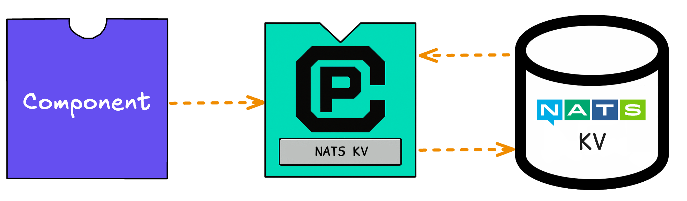

import Tabs from '@theme/Tabs';
import TabItem from '@theme/TabItem';

In our previous tutorials, we started a developer loop and added two [**interfaces**](/docs/concepts/interfaces.mdx) (`wasi:logging` and `wasi:keyvalue`) to our application. The `wash dev` process satisfied our application's capability requirements automatically, so we could move quickly and focus on code.

Now we'll learn how to:

- Explore capabilities available for wasmCloud applications
- Extend our application by plugging in capability requirements

:::info[Prerequisites]
This tutorial assumes you're following directly from the previous steps. Make sure to complete [**Quickstart**](/docs/tour/hello-world.mdx) and [**Add Features**](/docs/tour/add-features.mdx) first.
:::

## Choose a capability

As we learned in the previous tutorial, components can make use of **capabilities** for common requirements like key-value storage or logging.

If we want to learn about a capability, we can browse the [**Capability Catalog**](/docs/capabilities/index.mdx).

Each capability in the catalog consists of an [interface](/docs/concepts/interfaces.mdx) and one or more [capability providers](/docs/concepts/providers.mdx).

- **Interfaces** are the language-agnostic APIs we use to represent a capability in our code. They are defined using the WebAssembly Interface Type (WIT) interface description language in simple `.wit` files.
- **Capability providers** are reusable executable plugins that deliver functionality described by an interface. Where interfaces are typically very general (i.e. key-value storage), providers are tool- or vendor-specific implementations (i.e. Redis, Vault).

Here's the Capability Catalog listing for **Key-Value Storage**:

| NAME              | INTERFACE                                                       | PROVIDERS                                                                                                                                                                                                                                                      |
| ----------------- | --------------------------------------------------------------- | -------------------------------------------------------------------------------------------------------------------------------------------------------------------------------------------------------------------------------------------------------------- |
| Key-Value Storage | [`wasi:keyvalue`](https://github.com/WebAssembly/wasi-keyvalue) | [Redis](https://github.com/orgs/wasmCloud/packages/container/package/keyvalue-redis), [NATS](https://github.com/orgs/wasmCloud/packages/container/package/keyvalue-nats), [Vault](https://github.com/orgs/wasmCloud/packages/container/package/keyvalue-vault) |

Here we find the interface, `wasi:keyvalue`, and several capability providers including Redis.

:::info[What's WASI?]
WASI stands for [**WebAssembly System Interface (WASI)**](https://wasi.dev/), a group of standards-track APIs governed by the WASI Subgroup in the W3C WebAssembly Community Group. wasmCloud uses WASI interfaces to define capabilities in a standards-based way that avoids vendor lock-in.For more on interfaces and WASI, see the [Interfaces](/docs/developer/interfaces/creating-an-interface) page in our [Developer Guide](/docs/category/developer-guide).
:::

### Select a capability provider

Interfaces are backed by capability providers, which are both reusable and swappable.

When we ran `wash dev`, we added capabilities&mdash;but we never specified tools or libraries for key-value storage and logging. `wash dev` provisioned appropriate **capability providers** automatically. How? Because components encode their dependencies in the binaries themselves, `wash dev` was able to detect the requirement at runtime and start an appropriate providers to satisfy the requirements for an HTTP server, key-value store, and logger.

So what was actually running? In this case, `wash dev` used:

- [The wasmCloud `httpserver` provider](https://github.com/orgs/wasmCloud/packages/container/package/http-server)
- [The wasmCloud built-in logger](/docs/concepts/providers#built-in-providers)
- [The NATS `keyvalue` provider](https://github.com/wasmCloud/wasmCloud/pkgs/container/keyvalue-nats) (Convenient since NATS is already part of the wasmCloud stack)

As far as the key-value capability is concerned, the application looks like this:



Now we'll **swap out a different key-value storage provider**. We'll use the [Redis provider](https://github.com/wasmCloud/wasmCloud/tree/main/crates/provider-keyvalue-redis), which will only require us to have `redis-server` or Docker installed. The Redis provider will mediate a connection to the Redis server, which is running external to wasmCloud.

<Tabs groupId="env" queryString>
  <TabItem value="local" label="Local Redis Server" default>

[Install](https://redis.io/docs/getting-started/) and launch a local Redis server in the background:

```bash
redis-server &
```

  </TabItem>
  <TabItem value="docker" label="Docker">

Launch a Redis container in the background.

```bash
docker run -d --name redis -p 6379:6379 redis
```

  </TabItem>
</Tabs>

On the [wasmCloud GitHub Packages page](https://github.com/orgs/wasmCloud/packages?repo_name=wasmCloud), we can find a [`keyvalue-redis` image](https://github.com/wasmCloud/wasmCloud/pkgs/container/keyvalue-redis) (also linked in the Capability Catalog) that enables us to deploy the provider:

```text
ghcr.io/wasmcloud/keyvalue-redis:0.28.2
```

:::note[What are those images?]
The wasmCloud ecosystem uses the [OCI image specification](https://github.com/opencontainers/image-spec) to package components and providers&mdash;these component and provider images are not container images, but conform to OCI standards and may be stored on any OCI-compatible registry. You can learn more about wasmCloud packaging on the [**Packaging**](/docs/concepts/packaging.mdx) page.
:::

### Deploying the application with a key-value provider

We can still use `wash dev`&mdash;we'll just need to override the `wasi:keyvalue` capability dependency with the Redis provider. Open up the `wasmcloud.toml` configuration file and add the following lines to the end:

```toml
name = "http-hello-world"
version = "0.1.0"
language = "<your_language>"
type = "component"

[component]
wasm_target = "wasm32-wasip2"

[[dev.overrides.imports]] # [!code ++:4]
interface_spec = "wasi:keyvalue@0.2.0-draft"
image_ref = "ghcr.io/wasmcloud/keyvalue-redis:0.28.2"
config = { values = { url = "redis://127.0.0.1:6379" } }
```

Now the `wash dev` process will deploy the Redis provider (rather than the default NATS-KV provider) to satisfy your component's dependency on a `keyvalue` capability.


Save `wasmcloud.toml`. If `wash dev` is still running from the previous tutorial, make sure to stop it with CTRL+C and restart the developer loop. 

```shell
wash dev
```

Once the application is `Deployed`, we can `curl` the application like before:

```shell
curl 'localhost:8000?name=Bob'
```

```text
Hello x1, Bob!
```

```shell
curl 'localhost:8000?name=Bob'
```

```text
Hello x2, Bob!
```

```shell
curl 'localhost:8000?name=Alice'
```

```text
Hello x1, Alice!
```

Note that our increments are starting over again&mdash;after all, we swapped out the dev key-value store for a totally different one!

When you're done with development, you can stop `wash dev` with CTRL+C.

Stop your Redis server:

<Tabs groupId="env" queryString>
  <TabItem value="local" label="Local Redis Server" default>

Enter CTRL+C.

```shell
redis-cli shutdown
```

  </TabItem>
  <TabItem value="docker" label="Docker">

```shell
docker stop redis
```

  </TabItem>
</Tabs>

## Log files

If you encounter any problems, wasmCloud log files may contain useful error messages, and it's good to know how to find them. `wash dev` will create a unique log file for each session and will output the location of that log in the startup text:

```plaintext
...
🔧 Successfully started wasmCloud instance
✅ Successfully started host, logs writing to /Users/wasmcloud/.wash/dev/<session_id>/wasmcloud.log
...
```

## Next steps

In this tutorial, we learned how to explore capabilities, swap out a provider, and deploy an application to a wasmCloud environment.

- For more information on defining application manifests, see our documentation on the [wasmCloud application deployment manager](/docs/ecosystem/wadm/).
- For more information on capabilities, such as how to create new interfaces and providers, see the Developer Guide pages for [providers](/docs/developer/providers/) and [interfaces](/docs/developer/interfaces/creating-an-interface).

You can continue to build on this application by adding more features, or you can explore additional first-party providers in the [**Capability Catalog**](/docs/capabilities/index.mdx) to get an idea of what is possible with wasmCloud.

The next page demonstrates scaling via application manifest and gives a high-level overview of why this application that you've built already eliminates complexity and pain that developers often face when building applications for the cloud.
