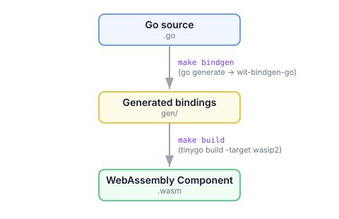

There are two ways to build WebAssembly components from Go source:

- **[TinyGo](https://tinygo.org/)**, an LLVM-based Go compiler for constrained environments that targets `wasip2` directly and emits a component with no adapter layer.
- **The standard Go compiler**, driven by the Bytecode Alliance's [`componentize-go`](https://github.com/bytecodealliance/componentize-go). Upstream Go has no `wasip2` target yet, so `componentize-go` compiles your program as a `wasip1` core module and wraps it into a WASI P2 component with an adapter.

Both produce standard components that run on wasmCloud. `wash` is toolchain-agnostic: `wash build` and `wash dev` run whatever `build.command` you put in [`.wash/config.yaml`](../../../config.mdx), so the choice comes down to the tradeoffs described below. The [wasmCloud Go SDK](https://github.com/wasmCloud/go), its examples, and the [Developer Guide](../../index.mdx?lang=tinygo) walkthrough use TinyGo today, so if you want the path with the most wasmCloud-specific material behind it, start there.

This guide explains how the two toolchains differ, helps you choose between them, and then covers setup and practical guidance for each.

## Two toolchains, mechanically

Nearly every difference between the two paths follows from *how* each turns Go into a component:

| | TinyGo | Standard Go + `componentize-go` |
|---|---|---|
| **Compiler** | TinyGo (LLVM), 0.33 or later | The stock `gc` toolchain, Go 1.25.5 or later |
| **Path to a component** | `tinygo build -target wasip2` emits a component directly | `go build` (`GOOS=wasip1`, reactor mode) → core module → `wasi_snapshot_preview1` adapter lifts it to a P2 component |
| **Bindings generator** | [`wit-bindgen-go`](https://github.com/bytecodealliance/go-modules) (`go.bytecodealliance.org/cmd/wit-bindgen-go`) | `componentize-go bindings` (a Go backend of [`wit-bindgen`](https://github.com/bytecodealliance/wit-bindgen)) |
| **Support library** | [`go.wasmcloud.dev/component`](https://github.com/wasmCloud/go/tree/main/component) (the wasmCloud Go SDK), built on [`go.bytecodealliance.org/cm`](https://pkg.go.dev/go.bytecodealliance.org/cm) | [`go.bytecodealliance.org/pkg`](https://github.com/bytecodealliance/go-pkg) (`go-pkg`) |
| **Extra tools on `PATH`** | `tinygo`, plus `wasm-tools` (TinyGo shells out to it for the component step) and `wasm-opt` (bundled with official TinyGo releases) | `componentize-go` (installable as a Go tool) |
| **WASI interface versions emitted** | `wasi:*@0.2.0` | Adapter and `go-pkg` bindings target `wasi:*@0.2.8`–`0.2.12` |
| **WASI 0.3 (async) support** | No | Yes, opt-in — see [WASI P3 with `componentize-go`](#wasi-p3-with-componentize-go) |

## Choosing a toolchain

### Tradeoffs

| | TinyGo | Standard Go + `componentize-go` |
|---|---|---|
| **Go language and standard library** | A large subset; gaps in `reflect` (which affects `encoding/json` and reflection-heavy libraries), `os/exec`, parts of `net`, `text/template`. Many third-party modules don't compile. | The complete standard library (minus threads and syscalls that don't exist in Wasm); most pure-Go modules just work. |
| **Runtime semantics** | TinyGo's own mark/sweep GC (precise on `wasip2` in current releases) and cooperative goroutine scheduler. | The real Go GC and scheduler (single-threaded under Wasm). |
| **Artifact size** | Smaller components with a minimal import surface. | Larger components: the full Go runtime plus one extra core module for the adapter. `net/http`-heavy components pay the most. |
| **Build speed** | Typically slower (LLVM). | Typically faster (the Go compiler). |
| **Host requirements** | Any WASI P2 host. | Any WASI P2 host that resolves `wasi:*@0.2.x` minor versions semver-compatibly; wasmCloud 2.5.0 and later ship a Wasmtime that implements the `wasi:*@0.2.12` interfaces the adapter imports. |
| **Where bugs hide** | In TinyGo's divergence from upstream Go. | In the preview1 adapter layer — for example, a class of trap where Go's GC ran inside `cabi_realloc` and tried to call a host import ([componentize-go#56](https://github.com/bytecodealliance/componentize-go/issues/56), fixed in July 2026). |
| **Maturity and community** | Large, long-established compiler project. | Pre-1.0 tooling with a small contributor base; when you hit a bug you may be the first. |
| **wasmCloud SDK, examples, docs** | This is what wasmCloud publishes for Go today. | Not yet: a rebuild of the wasmCloud Go SDK on `componentize-go` is [in progress](https://github.com/wasmCloud/go/pull/436). |
| **Ecosystem direction** | The Bytecode Alliance's [Component Model documentation](https://component-model.bytecodealliance.org/language-support/building-a-simple-component/tinygo.html) now notes that its TinyGo component tooling is no longer actively maintained. | The direction Go + Wasm is heading upstream: the Component Model docs [lead with `componentize-go`](https://component-model.bytecodealliance.org/language-support/building-a-simple-component/go.html), and once upstream Go gains a native `wasip2` target ([golang/go#65333](https://github.com/golang/go/issues/65333)) the adapter step disappears. |

### Which should I use?

**Choose TinyGo when:**

- You want to follow wasmCloud's documented Go path, with SDK, examples, and tutorials that match.
- Artifact size matters (edge deployments, constrained registries, cold-start-sensitive workloads).
- You're writing new code for a component from scratch and don't depend on reflection-heavy libraries.

**Choose the standard Go compiler with `componentize-go` when:**

- You're porting existing Go code, or you rely on `reflect`, `encoding/json`, ORMs, or third-party modules that don't compile under TinyGo.
- Fast iteration matters more than binary size.
- You want real Go runtime semantics (GC, scheduler, `time.Sleep`).
- You want WASI 0.3 async support, or you're betting on where Go + Wasm is going long-term and accept pre-1.0 tooling to get there.

:::tip[Recommendation]
Lead with TinyGo if you're getting started with Go on wasmCloud today: it's the path the wasmCloud Go SDK, examples, and tutorials support, and it has the mature compiler and the most wasmCloud-specific material behind it. Reach for `componentize-go` when your existing Go code won't compile under TinyGo or you need the full standard library, and set expectations that you're on young, fast-moving tooling.

Keep an eye on the direction of travel, though: TinyGo's bindings generator (`wit-bindgen-go`) hasn't had a release since May 2025, and the wasmCloud Go SDK is being rebuilt on `componentize-go`. If you're starting a new project and can tolerate pre-1.0 tooling, `componentize-go` is where the wasmCloud Go SDK is heading.
:::

## Building with TinyGo

### Build pipeline



Building a TinyGo component has two steps: generating Go bindings from WIT interfaces, then compiling to a Wasm component with TinyGo. We recommend using a `Makefile` to wrap these steps. When you run `wash build`, it executes the build command from your `.wash/config.yaml`, which calls the Makefile targets.

If you're looking for a quick walkthrough of creating, building, and running a TinyGo component, see the [Developer Guide](../../index.mdx?lang=tinygo).

### Toolchain

Install TinyGo following the [official installation guide](https://tinygo.org/getting-started/install/); the wasmCloud Go SDK requires 0.33 or later. The `wasip2` target also needs [`wasm-tools`](https://github.com/bytecodealliance/wasm-tools) on your `PATH`.

:::warning[Pin `wasm-tools`]
The wasmCloud Go SDK documents a `wasm-tools` window of **1.220.0–1.225.0**; 1.226.0 and later depend on unreleased changes to `wit-bindgen-go`. Install a pinned version rather than the latest:

```shell
cargo install --locked wasm-tools@1.225.0
```

Check the [SDK README](https://github.com/wasmCloud/go/tree/main/component) for the current window.
:::

Key compiler flags for Wasm components:

| Flag | Value | Description |
|---|---|---|
| `-target` | `wasip2` | Compile to a WASI P2 component |
| `-wit-package` | `./wit` | Path to the WIT package directory |
| `-wit-world` | `<world>` | Name of the WIT world to target |
| `-o` | `<name>.wasm` | Output file path |

Optional optimization flags:

| Flag | Value | Description |
|---|---|---|
| `-scheduler` | `asyncify` | Goroutine support via Binaryen's Asyncify (the default for `wasip2`) |
| `-gc` | `conservative` | Use the conservative mark/sweep collector instead of the `wasip2` default (`precise`) |
| `-opt` | `z` | Aggressive code size optimization |
| `-no-debug` | | Remove debug info (reduces binary size significantly) |

If you omit `-wit-package` and `-wit-world`, TinyGo falls back to its built-in default world (`wasi:cli/command`) and your component's own imports fail to resolve — see the [wash FAQ](../../../faq.mdx#common-issues-with-tinygo-builds).

### `wit-bindgen-go`

[`wit-bindgen-go`](https://github.com/bytecodealliance/go-modules) generates Go code from WIT interface definitions. It produces typed Go packages that map to your component's imports and exports.

`wit-bindgen-go` is invoked via a `//go:generate` directive at the top of your `main.go`:

```go
//go:generate go tool wit-bindgen-go generate --world wasmcloud:hello/hello --out gen ./wit
```

This reads the WIT files in `./wit`, generates Go packages for the `hello` world in the `wasmcloud:hello` package, and writes them to the `gen/` directory. The `--world` flag uses the fully-qualified world name in the format `<package>/<world>`. The generated packages depend on the [`cm`](https://pkg.go.dev/go.bytecodealliance.org/cm) package for Component Model types like `option`, `result`, `list`, and `resource`.

Declare `wit-bindgen-go` as a tool dependency in your `go.mod` using the Go 1.24+ `tool` directive:

```go title="go.mod"
tool go.bytecodealliance.org/cmd/wit-bindgen-go
```

Then run `go mod tidy` to resolve the dependency.

### Handling HTTP requests

The [`go.wasmcloud.dev/component`](https://github.com/wasmCloud/go) package provides idiomatic Go adapters for WASI interfaces. The `wasihttp` package bridges Go's standard `net/http` library with WASI HTTP, so you can write familiar Go HTTP handlers.

#### Basic HTTP server

```go
//go:generate go tool wit-bindgen-go generate --world wasmcloud:hello/hello --out gen ./wit

package main

import (
	"fmt"
	"net/http"

	"go.wasmcloud.dev/component/net/wasihttp"
)

func init() {
	wasihttp.HandleFunc(handleRequest)
}

func handleRequest(w http.ResponseWriter, r *http.Request) {
	fmt.Fprintf(w, "Hello from Go!\n")
}

func main() {}
```

Key points:

- **`wasihttp.HandleFunc`** accepts a standard `http.HandlerFunc` and registers it as the WASI HTTP incoming handler. All conversion between WASI HTTP types and Go's `net/http` types happens behind the scenes.
- **Handlers are registered in `init()`**, not `main()`. The component doesn't run like a CLI — it responds to incoming HTTP requests.
- **`main()` is empty.** This is required but does nothing for component-based programs.
- You can use Go's standard `http.ResponseWriter` and `*http.Request` types exactly as you would in a normal Go HTTP server.

#### Routing

`wasihttp.Handle` accepts any `http.Handler`, so Go's standard `http.ServeMux`, third-party routers, and middleware chains all work.

With Go's standard library:

```go
func init() {
	mux := http.NewServeMux()
	mux.HandleFunc("/", handleHome)
	mux.HandleFunc("/api/data", handleData)
	wasihttp.Handle(mux)
}
```

With [`httprouter`](https://github.com/julienschmidt/httprouter):

```go
import "github.com/julienschmidt/httprouter"

func init() {
	router := httprouter.New()
	router.HandlerFunc(http.MethodGet, "/", indexHandler)
	router.HandlerFunc(http.MethodGet, "/headers", headersHandler)
	router.HandlerFunc(http.MethodPost, "/post", postHandler)
	wasihttp.Handle(router)
}
```

#### Outgoing HTTP requests

The `wasihttp` package provides a `Transport` that implements `http.RoundTripper`, enabling outgoing HTTP requests via WASI:

```go
import (
	"io"
	"net/http"

	"go.wasmcloud.dev/component/net/wasihttp"
)

func handleRequest(w http.ResponseWriter, r *http.Request) {
	client := http.Client{Transport: &wasihttp.Transport{}}
	resp, err := client.Get("https://api.example.com/data")
	if err != nil {
		http.Error(w, err.Error(), http.StatusInternalServerError)
		return
	}
	defer resp.Body.Close()
	io.Copy(w, resp.Body)
}
```

To make outgoing requests, your WIT world must import `wasi:http/outgoing-handler` (already included by `wasmcloud:component-go/imports`).

#### Logging

The `wasilog` package provides structured logging backed by WASI interfaces:

```go
import "go.wasmcloud.dev/component/log/wasilog"

func handleRequest(w http.ResponseWriter, r *http.Request) {
	logger := wasilog.ContextLogger("handler")
	logger.Info("request received", "path", r.URL.Path, "method", r.Method)
	fmt.Fprintf(w, "Hello from Go!\n")
}
```

### Adding custom WASI interfaces

The `wasmcloud:component-go/imports` include pulls in standard imports for the wasmCloud Go component library (logging, config, etc.). For additional interfaces like `wasi:keyvalue`, `wasi:config`, or custom interfaces, add them to your WIT world and regenerate bindings.

**1. Declare the imports in your WIT world:**

```wit title="wit/world.wit"
package wasmcloud:hello;

world hello {
    include wasmcloud:component-go/imports@0.1.0;
    import wasi:keyvalue/store@0.2.0-draft;
    import wasi:keyvalue/atomics@0.2.0-draft;
    export wasi:http/incoming-handler@0.2.0;
}
```

**2. Fetch dependencies and regenerate bindings:**

```shell
wash wit fetch
go generate ./...
```

This downloads the WIT definitions for `wasi:keyvalue` into `wit/deps/` and generates Go packages in `gen/`.

**3. Use the generated bindings:**

```go
import (
	"fmt"
	"net/http"

	"go.wasmcloud.dev/component/net/wasihttp"
	"<your-module>/gen/wasi/keyvalue/store"
	"<your-module>/gen/wasi/keyvalue/atomics"
)

func handleRequest(w http.ResponseWriter, r *http.Request) {
	bucket := store.Open("")
	if bucket.IsErr() {
		http.Error(w, bucket.Err().String(), http.StatusInternalServerError)
		return
	}
	count := atomics.Increment(*bucket.OK(), "visitor-count", 1)
	if count.IsErr() {
		http.Error(w, count.Err().String(), http.StatusInternalServerError)
		return
	}
	fmt.Fprintf(w, "Visit count: %d\n", *count.OK())
}
```

Generated bindings follow Go naming conventions — WIT function names are converted to PascalCase, and WIT `result` values become `cm.Result` with `IsErr()`, `OK()`, and `Err()` accessors. The generated packages are in `gen/` under the WIT namespace path (e.g., `gen/wasi/keyvalue/store`).

Replace `<your-module>` with your Go module path from `go.mod`.

### Project structure

A typical TinyGo component project:

```
my-component/
├── main.go              # Application code
├── Makefile             # Build recipes (bindgen, build)
├── go.mod               # Go module definition
├── go.sum               # Go dependency checksums
├── gen/                 # Generated bindings (gitignored)
├── wit/
│   ├── world.wit        # WIT world definition
│   └── deps/            # Fetched WIT dependencies (gitignored)
├── wkg.lock             # WIT dependency lock file
└── .wash/
    └── config.yaml      # wash project configuration
```

#### `Makefile`

A `Makefile` wraps the two-step build process (bindings generation + TinyGo compilation) so that `wash build` and `wash dev` can invoke them with simple commands:

```makefile title="Makefile"
all: build

.PHONY: build
build:
	tinygo build -target wasip2 -wit-package ./wit -wit-world hello -o my-component.wasm ./

.PHONY: bindgen
bindgen:
	go generate ./...
```

The `build` target invokes TinyGo with:
- `-target wasip2` — compile to a WASI P2 component
- `-wit-package ./wit` — path to the WIT package directory
- `-wit-world hello` — name of the WIT world to target
- `-o my-component.wasm` — output file path

The `bindgen` target runs `go generate`, which invokes `wit-bindgen-go` via the directive in `main.go`.

#### `go.mod`

```go title="go.mod"
module github.com/myorg/my-component

go 1.24

require (
	go.bytecodealliance.org/cm v0.3.0
	go.wasmcloud.dev/component v0.0.10
)

tool go.bytecodealliance.org/cmd/wit-bindgen-go
```

The `tool` directive (Go 1.24+) declares `wit-bindgen-go` as a build tool dependency. This replaces the older `tools.go` file pattern.

The SDK and `cm` versions move together: `go.wasmcloud.dev/component` v0.0.10 pairs with `cm` v0.3.0, while older SDK releases (v0.0.9 and earlier) pair with `cm` v0.1.0. Bump them as a pair rather than running `go get -u` across the board.

You should add both `gen/` and `wit/deps/` to your `.gitignore` — these are generated or fetched during the build and should not be committed.

#### WIT world

```wit title="wit/world.wit"
package wasmcloud:hello;

world hello {
    include wasmcloud:component-go/imports@0.1.0;
    export wasi:http/incoming-handler@0.2.0;
}
```

The `include wasmcloud:component-go/imports` line pulls in standard imports used by the wasmCloud Go component library (logging, config, etc.). You can also declare imports individually if you prefer.

:::info[WASI HTTP version]
The `wasi:http/incoming-handler` version in your WIT world (here `@0.2.0`) must match the version supported by your TinyGo and `wit-bindgen-go` toolchain. If you see build errors about missing exports, check that the version in your `world.wit` aligns with your installed toolchain versions.
:::

#### `.wash/config.yaml`

The [project configuration file](../../../config.mdx) at `.wash/config.yaml` tells `wash` how to build the component:

```yaml title=".wash/config.yaml"
build:
  command: make bindgen build
```

The `build.command` is a shell command that `wash build` executes. Here it runs the Makefile's `bindgen` and `build` targets in sequence — first generating Go bindings from WIT, then compiling with TinyGo.

You can also specify a separate command for `wash dev` that skips binding generation for faster iteration:

```yaml title=".wash/config.yaml"
dev:
  command: make build

build:
  command: make bindgen build
```

With this configuration, `wash dev` runs only `make build` (recompiling Go code), while `wash build` runs `make bindgen build` (regenerating bindings and recompiling). This speeds up the development loop when you're only changing Go code, not WIT interfaces.

### Standard library compatibility

TinyGo supports most of the Go standard library, but some packages have limitations in the `wasip2` target.

#### What works

- **`fmt`** — formatted I/O (adds ~100 KB to binary size)
- **`io`** — I/O primitives
- **`strings`**, **`bytes`** — string and byte manipulation
- **`strconv`** — string conversions
- **`encoding/json`** — JSON encoding/decoding (may have edge-case panics — test thoroughly)
- **`encoding/base64`** — base64 encoding
- **`math`** — mathematical functions
- **`sort`** — sorting
- **`sync`** — synchronization primitives
- **`time`** — time operations
- **`net/http`** — via `wasihttp` adapter (not directly — see below)

#### What does not work

- **`net/http` directly** — Go's standard HTTP server/client does not work in `wasip2`. Use `wasihttp.HandleFunc` for incoming requests and `wasihttp.Transport` for outgoing requests.
- **`os`** — limited; filesystem and process operations are not available unless WASI filesystem is configured
- **`net`** — raw networking is not available; use WASI HTTP interfaces
- **Packages requiring cgo** — TinyGo does not support cgo in the `wasip2` target
- **`plugin`**, **`net/smtp`**, **`debug/buildinfo`** — cannot be imported
- **`reflect`** — partial support; libraries that lean on reflection (ORMs, some serialization and validation libraries) may fail to compile or misbehave at runtime

#### Practical guidance

- Use the `wasihttp` package instead of `net/http` directly — it provides `http.Handler` and `http.RoundTripper` implementations backed by WASI
- Prefer pure Go libraries; anything requiring cgo will not compile
- Test your dependencies against the `wasip2` target early — some packages compile but have runtime issues
- Be mindful of binary size: packages like `fmt` add meaningful overhead to Wasm components
- If a dependency you can't replace won't compile under TinyGo, that's the clearest signal to [switch to `componentize-go`](#building-with-componentize-go)

## Building with `componentize-go`

[`componentize-go`](https://github.com/bytecodealliance/componentize-go) is a Bytecode Alliance tool that builds components with the standard Go compiler. It requires **Go 1.25.5 or later**. Under the hood, `componentize-go build` runs `go build` for `GOOS=wasip1 GOARCH=wasm` in reactor mode (`-buildmode=c-shared`, so `//go:wasmexport` functions stay callable after `init()` with an empty `main()`), embeds your WIT world in the resulting core module, and wraps it into a WASI P2 component with the `wasi_snapshot_preview1` adapter.

### Toolchain

Add `componentize-go` to your module as a Go tool. This is all that needs installing beyond Go itself:

```shell
go get -tool github.com/bytecodealliance/componentize-go
go tool componentize-go --help
```

(You can also `go install github.com/bytecodealliance/componentize-go@latest` or download a release binary. The Go module is a thin wrapper that fetches and runs a prebuilt binary for your platform.)

The CLI takes WIT options *before* the subcommand:

| Flag / subcommand | Description |
|---|---|
| `-d, --wit-path <PATH>` | Directory, `.wit` file, or WIT package to load (repeatable) |
| `-w, --world <NAME>` | Fully-qualified world to target (repeatable; multiple worlds are merged) |
| `bindings -o <dir> --pkg-name <import-path> [--format]` | Generate Go bindings for the selected worlds into `<dir>` (see [Adding custom WASI interfaces](#adding-custom-wasi-interfaces-1) for why `--pkg-name` matters) |
| `build [-o <file>]` | Build the component (default output `main.wasm`) |
| `test --pkg <dir>` | Compile Go tests to Wasm for running under a runtime like `wasmtime` |

If you pass no `-w`/`-d` flags, `componentize-go` discovers a `componentize-go.toml` file at the root of your module or any of its dependencies and uses the worlds and WIT paths declared there. Passing `-w` explicitly overrides discovery entirely, so if you go that route you must list every world the component needs.

### Handling HTTP requests with `go-pkg`

[`go.bytecodealliance.org/pkg`](https://github.com/bytecodealliance/go-pkg) (`go-pkg`) is the support library for `componentize-go`. It ships committed bindings and WIT worlds for HTTP components plus adapters from standard-library interfaces to `wasi:*` interfaces:

| Package | Description |
|---|---|
| `wasihttp` | `net/http` adapter for `wasi:http`: serve incoming requests with any `http.Handler`, send outbound requests through an `http.RoundTripper` |
| `wasilog` | `slog.Handler` over `wasi:logging` |
| `wasiconfig` | Helpers over `wasi:config/store` |
| `wit/types`, `wit/runtime` | Core WIT value types (`Option`, `Result`, `Tuple`, ...) and the canonical-ABI runtime used by generated bindings |

Because `go-pkg` ships its own `componentize-go.toml` declaring the `bytecodealliance:pkg/wasip2` world — which exports `wasi:http/incoming-handler@0.2.8` and imports `wasi:cli`, `wasi:config/store`, `wasi:logging`, and `wasi:http/outgoing-handler` — a basic HTTP component needs no WIT files or bindings step of its own:

```go title="main.go"
package main

import (
	"fmt"
	"net/http"

	"go.bytecodealliance.org/pkg/wasihttp"
)

func init() {
	wasihttp.HandleFunc(func(w http.ResponseWriter, r *http.Request) {
		fmt.Fprintf(w, "Hello from Go!\n")
	})
}

func main() {}
```

```shell
go get go.bytecodealliance.org/pkg@main
go get -tool github.com/bytecodealliance/componentize-go
go tool componentize-go build -o my-component.wasm
```

The shape is the same as the TinyGo SDK — register a handler in `init()`, leave `main()` empty — and `wasihttp.Handle` accepts any `http.Handler`, so `http.ServeMux` and third-party routers work as before. `wasihttp.Transport` is the `http.RoundTripper` for outbound requests.

:::warning[`go-pkg` adapters are on `main`, not yet in a tagged release]
As of August 2026 the `wasihttp`, `wasilog`, and `wasiconfig` packages exist on the `go-pkg` `main` branch but not in the latest tagged release (v0.2.3), which contains only the `wit/*` core types. `go get go.bytecodealliance.org/pkg@main` pins a pseudo-version that includes them; check the [releases page](https://github.com/bytecodealliance/go-pkg/releases) for a tagged version once one lands.
:::

:::info[Declare the world's imports on Kubernetes]
The `go-pkg` world declares `wasi:config/store` and `wasi:logging` imports, but the built component only imports them if your code uses `wasiconfig` or `wasilog` (unused world imports are pruned at build time). If it does, `wash dev` wires them up automatically, while a `WorkloadDeployment` on Kubernetes must declare each under `hostInterfaces` or the component fails to link — see [Troubleshooting](../../../../troubleshooting.mdx#missing-host-interface-implementation-in-the-linker). Run `wash inspect <component.wasm>` to see exactly what your component imports.
:::

### Adding custom WASI interfaces

To import interfaces beyond what `go-pkg`'s world provides — `wasi:keyvalue`, `wasmcloud:messaging`, or your own — define a WIT world for them, generate bindings, and pass both worlds at build time:

**1. Declare a world with the additional imports:**

```wit title="wit/world.wit"
package myorg:hello;

world hello {
    import wasi:keyvalue/store@0.2.0-draft;
    import wasi:keyvalue/atomics@0.2.0-draft;
}
```

**2. Fetch WIT dependencies and generate bindings:**

```shell
wash wit fetch
go tool componentize-go -d ./wit -w myorg:hello/hello bindings -o gen --pkg-name github.com/myorg/my-component/gen --format
go mod tidy
```

`--pkg-name` is the *import path* of the output directory: your module path plus `gen`. Don't omit it — without `--pkg-name`, `componentize-go bindings` generates a self-contained `wit_component` module, complete with its own `go.mod` and a `package main`, intended for a project that has no `go.mod` yet, and it will overwrite yours. The command prints a reminder to `require go.bytecodealliance.org/pkg` at a particular version; ignore it if you already require a newer one.

Generated packages are flat, snake_cased directories under `gen/` (for example `gen/wasi_keyvalue_store`), and they depend on `go-pkg`'s `wit/types` and `wit/runtime`. WIT `result` values come back as `witTypes.Result` with `IsOk()`, `Ok()`, and `Err()` accessors. Generated code uses `unsafe.Pointer` in ways the default `go vet` analyzers flag; if you run `go vet` in CI, use `go vet -unsafeptr=false -composites=false ./...`.

**3. Build with both worlds** — the `go-pkg` HTTP world plus your own — since an explicit `-w` disables `componentize-go.toml` discovery:

```shell
go tool componentize-go -d ./wit -w bytecodealliance:pkg/wasip2 -w myorg:hello/hello build -o my-component.wasm
```

Custom **exports** (a non-HTTP interface your component implements, such as `wasmcloud:messaging/handler`) take a little more structure than imports: the generated `//go:wasmexport` glue expects a hand-written `Exports` variable with a slot for each exported function that you assign in `init()`, plus a blank import of the generated `wit_exports` package. The [`componentize-go` SDK example](https://github.com/bytecodealliance/componentize-go/tree/main/examples/sdk) walks through the pattern.

### Project structure

A minimal `componentize-go` project that uses `go-pkg`'s HTTP world:

```
my-component/
├── main.go              # Application code
├── go.mod               # Go module definition (tool directive for componentize-go)
├── go.sum               # Go dependency checksums
└── .wash/
    └── config.yaml      # wash project configuration
```

Add `wit/`, `wkg.lock`, and a generated-bindings directory when you declare your own world. Unlike the TinyGo flow there's no `//go:generate` directive or `Makefile` requirement, though a `Makefile` is still a convenient place to wrap the `bindings` and `build` steps.

#### `go.mod`

```go title="go.mod"
module github.com/myorg/my-component

go 1.25

require go.bytecodealliance.org/pkg v0.2.4-0.20260806154504-91f6c4863e67

tool github.com/bytecodealliance/componentize-go
```

(`go mod tidy` also adds a few `// indirect` requirements for the tool's own dependencies; the snippet is abbreviated.)

#### `.wash/config.yaml`

```yaml title=".wash/config.yaml"
build:
  command: go tool componentize-go build -o build/my-component.wasm
  component_path: build/my-component.wasm
```

`wash build` and `wash dev` run this command exactly as they would a `cargo` or `tinygo` invocation. If your build has a separate bindings step, wrap both in a `Makefile` (or `&&`-chain them) as the TinyGo section shows.

### Standard library and runtime

This is the standard Go toolchain, so the standard library is complete except for things Wasm can't do: no OS threads, no `os/exec`, no raw `net` sockets outside what WASI provides. `reflect`, `encoding/json`, `text/template`, and reflection-heavy third-party modules work as they do natively. Two things worth knowing:

- **Direct `net/http` still doesn't work.** Go's own HTTP server and client expect real sockets; use `wasihttp` for both incoming and outgoing HTTP.
- **The adapter is a real layer.** Bugs specific to `componentize-go` tend to surface there — the [componentize-go issue tracker](https://github.com/bytecodealliance/componentize-go/issues) is the place to look when a component traps in ways that don't reproduce natively.

### WASI P3 with `componentize-go`

`componentize-go` can also build **WASI 0.3** (async) components: `go-pkg` ships a `bytecodealliance:pkg/wasip3` world exporting `wasi:http/handler@0.3.0` with streaming bodies, and the same `wasihttp` API compiles against it under the `componentizego_async` build tag, which `componentize-go` sets automatically when the selected world is async:

```shell
go tool componentize-go -w bytecodealliance:pkg/wasip3 build
```

Async worlds currently need a patched Go toolchain (`componentize-go` downloads one automatically when the stock `go` lacks it, pending an [upstream change](https://github.com/golang/go/pull/76775)). See [WASI 0.3 in the Runtime section](../../../../runtime/index.mdx#wasi-03) for what the host accepts.

## Working with `wash`

Everything below applies to both toolchains.

### WIT dependency management

`wash` bundles the [`wkg`](https://github.com/bytecodealliance/wasm-pkg-tools) WebAssembly package manager, so you can fetch WIT dependencies directly:

```shell
wash wit fetch
```

This populates `wit/deps/` with downloaded interface definitions and creates a `wkg.lock` file. You should:

- Add `wit/deps/` to `.gitignore` — these are fetched dependencies
- Commit `wkg.lock` — this ensures reproducible builds

When you run `wash build`, it calls `wash wit fetch` automatically, so you typically don't need to run it manually.

For a detailed explanation of `wkg` and auto-resolved namespaces, see the [Rust Language Guide's WIT dependency management section](../rust/index.mdx#wit-dependency-management-with-wkg).

### Development loop

Start a development loop that builds your component and runs it in a local wasmCloud environment:

```shell
wash dev
```

`wash dev` compiles the component using the build command from `.wash/config.yaml` (or `dev.command` if set), deploys it to a local host, and serves it. In order to watch for source changes, you can wrap the command with an external watcher like [`watchexec`](https://github.com/watchexec/watchexec):

```shell
watchexec -c -r 'wash dev'
```

The [quickstart](../../../../quickstart/index.mdx) shows the full watched-loop pattern.

### Build a component

Compile your project to a `.wasm` binary:

```shell
wash build
```

`wash build` executes the `build.command` from your `.wash/config.yaml` — `make bindgen build` in the TinyGo layout, or `go tool componentize-go build ...` in the `componentize-go` layout — and reports the compiled component at `component_path` (or the `-o` output).

## Further reading

- [Developer Guide](../../index.mdx?lang=tinygo) — quickstart tutorial for creating, building, and running a TinyGo component
- [wasmCloud Go component library](https://github.com/wasmCloud/go) — `wasihttp`, `wasilog`, and other Go adapters for WASI interfaces (TinyGo)
- [`componentize-go`](https://github.com/bytecodealliance/componentize-go) and [`go-pkg`](https://github.com/bytecodealliance/go-pkg) — building components with the standard Go compiler
- [TinyGo documentation](https://tinygo.org/docs/) — compiler reference and standard library support
- [TinyGo package support](https://tinygo.org/docs/reference/lang-support/stdlib/) — standard library compatibility matrix
- [`wit-bindgen-go`](https://github.com/bytecodealliance/go-modules) — Bytecode Alliance Go modules for WIT bindings (TinyGo)
- [Component Model: Go tooling](https://component-model.bytecodealliance.org/language-support/building-a-simple-component/go.html) and [TinyGo tooling](https://component-model.bytecodealliance.org/language-support/building-a-simple-component/tinygo.html) — Bytecode Alliance documentation for both toolchains
- [Language Support overview](../index.mdx) — summary of all supported languages and toolchains
