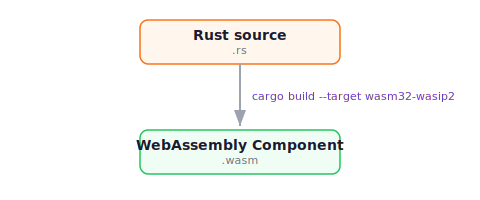

Rust has first-class support for building WebAssembly components. The `wasm32-wasip2` compiler target ships with the standard Rust toolchain, and the [`wstd`](https://crates.io/crates/wstd) crate provides an async standard library purpose-built for WASI 0.2 components.

This guide covers the toolchain, the `wstd` library, adding custom WASI interfaces, and practical guidance for building Rust components on wasmCloud.

If you're looking for a quick walkthrough of creating, building, and running a Rust component, see the [Developer Guide](../../index.mdx?lang=rust).

## Toolchain overview

### Build pipeline



Unlike TypeScript or Go, Rust compiles directly to a Wasm component in a single step. No post-processing, bundling, or external tools are required.

### `wasm32-wasip2` target

The `wasm32-wasip2` target has been a [Tier 2 target](https://doc.rust-lang.org/nightly/rustc/platform-support/wasm32-wasip2.html) since Rust 1.82. It compiles Rust code to a WebAssembly component targeting WASI 0.2 (Preview 2), which includes the Component Model.

Install the target:

```shell
rustup target add wasm32-wasip2
```

Build a component:

```shell
cargo build --target wasm32-wasip2 --release
```

The compiled component is written to `target/wasm32-wasip2/release/<crate_name>.wasm`.

### `wstd`

[`wstd`](https://github.com/bytecodealliance/wstd) is a minimal async Rust standard library for Wasm components, maintained by the Bytecode Alliance. It provides high-level APIs for HTTP, networking, I/O, timers, and randomness — all backed by WASI 0.2 interfaces.

`wstd` handles WASI bindings internally through its dependency on the [`wasip2`](https://crates.io/crates/wasip2) crate. For standard HTTP components, `wstd` is the only dependency you need.

:::note[`wstd` is a transitional library]
`wstd` exists because mainstream async runtimes like `tokio` and `async-std` do not yet provide a complete WASI 0.2 story for HTTP-export components. As of `tokio` 1.51, `tokio` supports `wasm32-wasip2` for raw socket networking via `wasi:sockets`, but it does not yet drive the `wasi:http/incoming-handler` export that wasmCloud HTTP components rely on. Once mainstream runtimes cover that path, the `wstd` project recommends migrating to them. The API is designed to make that migration straightforward.
:::

Available modules:

| Module | Description |
|---|---|
| `wstd::http` | HTTP request/response types, `#[http_server]` macro |
| `wstd::io` | Async I/O abstractions |
| `wstd::net` | Async networking (`TcpListener`, `TcpStream`) |
| `wstd::time` | Async timers and durations |
| `wstd::rand` | Random number generation (backed by `wasi:random`) |
| `wstd::task` | Async task types |
| `wstd::runtime` | Async event loop (`block_on()` executor) |

### `wit-bindgen`

[`wit-bindgen`](https://github.com/bytecodealliance/wit-bindgen) is a lower-level tool that generates Rust code from WIT interface definitions. You don't need `wit-bindgen` for standard HTTP components — `wstd` handles those bindings internally. However, `wit-bindgen` is essential when you need to use WASI interfaces that aren't included in `wstd`, such as `wasi:keyvalue` or `wasi:config`.

See [Adding custom WASI interfaces](#adding-custom-wasi-interfaces) for details on using `wstd` and `wit-bindgen` together.

## Async runtime: when to use `wstd` vs `tokio`

Both `wstd` and `tokio` 1.51+ compile against `wasm32-wasip2`. Choosing between them comes down to what your component exports, since the two runtimes solve different parts of the problem.

| Use case | Runtime |
|---|---|
| Component exports `wasi:http/incoming-handler` (HTTP service) | `wstd` (or [`wstd-axum`](https://docs.rs/wstd-axum) for routing) |
| Component is a long-running TCP server or client over `wasi:sockets` | `tokio` 1.51+ with `RUSTFLAGS="--cfg tokio_unstable"` |
| Component uses tokio sync primitives (`Mutex`, `mpsc`, `oneshot`) as in-process utilities | `wstd` for the runtime, with `tokio = { version = "1.51", features = ["sync"] }` as a passive dependency |

### Why HTTP components stay on `wstd`

Tokio's wasip2 work covers `wasi:sockets` networking. It does not provide a bridge to `wasi:http/incoming-handler`. The `wstd-axum` crate, which adapts an `axum::Router` onto the wasi-http export, explicitly disables `tokio` and `hyper` integrations: a Wasm component receives HTTP through host-imported interfaces, not raw sockets, so the standard tokio-and-hyper path doesn't apply.

Pulling tokio's runtime into an HTTP-export component also expands the WASI capability surface the component demands. The diff below shows the imports of two functionally equivalent components that build cleanly. The first uses `wstd` only; the second initializes a `tokio` current-thread runtime inside an `incoming-handler` implementation.

A `wstd`-only component declares only the imports it needs:

```text
import wasi:io/poll@0.2.9
import wasi:io/streams@0.2.9
import wasi:io/error@0.2.9
import wasi:http/types@0.2.9
import wasi:cli/{stderr, environment, exit}@0.2.9
import wasi:clocks/monotonic-clock@0.2.9
import wasi:random/insecure-seed@0.2.9
export wasi:http/incoming-handler@0.2.9
```

A component that initializes a `tokio` runtime inside its `incoming-handler` ends up importing a much broader surface, including sockets and filesystem interfaces it never uses:

```text
import wasi:http/types@0.2.4
import wasi:io/{poll, streams, error}@0.2.6
import wasi:sockets/{network, tcp}@0.2.6
import wasi:filesystem/{types, preopens}@0.2.6
import wasi:cli/{environment, exit, stdin, stdout, stderr}@0.2.6
import wasi:clocks/{monotonic-clock, wall-clock}@0.2.6
import wasi:random/insecure-seed@0.2.6
export wasi:http/incoming-handler@0.2.2
```

The second component imports `wasi:sockets/*` and `wasi:filesystem/*` it never uses, and the version skew between `wasi:http/types@0.2.4` and the `0.2.6` cluster makes it fragile to link against most hosts. Stick to `wstd` (or `wstd-axum`) for any component that exports HTTP.

### When tokio is the right answer

If your component opens raw TCP listeners or connects out over TCP, tokio's wasip2 path is the supported runtime. The wasmCloud [`service-tcp`](https://github.com/wasmCloud/wasmCloud/tree/main/templates/service-tcp) template is the canonical example. Cargo features that work on `wasm32-wasip2`:

- `sync`, `macros`, `rt`, `time`, `io-util`, `net`

Cargo features that do not work on `wasm32-wasip2` today:

- `fs` (no `tokio::fs`)
- DNS lookups (`tokio::net::lookup_host`)
- Multi-threading (`rt-multi-thread`)
- Signal handling

Use `#[tokio::main(flavor = "current_thread")]`. wasip2 is single-threaded.

### Tokio sync primitives inside a `wstd` component

If a library you depend on wants `tokio::sync::Mutex` or you want `mpsc` for in-component fan-out, you can pull tokio in as a passive utility crate without contaminating the WASI import surface. In `Cargo.toml`:

```toml
[dependencies]
wstd = "0.6"
tokio = { version = "1.51", features = ["sync"] }
```

Verified component imports match a `wstd`-only build, byte for byte. Avoid widening to `features = ["full"]` or enabling `rt`/`net`/`fs` in this configuration: that pulls mio into the dep tree and the surface expands as in the second example above.

## Handling HTTP requests

The `#[wstd::http_server]` macro is the standard way to build an HTTP component in Rust. It wires an async function to the `wasi:http/incoming-handler` export:

```rust
use wstd::http::{Body, Request, Response, StatusCode};

#[wstd::http_server]
async fn main(req: Request<Body>) -> Result<Response<Body>, wstd::http::Error> {
    match req.uri().path() {
        "/" => home().await,
        _ => not_found().await,
    }
}

async fn home() -> Result<Response<Body>, wstd::http::Error> {
    Ok(Response::new(Body::from("Hello from wasmCloud!\n")))
}

async fn not_found() -> Result<Response<Body>, wstd::http::Error> {
    Ok(Response::builder()
        .status(StatusCode::NOT_FOUND)
        .body(Body::from("Not found\n"))?)
}
```

Key points:

- The function must be `async` and accept a `Request<Body>`, returning `Result<Response<Body>, wstd::http::Error>`.
- Route matching is manual (pattern match on `req.uri().path()`). For complex routing, you can use helper functions or a lightweight router crate.
- `Response::new()` creates a 200 OK response. Use `Response::builder()` for custom status codes or headers.
- Handler functions can be `async`, enabling outgoing HTTP calls, key-value operations, or other async work within a request.

### Routing with `wstd-axum`

For anything more involved than a single handler, [`wstd-axum`](https://docs.rs/wstd-axum) lets you write the component using the [`axum`](https://docs.rs/axum) framework. `wstd-axum` adapts an `axum::Router` onto `wasi:http/incoming-handler`:

```rust
use axum::{Router, routing::get};

#[wstd_axum::http_server]
fn main() -> Router {
    Router::new()
        .route("/", get(|| async { "Hello from wasmCloud!\n" }))
        .route("/api/greet/{name}", get(|axum::extract::Path(name): axum::extract::Path<String>|
            async move { format!("Hello, {name}!\n") }))
}
```

`Cargo.toml` must opt out of axum's default features and only enable feature flags that don't require `tokio` or `hyper`:

```toml
[dependencies]
axum = { version = "0.8", default-features = false, features = ["json", "query", "matched-path"] }
wstd = "0.6"
wstd-axum = "0.6"
```

The wasmCloud [`http-handler`](https://github.com/wasmCloud/wasmCloud/tree/main/templates/http-handler) template demonstrates this pattern end to end.

### Outgoing HTTP requests

Components can make outgoing HTTP requests using `wstd::http::Client`:

```rust
use wstd::http::{Body, Client, Request, Response};

#[wstd::http_server]
async fn main(req: Request<Body>) -> Result<Response<Body>, wstd::http::Error> {
    let client = Client::new();
    let upstream_resp = client.send(
        Request::get("https://api.example.com/data").body(Body::empty())?
    ).await?;

    Ok(Response::new(upstream_resp.into_body()))
}
```

To make outgoing HTTP requests, your WIT world must import `wasi:http/outgoing-handler`:

```wit
world hello {
    import wasi:http/outgoing-handler@0.2.2;
    export wasi:http/incoming-handler@0.2.2;
}
```

## Adding custom WASI interfaces

`wstd` (through its `wasip2` dependency) provides bindings for standard WASI interfaces: `wasi:http`, `wasi:io`, `wasi:clocks`, `wasi:random`, and others. For draft or experimental interfaces like `wasi:keyvalue`, `wasi:config`, or custom interfaces, you need `wit-bindgen` to generate bindings for the additional interfaces.

### How `wstd` and `wit-bindgen` coexist

- **`wstd`** handles the HTTP export via the `#[wstd::http_server]` macro
- **`wasip2`** (bundled with `wstd`) provides bindings for standard WASI imports
- **`wit-bindgen`** generates bindings for your custom imports only

Many draft interfaces like `wasi:keyvalue` are self-contained — they don't share types with `wasi:io` or other standard interfaces. This means there are no type conflicts between what `wasip2` provides and what `wit-bindgen` generates.

### Example: Adding `wasi:keyvalue`

**1. Add `wit-bindgen` to `Cargo.toml`:**

```toml
[package]
name = "my-component"
edition = "2024"
version = "0.1.0"

[lib]
crate-type = ["cdylib"]

[dependencies]
wstd = "0.6"
wit-bindgen = "0.46.0"
```

**2. Declare the imports in `wit/world.wit`:**

```wit
package myorg:mycomponent;

world my-world {
    import wasi:keyvalue/store@0.2.0-draft;
    import wasi:keyvalue/atomics@0.2.0-draft;
    export wasi:http/incoming-handler@0.2.2;
}
```

**3. Fetch the WIT dependencies:**

```shell
wkg wit fetch
```

This populates `wit/deps/` with the interface definitions for `wasi:keyvalue`, `wasi:http`, and their transitive dependencies.

**4. Generate bindings and use the interface in `src/lib.rs`:**

```rust
use wstd::http::{Body, Request, Response};

// Generate bindings for all interfaces in the WIT world.
// wstd handles the HTTP export; wit-bindgen generates the keyvalue imports.
wit_bindgen::generate!({
    world: "my-world",
    path: "wit",
    generate_all,
});

use wasi::keyvalue::{atomics, store};

#[wstd::http_server]
async fn main(req: Request<Body>) -> Result<Response<Body>, wstd::http::Error> {
    let bucket = store::open("")
        .map_err(|e| wstd::http::Error::msg(format!("keyvalue error: {:?}", e)))?;

    let count = atomics::increment(&bucket, "visitor-count", 1)
        .map_err(|e| wstd::http::Error::msg(format!("increment error: {:?}", e)))?;

    Ok(Response::new(Body::from(format!("Visit count: {count}\n"))))
}
```

The `generate_all` option tells `wit-bindgen` to generate bindings for all imports in the world. Since `wasi:keyvalue` isn't in `wasip2`, `wit-bindgen` generates it. The HTTP export is still handled by `wstd`, not `wit-bindgen`.

Generated bindings are available under `wasi::keyvalue::*`, matching the WIT package namespace.

### Version alignment

The `wasi:http/incoming-handler` version in your WIT world **must match** the version provided by your `wasip2` dependency. Check your resolved version with:

```shell
cargo tree -p wasip2
```

| `wasip2` version | WASI HTTP version |
|---|---|
| 1.0.0, 1.0.1 | 0.2.4 |
| 1.0.2+ | 0.2.9 |

If versions mismatch, you'll get a linker error: `failed to find export of interface wasi:http/incoming-handler@... function handle`.

To fix this, update the version in `wit/world.wit` and re-fetch dependencies:

```shell
rm -rf wit/deps wkg.lock && wkg wit fetch
```

### Handling type conflicts

If a custom interface imports types from `wasi:io` or other standard interfaces (creating overlap with `wasip2`), use `wit-bindgen`'s `with` option to point to `wasip2`'s types:

```rust
wit_bindgen::generate!({
    world: "my-world",
    path: "wit",
    with: {
        "wasi:io/streams@0.2.9": wasip2::wasi::io::streams,
        "wasi:io/poll@0.2.9": wasip2::wasi::io::poll,
    },
    generate_all,
});
```

Self-contained interfaces like `wasi:keyvalue@0.2.0-draft` don't share types with standard interfaces, so this isn't needed in most cases.

## Project structure

A typical Rust component project:

```
my-component/
├── .wash/
│   └── config.yaml      # wash project configuration
├── src/
│   └── lib.rs           # Application code
├── wit/
│   ├── world.wit        # WIT world definition
│   └── deps/            # Fetched WIT dependencies (gitignored)
├── Cargo.toml
├── Cargo.lock
└── wkg.lock             # WIT dependency lock file
```

### `Cargo.toml`

```toml
[package]
name = "my-component"
version = "0.1.0"
edition = "2024"

[lib]
crate-type = ["cdylib"]

[dependencies]
wstd = "0.6"
```

- **`crate-type = ["cdylib"]`** is required — it tells Cargo to produce a C-compatible dynamic library, which is the format used by the `wasm32-wasip2` target to emit a `.wasm` component.
- For a standard HTTP component, `wstd` is the only dependency needed.

### WIT world

In `wit/world.wit`:

```wit
package wasmcloud:hello;

world hello {
    export wasi:http/incoming-handler@0.2.2;
}
```

The WIT world declares your component's imports and exports. A component exporting `wasi:http/incoming-handler` can handle incoming HTTP requests. Adding imports (like `wasi:http/outgoing-handler` or `wasi:keyvalue/store`) declares the capabilities your component requires from the runtime.

:::info[WASI HTTP version]
The `wasi:http/incoming-handler` version in your WIT world must match the version provided by your `wasip2` dependency. The version shown here (`@0.2.2`) matches the wasmCloud project template. See [Version alignment](#version-alignment) for details on matching versions.
:::

### WIT dependency management with `wkg`

`wash` bundles the [`wkg`](https://github.com/bytecodealliance/wasm-pkg-tools) WebAssembly package manager, so you don't need to install a separate tool. You can fetch WIT dependencies directly with `wash`:

```shell
wash wit fetch
```

This reads your WIT world, populates `wit/deps/` with downloaded interface definitions, and creates a `wkg.lock` file. You should:

- Add `wit/deps/` to `.gitignore` — these are fetched dependencies
- Commit `wkg.lock` — this ensures reproducible builds

When you run `wash build`, it calls `wash wit fetch` automatically, so you typically don't need to run it manually. If you have `wkg` installed separately, it works the same way — `wash` and `wkg` share the same underlying crate and produce the same `wkg.lock` file.

The following namespaces are resolved automatically without configuration:

- `wasi` — standard [WASI](https://wasi.dev/) interfaces
- `wasmcloud` — wasmCloud project interfaces
- `wrpc` — [wRPC](https://github.com/wrpc) interfaces
- `ba` — [Bytecode Alliance](https://bytecodealliance.org/) interfaces

### `.wash/config.yaml`

Rust projects use a [project configuration file](../../../config.mdx) at `.wash/config.yaml` that tells `wash` how to build the component:

```yaml
build:
  command: cargo build --target wasm32-wasip2 --release
  component_path: target/wasm32-wasip2/release/hello_world.wasm
```

The `command` field specifies the build command and `component_path` points to the compiled `.wasm` binary. For a full reference of configuration options, see the [Configuration](../../../config.mdx) page.

### Optimizing binary size

Wasm component binaries can be reduced with standard Cargo release profile settings. Add the following to `Cargo.toml`:

```toml
[profile.release]
opt-level = "z"       # Optimize for size
lto = true            # Link-time optimization
codegen-units = 1     # Better optimization (slower compile)
strip = true          # Remove debug symbols
```

## Crate compatibility

### What works

Any Rust crate that compiles to `wasm32-wasip2` works inside a Wasm component. This includes:

- **Pure computation** — `serde`, `serde_json`, `regex`, `uuid`, `base64`, `chrono` (without `std` time), etc.
- **Error handling** — `anyhow`, `thiserror`
- **Async** — `wstd`'s own async runtime (not `tokio` or `async-std` — see below)
- **HTTP types** — `wstd::http` provides `Request`, `Response`, `Body`, `StatusCode`, etc.

### What does not work

- **`tokio` for `wasi:http/incoming-handler` components** — `tokio` 1.51+ supports `wasm32-wasip2` for raw socket networking, but it does not bridge to `wasi:http/incoming-handler`. Use `wstd` (or `wstd-axum`) for HTTP-export components. See [Async runtime: when to use `wstd` vs `tokio`](#async-runtime-when-to-use-wstd-vs-tokio).
- **`async-std`, `smol`** — these mainstream async runtimes do not yet support WASI 0.2.
- **Crates that use `std::net` or `std::fs` directly** — these require OS-level syscalls not available in the Wasm sandbox. Use `wstd::net` and WASI filesystem interfaces instead.
- **Crates with native C dependencies** — anything that links to a C library via `build.rs` (e.g., `openssl-sys`, `libsqlite3-sys`) will not compile for `wasm32-wasip2`.
- **Crates using threads** — `std::thread` is not available in WASI 0.2. Async concurrency through `wstd` is the alternative.

### Practical guidance

- Check a crate's compatibility by attempting `cargo check --target wasm32-wasip2` before committing to it
- Prefer crates with `no_std` support or explicit Wasm compatibility
- For JSON handling, `wstd` has optional `serde` and `serde_json` feature flags: `wstd = { version = "0.6", features = ["serde", "serde_json"] }`

## Building and running

### Create a new project

Use `wash new` to scaffold a Rust component project:

```shell
wash new https://github.com/wasmCloud/wasmCloud.git --name hello --subfolder templates/http-hello-world
```

### Development loop

Start a development loop that builds, runs, and watches for changes:

```shell
wash dev
```

Send a request to test:

```shell
curl localhost:8000
```

### Build a component

Compile your project to a `.wasm` binary using standard Cargo:

```shell
cargo build --target wasm32-wasip2 --release
```

The compiled component is written to `target/wasm32-wasip2/release/<crate_name>.wasm`.

If your WIT world references external interfaces (e.g. `wasi:keyvalue`), fetch the definitions first:

```shell
wkg wit fetch
```

:::tip[`wash build` as an alternative]
`wash build` wraps both steps — it runs `wkg wit fetch` and then `cargo build` using the command from your `.wash/config.yaml`. Either approach produces the same output. This guide shows `cargo` directly because it's the standard Rust build command and works without any wasmCloud-specific configuration.
:::

### Inspect a component

Verify your component's imports and exports with `wasm-tools`:

```shell
wasm-tools component wit target/wasm32-wasip2/release/my_component.wasm
```

This prints the resolved WIT world, showing exactly which interfaces the component imports and exports.

## Working with WASI interfaces

These guides walk through adding WASI interfaces to a Rust component:

- [Key-Value Storage](./key-value-storage.mdx) — replace an in-memory data store with persistent key-value storage
- [Messaging](./messaging.mdx) — implement communication between components over a messaging interface
- [Filesystem](./filesystem.mdx) — read and write files from preopened directories
- [Configuration](./configuration.mdx) — read configuration values injected from Kubernetes ConfigMaps, Secrets, and inline environment variables

The patterns in these guides (declaring WIT imports, generating bindings via `wit-bindgen` alongside `wstd`, handling serialization) apply to any WASI interface you add to a Rust component.

## Further reading

- [Developer Guide](../../index.mdx?lang=rust) — quickstart tutorial for creating, building, and running a Rust component
- [wasmCloud Rust templates](https://github.com/wasmCloud/wasmCloud/tree/main/templates) — project templates for the most common starting points
- [wasmCloud Rust examples](https://github.com/wasmCloud/wasmCloud/tree/main/examples) — example projects in the `wash` repository
- [`wstd` documentation](https://docs.rs/wstd) — API reference for the async Wasm standard library
- [`wstd-axum` documentation](https://docs.rs/wstd-axum) — `axum` adapter for `wasi:http/incoming-handler`
- [`wstd` repository](https://github.com/bytecodealliance/wstd) — source code and examples
- [`wit-bindgen` documentation](https://docs.rs/wit-bindgen) — API reference for the WIT bindings generator
- [`wasm32-wasip2` platform support](https://doc.rust-lang.org/nightly/rustc/platform-support/wasm32-wasip2.html) — Rust target documentation
- [Component Model: Rust](https://component-model.bytecodealliance.org/language-support/rust.html) — Component Model documentation for Rust
- [Language Support overview](../index.mdx) — summary of all supported languages and toolchains
