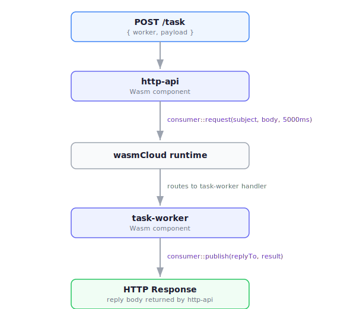

You can add messaging capabilities to a component with the [`wasmcloud:messaging`](https://github.com/wasmCloud/wasmCloud/tree/main/wit/messaging.wit) interface.

This guide walks through the wasmCloud [`http-api-with-distributed-workloads`](https://github.com/wasmCloud/typescript/tree/main/templates/http-api-with-distributed-workloads) template, which demonstrates how to dispatch work from an HTTP API to a background component via a message broker. You can use this guide as a model for implementing `wasmcloud:messaging` in your own components.

## Overview

Messaging typically spans **at least two components**. A component can import `consumer` to publish events without a handler in the same deployment; for example, the component might publish audit events that an external NATS subscriber consumes. A handler can also receive from multiple senders. 

The example template used on this page demonstrates a two-component request-reply pattern that may serve as a starting point. The template consists of:

- **`http-api`** — An HTTP component that accepts a `POST /task` request and uses `wasmcloud:messaging/consumer` to dispatch a request message and await its reply.
- **`task-worker`** — A headless component that exports `wasmcloud:messaging/handler` to receive messages, process them, and publish a reply.



:::info[NATS in production]
`wasmcloud:messaging` uses NATS as its production transport, built into the wasmCloud runtime. During development with `wash dev`, messaging is handled in-process; no NATS server is required. In production, the runtime connects to NATS automatically when the host starts with a NATS URL.
:::

Adding `wasmcloud:messaging` to a component project touches four files: two WIT worlds and two bundler configs:

* `http-api/wit/world.wit` — Declares the messaging consumer import in the HTTP component
* `task-worker/wit/world.wit` — Declares the consumer import and handler export
* `http-api/rolldown.config.mjs` — Extends the externals list to cover `wasmcloud:` imports
* `task-worker/rolldown.config.mjs` — Same change as above

Plus the two TypeScript implementation files:

* `http-api/src/component.ts` — Uses `request()` to dispatch tasks and receive replies
* `task-worker/src/component.ts` — Exports a `handler` object with `handleMessage()`

:::tip[Complete example]
A full working example is available as a template:
```bash
wash new https://github.com/wasmCloud/typescript.git \
  --name http-api-with-distributed-workloads \
  --subfolder templates/http-api-with-distributed-workloads
```
:::

## Step 1: Declare the WIT worlds

Every capability a component uses or provides must be declared in its WIT world. Messaging is split into two interfaces that play different roles.

### HTTP API — import the consumer

The `http-api` component only sends messages; it never receives them. In `http-api/wit/world.wit`, declare a single import:

```wit {4}
package wasmcloud:templates@0.1.0;

world typescript-http-api-with-distributed-workloads-api {
  import wasmcloud:messaging/consumer@0.2.0;

  export wasi:http/incoming-handler@0.2.6;
}
```

### Task worker — import consumer, export handler

The `task-worker` component receives messages **and** sends replies. Receiving requires exporting `handler`; replying requires importing `consumer`. In `task-worker/wit/world.wit`:

```wit {4-5}
package wasmcloud:templates@0.1.0;

world typescript-http-api-with-distributed-workloads-worker {
  import wasmcloud:messaging/consumer@0.2.0;

  export wasmcloud:messaging/handler@0.2.0;
}
```

### What these interfaces provide

| Interface | Direction | Purpose |
|---|---|---|
| `wasmcloud:messaging/consumer` | import | Send messages (`request`, `publish`) |
| `wasmcloud:messaging/handler` | export | Receive messages (`handleMessage`) |

The underlying message type used by both interfaces:

```wit
record broker-message {
  subject: string,
  body: list<u8>,       // Uint8Array in TypeScript
  reply-to: option<string>,
}
```

### How dependency resolution works

When you run `npm run build`, the build pipeline calls `wash wit fetch` as a setup step. `wasmcloud:messaging` is hosted at the `wasmcloud.com` package registry — distinct from the `wasi.dev` registry used for standard WASI interfaces. Both registries are resolved automatically; no extra configuration is required.

## Step 2: Update `rolldown.config.mjs`

Unlike `wasi:` imports, `wasmcloud:` imports are not covered by the default external pattern in `rolldown.config.mjs`. Both components need this pattern extended.

**Before** (default in single-component templates):
```javascript
external: /wasi:.*/,
```

**After** — `http-api/rolldown.config.mjs` (required for any component using `wasmcloud:` interfaces):
```javascript {5}
import { defineConfig } from "rolldown";

export default defineConfig({
  input: "src/component.ts",
  external: [/wasi:.*/, /wasmcloud:.*/],
  output: {
    file: "dist/component.js",
    format: "esm",
  },
});
```

Apply the same change to `task-worker/rolldown.config.mjs`. Without this, rolldown will attempt to bundle the `wasmcloud:messaging/consumer` module and fail with a "could not resolve" error.

## Step 3: Use `request()` in the HTTP API

With the WIT world updated, you can import messaging functions in TypeScript using the exact WIT interface name as the import path.

### Import

In `http-api/src/component.ts`:

```typescript
// @ts-expect-error — types generated after running npm run setup:wit
import { request } from 'wasmcloud:messaging/consumer@0.2.0';
```

**Why `@ts-expect-error`?** The import path `wasmcloud:messaging/consumer@0.2.0` is a bare module specifier that TypeScript can't resolve against the project's type definitions at compile time, so it reports a type error. The directive suppresses that. The import itself works correctly at runtime: `rolldown` marks it as external, and `jco componentize` wires it to the real interface when building the Wasm component.

Once you've run `npm run setup:wit`, the generated signatures are available in `generated/types/interfaces/wasmcloud-messaging-consumer.d.ts` for reference:

```typescript
declare module 'wasmcloud:messaging/consumer@0.2.0' {
  export function request(subject: string, body: Uint8Array, timeoutMs: number): BrokerMessage;
  export function publish(msg: BrokerMessage): void;
  export type BrokerMessage = import('wasmcloud:messaging/types@0.2.0').BrokerMessage;
}
```

### Calling `request()`

`request()` implements the request-reply pattern: it publishes `body` to `subject`, blocks until a reply arrives (up to `timeoutMs` milliseconds), and returns the reply message. It is **synchronous**, with no `await` required.

On error (timeout, no subscriber, or delivery failure) `request()` throws rather than returning. Always wrap it in `try/catch`. In `http-api/src/component.ts`:

```typescript
const encoder = new TextEncoder();
const decoder = new TextDecoder();

const REQUEST_TIMEOUT_MS = 5000;

app.post('/task', async (c) => {
  const body = await c.req.json<{ worker?: string; payload: string }>();

  const subject = `tasks.${body.worker ?? 'default'}`;
  const msgBody = encoder.encode(body.payload);

  try {
    const reply = request(subject, msgBody, REQUEST_TIMEOUT_MS);
    return c.text(decoder.decode(reply.body));
  } catch (err) {
    const message = err instanceof Error ? err.message : String(err);
    return c.text(`Messaging error: ${message}`, 502);
  }
});
```

:::warning[Timeout behavior]
If no component is subscribed to `subject` within `timeoutMs` milliseconds, `request()` throws with a timeout error. During `wash dev`, the wasmCloud runtime routes calls in-process, so timeouts only occur if the handler throws or takes too long. In production, a missing NATS subscription or an unreachable server both surface as timeout errors.
:::

### How import paths map to WIT interfaces

The import path is always the fully-qualified WIT interface name:

```
wasmcloud:messaging/consumer@0.2.0  →  import { request, publish } from 'wasmcloud:messaging/consumer@0.2.0'
```

### Subject naming

Subjects are arbitrary dot-separated strings following NATS subject conventions. The template uses `tasks.{worker}` so that multiple worker types can each subscribe to their own sub-subject:

```
tasks.task-worker   →  handled by the leet-speak task-worker component
tasks.summarizer    →  would be handled by a hypothetical summarizer component
```

In development with `wash dev`, all messages are routed in-process regardless of subject; the subject only becomes meaningful in production where NATS subscription patterns control routing.

## Step 4: Implement `handleMessage()` in the task worker

The task-worker exports `wasmcloud:messaging/handler@0.2.0`. Exporting a WIT interface is different from importing one: instead of calling a function, you provide an object that the runtime calls into.

### The handler export

`componentize-js` maps `export wasmcloud:messaging/handler@0.2.0` in the WIT world to a named JavaScript export. The export name is the segment of the interface path between `/` and `@`:

```
wasmcloud:messaging/handler@0.2.0
                    ^^^^^^^ → export name: handler
```

That export must be an object with a `handleMessage` method. You cannot rename it. In `task-worker/src/component.ts`:

```typescript
export const handler = {
  handleMessage(msg: BrokerMessage): void {
    // process msg and optionally publish a reply
  },
};
```

### Replying to a message

The incoming message's `replyTo` field holds the subject the original caller is listening on. Publish your response there using `publish()`.

`BrokerMessage` is declared locally as an interface because the generated types use a module augmentation syntax that TypeScript can't resolve at the import site — the same situation as the `@ts-expect-error` on the consumer import. The local interface gives you type safety without fighting the toolchain. In `task-worker/src/component.ts`:

```typescript
// @ts-expect-error — types generated after running npm run setup:wit
import { publish } from 'wasmcloud:messaging/consumer@0.2.0';

interface BrokerMessage {
  subject: string;
  body: Uint8Array;
  replyTo?: string;
}

const encoder = new TextEncoder();
const decoder = new TextDecoder();

export const handler = {
  handleMessage(msg: BrokerMessage): void {
    if (!msg.replyTo) {
      throw new Error('missing reply_to — cannot send response');
    }

    const payload = decoder.decode(msg.body);
    const result = processPayload(payload);

    publish({
      subject: msg.replyTo,
      body: encoder.encode(result),
    });
  },
};
```

`publish()` is fire-and-forget: it delivers the message and returns. Like `request()`, it throws on delivery error.

To signal a handler failure, **throw** from `handleMessage`. The thrown error propagates back to the caller: the wasmCloud runtime logs it, and if the sender called `request()`, the throw surfaces there as a caught error.

### Fire-and-forget handlers

If the handler doesn't need to reply (one-way notification pattern), omit the `publish()` call:

```typescript
export const handler = {
  handleMessage(msg: BrokerMessage): void {
    const event = JSON.parse(decoder.decode(msg.body));
    processEvent(event); // side effects only, no reply
  },
};
```

## Step 5: Configure multi-component development

A multi-component project has a root `package.json` workspace and a root `.wash/config.yaml`. The `component_path` in the config points to the primary component (the HTTP API); additional components are declared under `dev: components:`. In `.wash/config.yaml`:

```yaml
new:
  command: npm install

build:
  command: npm run build
  component_path: http-api/dist/http_api.wasm

dev:
  components:
    - name: task-worker
      file: task-worker/dist/task_worker.wasm
```

The `dev: components:` list tells `wash dev` to deploy the task-worker alongside the main component. `wash dev` automatically links both components through the wasmCloud runtime; no NATS server is required needed during development.

The root `package.json` coordinates the build across both sub-packages:

```json
{
  "scripts": {
    "build": "npm run build --workspace=http-api && npm run build --workspace=task-worker",
    "dev": "nodemon"
  },
  "workspaces": ["http-api", "task-worker"]
}
```

:::note
`npm run dev` runs `nodemon`, which watches source files and re-runs `npm run build` on changes. It handles the build side of the development loop only. Use `wash dev` to start the full environment: build, deploy, and serve.
:::

### Dependencies

The task-worker has no runtime `dependencies`, only `devDependencies`. It doesn't need `hono` or `@bytecodealliance/jco-std` because it doesn't handle HTTP. All messaging plumbing comes from the WIT bindings at componentization time. In `task-worker/package.json`:

```json
{
  "devDependencies": {
    "@bytecodealliance/jco": "^1.15.4",
    "rimraf": "^6.1.2",
    "rolldown": "^1.0.0-beta.47",
    "typescript": "^5.9.3"
  }
}
```

## Build and verify

### Build

```bash
npm install
npm run build
```

This runs the full pipeline for both components:
1. `wash wit fetch` — downloads `wasmcloud:messaging` WIT definitions into `wit/deps/`
2. `jco guest-types` — generates TypeScript type definitions in `generated/types/`
3. `rolldown` — bundles TypeScript into `dist/component.js` (leaving `wasi:` and `wasmcloud:` imports external)
4. `jco componentize` — compiles `dist/component.js` into a `.wasm` component

### Run

```bash
wash dev
```

`wash dev` builds both components, starts an HTTP server on port 8000, and routes messaging calls between them in-process.

### Test

Open http://localhost:8000 to use the web UI, or test with curl:

```bash
# Send a task — the task-worker converts the payload to leet speak
curl -s -X POST http://localhost:8000/task \
  -H 'Content-Type: application/json' \
  -d '{"worker": "task-worker", "payload": "Hello World"}'
# => H3110 W0r1d

# Missing payload returns 400
curl -s -X POST http://localhost:8000/task \
  -H 'Content-Type: application/json' \
  -d '{}'
# => Missing required field: payload
```

## Production deployment

Both components run on the same wasmCloud host. Start the host with a NATS URL; the runtime's built-in messaging plugin connects to NATS automatically. Deploy both components together with a `WorkloadDeployment` manifest:

```yaml
apiVersion: runtime.wasmcloud.dev/v1alpha1
kind: WorkloadDeployment
metadata:
  name: http-api-with-distributed-workloads
spec:
  replicas: 1
  template:
    spec:
      hostInterfaces:
        - namespace: wasi
          package: http
          interfaces:
            - incoming-handler
          config:
            host: your-domain.example.com    # HTTP Host header used for routing
        - namespace: wasmcloud
          package: messaging
          interfaces:
            - consumer
            - handler
          config:
            subscriptions: "tasks.>"         # NATS subjects the task-worker subscribes to
      components:
        - name: http-api
          image: <registry>/http_api:latest
        - name: task-worker
          image: <registry>/task_worker:latest
```

Key points about the manifest:

- **`hostInterfaces`** declares which built-in host capabilities the workload needs. No separate HTTP server or NATS component is listed — both are provided by the runtime.
- **`interfaces: [consumer, handler]`** declares both the sending (`consumer`) and receiving (`handler`) sides of the messaging interface. The runtime automatically wires subscriptions to the component that exports `handler` (task-worker), not to http-api which only imports `consumer`.
- **`subscriptions`** is a comma-separated list of NATS subject patterns. `tasks.>` matches any subject starting with `tasks.`, covering any number of worker types.
- **HTTP `host` config** is the Host header the runtime uses to route incoming HTTP requests to this workload. The actual listen address is set at host startup (`--http-addr`).

:::info[Subject-based routing in production]
Because NATS subscriptions are configured per-workload at deploy time, subject naming becomes a contract between sender and handler. The `tasks.{worker}` convention in this template means each worker type can be independently scaled and replaced without modifying the HTTP API; just change the subscription on the new workload's manifest.
:::

For Kubernetes deployment, see the [runtime-operator documentation](https://github.com/wasmCloud/wasmCloud/tree/main/runtime-operator).

## Summary: checklist for adding `wasmcloud:messaging`

**For a component that sends messages (consumer):**

1. **Add `import wasmcloud:messaging/consumer@0.2.0` to `wit/world.wit`**.
2. **Add `wasmcloud:` to rolldown externals**: `external: [/wasi:.*/, /wasmcloud:.*/]`.
3. **Run `npm run setup:wit` once** to download WIT definitions and generate type stubs (`jco guest-types`).
4. **Import with `@ts-expect-error`**: `import { request, publish } from 'wasmcloud:messaging/consumer@0.2.0'`.
5. **Use `request(subject, body, timeoutMs)`** for request-reply; wrap in try/catch since it throws on error or timeout.
6. **Use `publish(msg)`** for fire-and-forget delivery with no reply expected.

**For a component that handles messages (handler):**

1. **Add both `import wasmcloud:messaging/consumer@0.2.0` and `export wasmcloud:messaging/handler@0.2.0` to `wit/world.wit`**. The import is needed for `publish()` (replies); the export declares the handler.
2. **Add `wasmcloud:` to rolldown externals** (same as above).
3. **Export a `handler` object with a `handleMessage` method**:
   ```typescript
   export const handler = {
     handleMessage(msg: BrokerMessage): void { ... }
   };
   ```
4. **Use `msg.replyTo`** to find the reply subject for request-reply patterns; call `publish({ subject: msg.replyTo, body })` to respond.
5. **Throw to signal errors** — the thrown value is returned as the WIT `result` error variant.
6. **No runtime npm dependencies needed** — the handler component only needs dev tooling.

**For multi-component development:**

1. **Declare `dev: components:` in root `.wash/config.yaml`** with the path to each additional component's `.wasm` file.
2. **`wash dev` routes messages in-process** — no NATS server required during development.
3. **In production**, use a `WorkloadDeployment` manifest with a `wasmcloud:messaging` hostInterface entry. Include `handler` in the interfaces list and set `subscriptions` in the `config` block. 

---

## API reference: `wasmcloud:messaging` functions used

| Function | Signature | Description |
|---|---|---|
| `request(subject, body, timeoutMs)` | `(string, Uint8Array, number) => BrokerMessage` | Publish to `subject` and block until a reply arrives (or timeout elapses). Throws on error. |
| `publish(msg)` | `(BrokerMessage) => void` | Fire-and-forget publish. Throws on delivery error. |
| `handler.handleMessage(msg)` | `(BrokerMessage) => void` | Called by the runtime for each delivered message. Throw to signal failure. |

**`BrokerMessage` fields:**

| Field | Type | Description |
|---|---|---|
| `subject` | `string` | The message subject (NATS topic) |
| `body` | `Uint8Array` | Raw message payload |
| `replyTo` | `string \| undefined` | Reply subject set automatically by `request()` |

## Further reading

- [TypeScript Language Guide](../index.mdx) — toolchain overview, HTTP patterns, framework integration, and library compatibility
- [Key-Value Storage](./key-value-storage.mdx) — Persistent state for a single component
- [Blob Storage](./blob-storage.mdx) — Object storage for larger payloads
- [Language Support overview](../../index.mdx) — summary of all supported languages and toolchains
