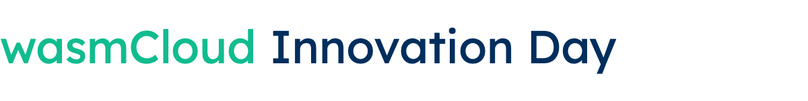

import HubspotForm from 'react-hubspot-form';
import styles from './_assets/innovation-day.module.css';

**Time:** Wednesday, September 18, 2024 @ 10am - 6pm Eastern  
**Place:** Virtual

Whether you’re already using Wasm or a complete newbie, this one-day virtual event is the ideal immersion in all things WebAssembly and wasmCloud. We’ll explore wasmCloud’s technical architecture and growing feature set&mdash;and most importantly, hear how companies in a host of industries are working with this popular open source CNCF project.

Here’s what to expect…check out the full agenda below!

**wasmCloud in Industry:** Hear how engineers from the world’s largest organizations are using wasmCloud in real-world use cases.

**Technical Deep Dive:** wasmCloud has been transformed with WASI 0.2 and wasmCloud 1.1 is full of features designed to make building with components a joy. From secrets support to creating your own custom capabilities, we’ll take a deeper look at what’s new, and how to get the most out of 1.1.

**Community Workshop and Hangout:** Join us in Gather space to build your own Wasm application and hang with industry leaders, open source contributors, and wasmCloud users.

    

        <h2>Agenda</h2>

**Morning Session** 

**10 - 11am ET: wasmCloud Weekly Community Meeting**

- Special edition: we’ll focus on the essential role of open source maintainers: explore what being a maintainer involves, and how you can work with us.

**11 - 11.15am: Opening Keynote:** **The Pitfalls of Modern Platform Engineering: [Bailey Hayes](https://github.com/ricochet)**

- Ending the ‘rinse and repeat’ of application development
- Improving life with Kubernetes
- Running distributed workloads securely and efficiently

**11.15 - 12.15pm: wasmCloud 1:1, Technical Deep Dive**

- **Secrets: [Brooks Townsend](https://github.com/brooksmtownsend)**    - Why this is the most requested feature amongst our enterprise customers and partners
- **Evolution in Golang: [Lucas Fontes](https://github.com/lxfontes), [Brooks Townsend](https://github.com/brooksmtownsend)** - Go provider SDK; Go components with TinyGo
- **wasmcloud-operator: Lucas Fontes**
- **wash dev: [Taylor Thomas](https://github.com/thomastaylor312)**
- **Custom Capabilities** - Postgres and Couchbase with [Victor Adossi](https://github.com/t3hmrman); Machine Learning with Christoph Brewing, BMW / Jochen Rau, MachineMetrics
- Seamless distributed systems with **wRPC and NATS:** [Taylor Thomas](https://github.com/thomastaylor312) and [Roman Volosatvos](https://github.com/rvolosatovs)

**12.15 - 12.30pm: Fireside Chat:** Community leaders in the CNCF and Bytecode Alliance join [Bailey Hayes](https://github.com/ricochet)
    * What’s next in cloud native WASI proposals?
    * Your Community Needs You! Bytecode Alliance community call to action  

**12.30 - 1.30pm: Customer and User Demos**
    * You don’t want to miss these demos! Details to follow!

**1.30 - 2pm: Lunch**

**2 - 6pm: Workshop and Gather Hangout**

- Workshop! Build your own standup app with [Lachlan Heywood](https://github.com/lachieh)
- Meet the Bytecode Alliance team
- Meet wasmCloud maintainers [Brooks](https://github.com/brooksmtownsend), [Taylor](https://github.com/thomastaylor312), [Bailey](https://github.com/ricochet), [Victor](https://github.com/t3hmrman) and the team and find out how to get involved
- Meet your community compatriots!

**6pm: Event Closes**

    

    

        <a href="#register" class="button">Register</a>
        <a href="/contact" class="button">Get in touch</a>
        <a
            href="https://twitter.com/intent/tweet?text=Join%20me%20at%20wasmCloud%20Innovation%20Day%20on%20Sept.%2018%20for%20a%20free%2C%20one-day%20virtual%20immersion%20course%20in%20WebAssembly%20and%20wasmCloud!%20https%3A%2F%2Fwasmcloud.com%2Finnovation-day"
            class="button"
        >Share on X</a>
        <a
            href="https://www.linkedin.com/feed/?shareActive=true&text=Join%20me%20at%20wasmCloud%20Innovation%20Day%20on%20Sept.%2018%20for%20a%20free,%20one-day%20virtual%20immersion%20course%20in%20WebAssembly%20and%20wasmCloud!%20https://wasmcloud.com/innovation-day"
            class="button"
        >Share on LinkedIn</a>
    
    

 

<HubspotForm
  portalId="20760433"
  formId="52d55964-82a5-49c6-b4a1-bbfdfc58a454"
  onSubmit={() => console.log('Submitted form')}
  onReady={(form) => console.log('Form ready for submit')}
  region="na1"
  loading={
Loading...
}
/>

