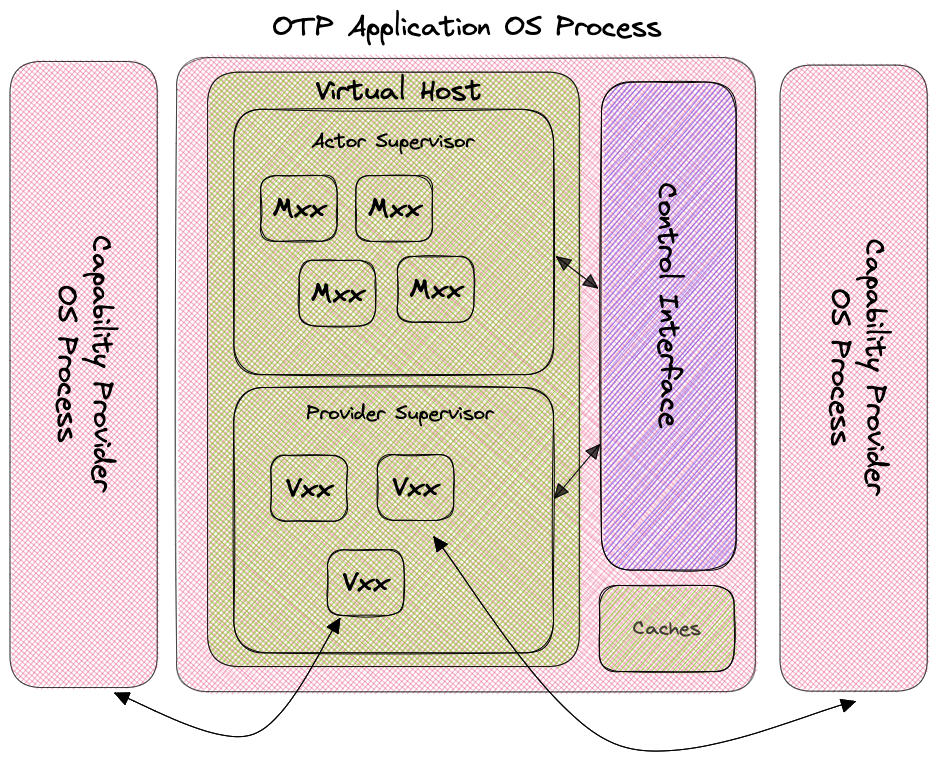

:::warning
wasmCloud's [Elixir host runtime](https://github.com/wasmcloud/wasmcloud-otp) has been deprecated. The [Rust wasmCloud runtime](https://github.com/wasmCloud/wasmCloud) is receiving all new features
:::

The following diagram illustrates the composition of the Elixir OTP host:



In this diagram, `Mxxx` represents an actor (an actor's public key is a 56-character string starting with `M`) while `Vxxx` represents a capability provider (their public keys start with `V`).

The unit of deployment is the single OTP application. See the [GitHub repository](https://github.com/wasmcloud/wasmcloud-otp) for details and specifics of how this application is deployed, including instructions for use with Docker.

Inside each deployed Elixir wasmCloud host, there is a process supervisor called the **Virtual Host**. Beneath this supervisor are two more supervisors: the **Actor Supervisor** and the **Provider Supervisor**. In turn, each of these supervise individual processes for actors and providers.

The actor process contains a [NIF](https://www.erlang.org/doc/tutorial/nif.html)-based instance of the [Rust](https://github.com/wasmcloud/wasmcloud) runtime responsible for loading and managing WebAssembly modules and components.

The capability provider process is a bit tricky. It uses an Elixir [Port](https://hexdocs.pm/elixir/1.14.4/Port.html) to spawn a new operating system process for the capability provider binary (which is extracted from a provider archive file) suitable for the current operating system and CPU architecture.

The blanket term **wasmCloud Host** refers to the _combination_ of the core Elixir OTP operating system process and all of the OS processes spawned for capability providers.

If a host is asked to gracefully terminate, then it will usually be able to stop all of the capability provider OS processes. However, sometimes that doesn't work or other times (like when you're developing locally), the host may be terminated forcefully. This can _orphan_ capability providers. To find them and terminate them, locate them with the following shell command (or your OS equivalent):

```
ps -ef | grep wasmcloud
```

Also, if you find that you may have orphaned the actual OTP host and not just a provider, you can look for the `beam` process:

```
ps -ef | grep beam
```

We all look forward to the bright future when we might be able to replace provider archive files containing OS/CPU-bound binaries with fully portable WASI components. Until then, spawning an OS process for a capability provider is the only way to manage them.
