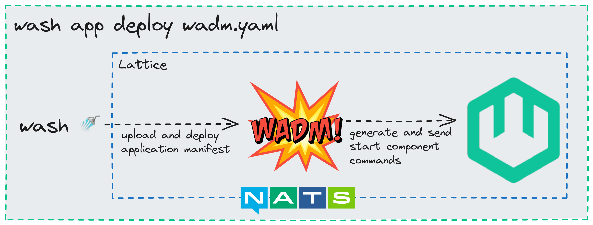
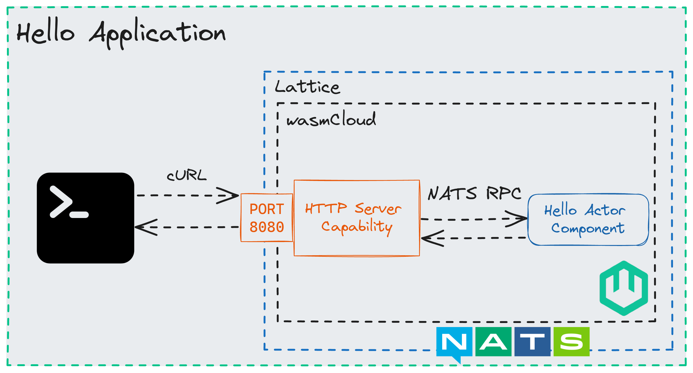

import Tabs from '@theme/Tabs';
import TabItem from '@theme/TabItem';
import HubspotForm from 'react-hubspot-form';

import washboard_hello from '../images/washboard_hello.png';

# Quickstart

A familiar starting example to get you up and running with wasmCloud.

## Before We Begin

:::info

Looking for an introduction? Check out [What Is wasmCloud?](/docs/intro) or [Concepts](/docs/category/concepts) first.

:::

:::info

If you have not installed `wash`, follow the [installation guide](../installation.mdx) first.

:::

In this guide, we'll be taking a tour through the tooling in the wasmCloud ecosystem and a "Hello world" example. Once you're finished, you'll have a good understanding of how to use `wash` and `wadm` to build and deploy wasmCloud applications. All wasmCloud applications need a [host](/docs/concepts/hosts) to run on, so let's
use `wash` to start one now.

## Starting Host Infrastructure

<Tabs groupId="env" queryString>
  <TabItem value="local" label="Local">

To start a host, simply run `wash up`. The default settings should work well for this tutorial. The host can be killed at any time with `CTRL+c`.

  </TabItem>
  <TabItem value="docker" label="Docker">

You can use the linked [docker-compose.yml](https://github.com/wasmCloud/wasmCloud/blob/main/examples/docker/docker-compose-full.yml) file to start the necessary host infrastructure in Docker:

If you save the above file as `wasmcloud.yml`, you can start the host infrastructure with `docker compose --file wasmcloud.yaml up`.

  </TabItem> 
</Tabs>

This command bootstraps 3 independent processes to create the necessary local infrastructure for wasmCloud:

- the **wasmCloud** host which manages the execution of actors and capability providers
- a [**NATS**](https://nats.io/) server to manage communications between application components
- a [**wadm**](/docs/category/declarative-application-deployment-wadm) process which monitors the [lattice](/docs/reference/glossary#lattice) and maintains the state of managed deployments


By default, `wash` will run the host in interactive mode.
If you'd rather run the host in the background, run `wash up --detached` (or `wash up -d`, for short).

## Creating a Project

Now that our wasmCloud host infrastructure is running, let's generate a new actor component project. This is where our "Hello World" example begins. If you're running your host in the foreground, just switch to another terminal window to run these commands.

Pick your language of choice below to follow

<Tabs groupId="lang" queryString>
  <TabItem value="rust" label="Rust" default>
  :::caution
  Component examples are experimental and likely to require recompilation with each new release of wasmCloud.
  :::

This command generates a new actor project in the `./hello` directory:

```bash
wash new actor hello --git wasmcloud/wasmcloud --subfolder examples/rust/actors/http-hello-world --branch 0.82-examples
```

This actor is a simple Rust project with a few extra goodies included for wasmCloud. At a high level, the important pieces are:

1. `src/lib.rs`: Where the business logic is implemented
2. `wasmcloud.toml`: Actor metadata and capability permissions
3. `wadm.yaml`: A declarative manifest for running the full application

:::info[Rust dependencies]
You don't need any Rust dependencies installed to run this example, but if you want to build it yourself you'll need to install the [Rust toolchain](https://www.rust-lang.org/tools/install) and the `wasm32-wasi` target.

```bash
rustup target add wasm32-wasi
```

:::

  </TabItem>
  <TabItem value="tinygo" label="TinyGo">

:::caution
Component examples are experimental and likely to require recompilation with each new release of wasmCloud.
:::

This command generates a new actor project in the `./hello` directory:

```bash
wash new actor hello --git wasmcloud/wasmcloud --subfolder examples/golang/actors/http-hello-world --branch 0.82-examples
```

This actor is a simple Go project with a few extra goodies included for wasmCloud. At a high level, the important pieces are:

1. `hello.go`: Where the business logic is implemented
2. `wasmcloud.toml`: Actor metadata and capability permissions
3. `wadm.yaml`: A declarative manifest for running the full application

:::info[Go dependencies]
You don't need any Go dependencies installed to run this example, but if you want to build it yourself you'll need to install both [Go](https://golang.org/doc/install) and [TinyGo](https://tinygo.org/getting-started/). We use the TinyGo toolchain to compile Go code to WebAssembly.
:::

  </TabItem>
  <TabItem value="typescript" label="TypeScript">

:::caution
Component examples are experimental and likely to require recompilation with each new release of wasmCloud.
:::

This command generates a new actor project in the `./hello` directory:

```bash
wash new actor hello --git wasmcloud/wasmcloud --subfolder examples/typescript/actors/http-hello-world --branch 0.82-examples
```

This actor is a simple TypeScript project with a few extra goodies included for wasmCloud. At a high level, the important pieces are:

1. `index.ts`: Where the business logic is implemented
2. `wasmcloud.toml`: Actor metadata and capability permissions
3. `wadm.yaml`: A declarative manifest for running the full application

:::info[Dependencies]
You don't need any TypeScript/JavaScript dependencies installed to run this example, but if you want to build it yourself you'll need to install [npm](https://docs.npmjs.com/downloading-and-installing-node-js-and-npm) and run `npm install` in the project directory. We use npm to install dependencies and compile the TS/JS code to WebAssembly.
:::

  </TabItem>
  <TabItem value="Python" label="Python">

:::caution
Component examples are experimental and likely to require recompilation with each new release of wasmCloud.
:::

This command generates a new actor project in the `./hello` directory:

```bash
wash new actor hello --git wasmcloud/wasmcloud --subfolder examples/python/actors/http-hello-world --branch 0.82-examples
```

This actor is a simple Python project with a few extra goodies included for wasmCloud. At a high level, the important pieces are:

1. `app.py`: Where the business logic is implemented
2. `wasmcloud.toml`: Actor metadata and capability permissions
3. `wadm.yaml`: A declarative manifest for running the full application

:::info[Dependencies]
You don't need any Python dependencies installed to run this example, but if you want to build it yourself you'll need to install [Python 3.10 or later](https://www.python.org/) and [pip](https://pypi.org/project/pip/). After you have those, you'll need to install [componentize-py v0.12 or later](https://github.com/bytecodealliance/componentize-py/tree/main?tab=readme-ov-file#getting-started):

```
pip install componentize-py
```

:::

  </TabItem>
  <TabItem value="unlisted" label="My Language Isn't Listed">

If you prefer working in a language that isn't listed here, let us know!

{' '}

<div style={{ display: 'flex', flexDirection: 'row' }}>
  <div style={{ width: '100%' }}>
    <HubspotForm
      portalId="20760433"
      formId="71e74f55-cc30-41de-9d41-e3d9dc159c71"
      onSubmit={() => console.log('Submitted form')}
      onReady={(form) => console.log('Form ready for submit')}
      region="na1"
      loading={<div>Loading...</div>}
    />
  </div>
</div>

  </TabItem>
</Tabs>

Feel free to take a look at the code and the project structure. We'll take a look at each of these in depth later, so for now let's build and run the example.

## Building the Application

:::info
If you prefer not to build anything yet, you can use `wasmcloud.azurecr.io/hello:0.1.7` as the image inside of `wadm.yaml` instead to pull our prebuilt example actor.
:::

We can use the open source HTTP Server capability provider to serve our application, so the only thing you'll need to build is the actor component. Change directory into the generated `hello` directory and run `wash build` to build your actor, taking note of the actor path after building:

```bash
cd hello # enter the new project directory (if you haven't already)
wash build
```

```bash
Actor built and signed and can be found at "/Users/wasmcloud/hello/build/http_hello_world_s.wasm"
```

## Starting our Application

We'll use `wash` and [wadm](/docs/category/declarative-application-deployment-wadm), the wasmCloud application deployment manager, to start this actor, the httpserver capability, and link them together to configure them.

```bash
cd hello # enter the new project directory (if you haven't already)
wash app deploy wadm.yaml
```



`wadm` will take care of taking this manifest and scheduling the resources on the host that you launched earlier. You should see output in the host logs when your actor and capability start up, which should happen after just a few seconds. After you see that the HTTP server set up the listener in the host logs, or once the application is **Deployed** when you check `wash app list`, you can query it yourself:

```bash
➜ wash app list

Name             Latest Version   Deployed Version   Deploy Status   Description
http-hello-world v0.0.1           v0.0.1                  Deployed   HTTP Hello World
```

```bash
$ curl localhost:8080
Hello, World!
```

Congratulations, you just ran a WebAssembly application in wasmCloud!

## How does it work?



When you send your HTTP request to `localhost:8080`, that request is received by the HTTP Server capability provider. The HTTP Server capability provider then forwards that request to the actor, which responds with the string "Hello, world!". This loose coupling of capability providers and actors provides flexibility, security, and it lets our actor code be purely business logic instead of compiling in vendor specific code. Let's take a look at your application code now:

<Tabs groupId="lang" queryString>
  <TabItem value="rust" label="Rust">

```rust
wit_bindgen::generate!({
    world: "hello",
    exports: {
        "wasi:http/incoming-handler": HttpServer,
    },
});

use exports::wasi::http::incoming_handler::Guest;
use wasi::http::types::*;

struct HttpServer;

impl Guest for HttpServer {
    fn handle(_request: IncomingRequest, response_out: ResponseOutparam) {
        let response = OutgoingResponse::new(Fields::new());
        response.set_status_code(200).unwrap();
        let response_body = response.body().unwrap();
        response_body
            .write()
            .unwrap()
            .blocking_write_and_flush(b"Hello from Rust!\n")
            .unwrap();
        OutgoingBody::finish(response_body, None).expect("failed to finish response body");
        ResponseOutparam::set(response_out, Ok(response));
    }
}
```

This actor has a single struct, `HttpServer`, that implements the `handle` function. This function is called by the HTTP Server capability provider when it receives an incoming HTTP request. The `handle` function constructs an `HttpResponse` and sends it back to the HTTP Server capability provider, which then sends it back to the client. There's no mention of ports, certificates, HTTP libraries, and if those things change this actor will work all the same.

  </TabItem>
  <TabItem value="tinygo" label="TinyGo" default>

```go
package main

import (
	http "github.com/wasmcloud/wasmcloud/examples/golang/actors/http-hello-world/gen"
)

// Helper type aliases to make code more readable
type HttpRequest = http.ExportsWasiHttp0_2_0_rc_2023_12_05_IncomingHandlerIncomingRequest
type HttpResponseWriter = http.ExportsWasiHttp0_2_0_rc_2023_12_05_IncomingHandlerResponseOutparam
type HttpOutgoingResponse = http.WasiHttp0_2_0_rc_2023_12_05_TypesOutgoingResponse
type HttpError = http.WasiHttp0_2_0_rc_2023_12_05_TypesErrorCode

type HttpServer struct{}

func init() {
	httpserver := HttpServer{}
	// Set the incoming handler struct to HttpServer
	http.SetExportsWasiHttp0_2_0_rc_2023_12_05_IncomingHandler(httpserver)
}

func (h HttpServer) Handle(request HttpRequest, responseWriter HttpResponseWriter) {
	// Construct HttpResponse to send back
	headers := http.NewFields()
	httpResponse := http.NewOutgoingResponse(headers)
	httpResponse.SetStatusCode(200)
	httpResponse.Body().Unwrap().Write().Unwrap().BlockingWriteAndFlush([]uint8("Hello from Go!\n")).Unwrap()

	// Send HTTP response
	okResponse := http.Ok[HttpOutgoingResponse, HttpError](httpResponse)
	http.StaticResponseOutparamSet(responseWriter, okResponse)
}

//go:generate wit-bindgen tiny-go wit --out-dir=gen --gofmt
func main() {}
```

This actor has a single struct, `HttpServer`, that implements the `Handle` function. This function is called by the HTTP Server capability provider when it receives an incoming HTTP request. The `Handle` function constructs an `HttpResponse` and sends it back to the HTTP Server capability provider, which then sends it back to the client. There's no mention of ports, certificates, HTTP libraries, and if those things change this actor will work all the same.

  </TabItem>
  <TabItem value="typescript" label="TypeScript" default>

```go
import {
  IncomingRequest,
  ResponseOutparam,
  OutgoingResponse,
  Fields,
} from "wasi:http/types@0.2.0-rc-2023-12-05";

// Implementation of wasi-http incoming-handler
//
// NOTE: To understand the types involved, take a look at wit/deps/http/types.wit
function handle(req: IncomingRequest, resp: ResponseOutparam) {
  // Start building an outgoing response
  const outgoingResponse = new OutgoingResponse(new Fields());

  // Access the outgoing response body
  let outgoingBody = outgoingResponse.body();
  // Create a stream for the response body
  let outputStream = outgoingBody.write();
  // // Write hello world to the response stream
  outputStream.blockingWriteAndFlush(
    new Uint8Array(new TextEncoder().encode("hello from Typescript"))
  );

  // Set the status code for the response
  outgoingResponse.setStatusCode(200);

  // Set the created response
  ResponseOutparam.set(resp, { tag: "ok", val: outgoingResponse });
}

export const incomingHandler = {
  handle,
};
```

This actor has a single function, `handle`, that implements the `incoming-handler` interface. This function is called by the HTTP Server capability provider when it receives an incoming HTTP request. The `handle` function constructs an `OutgoingResponse` and sends it back to the HTTP Server capability provider, which then sends it back to the client. There's no mention of ports, certificates, HTTP libraries, and if those things change this actor will work all the same.

  </TabItem>
  <TabItem value="Python" label="Python">
    ```python
from hello import exports
from hello.types import Ok
from hello.imports.types import (
    IncomingRequest, ResponseOutparam,
    OutgoingResponse, Fields, OutgoingBody
)

class IncomingHandler(exports.IncomingHandler):
    def handle(self, _: IncomingRequest, response_out: ResponseOutparam): # Construct the HTTP response to send back
        outgoingResponse = OutgoingResponse(Fields.from_list([])) # Set the status code to OK
        outgoingResponse.set_status_code(200)
        outgoingBody = outgoingResponse.body() # Write our Hello World message to the response body
        outgoingBody.write().blocking_write_and_flush(bytes("Hello from Python!\n", "utf-8"))
        OutgoingBody.finish(outgoingBody, None) # Set and send the HTTP response
        ResponseOutparam.set(response_out, Ok(outgoingResponse))

````

    This actor has a single class, `IncomingHandler`, that implements the `handle` function. This function is called by the HTTP Server capability provider when it receives an incoming HTTP request. The `handle` function constructs an HttpResponse and sends it back to the HTTP Server capability provider, which then sends it back to the client. There's no mention of ports, certificates, HTTP libraries, and if those things change this actor will work all the same.

  </TabItem>
</Tabs>

:::info

Capabilities are _deny by default_, the link inside of `wadm.yaml` explicitly allowed the "Hello World" component to receive an HTTP request. If you inspect the [WIT output](https://wasmcloud.com/docs/hosts/abis/components/) of your component with `wash inspect --wit` you'll see the only `export` is `wasi:http/incoming-handler`, and the only `import`s are standard capabilities. This means that this actor cannot make network requests of its own, read arbitrary files, or even generate a random number, all are denied by the wasmCloud runtime.

:::

When you ran `wash app deploy wadm.yaml`, `wadm` takes the application manifest and schedules the components on hosts according to the scale you specify. This example has a minimal manifest, let's take a look at it:

```yaml
# Metadata
apiVersion: core.oam.dev/v1beta1
kind: Application
metadata:
  name: hello
  annotations:
    version: v0.0.1
    description: 'wasmCloud Hello World Example'
spec:
  components:
    # Your actor component, started from the wasmCloud example OCI artifact
    - name: hello
      type: actor
      properties:
        image: wasmcloud.azurecr.io/hello:0.1.7
      traits:
        # One replica of this actor will run
        - type: spreadscaler
          properties:
            replicas: 1
        # The link configuration tells the httpserver to listen on 8080
        - type: linkdef
          properties:
            target: httpserver
            values:
              address: 0.0.0.0:8080

    # The httpserver capability provider, started from the official wasmCloud OCI artifact
    - name: httpserver
      type: capability
      properties:
        image: wasmcloud.azurecr.io/httpserver:0.19.1
        contract: wasmcloud:httpserver
````

## Scaling up 📈

WebAssembly can be easily scaled due to its small size, portability, and [wasmtime](https://wasmtime.dev/)'s ability to efficiently instantiate multiple instances of a single WebAssembly component. We leverage these aspects to make it simple to scale your applications with wasmCloud. Components only use resources when they're actively processing requests, so you can specify the number of replicas you want to run and wasmCloud will automatically scale up and down to meet demand. Let's scale up our hello world application to 50 replicas by editing `wadm.yaml`:

```yaml {17-19}
apiVersion: core.oam.dev/v1beta1
kind: Application
metadata:
  name: hello
  annotations:
    # Make sure to bump the version so wadm knows to update the application
    version: v0.0.2
    description: 'wasmCloud Hello World Example'
spec:
  components:
    - name: hello
      type: actor
      properties:
        image: wasmcloud.azurecr.io/hello:0.1.7
      traits:
        - type: spreadscaler
          properties:
            # Update the scale to 50
            replicas: 50
```

Now your hello application is ready to deploy v0.0.2 with 50 replicas, meaning it can handle up to 50 concurrent incoming HTTP requests. Just run `wash app deploy wadm.yaml` again, wasmCloud will be configured to automatically scale your actor component based on incoming load. It's a little easier to visualize this in the wasmCloud dashboard, so let's take a look at that next.

## Viewing the wasmCloud dashboard

To view the wasmCloud dashboard, you'll have to launch `wash` with the option `--nats-websocket-port 4001`. Go ahead and `CTRL+c` or `wash down` to stop your previous host, and then relaunch it with the new option:

```bash
wash up --nats-websocket-port 4001
```

:::info[What will happen to my application?]
Treat wasmCloud hosts as cattle, not pets. Stopping your host will stop all of the components running on it, and **wadm** will look for other available hosts to reschedule your application on. As soon as you launch your new host with the `--nats-websocket-port` option, your application will be rescheduled on it and work just as it did before.
:::

Then, you can launch the wasmCloud dashboard using `wash ui`, which will launch the dashboard on [http://localhost:3030](http://localhost:3030).
This is a great way to visualize what is running on your host, even multiple hosts that are connected to the same NATS server.


## Log files

If you encounter any problems, the host log files may contain useful error
messages, and it's good to know how to find them. The tabs below, organized by how you started the
wasmCloud host, show you where to find logs:

<Tabs groupId="env" queryString >
  <TabItem value="local" label="Local" default>

By default, logs from `wash up` are automatically output to your terminal. If you ran the command
with the `--detached` flag, logs can be found in `~/.wash/downloads/wasmcloud.log`

  </TabItem>
  <TabItem value="docker" label="Docker">

Logs from hosts running in Docker, if started with our docker compose, can be found by running
`docker logs wasmcloud`.

  </TabItem>
</Tabs>

## Next steps

Congratulations! You've made it through the first guide to wasmCloud. You started your first application and
got familiar with the fundamentals of `wash`, `wadm`, and the wasmCloud dashboard. You should now feel
comfortable exploring the ecosystem. We recommend proceeding onto the next guide, where you can build your own
application and get into the developer loop.
