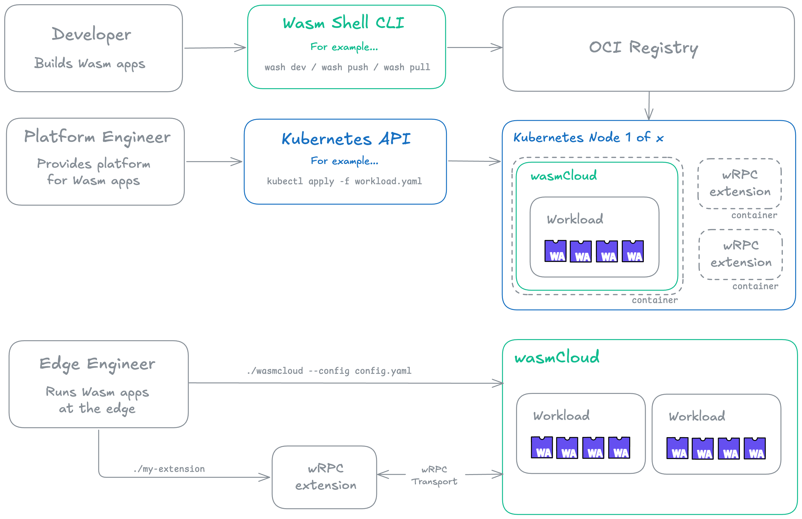

# wasmCloud

### wasmCloud is a cloud native platform for running WebAssembly workloads across any cloud, Kubernetes, datacenter, or edge.

The wasmCloud project is open source and Incubating with the [Cloud Native Computing Foundation (CNCF)](https://www.cncf.io/).

## The platform

The wasmCloud platform consists of three primary parts:

* [Wasm Shell (`wash`) CLI](./wash/index.mdx): A development tool for building and publishing WebAssembly components with languages including Go, TypeScript, Rust, and more. 
* [Runtime (`wash-runtime`)](./runtime/index.mdx): An easy-to-use runtime and workload API for executing WebAssembly components, with built-in support for WASI interfaces. 
* [Kubernetes Operator (`runtime-operator`)](./kubernetes-operator/index.mdx): An operations tool that runs wasmCloud infrastructure on Kubernetes. 

Component developers use the [Wasm Shell (`wash`) CLI](https://github.com/wasmCloud/wash/) to develop and publish components, and the [runtime-operator](https://github.com/wasmCloud/runtime-operator) integrates wasmCloud with Kubernetes. 

For an overview of core concepts in wasmCloud and WebAssembly, see the [Glossary](./glossary.mdx). 
