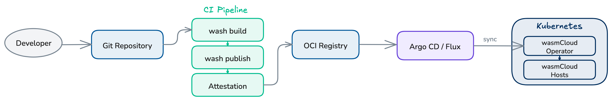

## Overview

wasmCloud components are distributed as [OCI artifacts](https://opencontainers.org/), so a CI/CD pipeline for wasmCloud follows a familiar pattern: build `.wasm` binaries, push them to an OCI registry, and update Kubernetes manifests to reference the new image.

The wasmCloud project provides a set of official [GitHub Actions](#wasmcloud-github-actions) that handle building components, publishing to OCI registries, and generating supply-chain attestations. For teams using GitOps, [Argo CD](#gitops-with-argo-cd) or Flux can close the loop by reconciling Kubernetes state with a Git repository.



## wasmCloud GitHub Actions

wasmCloud provides four GitHub Actions for CI pipelines:

| Action | Description |
|--------|-------------|
| [`wasmCloud/setup-wash-action`](https://github.com/wasmCloud/setup-wash-action) | Installs the `wash` CLI (and optional plugins) on the runner |
| [`wasmcloud/actions/setup-wash-cargo-auditable`](https://github.com/wasmCloud/actions/tree/main/setup-wash-cargo-auditable) | Configures `cargo-auditable` to embed SBOM data in Rust builds |
| [`wasmcloud/actions/wash-build`](https://github.com/wasmCloud/actions/tree/main/wash-build) | Builds a Wasm component, outputs the path to the built artifact |
| [`wasmcloud/actions/wash-oci-publish`](https://github.com/wasmCloud/actions/tree/main/wash-oci-publish) | Publishes a component to an OCI registry with optional attestation and SBOM |

### setup-wash-action

The [`setup-wash-action`](https://github.com/wasmCloud/setup-wash-action) installs `wash`, adds it to `PATH`, caches the binary, and installs the `wasm32-wasip2` Rust target. Optionally installs wash plugins (also cached).

```yaml
- uses: wasmCloud/setup-wash-action@main
  with:
    wash-version: "wash-v2.0.0-rc.7"    # version to install (default: wash-v2.0.0-rc.7)
    plugins: "ghcr.io/wasmcloud/plugin"  # optional comma-separated plugin URIs
```

### setup-wash-cargo-auditable

The [`setup-wash-cargo-auditable`](https://github.com/wasmCloud/actions/tree/main/setup-wash-cargo-auditable) action installs `cargo-auditable` and `cargo-audit`, then configures `.wash/config.yaml` so that `wash build` uses `cargo auditable build` under the hood. This embeds dependency metadata in the compiled binary for later SBOM extraction.

:::note[]
A Cargo project (`Cargo.toml`) must already exist in the working directory before calling this action, as it reads the package name to determine the component output path.
:::

```yaml
- uses: wasmcloud/actions/setup-wash-cargo-auditable@main
  with:
    working-directory: "."  # directory containing the project (default: .)
```

### wash-build

The [`wash-build`](https://github.com/wasmCloud/actions/tree/main/wash-build) action runs `wash build --output json` and exposes the path to the built component as a step output.

```yaml
- id: build
  uses: wasmcloud/actions/wash-build@main
  with:
    working-directory: "."  # directory containing the project (default: .)
```

**Output:** `steps.build.outputs.component_path` &mdash; path to the built `.wasm` file.

### wash-oci-publish

The [`wash-oci-publish`](https://github.com/wasmCloud/actions/tree/main/wash-oci-publish) action pushes the built component to an OCI registry. When attestation is enabled, the action generates build provenance and an SBOM (converted from CycloneDX to SPDX format).

```yaml
- uses: wasmcloud/actions/wash-oci-publish@main
  with:
    component_path: ${{ steps.build.outputs.component_path }}  # required
    registry: ghcr.io                                          # default: ghcr.io
    attestation: "true"                                        # default: false
    image_tags: "latest,v1.0.0,${{ github.sha }}"              # default: branch name
```

:::note[]
When `attestation` is enabled, the workflow needs the following permissions. See [Supply chain security](#supply-chain-security) for details.
```yaml
permissions:
  contents: write
  packages: write
  attestations: write
  id-token: write
```
:::

## Example: Build and publish pipeline

The following GitHub Actions workflow builds a Rust-based Wasm component with auditable dependency metadata, publishes it to GitHub Container Registry, and generates supply-chain attestations:

```yaml
name: Build and Publish Component
on:
  push:
    tags:
      - "v*"

permissions:
  contents: write
  packages: write
  attestations: write
  id-token: write

jobs:
  build-and-publish:
    runs-on: ubuntu-latest
    steps:
      - uses: actions/checkout@v6

      - name: Setup wash CLI
        uses: wasmCloud/setup-wash-action@main

      - name: Setup cargo-auditable
        uses: wasmcloud/actions/setup-wash-cargo-auditable@main

      - name: Build component
        id: build
        uses: wasmcloud/actions/wash-build@main

      - name: Publish component
        uses: wasmcloud/actions/wash-oci-publish@main
        with:
          component_path: ${{ steps.build.outputs.component_path }}
          registry: ghcr.io
          attestation: "true"
          image_tags: "latest,${{ github.ref_name }}"
```

This pipeline triggers on version tags (e.g. `v1.0.0`). The published image will be tagged with both `latest` and the Git tag.

## GitOps with Argo CD

For production deployments, a GitOps workflow keeps Kubernetes state in sync with a Git repository. [Argo CD](https://argo-cd.readthedocs.io/) is a popular GitOps tool for Kubernetes and pairs well with the wasmCloud operator.

### Two-application pattern

A common pattern uses two Argo CD Applications:

1. **Infrastructure Application** &mdash; deploys the wasmCloud platform (operator, NATS, hosts) from the [Helm chart](../index.mdx).
2. **Workloads Application** &mdash; deploys `WorkloadDeployment` manifests from a dedicated Git repository.

This separation lets infrastructure and workload teams operate independently, each managing their own deployment cadence.

### Example Argo CD Applications

**Infrastructure Application** &mdash; installs the wasmCloud operator via Helm:

```yaml
apiVersion: argoproj.io/v1alpha1
kind: Application
metadata:
  name: wasmcloud-platform
  namespace: argocd
spec:
  project: default
  source:
    chart: runtime-operator
    repoURL: ghcr.io/wasmcloud/charts
    targetRevision: v2-canary
    helm:
      releaseName: wasmcloud
  destination:
    server: https://kubernetes.default.svc
    namespace: default
  syncPolicy:
    automated:
      prune: true
      selfHeal: true
```

**Workloads Application** &mdash; syncs `WorkloadDeployment` manifests from a Git repository:

```yaml
apiVersion: argoproj.io/v1alpha1
kind: Application
metadata:
  name: wasmcloud-workloads
  namespace: argocd
spec:
  project: default
  source:
    repoURL: https://github.com/<org>/wasmcloud-workloads.git
    targetRevision: main
    path: manifests
  destination:
    server: https://kubernetes.default.svc
    namespace: default
  syncPolicy:
    automated:
      prune: true
      selfHeal: true
```

### Automating manifest updates

After the CI pipeline publishes a new component image, a second workflow job can update the `WorkloadDeployment` manifest in the workloads repository and open a pull request:

```yaml
  update-manifests:
    needs: build-and-publish
    runs-on: ubuntu-latest
    steps:
      - uses: actions/checkout@v6
        with:
          repository: <org>/wasmcloud-workloads
          token: ${{ secrets.WORKLOADS_REPO_TOKEN }}

      - name: Update image tag
        run: |
          sed -i "s|image: ghcr.io/<org>/my-component:.*|image: ghcr.io/<org>/my-component:${{ github.ref_name }}|" \
            manifests/my-component.yaml

      - name: Create pull request
        uses: peter-evans/create-pull-request@v7
        with:
          title: "Update my-component to ${{ github.ref_name }}"
          commit-message: "chore: update my-component to ${{ github.ref_name }}"
          branch: "update-my-component-${{ github.ref_name }}"
```

Once merged, Argo CD detects the change and rolls out the new version automatically.

:::info[]
This pattern works with any GitOps tool that watches a Git repository for changes, including [Flux](https://fluxcd.io/).
:::

## Supply chain security

The wasmCloud GitHub Actions support a full supply-chain security pipeline using `cargo-auditable`, CycloneDX, and GitHub's built-in attestation actions.

The attestation flow works as follows:

1. **`setup-wash-cargo-auditable`** configures `cargo-auditable` via `.wash/config.yaml` so that dependency metadata is embedded in the compiled binary during `wash build`.
2. **`wash-oci-publish`** (with `attestation: "true"`) extracts the embedded metadata and generates attestations:
   - Extracts a CycloneDX SBOM from the binary using `auditable2cdx`
   - Converts the SBOM to SPDX format using `cyclonedx-cli`
   - Generates an SBOM attestation via [`actions/attest-sbom`](https://github.com/actions/attest-sbom)
   - Generates build provenance via [`actions/attest-build-provenance`](https://github.com/actions/attest-build-provenance)

For attestation to work, the workflow must include the following permissions block:

```yaml
permissions:
  contents: write       # required for attestation uploads
  packages: write       # required for OCI registry push
  attestations: write   # required for attestation creation
  id-token: write       # required for OIDC token (provenance signing)
```

:::warning[]
Without all four permissions, the attestation steps will fail. If you don't need attestation, you can omit these permissions and set `attestation: "false"` (the default).
:::
