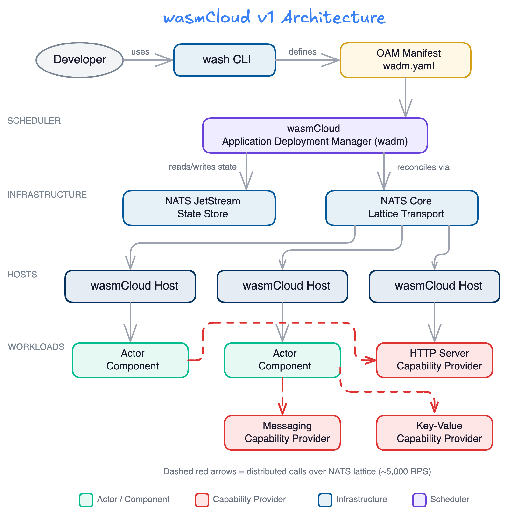
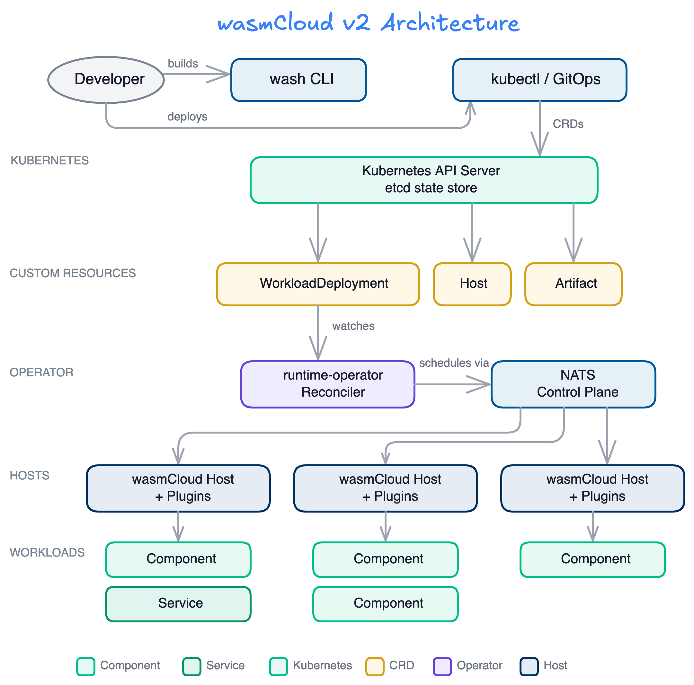
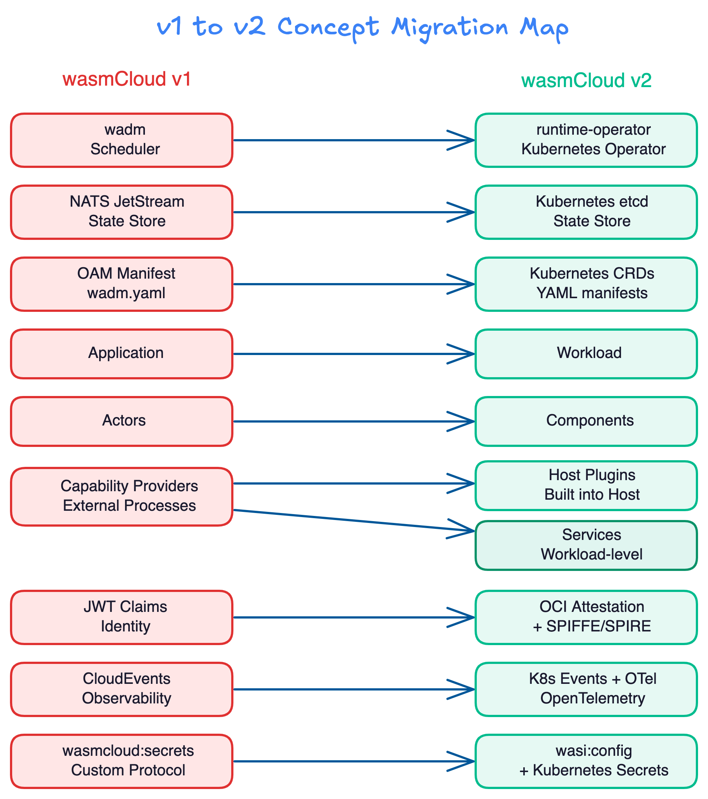
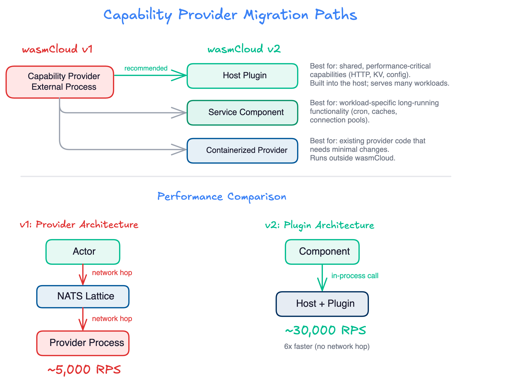
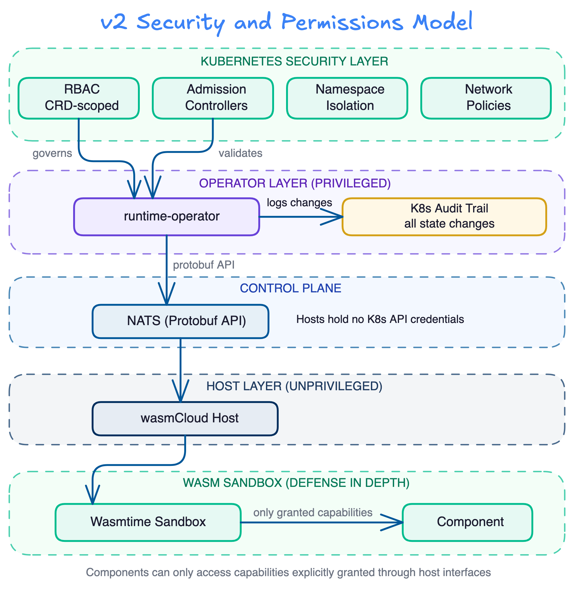
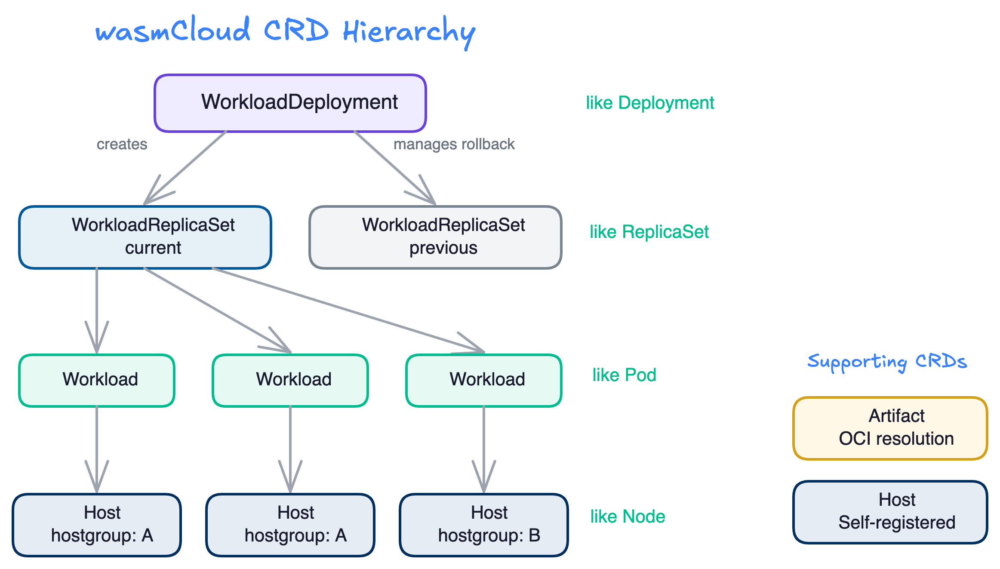
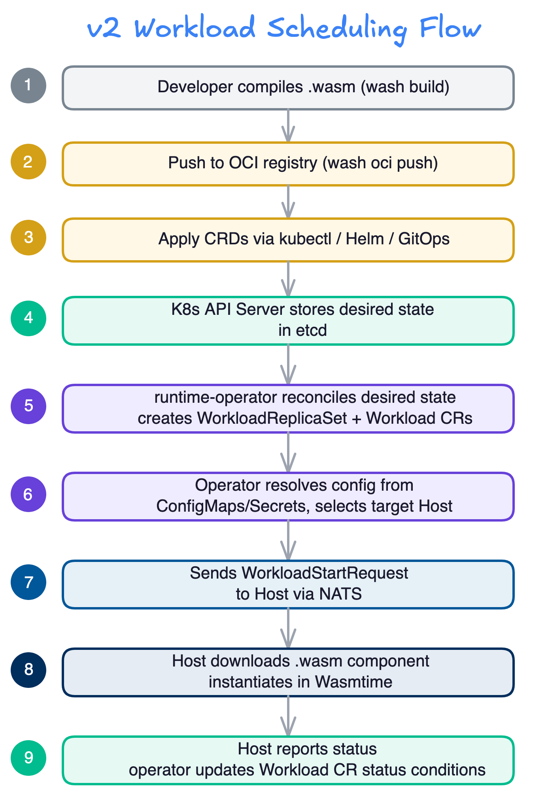

# Migration to v2

### Migrating to wasmCloud v2 reduces operational complexity and dramatically improves performance.

This guide walks through the architectural differences between wasmCloud v1 and v2, the benefits of migrating, and practical steps for bringing your v1 workloads to v2.

## What changed and why

wasmCloud v1 introduced a powerful model for distributed WebAssembly, but operational experience revealed several areas for improvement:

- **The v1 wasmCloud Application Deployment Manager (`wadm`) required its own StatefulSet and persistent JetStream storage**, adding operational surface area and failure modes to every deployment.
- **The `wadm` reconciler had resiliency issues**&mdash;eventually-consistent reconciliation could become stale or divergent, requiring manual intervention during degraded NATS scenarios.
- **OAM (the Open Application Model) was deprecated**, creating friction for teams using modern OCI supply chain security.
- **The v1 host was overburdened**, responsible for reading/writing state to JetStream, fetching OCI artifacts, managing secrets, assembling link graphs, and more.
- **Capability providers added network hops for every call**, limiting performance to ~5,000 requests-per-second compared to ~30,000 RPS with in-process calls.

wasmCloud v2 addresses all of these issues with a new architecture built on Kubernetes-native primitives and a simplified runtime.

## Architecture comparison

### wasmCloud v1 architecture

In v1, `wadm` acted as the workload scheduler, storing state in NATS JetStream and communicating with hosts over the NATS lattice. Capability providers ran as separate external processes, and applications were defined using OAM manifests.



Key characteristics of v1:
- **`wadm`** managed application lifecycle using OAM manifests
- **NATS JetStream** stored all scheduler state
- **Capability providers** ran as separate processes, communicating over NATS
- **Actors** (now called components) linked to providers over the network
- **All inter-component communication** traversed the NATS lattice

### wasmCloud v2 architecture

In v2, the Kubernetes operator (`runtime-operator`) replaces `wadm` as the workload scheduler. State is stored in Kubernetes `etcd`, workloads are defined using Kubernetes CRDs, and capability providers are replaced by [host plugins](./overview/hosts/plugins.mdx) and [services](./overview/workloads/services.mdx).



Key characteristics of v2:
- **`runtime-operator`** manages workload lifecycle using Kubernetes CRDs
- **Kubernetes `etcd`** stores all desired state
- **Host plugins** provide capabilities in-process for dramatically better performance
- **Components and services** run within a workload on the same host
- NATS serves as the **control plane** between operator and hosts (not the data plane)

## Concept migration map

The following diagram maps v1 concepts to their v2 equivalents:



| wasmCloud v1 | wasmCloud v2 | Notes |
|---|---|---|
| `wadm` (scheduler) | `runtime-operator` (K8s operator) | Kubernetes-native reconciliation replaces custom reconciler |
| NATS JetStream (state store) | Kubernetes `etcd` | Data stays in-cluster; no separate StatefulSet required |
| OAM manifest (`wadm.yaml`) | Kubernetes CRDs (YAML) | Standard Kubernetes tooling (kubectl, Helm, ArgoCD) |
| Application | [Workload](./overview/workloads/index.mdx) | Workloads consist of components and optional services |
| Actors | [Components](./overview/workloads/components.mdx) | Same concept, updated terminology |
| Capability providers | [Host plugins](./overview/hosts/plugins.mdx) / [Services](./overview/workloads/services.mdx) | In-process instead of over-the-network |
| JWT claims (identity) | OCI attestation + SPIFFE/SPIRE | Industry-standard workload identity |
| CloudEvents (observability) | K8s Events + OpenTelemetry | Native Kubernetes observability |
| `wasmcloud:secrets` | `wasi:config` + K8s Secrets | Standard WASI interfaces with Kubernetes Secrets backend |
| Config service | `wasi:config` + K8s ConfigMaps | Standard WASI interfaces with Kubernetes ConfigMaps backend |
| Policy service | K8s admission controllers | Standard Kubernetes policy enforcement |

## Benefits of migrating

### Kubernetes-native operations

wasmCloud v2 is designed to work with the tools and patterns that platform teams already know:

- **`kubectl`** for managing resources
- **Helm** for packaging and deploying
- **ArgoCD / Flux** for GitOps workflows
- **OPA / Gatekeeper** for policy enforcement
- **Prometheus / OpenTelemetry** for observability

There is no need for wasmCloud-specific deployment tooling.

### Performance improvement

Replacing external capability providers with host plugins eliminates network hops for host-provided functionality:



In v1, every call from an actor to a capability provider traversed the NATS lattice, adding latency and the possibility of message loss. In v2, host plugins serve capabilities in-process, achieving approximately **6x higher throughput** (~30,000 RPS vs. ~5,000 RPS).

### Simplified operational footprint

wasmCloud v2 eliminates several components that v1 required for every deployment:

- No `wadm` StatefulSet to provision and maintain
- No JetStream persistent storage for scheduler state
- No custom reconciler with resiliency concerns
- Kubernetes `etcd` provides the state store
- Kubernetes controller reconciliation provides mature, battle-tested convergence

### Improved security model

wasmCloud v2 leverages Kubernetes-native security boundaries:



- **CRD-scoped RBAC**: The operator's ClusterRole is scoped exclusively to the `runtime.wasmcloud.dev` API group
- **Namespace isolation**: Workloads respect Kubernetes namespace boundaries
- **Privilege separation**: Only the operator is privileged; hosts hold no Kubernetes API credentials
- **Wasm sandboxing**: Components run in Wasmtime's sandbox, accessing only explicitly granted capabilities
- **Audit trail**: All state changes flow through the Kubernetes API server audit log
- **Network policies**: Hosts are subject to standard Kubernetes NetworkPolicies

### Data locality

All desired state remains within the cluster as Kubernetes custom resources backed by `etcd`. No external coordination services, cross-cluster state synchronization, or centralized control planes are required. Each cluster operates as an autonomous unit.

## How the CRD hierarchy works

wasmCloud v2 uses five Custom Resource Definitions in the `runtime.wasmcloud.dev/v1alpha1` API group, following patterns familiar from core Kubernetes resources:



| wasmCloud CRD | Kubernetes Analog | Purpose |
|---|---|---|
| `WorkloadDeployment` | `Deployment` | Manages rollouts of WorkloadReplicaSets |
| `WorkloadReplicaSet` | `ReplicaSet` | Manages replica count of Workloads |
| `Workload` | `Pod` | Single schedulable unit (components + optional service) |
| `Host` | `Node` | Registers capacity, receives scheduling decisions |
| `Artifact` | *(no direct analog)* | OCI image resolution and caching |

For most users, [`WorkloadDeployment`](./kubernetes-operator/crds.mdx#workloaddeployment) is the primary resource for deploying Wasm workloads. See the [CRD reference](./kubernetes-operator/crds.mdx) for full details and example manifests.

## How workload scheduling works in v2

The following diagram illustrates the complete flow from building a component to running it on a wasmCloud host:



1. **Developer compiles** a `.wasm` component from source using `wash build` or native toolchain
2. **Component is pushed** to an OCI registry using `wash oci push`
3. **CRDs are applied** to Kubernetes via `kubectl`, Helm, or GitOps tooling
4. **Kubernetes API server** stores the desired state in `etcd`
5. **`runtime-operator` reconciles** the desired state, creating `WorkloadReplicaSet` and `Workload` CRs
6. **Operator resolves configuration** from ConfigMaps/Secrets and selects a target Host matching the `hostSelector`
7. **Operator sends a `WorkloadStartRequest`** to the selected host via NATS
8. **Host downloads the `.wasm` component** and instantiates it in Wasmtime
9. **Host reports status**; operator updates the Workload CR status conditions

## Migration guide

### Migrating capability providers

This is likely the most significant change for v1 users. In v1, capability providers were external processes that communicated over NATS. In v2, there are three approaches depending on your use case:

#### Host plugins (recommended)

For shared, performance-critical capabilities (HTTP serving, key-value storage, configuration), **host plugins** are the recommended approach. Plugins are built into the host and serve capabilities to many workloads with in-process performance.

You can find a [basic example](https://github.com/wasmCloud/wash/tree/main/crates/wash-runtime#usage) in the `wash-runtime` repository.

#### Service components

For workload-specific, long-running functionality (cron jobs, connection pools, in-memory caches), use a **service component** within the workload. Services run continuously alongside components and can listen on TCP ports.

You can find an [example of a cron service](https://github.com/wasmCloud/wash/tree/main/examples/cron-service) in the `wash/examples` repository.

#### Containerized providers

For existing provider code that you want to migrate with minimal changes, you can **containerize the provider** and run it outside wasmCloud. This requires manually facilitating communication between your components and the provider via [wRPC](https://github.com/bytecodealliance/wrpc).

### Migrating applications to workloads

The v1 "Application" abstraction has been replaced by the [Workload](./overview/workloads/index.mdx). Where a v1 application was defined in an OAM manifest, a v2 workload is defined as a Kubernetes `WorkloadDeployment` CR:

**v1 (wadm.yaml using OAM):**

```yaml
apiVersion: core.oam.dev/v1beta1
kind: Application
metadata:
  name: hello-world
  annotations:
    version: v0.0.1
spec:
  components:
    - name: http-component
      type: component
      properties:
        image: ghcr.io/wasmcloud/components/http-hello-world:0.1.0
      traits:
        - type: spreadscaler
          properties:
            instances: 3
        - type: linkdef
          properties:
            target: httpserver
            values:
              address: 0.0.0.0:8080
    - name: httpserver
      type: capability
      properties:
        image: ghcr.io/wasmcloud/http-server:0.21.0
```

**v2 (Kubernetes CRD):**

```yaml
apiVersion: runtime.wasmcloud.dev/v1alpha1
kind: WorkloadDeployment
metadata:
  name: hello-world
  namespace: default
spec:
  replicas: 3
  template:
    spec:
      hostSelector:
        hostgroup: default
      components:
        - name: http-component
          image: ghcr.io/wasmcloud/components/http-hello-world-rust:0.1.0
          poolSize: 10
      hostInterfaces:
        - namespace: wasi
          package: http
          interfaces:
            - incoming-handler
          config:
            address: '0.0.0.0:8080'
```

Key differences:
- No separate capability provider component&mdash;HTTP serving is provided by a **host plugin**
- No link definitions&mdash;host interfaces are declared in the workload spec
- Replicas are managed by the `WorkloadDeployment`, following the same pattern as Kubernetes `Deployment`
- Standard Kubernetes `hostSelector` replaces OAM spread scalers

### Migrating secrets

In v1, the `wasmcloud:secrets` interface provided secrets access through a custom protocol. In v2, secrets are managed through standard Kubernetes Secrets and accessed via the `wasi:config` interface:

```yaml
# v2: Secrets via Kubernetes Secrets
components:
  - name: my-component
    image: ghcr.io/my-org/my-component:0.1.0
    localResources:
      environment:
        secretFrom:
          - name: my-k8s-secret
```

### Migrating configuration

The v1 config service is replaced by `wasi:config` backed by Kubernetes ConfigMaps:

```yaml
# v2: Configuration via ConfigMaps
components:
  - name: my-component
    image: ghcr.io/my-org/my-component:0.1.0
    localResources:
      environment:
        configFrom:
          - name: my-configmap
        config:
          LITERAL_KEY: literal_value
```

### Migrating distributed networking

In v1, components communicated over the network automatically through the NATS lattice. In v2, networking is [intentionally more explicit](./faq.mdx#how-do-distributed-applications-work-in-wasmcloud-v2). Components within the same workload communicate in-process. When distributed communication is required, use interfaces like `wasmcloud:messaging` with manual serialization/deserialization.

This change reflects a deliberate performance decision: in-process calls achieve ~30,000 RPS while distributed calls achieve ~5,000 RPS.

## Important considerations

### Kubernetes native

wasmCloud v2 is primarily designed for Kubernetes deployments. While the `wash-runtime` workload API can work with any orchestrator, and the operator can run with a standalone Kubernetes API server for lightweight scenarios, maintainer efforts are focused on the Kubernetes use case.

See the [FAQ](./faq.mdx#do-i-have-to-use-kubernetes-with-wasmcloud-v2) for more details.

### What has been intentionally removed

Several v1 subsystems have been replaced by industry standards:

- **JWT Claims**: Replaced by OCI artifact attestation and SPIFFE/SPIRE for workload identity
- **XKey Encoding**: Replaced with standard ed25519 key handling
- **CloudEvents**: Replaced by Kubernetes-native mechanisms (CRD status conditions, Kubernetes Events) and OpenTelemetry
- **External Capability Providers**: Replaced by host plugins and services
- **`wasmcloud:secrets`**: Replaced by `wasi:config` backed by Kubernetes Secrets
- **Config Service**: Replaced by `wasi:config` via ConfigMaps and Secrets
- **Policy Service**: Replaced by Kubernetes admission controllers and component-level capability-based security

### Learning curve

Teams migrating to v2 will need to learn:
- The [wasmCloud CRD schema](./kubernetes-operator/crds.mdx) (similar to core Kubernetes resources)
- Host plugin development (for custom capabilities)
- The [Workload](./overview/workloads/index.mdx) abstraction (replacing Applications)

## Getting started with v2

If you're ready to begin migrating:

1. **[Install wasmCloud v2](./installation.mdx)** to set up your environment
2. **[Read the Platform Overview](./overview/index.mdx)** to understand v2 concepts
3. **[Follow the Developer Guide](./wash/developer-guide/index.mdx)** to build and publish your first v2 component
4. **[Review the CRD reference](./kubernetes-operator/crds.mdx)** to understand how to define workloads
5. **[Check the FAQ](./faq.mdx)** for answers to common migration questions
