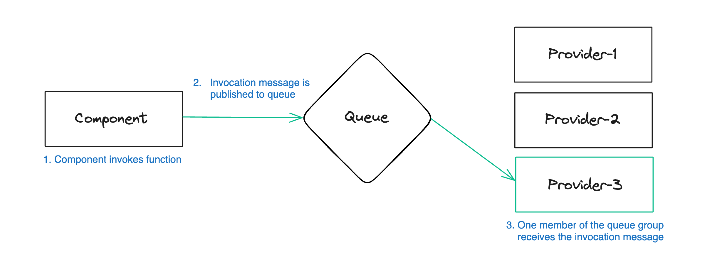

### NATS provides transport between hosts and the operator.

In wasmCloud, transport between hosts and the operator is handled by [**NATS**](https://nats.io/), an open source connective technology hosted by the Cloud Native Computing Foundation (CNCF). NATS enables secure application-layer networking across diverse environments including edge, different vendors' clouds, and on-premise datacenters.

NATS is designed to provide seamless connectivity tailored specifically to distributed systems, avoiding the complexities and limitations of 1:1 communication frameworks like HTTP or gRPC in distributed use cases. 

**Note**: Calls between [services](./workloads/services.mdx) and [components](./workloads/components.mdx) **do not** use NATS. See [Workloads](./workloads/index.mdx) for more information.

## Essential NATS concepts

NATS conceptualizes communications as **messages**. Applications send and receive messages identified by **subject** strings. In addition to the subject, messages contain a byte array payload and any number of header fields.

:::info[Topics and subjects]
What is called a **"subject"** in NATS is often called a **"topic"** in messaging systems more generally, including Apache Kafka, Google Cloud Pub/Sub, and Confluent, as well as the [`wasi-messaging` proposal](https://github.com/WebAssembly/wasi-messaging). In this documentation, we use "subject" in NATS-specific contexts, but you can think of "topic" and "subject" as essentially interchangeable.
:::

An entity that sends a message is a **publisher**. When a publisher sends a message, it may be received by one or more **subscribers**. This one-to-many communication pattern is called the [**publish-subscribe**](https://docs.nats.io/nats-concepts/core-nats/pubsub) model.

NATS supports a **[request-reply](https://docs.nats.io/nats-concepts/core-nats/reqreply)** pattern built on the publish-subscribe model. A publisher may send a "reply" message (the "request") on a given subject. Entities subscribed to the subject may send replies which are automatically directed back to the original request publisher.

In addition to the core publish-subscribe functionality, NATS provides **streaming** and **key-value storage** through its distributed persistence system called **[JetStream](https://docs.nats.io/nats-concepts/jetstream)**:

- **[Streams](https://docs.nats.io/nats-concepts/jetstream/streams)** are stores for messages on a given subject.
- **[Buckets](https://docs.nats.io/nats-concepts/jetstream/key-value-store)** are immediately consistent key-value stores using strings as keys and byte arrays as values (used in wasmCloud for tasks such as storing application manifests).

### Queue subscriptions

In addition to subscribing to a subject, subscribers may register themselves as part of a [**queue group**](https://docs.nats.io/using-nats/developer/receiving/queues): a collection of potential receivers between whom messages are automatically load-balanced, so that _only one subcriber_ ultimately receives the message. There is an equal likelihood that any given member of the queue group will receive any given message.

Usage of queue groups is defined at the publisher and subscriber level, meaning that it can facilitate workload scaling with server configuration.

In wasmCloud, components and providers use this **queue subscription** model to subscribe to invocations. When a component or provider exports a function, the system creates a queue subscription on a NATS subject that other entities can call.



In the diagram above:

1. A component imports a function on a linked provider over a shared interface.
2. When the component runs, an invocation message is published to a queue group.
3. There are three instances of the linked provider on the lattice. Any one of those three could receive the invocation. In this case, `Provider-3` gets the invocation message and runs its exported function.

With this basic model, queue groups and queue subscription facilitate horizontal scaling, load balancing, and failover for components and providers.

## Using the NATS CLI

You can interact directly with NATS using the NATS CLI. While it is not necessary to install the NATS CLI to use wasmCloud, it can be useful for troubleshooting. Installation instructions for the CLI are available on the [NATS CLI GitHub repo](https://github.com/nats-io/natscli).

To list all streams on your NATS network:

```shell
nats stream list
```

You can list all key-value buckets on your NATS instance with:

```shell
nats kv list
```

{/* For more information on troubleshooting and NATS, see the [troubleshooting](/docs/developer/troubleshooting/host#clear-nats-streams-and-buckets) section. */}

## Keep reading

{/* - See the [NATS Reference](/docs/category/nats/) for complete reference documentation on NATS usage in wasmCloud
- See the Operator Guide for instructions on [provisioning NATS for wasmCloud](/docs/category/provisioning-nats) in production environments.
- For information on authenticating to NATS with accounts and users, see [Connecting NATS to Wadm](/docs/deployment/wadm/nats-credentials).
- You can [use the `wash` CLI to open a WebSocket port](/docs/cli/wash#wash-up) utilizing [WebSocket support in NATS](https://docs.nats.io/running-a-nats-service/configuration/websocket). */}
- For more information on NATS, see the [NATS documentation](https://docs.nats.io/).
