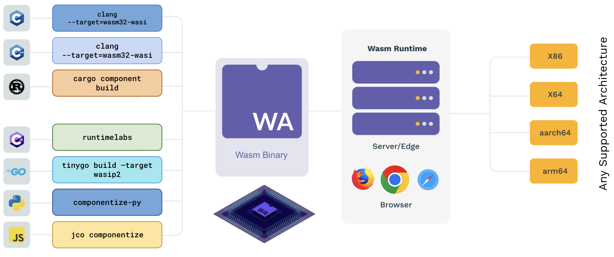

### Workloads are composed of one or more WebAssembly (Wasm) components. 

**Components** are portable, interoperable binaries (`.wasm` files) that implement stateless logic, typically enacting the core logic of an application (for example, the API for a web application), while leaving stateful or reusable functionality (e.g., key-value storage or HTTP) to [hosts](./hosts/index.mdx) and [host plugins](./hosts/plugins.mdx).

The [wasmCloud host](./hosts/index.mdx) runs components in cloud and edge environments, while the [Wasm Shell (`wash`) CLI](../wash/index.mdx) helps developers build and publish components. Workloads are defined according to the wasmCloud runtime's Workload API. For most users, this means defining the Workload in a Kubernetes manifest with the [`WorkloadDeployment` custom resource](../kubernetes-operator/crds.mdx#workloaddeployment). 

## Features of components

Components may be compiled from a variety of languages including Rust, Go, Python, JavaScript, and more. Because components can be compiled from many different languages and then interact with one another, they enable developers to break down language silos and utilize libraries and tooling in new ways. 

*Components can compile from a variety of languages and run across architectures. The [`wash build`](../wash/commands.mdx#wash-build) command can compile components from any language, leveraging language-specific toolchains.*

Components are secure-by-default, portable, interoperable, and composable:

* **Secure-by-default**: Components can't use capabilities without mediation by the host, so they are incapable of interacting with any operating system functionality on their own. The only way components can affect their external environment is through an explicitly permitted capability facilitated by a host.
* **Portable**: Because WebAssembly binaries execute against a virtual instruction set architecture (essentially a tiny VM), they are agnostic to architecture and operating system kernel; they run anywhere there is a WebAssembly runtime. Component binaries are typically much smaller than analogous container images, as well&mdash;often measured in kilobytes&mdash;enabling them to run in resource-constrained environments where even containers aren't practical. 
* **Interoperable**: Components can interact with one another over high-level APIs regardless of their respective languages of origin, so that a component written in Rust can utilize the functionality of a library from Go. 
* **Composable**: Multiple components can be combined into a single binary (or dynamically linked at runtime in wasmCloud). This enables developers to build applications as if with construction bricks, satisfying dependencies with other components as needed. 

The wasmCloud runtime dynamically links components in the same Workload at runtime. 

Components follow the principles of **[reactive programming](https://en.wikipedia.org/wiki/Reactive_programming)**: they only run when invoked by another entity. An invocation might originate from another component's function call, an extension, or a message from the [wasmCloud host](./hosts/index.mdx). In turn, components can invoke exposed functions on other components or the host.

## Connected by abstractions

wasmCloud components are _loosely coupled_ with the extensions they use for non-functional requirements. A component doesn't communicate with **Redis** or **Cassandra** or **Consul**; instead it communicates with a generalized abstraction over the `keyvalue` interface.

An [interface](./interfaces.mdx) represents an abstracted functionality. As long as an extension implements the correct interface, it's considered compatible with your component. A component written using the `keyvalue` interface should be able to work with _any_ key-value store. This decoupling also enables swapping the store at runtime without requiring a rebuild or redeploy. Learn more about wasmCloud's interface support on the [Interfaces](./interfaces.mdx) page.

## Open standards

The wasmCloud project is committed to supporting a componentized ecosystem and remains up-to-date with the latest versions of the [Wasmtime](https://wasmtime.dev/) WebAssembly runtime and [WebAssembly System Interface (WASI) P2](https://wasi.dev/interfaces#wasi-02), a set of standard APIs designed to allow WebAssembly components to access external resources in a safe and portable way.

Components are defined according to the [Component Model](https://github.com/WebAssembly/component-model), an open standard governed by the [W3C WebAssembly Community Group](https://www.w3.org/community/webassembly/) that describes a layer of specification in addition to that of a core WebAssembly module. 

In principle, any language can compile code to a component; the maturity of compilers varies by language, and component tooling is developing rapidly since the release of WASI 0.2 in January 2024. You can find practical tooling for working with components in [Useful WebAssembly Tooling](../wash/developer-guide/useful-webassembly-tools.mdx). We aim to support WASI P3 swiftly upon release. 

## Keep reading

[Continue to learn more about extensions](./hosts/index.mdx), or...

- Dig deeper on creating components in the [Developer Guide](../wash/developer-guide/index.mdx).