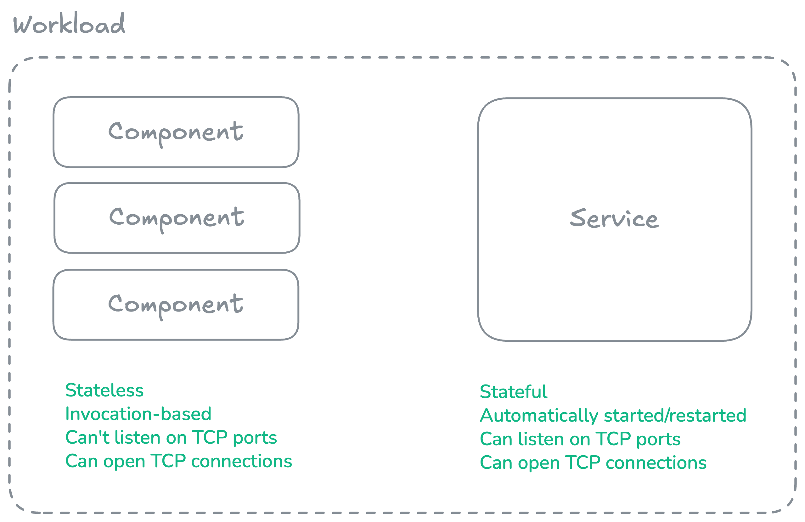

### Workloads are composed of one or more WebAssembly (Wasm) components and an optional service. 

A wasmCloud **workload** is an application-level abstraction that consists of one or more [**components**](./components.mdx) and optionally a [**service**](./services.mdx).

- **Components** are portable, interoperable binaries (`.wasm` files) that implement stateless logic, typically enacting the core logic of an application (for example, the API for a web application), while leaving stateful or reusable functionality (e.g., key-value storage or HTTP) to [services](./services.mdx), [hosts](../hosts/index.mdx), and [host plugins](../hosts/plugins.mdx).
  * You can find a simple example of a Rust-based "Hello world!" component in [`wash/examples`](https://github.com/wasmCloud/wash/tree/main/examples/http-hello-world).

- **Services** are persistent, stateful Wasm binaries that can act as `localhost` within the workload boundary and provide long-running processes.
  * You can find a simple example of a Rust-based cron service in [`wash/examples`](https://github.com/wasmCloud/wash/tree/main/examples/cron-service).

The [wasmCloud host](../hosts/index.mdx) runs workloads in cloud and edge environments, while the [Wasm Shell (`wash`) CLI](../../wash/index.mdx) helps developers build and publish components and services. 

Workloads are defined according to the [wasmCloud runtime's Workload API](https://github.com/wasmCloud/wash/blob/main/proto/wasmcloud/runtime/v2/workload.proto). For most users, this means defining the workload in a Kubernetes manifest with the [`WorkloadDeployment` custom resource](../../kubernetes-operator/crds.mdx#workloaddeployment). 

## Usage

Workloads are application-level units that combine components and services. Example use cases include:

- **Microservices**: Deploy a workload as a single microservice—for example, an order processing service with a component handling business logic and a service maintaining database connections.
- **API backends**: Build HTTP APIs where components handle request routing and response generation while services manage authentication state or connection pools.
- **Event processors**: Create workloads that respond to events from message queues, with components processing messages and services maintaining connections to the queue.
- **Scheduled jobs**: Run batch processing workloads where a cron service triggers component invocations on a schedule.

## Components vs Services

| Feature | Components | Services |
|---------|------------|----------|
| **Lifecycle** | Invocation-based (stateless) | Long-running (stateful) |
| **State** | No state between invocations | Maintains state across lifetime |
| **TCP Listening** | ❌ Cannot listen on ports | ✅ Can listen on TCP ports |
| **TCP Outbound** | ✅ Can connect out | ✅ Can connect out |
| **Execution Model** | Invoked per request | Runs continuously (like traditional binaries) |
| **WASI Interface** | Component model | `wasi:cli/run` |
| **Restart Policy** | N/A (invoked as needed) | Automatically restarted on crash |

**Use a component when you need:**
- Stateless request/response patterns
- Pure computation or transformation
- Scaling with invocation-based concurrency
- Standard WIT interface implementations

**Use a service when you need:**
- Persistent connections (database connection pooling)
- Long-running state (in-memory caches)
- TCP server capabilities
- Cron/scheduled task execution
- Protocol adapters and bridges

## Keep reading

- [Continue to learn more about WebAssembly (Wasm) components](./components.mdx).
- Learn more about [services](./services.mdx).