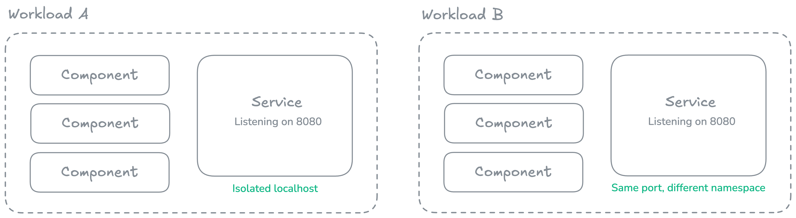
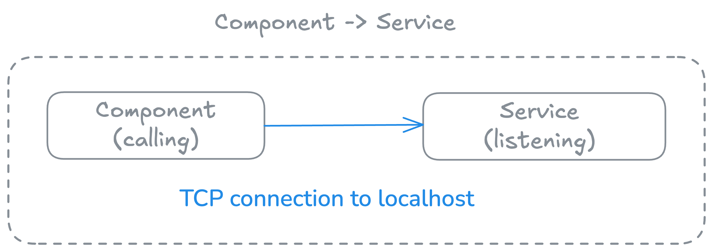
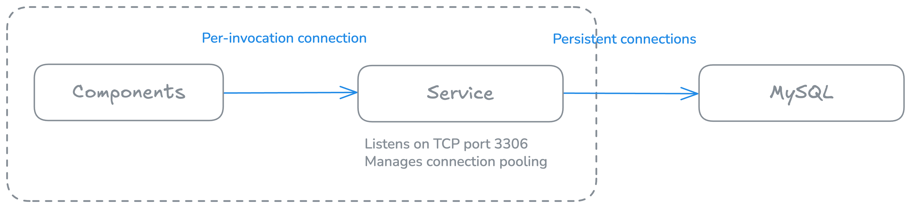
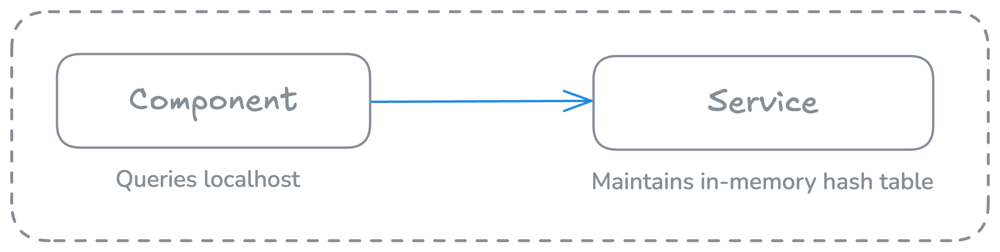

### Services are persistent, stateful companions to stateless components.

Workloads are composed of **components** and optionally a **service**. While services *are* Wasm components, they serve a fundamentally different role than a typical component in the architecture of an application. 

A service is essentially the "localhost" for a workload, acting as a persistent, stateful companion to stateless components, and providing capabilities that don't make sense for ephemeral invocations. Services are an important primitive for building complete applications that require both stateless, scalable components *and* stateful, long-running processes. 

By isolating services at the workload level and providing them with TCP capabilities, wasmCloud enables patterns like connection pooling, protocol bridging, and cron scheduling&mdash;all while maintaining strong security boundaries.

## Service as localhost

Services can open TCP sockets, listen on ports for incoming connections, and act as `127.0.0.1`/`localhost` within the workload boundary. Services run continuously for the lifetime of the workload.

When a component opens a TCP connection to `127.0.0.1` or `localhost`, it connects to the service within its own workload—**not** to the underlying host OS. This creates a strong isolation boundary.

Multiple workloads on the same [wasmCloud host](../hosts/index.mdx) can each have services listening on the same port (e.g., port 8080) without conflicts, as each workload has its own isolated network namespace.



## Communication flow

Services can call [interfaces](../interfaces.mdx) exported by components:


Components **cannot** call into the service via WIT interfaces. 

However, components **can** connect to TCP ports the service is listening on:



## Use cases

:::info[Developing services]
For instructions on how to develop services, see the [Wasm Shell (`wash`) Developer Guide](../../wash/developer-guide/create-services.mdx).
:::

### Connection pooling

Services are ideal for managing persistent connections to databases or external services. Components don't pay the overhead of establishing new TCP connections per invocation, and this approach enables efficient connection reuse across all component invocations.



### Cron or scheduled tasks

Implement cron-like functionality by having a service periodically call component interfaces. See the [cron service example](https://github.com/wasmCloud/wash/tree/main/examples/cron-service) for a demonstration of how this can implemented:

```rust
wit_bindgen::generate!({
    world: "service"
});

// NOTE: This example is a `tokio::main` to show how you can use an async main, but
// it can just be a synchronous main as well.
#[tokio::main(flavor = "current_thread")]
async fn main() {
    eprintln!("Starting cron-service with 1 second intervals...");
    loop {
        tokio::time::sleep(std::time::Duration::from_secs(1)).await;
        let _ = wasmcloud::example::cron::invoke();
    }
}
```

### Stateful in-memory cache

Run a small key-value store that maintains state across invocations. Connections are extremely fast, since they use virtual pipes within the runtime rather than "real" TCP/IP.



### TCP server applications

Build TCP server applications directly in Wasm, such as the following TCP echo server that accepts incoming connections, echoes back any data received, and runs continuously for the workload's lifetime:

```rust
use wstd::io;
use wstd::iter::AsyncIterator;
use wstd::net::TcpListener;

#[wstd::main]
async fn main() -> io::Result<()> {
    let listener = TcpListener::bind("127.0.0.1:7070").await?;
    println!("Listening on {}", listener.local_addr()?);
    println!("type `nc localhost 7070` to create a TCP client");

    let mut incoming = listener.incoming();
    while let Some(stream) = incoming.next().await {
        let stream = stream?;
        println!("Accepted from: {}", stream.peer_addr()?);
        wstd::runtime::spawn(async move {
            // if echo copy fails, we can ignore it.
            let _ = io::copy(&stream, &stream).await;
        })
        .detach();
    }
    Ok(())
}
```

## Considerations

When developing applications with services, it is important to consider the following:

- **One service per workload**: Currently, workloads support a single service.
- **One-way communication**: Components cannot call service exports via WIT (but can use TCP).
- **Memory usage**: Services maintain state, so they consume memory continuously.
- **WASI P2**: Services currently compile to WASI P2 (`wasm32-wasip2` target).
- **Async runtime**: Can use single-threaded async runtimes (e.g., Tokio with single-threaded executor).
- **Restarts**: Services are automatically restarted if they crash.
- **Isolation**: Service network operations are isolated within the workload boundary.

:::note[Looking ahead]
As wasmCloud v2 moves from WASI P2 to P3 and beyond, services make it possible to bridge between TCP and WIT (WebAssembly Interface Types) for protocols that don't have native WASI support yet.
:::

## Keep reading

- [Continue to learn more about interfaces](../interfaces.mdx).
- Learn more about services' role within a component&mdash;and how to decide when you should use components or services&mdash;in [Workloads](./index.mdx).
- Learn how to develop services in the [Wasm Shell Developer Guide](../../wash/developer-guide/create-services.mdx).


