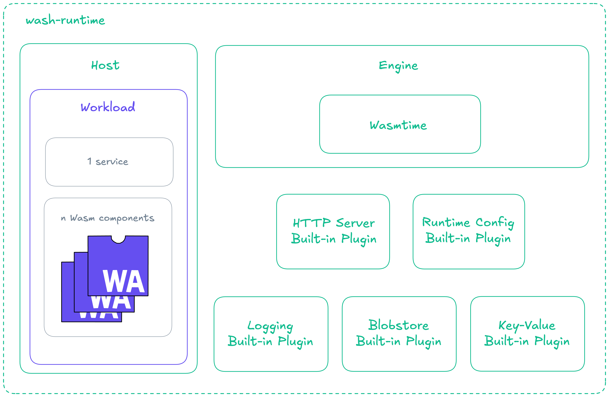

# Runtime

### wasmCloud's runtime (`wash-runtime`) is a simple, flexible runtime environment for WebAssembly workloads.

:::warning[Under construction]
This section is under active development&mdash;please check back soon for a more complete reference.
:::

[`wash-runtime`](https://github.com/wasmCloud/wash/tree/main/crates/wash-runtime) is a Rust crate that includes Wasmtime as the underlying runtime engine, as well as the wasmCloud host, which serves as a runtime environment for WebAssembly components. A plugin system allows for extension of the host with new and custom capabilities. 

The runtime provides easy-to-use abstractions over the low-level [Wasmtime API](https://wasmtime.dev/), as well as wasmCloud-specific APIs for managing workloads, handling NATS subscriptions, managing and utilizing host plugins, and more. 

## Architecture

The runtime provides three primary abstractions:

1. **Engine**: Wasmtime configuration and component compilation
2. **Host**: Runtime environment with plugin management
3. **Workload**: High-level API for managing component lifecycles



## WASI Interface Support

The crate includes two sets of built-in plugins (toggleable at runtime via feature flags), one working in-memory for development with `wash dev`, and the other backed by NATS for production deployment. Both sets of plugins contain the following interfaces:

- `wasi:http`
- `wasi:keyvalue`
- `wasi:blobstore`
- `wasi:config`
- `wasi:logging`
- `wasi:filesystem`
- `wasmcloud:messaging`

Hosts can be extended with additional host plugins at build-time.

## Usage

```rust
use std::sync::Arc;
use std::collections::HashMap;

use wash_runtime::{
    engine::Engine,
    host::{
        HostBuilder, HostApi,
        http::{HttpServer, DynamicRouter},
    },
    plugin::{
        wasi_config::WasiConfig,
    },
    types::{WorkloadStartRequest, Workload},
};

#[tokio::main]
async fn main() -> anyhow::Result<()> {
    // Create a Wasmtime engine
    let engine = Engine::builder().build()?;

    // Configure plugins
    let http_router = DynamicRouter::default();
    let http_handler = HttpServer::new(http_router, "127.0.0.1:8080".parse()?);
    let wasi_config_plugin = WasiConfig::default();

    // Build and start the host
    let host = HostBuilder::new()
        .with_engine(engine)
        .with_http_handler(Arc::new(http_handler))
        .with_plugin(Arc::new(wasi_config_plugin))?
        .build()?;

    let host = host.start().await?;

    // Start a workload
    let req = WorkloadStartRequest {
        workload_id: uuid::Uuid::new_v4().to_string(), // or any id you like
        workload: Workload {
            namespace: "test".to_string(),
            name: "test-workload".to_string(),
            annotations: HashMap::new(),
            service: None,
            components: vec![],
            host_interfaces: vec![],
            volumes: vec![],
        },
    };

    host.workload_start(req).await?;

    Ok(())
}
```

## `cargo` Features

The crate supports the following `cargo` features:

- `wasi-http` (default): HTTP client and server support via `wasmtime-wasi-http`
- `wasi-config` (default): Runtime configuration interface
- `wasi-logging` (default): Logging interface
- `wasi-blobstore` (default): Blob storage interface
- `wasi-keyvalue` (default): Key-value storage interface
- `oci`: OCI registry integration for pulling components

