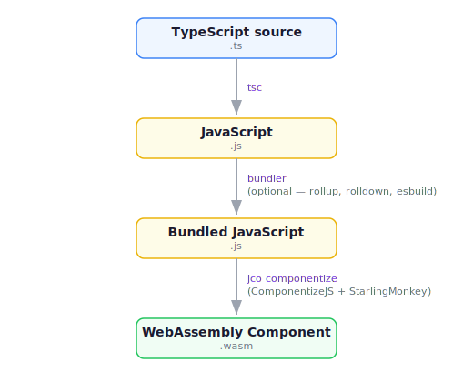

TypeScript and JavaScript are first-class languages for building WebAssembly components on wasmCloud. This guide covers the toolchain, patterns for handling HTTP requests, framework integration with Hono, and practical guidance for library compatibility.

If you're looking for a quick walkthrough of creating, building, and running a TypeScript component, see the [Developer Guide](../../index.mdx?lang=typescript).

## Toolchain overview

Building a TypeScript Wasm component involves a pipeline of tools that compile your code from TypeScript source to a `.wasm` binary. Understanding what each tool does will help you debug build issues and make informed decisions about your project setup.

### Build pipeline



### jco

[`jco`](https://github.com/bytecodealliance/jco) is the JavaScript component toolchain maintained by the Bytecode Alliance. It is the primary CLI tool for building and working with JavaScript Wasm components.

Key commands:

| Command | Description |
|---|---|
| `jco componentize` | Compile a JavaScript file into a Wasm component |
| `jco types` | Generate TypeScript type definitions from WIT interface files |
| `jco transpile` | Convert a Wasm component (from any language) into ES modules for Node.js or browsers |
| `jco serve` | Transpile and run a component as an HTTP server |

When you run `wash build` on a TypeScript project, `wash` executes the build script defined in your `package.json`, which typically calls `jco types`, `tsc`, and `jco componentize` in sequence.

### ComponentizeJS

[ComponentizeJS](https://github.com/bytecodealliance/ComponentizeJS) is the library behind `jco componentize`. It takes a JavaScript source file and a WIT world definition as input and produces a Wasm component binary.

Because JavaScript cannot be compiled ahead-of-time to raw WebAssembly instructions, ComponentizeJS embeds a JavaScript engine inside each component. It uses [Wizer](https://github.com/bytecodealliance/wizer) to pre-initialize the engine, parse your source code, and snapshot the result. At runtime, only the pre-compiled bytecode executes — there is no parsing or compilation overhead at startup.

### StarlingMonkey

[StarlingMonkey](https://github.com/bytecodealliance/StarlingMonkey) is the JavaScript engine embedded by ComponentizeJS. It is Mozilla's SpiderMonkey engine (the same engine used by Firefox) compiled to WebAssembly and targeting WASI 0.2.

StarlingMonkey provides a subset of standard Web APIs inside the Wasm sandbox:

- **`fetch()`** — outgoing HTTP requests (backed by `wasi:http`)
- **`Request` / `Response` / `Headers`** — standard Web request and response objects
- **`URL` / `URLSearchParams`** — URL parsing
- **`TextEncoder` / `TextDecoder`** — text encoding
- **`ReadableStream` / `WritableStream` / `TransformStream`** — WHATWG Streams
- **`addEventListener('fetch', ...)`** — incoming HTTP request handling (Service Worker pattern)
- **`setTimeout` / `setInterval`** — timers
- **`console.log` / `console.error`** — logging (routed to WASI stderr)
- **`crypto.getRandomValues()`** — cryptographic randomness (backed by `wasi:random`)

These Web APIs are what make framework compatibility possible — libraries written against Web Standards (rather than Node.js APIs) can run inside a Wasm component without modification.

:::note[Binary size]
Each JavaScript Wasm component includes the StarlingMonkey runtime, which adds approximately 8 MB to the component binary. This is a fixed cost — it does not grow with the size of your application code.
:::

## Handling HTTP requests

There are two patterns for handling incoming HTTP requests in a TypeScript component. They are **mutually exclusive** — you must choose one or the other for a given component.

### Direct `incomingHandler` export

The direct approach works with the raw WASI HTTP types. You export an `incomingHandler` object with a `handle` method that receives an `IncomingRequest` and a `ResponseOutparam`:

```typescript
import {
  IncomingRequest,
  ResponseOutparam,
  OutgoingBody,
  OutgoingResponse,
  Fields,
} from 'wasi:http/types@0.2.3';

function handle(req: IncomingRequest, resp: ResponseOutparam) {
  const outgoingResponse = new OutgoingResponse(new Fields());
  let outgoingBody = outgoingResponse.body();
  {
    let outputStream = outgoingBody.write();
    outputStream.blockingWriteAndFlush(
      new Uint8Array(new TextEncoder().encode('Hello from TypeScript!\n')),
    );
    // @ts-ignore: dispose the stream before returning
    outputStream[Symbol.dispose]();
  }
  outgoingResponse.setStatusCode(200);
  OutgoingBody.finish(outgoingBody, undefined);
  ResponseOutparam.set(resp, { tag: 'ok', val: outgoingResponse });
}

export const incomingHandler = {
  handle,
};
```

This pattern gives you full control over the WASI HTTP types but requires more boilerplate.

### Service Worker fetch pattern

The fetch pattern uses `addEventListener('fetch', ...)` — the same API used by browser Service Workers and platforms like Cloudflare Workers. StarlingMonkey automatically maps this event listener to the `wasi:http/incoming-handler` export:

```typescript
addEventListener('fetch', (event) => {
  const url = new URL(event.request.url);

  if (url.pathname === '/hello') {
    event.respondWith(new Response('Hello from TypeScript!\n'));
  } else {
    event.respondWith(new Response('Not found\n', { status: 404 }));
  }
});
```

The fetch pattern lets you work with standard Web `Request` and `Response` objects instead of low-level WASI types. This is the pattern that makes web frameworks like Hono work — they expect `Request` in and `Response` out.

### When to use which

| | Direct `incomingHandler` | Service Worker fetch |
|---|---|---|
| **Best for** | Simple handlers, learning WASI HTTP types | Framework integration, complex routing |
| **API surface** | WASI HTTP types (`IncomingRequest`, `ResponseOutparam`, etc.) | Web Standards (`Request`, `Response`, `Headers`) |
| **Framework compatible** | No | Yes (Hono, itty-router, etc.) |
| **Boilerplate** | More | Less |

### Outgoing HTTP requests

Components can make outgoing HTTP requests using the standard `fetch()` API, which is provided by [StarlingMonkey](#starlingmonkey) and backed by `wasi:http/outgoing-handler`:

```typescript
addEventListener('fetch', async (event) => {
  const upstream = await fetch('https://api.example.com/data');
  const data = await upstream.json();

  event.respondWith(
    new Response(JSON.stringify(data), {
      headers: { 'Content-Type': 'application/json' },
    }),
  );
});
```

To make outgoing requests, your WIT world must import `wasi:http/outgoing-handler`:

```wit
world hello {
    import wasi:http/outgoing-handler@0.2.3;
    export wasi:http/incoming-handler@0.2.3;
}
```

## Using Hono

[Hono](https://hono.dev/) is a lightweight web framework built on Web Standards. Because it uses standard `Request`/`Response` objects rather than Node.js APIs, it works naturally inside Wasm components.

### With `jco-std` (recommended)

[`@bytecodealliance/jco-std`](https://www.npmjs.com/package/@bytecodealliance/jco-std) is a Bytecode Alliance library that provides standard adapters for building Wasm components in JavaScript, including a Hono adapter. This is the simplest way to use Hono with wasmCloud.

```typescript title="src/index.ts"
import { Hono } from 'hono';
import { fire } from '@bytecodealliance/jco-std/wasi/0.2.6/http/adapters/hono/server';

const app = new Hono();

app.get('/', (c) => c.text('Hello from wasmCloud!'));
app.get('/api/data', (c) => c.json({ message: 'This is some JSON data.' }));
app.notFound((c) => c.json({ error: 'Not found' }, 404));

fire(app);

export { incomingHandler } from '@bytecodealliance/jco-std/wasi/0.2.6/http/adapters/hono/server';
```

The `fire()` function wires your Hono app to the Service Worker fetch event listener under the hood. The re-exported `incomingHandler` provides the Wasm component export that `jco componentize` expects.

Install the dependencies:

```shell
npm install hono
npm install -D @bytecodealliance/jco @bytecodealliance/componentize-js @bytecodealliance/jco-std
```

Because `jco-std` and Hono are npm packages with multiple modules, you need a bundler to produce a single JavaScript file for componentization. [Rolldown](https://rolldown.rs/), [Rollup](https://rollupjs.org/), [esbuild](https://esbuild.github.io/), and [Rsbuild](https://rsbuild.dev/) all work.

### With the Service Worker pattern directly

You can also wire Hono to the fetch event listener yourself, without `jco-std`:

```typescript title="src/index.ts"
/// <reference lib="WebWorker" />
declare const self: ServiceWorkerGlobalScope;

import { Hono } from 'hono';

const app = new Hono();

app.get('/', (c) => c.text('Hello from wasmCloud!'));
app.get('/api/data', (c) => c.json({ message: 'This is some JSON data.' }));

self.addEventListener('fetch', (event) => {
  event.respondWith(app.fetch(event.request));
});
```

This approach gives you more control — for example, you can inject WASI configuration values into the Hono context or add custom middleware.

The wasmCloud TypeScript examples repository includes a [full http-service example built with Hono](https://github.com/wasmCloud/typescript/tree/v2/templates/http-service-hono).

## Project structure

A typical TypeScript component project looks like this:

```
my-component/
├── .wash/
│   └── config.yaml      # wash project configuration
├── generated/
│   └── types/           # Generated by `jco types` — TypeScript definitions from WIT
├── src/
│   └── index.ts         # Your application code
├── wit/
│   └── world.wit        # WIT world definition
├── dist/                # Build output (JS and .wasm)
├── package.json
└── tsconfig.json
```

### WIT world

The `wit/world.wit` file declares the interfaces your component exports and imports:

```wit title="wit/world.wit"
package wasmcloud:hello;

world hello {
  export wasi:http/incoming-handler@0.2.3;
}
```

A component that exports `wasi:http/incoming-handler` is declaring that it can handle incoming HTTP requests. When you add imports (like `wasi:http/outgoing-handler` for outgoing `fetch()` calls, or `wasi:config/runtime` for configuration), `wash` automatically resolves the dependencies.

:::info[WASI HTTP version]
The `wasi:http/incoming-handler` version in your WIT world (here `@0.2.3`) must match the version supported by your `jco`/`componentize-js` toolchain. The version shown here matches the wasmCloud TypeScript project template. If you see build errors about missing exports, check that the version in your `world.wit` aligns with your installed `jco` version.
:::

### `.wash/config.yaml`

TypeScript projects use a [project configuration file](../../../config.mdx) at `.wash/config.yaml` that tells `wash` how to build the component:

```yaml title=".wash/config.yaml"
build:
  command: npm run install-and-build
  component_path: dist/http-hello-world.wasm
```

The `command` field specifies the build command (which runs the scripts in your `package.json`) and `component_path` points to the compiled `.wasm` binary. For a full reference of configuration options, see the [Configuration](../../../config.mdx) page.

### `package.json` build scripts

A standard build pipeline has three steps:

```json title="package.json"
{
  "scripts": {
    "generate:types": "jco types wit/ -o generated/types",
    "build:ts": "tsc",
    "build:js": "jco componentize -w wit -o dist/my-component.wasm dist/my-component.js",
    "build": "npm run generate:types && npm run build:ts && npm run build:js",
    "install-and-build": "npm install && npm run build"
  },
  "devDependencies": {
    "@bytecodealliance/jco": "^1.16.0",
    "typescript": "^5.9.0"
  }
}
```

1. **`generate:types`** — `jco types` reads your WIT files and generates TypeScript type definitions into `generated/types/`. This gives you IDE autocompletion and type checking for WASI interfaces.
2. **`build:ts`** — `tsc` compiles TypeScript to JavaScript.
3. **`build:js`** — `jco componentize` takes the compiled JavaScript, embeds it with StarlingMonkey, and produces a `.wasm` component binary.

If you use a bundler (for framework projects with npm dependencies), add a bundling step between `build:ts` and `build:js`.

### `tsconfig.json`

The key configuration is the `paths` mapping, which tells TypeScript how to resolve WASI import specifiers:

```json title="tsconfig.json"
{
  "compilerOptions": {
    "target": "es2022",
    "module": "es2022",
    "paths": {
      "wasi:http/types@0.2.3": ["./generated/types/interfaces/wasi-http-types.d.ts"]
    },
    "outDir": "./dist/",
    "strict": true,
    "skipLibCheck": true
  }
}
```

The `paths` entry maps `wasi:http/types@0.2.3` (the import specifier you use in your TypeScript code) to the generated type definition file. Without this, TypeScript cannot resolve the WASI imports at compile time.

## Library compatibility

### What works

Libraries that target **Web Standards** — meaning they use `fetch()`, `Request`/`Response`, `URL`, `Headers`, `TextEncoder`, Streams, and similar APIs — generally work inside a Wasm component.

Known compatible libraries include:

- **[Hono](https://hono.dev/)** — web framework (officially supports WASI)
- **[itty-router](https://github.com/kwhitley/itty-router)** — lightweight router
- **[Axios](https://axios-http.com/)** — HTTP client (uses `fetch()` when available)
- Pure computation libraries (parsers, validators, formatters) that don't depend on platform APIs

### What does not work

Currently, **Node.js APIs are not available** inside a Wasm component. Libraries that depend on Node.js built-in modules will not work:

- `fs`, `path`, `os`, `child_process` — no Node.js built-ins
- `require()` — no CommonJS (ESM only)
- `Buffer` — use `Uint8Array` and `TextEncoder` instead
- `process.env` — use `wasi:config/runtime` instead
- `net`, `http`, `https` — use `fetch()` instead

This rules out frameworks like Express.js (which depends on the Node.js `http` module), most database drivers, and anything that uses native addons.

### Practical guidance

- Prefer libraries designed for edge or serverless environments — they tend to use Web Standards rather than Node.js APIs
- Use a bundler to combine your dependencies into a single JavaScript file before componentization
- All imports must be statically resolvable — dynamic `import()` is not supported
- WebSocket support is not yet available in StarlingMonkey

## Building and running

### Create a new project

Use `wash new` to scaffold a TypeScript component project:

```shell
wash new https://github.com/wasmCloud/typescript.git --subfolder templates/http-hello-world-fetch --git-ref v2
```

For an HTTP service project with Hono:

```shell
wash new https://github.com/wasmCloud/typescript.git --subfolder templates/http-service-hono --git-ref v2
```

TypeScript templates for wasmCloud v2.x use standard `npm` commands for development loops and builds.

### Development loop

Start a development loop that watches for source changes, rebuilds, and re-runs the component:

```shell
npm run dev
```

TypeScript templates designed for wasmCloud v2 use [`nodemon`](https://nodemon.io/) to watch your `src/` directory and automatically re-run the build pipeline when files change. Under the hood, `npm run dev` runs `nodemon` which triggers `npm run build` on each change and serves the resulting component with `wash dev`.

Send a request to test:

```shell
curl localhost:8000
```

### Build a component

Compile your project to a `.wasm` binary:

```shell
npm run build
```

The compiled component is generated in the `dist/` directory by default. The output path is configured in your `package.json` build scripts.

## Working with WASI interfaces

These guides walk through adding WASI interfaces to a TypeScript component, using the [`http-service-hono`](https://github.com/wasmCloud/typescript/tree/v2/templates/http-service-hono) template as a starting point:

- [Key-Value Storage](./key-value-storage.mdx) — replace an in-memory data store with persistent key-value storage
- [Blob Storage](./blob-storage.mdx) — use streaming blob storage for larger objects

The patterns in these guides (declaring WIT imports, importing interfaces with `@ts-expect-error`, handling serialization) apply to any WASI interface you add to a TypeScript component.

## Further reading

- [Developer Guide](../../index.mdx?lang=typescript) — quickstart tutorial for creating, building, and running a TypeScript component
- [wasmCloud TypeScript templates](https://github.com/wasmCloud/typescript/tree/main/templates) — project templates including http-client, http-service-hono, and more
- [jco documentation](https://github.com/bytecodealliance/jco) — full reference for the JavaScript Component toolchain
- [ComponentizeJS](https://github.com/bytecodealliance/ComponentizeJS) — details on how JavaScript is compiled to Wasm components
- [StarlingMonkey](https://github.com/bytecodealliance/StarlingMonkey) — the embedded JavaScript engine and its supported Web APIs
- [Hono WASI guide](https://hono.dev/docs/getting-started/webassembly-wasi) — Hono's official documentation for WebAssembly/WASI
- [Component Model: JavaScript](https://component-model.bytecodealliance.org/language-support/javascript.html) — Component Model documentation for JavaScript
- [Language Support overview](../index.mdx) — summary of all supported languages and toolchains
